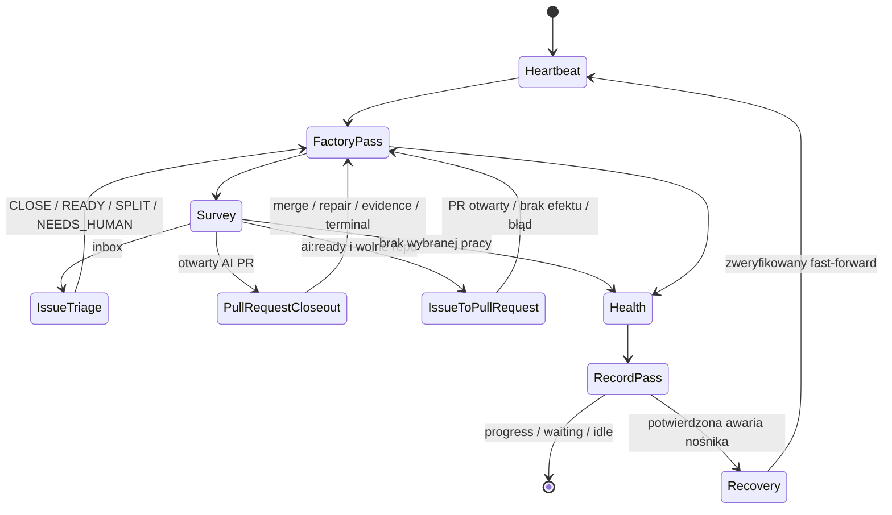
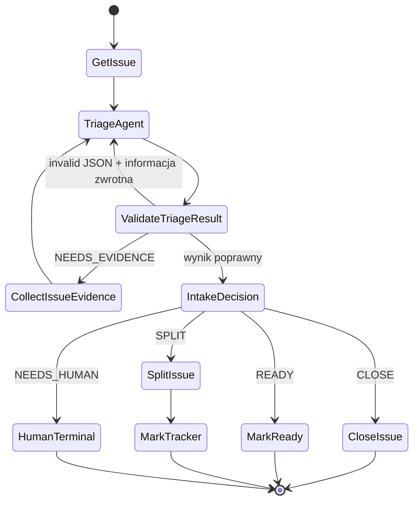
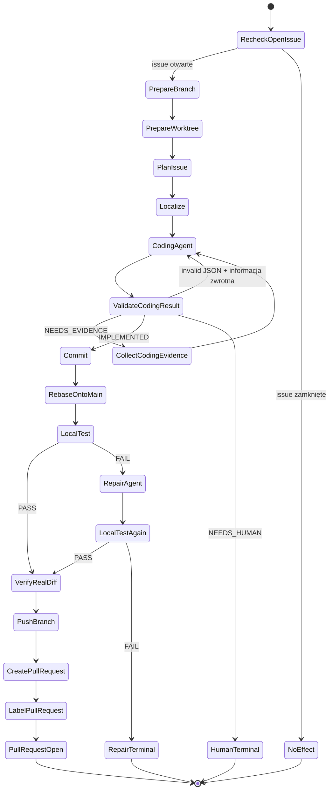
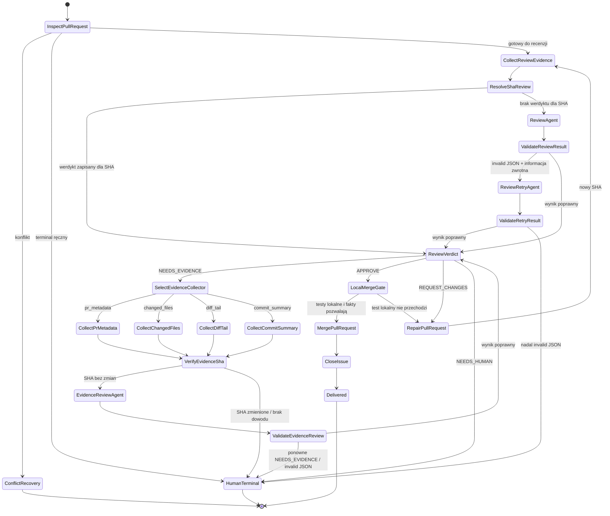
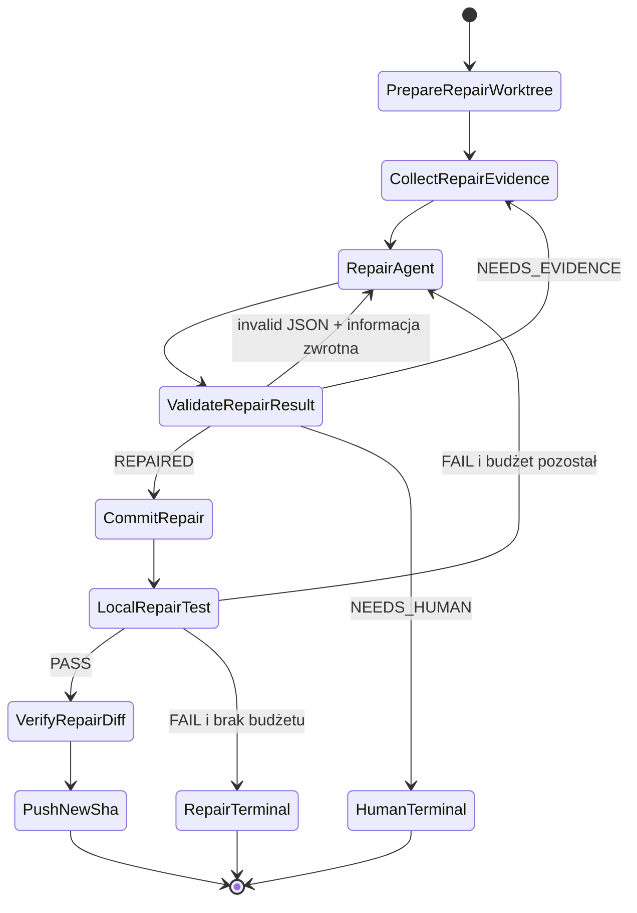
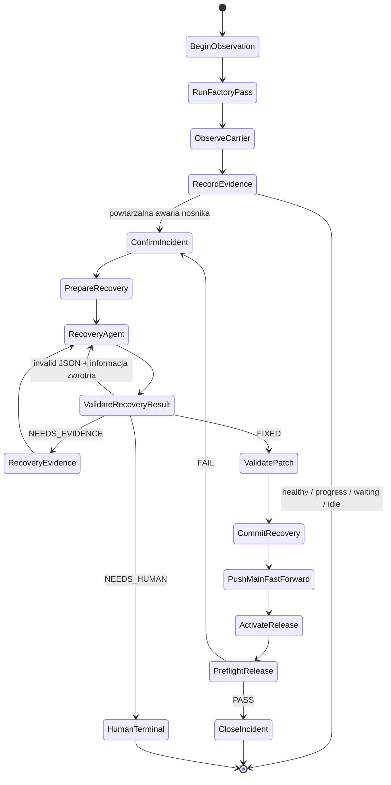

# Lokay

Lokay continuously mills work across configured GitHub repositories: survey, per-repo PR close-out, then triage and **serial** `issue_to_pr` (ticket after ticket; default K=1) with a real configured coding executor.

## What one tick does

1. Surveys every enabled repository for inbox issues, `ai:ready` issues, and open `ai/fix/*` pull requests.
2. Triages undecided issues through the `issue_triage` Fala path (triage + deterministic intake CLOSE/READY/SPLIT + optional auto-split before `ai:ready` sticks), skipping only repos that still have actionable open AI PRs.
3. Applies per-repo PR-first close-out: conflicts are closed and re-readied, failed work enters `pr_repair`, and approved mergeable work enters `pr_triage`.
4. Implements ready issues through `issue_to_pr` **serially by design** (`limits.max_issue_to_pr_per_pass`, default **1** — an optional pass budget, not concurrent worktrees/Pi/tmux). Never a second AI PR in the same repo. A contradiction gate demotes/defers clear queue conflicts before implement.
5. Reports truthful health. Remaining work without progress is not reported as idle; waiting and survey errors remain distinct outcomes.

The top-level mill runs the parent `factory_pass` Fala. Its `factory_tick` effector applies the multi-repo pass policy and composes the smaller `issue_triage`, `pr_triage`, `pr_repair`, and `issue_to_pr` child Falas. Parent and child runs use separate journals.

## Architecture

- **Core value:** authored Fala process graph(s) (`fala/`). Workers, GitHub, and atom bodies are replaceable blocks under JSON contracts — see `docs/PROCESS.md`.
- `src/lokay/proc/`: small command-line atoms. They exchange JSON envelopes on stdout.
- `fala/lokay.fala-package.toml`: authored parent `factory_pass` plus child conduction for `issue_triage`, `pr_triage`, `pr_repair`, and `issue_to_pr`.
- `src/lokay/compose/`: graph entrypoints plus the Python tick, mill, and status policy.
- `executor.command` and `executor.args`: the sole nondeterministic coding slot. Lokay rejects fake, stub, and no-op agents.
- Local verification is repository-declared (`[tool.lokay] test` in the worktree `pyproject.toml`). No declaration is an honest skip — Lokay does not invent `pytest` from `pyproject` / `tests/`.
- `repos.mikolaj92.yaml`: managed repository scope.

There is no alternate Python fallback graph and no Hermes/Kanban execution ledger.

## Quick start

Requirements: Python 3.12+, [`uv`](https://docs.astral.sh/uv/), authenticated GitHub CLI `gh`, and a local Fala checkout at `../Fala` as configured in `pyproject.toml`. Verification is local; Lokay does not use GitHub Actions.

```bash
uv sync
cp config.example.yaml config.yaml
uv run lokay validate --config config.yaml
uv run lokay-repos --config config.yaml
uv run lokay status --config config.yaml
uv run lokay path --describe
```

Dry-run is the default unless live mode is explicit:

```bash
uv run lokay tick --config config.yaml
uv run lokay mill --config config.yaml --live --max-passes 8
```

For a documented night / live autonomous profile (merge on, local verification,
serial K=1), see `config.live-autonomous.example.yaml` and
[`docs/AUTONOMY.md`](docs/AUTONOMY.md).

## Continuous operation

The product daemon entrypoint owns one OS advisory lock across preflight and work:

```bash
uv run lokay-daemon --config config.yaml --max-passes 8 \
  --outbox ~/.lokay/preflight-bootstrap-incidents.log
```

This machine uses LaunchAgent label `ai.mikolaj.lokay-mill`, `scripts/lokay-mill-daemon.sh`, and logs under `~/.lokay/logs/`. The repository does not install or version a LaunchAgent plist.

## Maszyna stanów Lokaya

Lokay jest maszyną stanów sterowaną przez Falę. Stan domenowy pochodzi z
GitHuba (`issue`, PR, SHA, merge), a Fala wybiera następny minimalny proces
Unixowy. Proces może odczytać fakt albo wykonać jeden efekt uboczny. Nie może
ukrywać kolejnego grafu. Agent występuje tylko na granicy niedeterministycznej
i zwraca jeden wynik z zamkniętego schematu. Recenzja PR może poprosić o dokładnie
jeden dodatkowy fakt: `pr_metadata`, `changed_files`, `diff_tail` albo
`commit_summary`. Każdy rodzaj ma osobny kolektor Unixowy. Fala uruchamia tylko
wybrany kolektor, ponawia agenta raz i kieruje drugą prośbę o dowody do terminala
ręcznego.

Ten diagram jest kontraktem projektowym. **Każda zmiana przepływu zaczyna się
od zmiany i przeglądu diagramu. Dopiero zaakceptowany diagram wolno zakodować
w pakiecie Fali.** Test sprawdza, że diagram oraz `fala/lokay.fala-package.toml`
wymieniają te same ścieżki.



### Triage issue — `issue_triage`



### Implementacja issue — `issue_to_pr`



### Zamknięcie PR — `pr_triage`



### Naprawa istniejącego PR — `pr_repair`



### Odzyskanie Lokaya — `daemon_cycle` + `self_repair`



### Zgodność diagramu z implementacją

Diagram jest docelowym kontraktem maszyny. Nie oznacza, że każda pokazana
krawędź już istnieje. Implementacja może ruszyć dopiero po zaakceptowaniu tego
kontraktu. Aktualny audyt:

| Fragment | Stan obecny |
| --- | --- |
| `approve → lokalne testy → merge` | zaimplementowane w Fali |
| `request_changes → pr_repair → nowy SHA → recenzja` | zaimplementowane; pełny powrót między przebiegami wymaga dalszego audytu |
| `needs_human → terminal` | zaimplementowane w Fali |
| `needs_evidence → jeden kolektor z zamkniętego zbioru → ponów agenta raz` | zaimplementowane w Fali |
| `invalid JSON → feedback walidatora → ponów agenta raz` | zaimplementowane w Fali |
| `issue_triage` bez ukrytego drzewa Python | **do refaktoru** |
| `issue_to_pr` bez ukrytego drzewa Python | **do refaktoru** |
| odzyskanie lokalnego work item bez globalnej awarii Lokaya | **do refaktoru** |

### Ścieżki Fali odpowiadające diagramowi

| Stan z diagramu | Ścieżka Fali | Efekt domenowy |
| --- | --- | --- |
| `DaemonCycle` | `daemon_cycle` | uruchamia przebieg i ewentualne odzyskanie |
| `FactoryPass` | `factory_pass` | wybiera jedną następną pracę w pełnym katalogu |
| `TriageInbox` | `issue_triage` | `CLOSE`, `READY`, `SPLIT`, `NEEDS_HUMAN` |
| `ImplementIssue` | `issue_to_pr` | otwarty i oznaczony PR dla issue |
| `ReviewPullRequest` | `pr_triage` | merge, naprawa, dowody albo terminal ręczny |
| `RepairPullRequest` | `pr_repair` | nowy SHA na istniejącym PR |
| `SelfRepair` | `self_repair` | zweryfikowany fast-forward Lokaya |

### Reguły przejść

1. GitHub przechowuje stan domenowy. Dziennik Fali przechowuje wykonanie i
   obserwowalność. Etykieta nie może rekonstruować ani nadpisywać werdyktu.
2. Wynik agenta jest związany z konkretnym SHA i ma zamknięty schemat. Informacje
   `skipped`, `cached` i `already_reviewed_head` są tylko metadanymi wykonania.
3. Każda strzałka oznacza proces, który można osobno ponowić i obserwować.
4. Złożona gałąź jest osobną ścieżką lub pod-Falą. Nie wolno implementować jej
   jako rozbudowanego dispatchera Python.
5. Efekty uboczne następują dopiero po deterministycznej krawędzi Fali:
   etykieta, commit, push, utworzenie PR, merge i zamknięcie issue.
6. Lokay nie używa GitHub Actions. Testy i walidacja wykonują się lokalnie w
   zadeklarowanym środowisku repozytorium. LaunchAgent daje stały heartbeat.

## Safety

- Live mutation requires explicit live mode and a healthy preflight lease.
- Dry-run never mutates and is not a substitute agent.
- Issue bodies and repository content are untrusted input to the executor.
- Product runtime does not force-push or delete repositories.
- Invalid structured review, requested changes, secrets, and human-review requirements fail closed.
- Failed local verification, manual review, and survey errors are not reported as successful progress.

## Commands and layout

| Path or command | Purpose |
| --- | --- |
| `uv run lokay validate --config config.yaml` | Validate configuration |
| `uv run lokay-repos --config config.yaml` | List managed repositories |
| `uv run lokay status --config config.yaml` | Readiness, health, K, per-repo work, human residuals (`--local` / `--human`) |
| `~/.lokay/last-pass.json` | Compact pass receipt after each tick (LaunchAgent-friendly) |
| `uv run lokay path --describe` | Inspect materialized workflow paths |
| `uv run lokay mill --config config.yaml --live --max-passes 8` | Run a bounded live mill |
| `src/lokay/proc/` | Unix atoms |
| `src/lokay/compose/` | Path entrypoints and top-level mill policy |
| `fala/` | Authored Fala package |
| `scripts/lokay-mill-daemon.sh` | Launchd-compatible one-pass wrapper |

## Binding documentation

- [`docs/WORKING.md`](docs/WORKING.md) — working-machine contract and tick order
- [`docs/AUTONOMY.md`](docs/AUTONOMY.md) — autonomous mill Definition of Working, night profile, canaries
- [`docs/MILL_HEALTH.md`](docs/MILL_HEALTH.md) — mill health without watching GitHub
- [`docs/GRAPH.md`](docs/GRAPH.md) — Fala paths and conduction
- [`docs/UNIX.md`](docs/UNIX.md) — process boundaries and JSON envelopes
- [`docs/NO_STUBS.md`](docs/NO_STUBS.md) — real-agent requirement
- [`docs/HTMX.md`](docs/HTMX.md), [`docs/ALPINE.md`](docs/ALPINE.md), [`docs/PLATFORM_UI.md`](docs/PLATFORM_UI.md) — UI boundaries
- [`repos.mikolaj92.yaml`](repos.mikolaj92.yaml) — managed repository inventory


## Local status dashboard

Run the read-only FastAPI dashboard on localhost:

```bash
uv run lokay-status-server --config config.yaml
# http://127.0.0.1:8766
```

The server does not survey GitHub or mutate the mill. It renders the current local
pass receipt, 24-hour and 7-day event throughput, supported repositories, per-repo
work, blockers, and a bounded history of completed pass receipts. Core UI assets
come from the pinned app-factory platform at same-origin `/static/platform`.
