# Lokay

Lokay continuously mills work across configured GitHub repositories: survey, per-repo PR close-out, then triage and **serial** `issue_to_pr` (ticket after ticket; default K=1) with a real configured coding executor.

## What one tick does

1. Surveys every enabled repository for inbox issues, `ai:ready` issues, and open `ai/fix/*` pull requests.
2. Triages undecided issues through the `issue_triage` Fala path (triage + deterministic intake CLOSE/READY/SPLIT + optional auto-split before `ai:ready` sticks), skipping only repos that still have actionable open AI PRs.
3. Applies per-repo PR-first close-out: conflicts are closed and re-readied, failed work enters `pr_repair`, and approved mergeable work enters `pr_triage`.
4. Implements ready issues through `issue_to_pr` **serially by design** (`limits.max_issue_to_pr_per_pass`, default **1** — an optional pass budget, not concurrent worktrees/Pi/tmux). Never a second AI PR in the same repo. A contradiction gate demotes/defers clear queue conflicts before implement.
5. Reports truthful health. Remaining work without progress is not reported as idle; waiting and survey errors remain distinct outcomes.

The top-level mill runs the parent `factory_pass` Fala. Its `factory_tick` effector applies the multi-repo pass policy and composes the smaller `issue_triage`, `pr_triage`, `pr_repair`, and `issue_to_pr` child Falas. Parent and child runs use separate journals.

## Architecture

- **Core value:** authored Fala process graph(s) (`fala/`). Workers, GitHub, and atom bodies are replaceable blocks under JSON contracts — see `docs/PROCESS.md`.
- `src/lokay/proc/`: small command-line atoms. They exchange JSON envelopes on stdout.
- `fala/lokay.fala-package.toml`: authored parent `factory_pass` plus child conduction for `issue_triage`, `pr_triage`, `pr_repair`, and `issue_to_pr`.
- `src/lokay/compose/`: graph entrypoints plus the Python tick, mill, and status policy.
- `executor.command` and `executor.args`: the sole nondeterministic coding slot. Lokay rejects fake, stub, and no-op agents.
- Local verification is repository-declared (`[tool.lokay] test` in the worktree `pyproject.toml`). No declaration is an honest skip — Lokay does not invent `pytest` from `pyproject` / `tests/`.
- `repos.mikolaj92.yaml`: managed repository scope.

There is no alternate Python fallback graph and no Hermes/Kanban execution ledger.

## Quick start

Requirements: Python 3.12+, [`uv`](https://docs.astral.sh/uv/), authenticated GitHub CLI `gh`, and a local Fala checkout at `../Fala` as configured in `pyproject.toml`. Verification is local; Lokay does not use GitHub Actions.

```bash
uv sync
cp config.example.yaml config.yaml
uv run lokay validate --config config.yaml
uv run lokay-repos --config config.yaml
uv run lokay status --config config.yaml
uv run lokay path --describe
```

Dry-run is the default unless live mode is explicit:

```bash
uv run lokay tick --config config.yaml
uv run lokay mill --config config.yaml --live --max-passes 8
```

For a documented night / live autonomous profile (merge on, local verification,
serial K=1), see `config.live-autonomous.example.yaml` and
[`docs/AUTONOMY.md`](docs/AUTONOMY.md).

## Continuous operation

The product daemon entrypoint owns one OS advisory lock across preflight and work:

```bash
uv run lokay-daemon --config config.yaml --max-passes 8 \
  --outbox ~/.lokay/preflight-bootstrap-incidents.log
```

This machine uses LaunchAgent label `ai.mikolaj.lokay-mill`, `scripts/lokay-mill-daemon.sh`, and logs under `~/.lokay/logs/`. The repository does not install or version a LaunchAgent plist.

## Maszyna stanów Lokaya

Lokay jest maszyną stanów sterowaną przez Falę. Stan domenowy pochodzi z
GitHuba (`issue`, PR, SHA, merge), a Fala wybiera następny minimalny proces
Unixowy. Proces może odczytać fakt albo wykonać jeden efekt uboczny. Nie może
ukrywać kolejnego grafu. Agent występuje tylko na granicy niedeterministycznej
i zwraca jeden wynik z zamkniętego schematu. Recenzja PR może poprosić o dokładnie
jeden dodatkowy fakt: `pr_metadata`, `changed_files`, `diff_tail` albo
`commit_summary`. Każdy rodzaj ma osobny kolektor Unixowy. Fala uruchamia tylko
wybrany kolektor, ponawia agenta raz i kieruje drugą prośbę o dowody do terminala
ręcznego.

Ten diagram jest kontraktem projektowym. **Każda zmiana przepływu zaczyna się
od zmiany i przeglądu diagramu. Dopiero zaakceptowany diagram wolno zakodować
w pakiecie Fali.** Test sprawdza, że diagram oraz `fala/lokay.fala-package.toml`
wymieniają te same ścieżki.

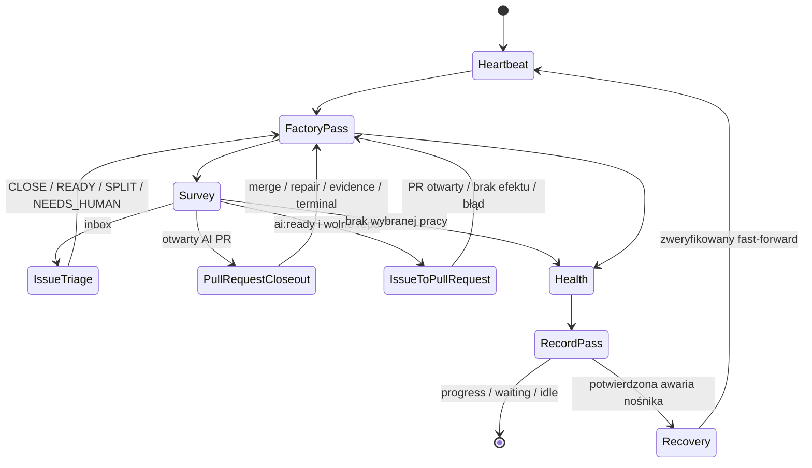
```mermaid
stateDiagram-v2
    [*] --> Heartbeat
    Heartbeat --> FactoryPass
    FactoryPass --> Survey
    Survey --> IssueTriage: inbox
    Survey --> PullRequestCloseout: otwarty AI PR
    Survey --> IssueToPullRequest: ai:ready i wolne repo
    Survey --> Health: brak wybranej pracy
    IssueTriage --> FactoryPass: CLOSE / READY / SPLIT / NEEDS_HUMAN
    PullRequestCloseout --> FactoryPass: merge / repair / evidence / terminal
    IssueToPullRequest --> FactoryPass: PR otwarty / brak efektu / błąd
    FactoryPass --> Health
    Health --> RecordPass
    RecordPass --> [*]: progress / waiting / idle
    RecordPass --> Recovery: potwierdzona awaria nośnika
    Recovery --> Heartbeat: zweryfikowany fast-forward
```

### Przegląd gotowych issue — `survey_ready`

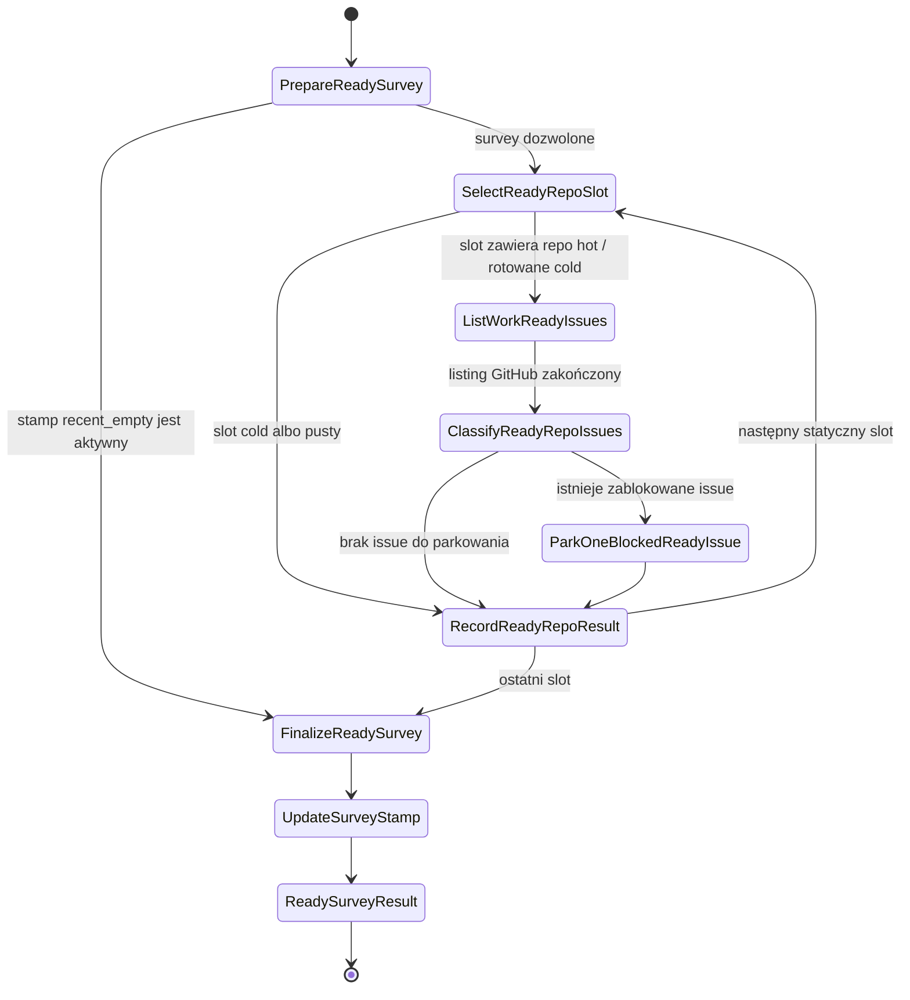
```mermaid
stateDiagram-v2
    [*] --> PrepareReadySurvey
    PrepareReadySurvey --> FinalizeReadySurvey: stamp recent_empty jest aktywny
    PrepareReadySurvey --> SelectReadyRepoSlot: survey dozwolone
    SelectReadyRepoSlot --> ListWorkReadyIssues: slot zawiera repo hot / rotowane cold
    SelectReadyRepoSlot --> RecordReadyRepoResult: slot cold albo pusty
    ListWorkReadyIssues --> ClassifyReadyRepoIssues: listing GitHub zakończony
    ClassifyReadyRepoIssues --> ParkOneBlockedReadyIssue: istnieje zablokowane issue
    ClassifyReadyRepoIssues --> RecordReadyRepoResult: brak issue do parkowania
    ParkOneBlockedReadyIssue --> RecordReadyRepoResult
    RecordReadyRepoResult --> SelectReadyRepoSlot: następny statyczny slot
    RecordReadyRepoResult --> FinalizeReadySurvey: ostatni slot
    FinalizeReadySurvey --> UpdateSurveyStamp
    UpdateSurveyStamp --> ReadySurveyResult
    ReadySurveyResult --> [*]
```

Pod-Fala rozwija skonfigurowany katalog do jawnych, statycznie ograniczonych
slotów repozytoriów. Manifest Fali zawiera każdy slot i jego krawędzie; żaden
proces Pythonowy nie iteruje po repozytoriach ani nie uruchamia kolejnego etapu.
Listing `work:ready` jest fizycznym odczytem GitHub i zwraca tylko otwarte issue.
Osobny czysty reduktor wyklucza issue pokryte przez PR albo ledger. Osobny efekt
parkuje najwyżej jedno zablokowane issue na repozytorium i pass, więc mutacja
pozostaje atomowa, a higiena postępuje bez ukrytej pętli. Finalizator wyłącznie
materializuje zgromadzony stan survey i nie podejmuje decyzji trasujących.

### Uruchomienie triage — `dispatch_triage`

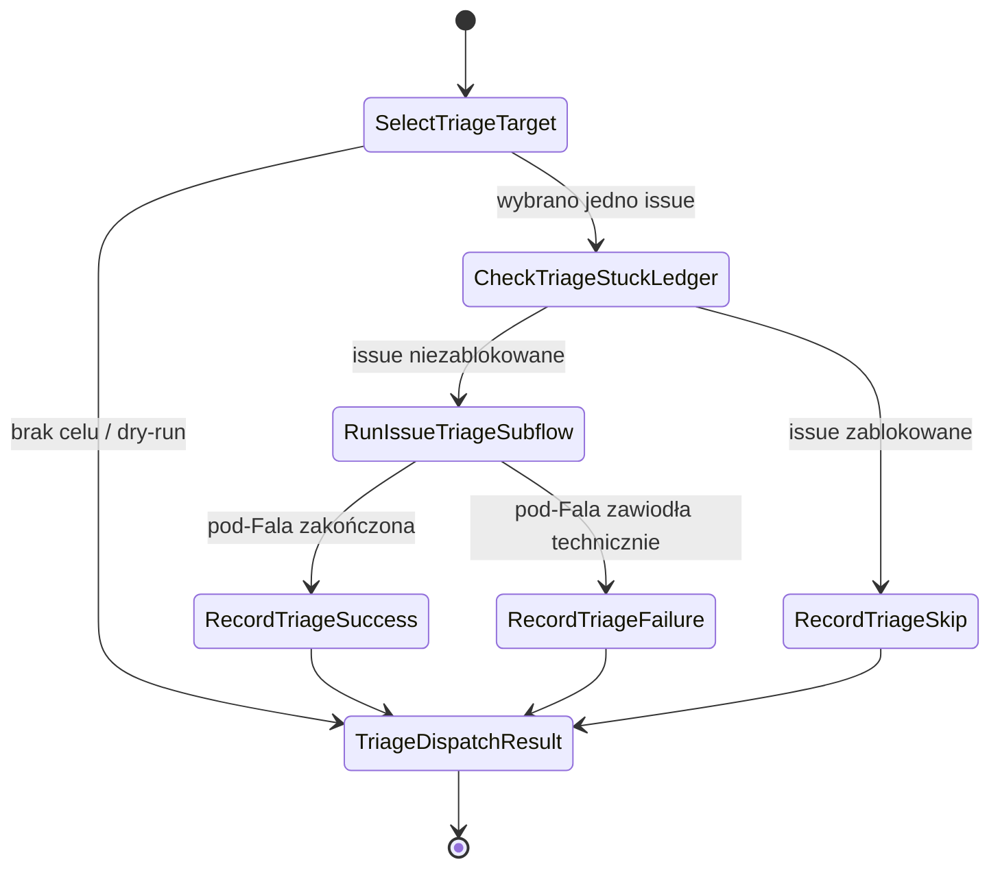
```mermaid
stateDiagram-v2
    [*] --> SelectTriageTarget
    SelectTriageTarget --> TriageDispatchResult: brak celu / dry-run
    SelectTriageTarget --> CheckTriageStuckLedger: wybrano jedno issue
    CheckTriageStuckLedger --> RecordTriageSkip: issue zablokowane
    CheckTriageStuckLedger --> RunIssueTriageSubflow: issue niezablokowane
    RunIssueTriageSubflow --> RecordTriageSuccess: pod-Fala zakończona
    RunIssueTriageSubflow --> RecordTriageFailure: pod-Fala zawiodła technicznie
    RecordTriageSuccess --> TriageDispatchResult
    RecordTriageFailure --> TriageDispatchResult
    RecordTriageSkip --> TriageDispatchResult
    TriageDispatchResult --> [*]
```

Pod-Fala uruchamia najwyżej jeden cel triage w jednym pass. Semantyczne drzewo
`issue_triage` pozostaje osobną autorską pod-Falą; dispatcher tylko wybiera cel,
sprawdza fizyczny ledger, uruchamia ją i zapisuje jej zamknięty wynik.

### Uruchomienie implementacji — `dispatch_implement`

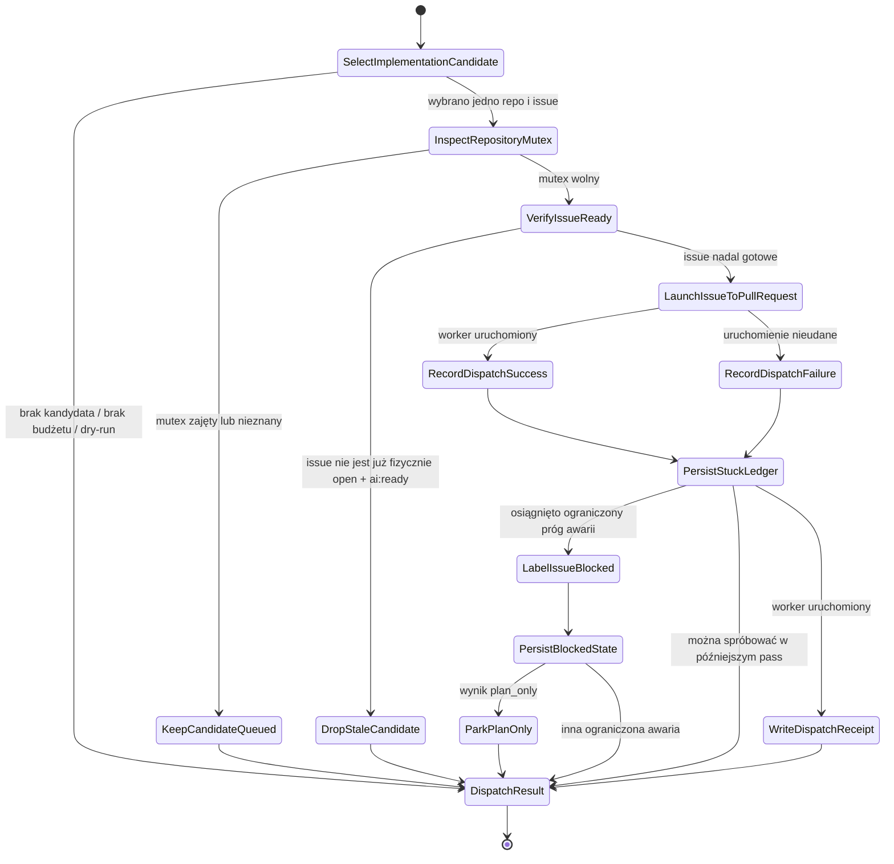
```mermaid
stateDiagram-v2
    [*] --> SelectImplementationCandidate
    SelectImplementationCandidate --> DispatchResult: brak kandydata / brak budżetu / dry-run
    SelectImplementationCandidate --> InspectRepositoryMutex: wybrano jedno repo i issue
    InspectRepositoryMutex --> KeepCandidateQueued: mutex zajęty lub nieznany
    InspectRepositoryMutex --> VerifyIssueReady: mutex wolny
    VerifyIssueReady --> DropStaleCandidate: issue nie jest już fizycznie open + ai:ready
    VerifyIssueReady --> LaunchIssueToPullRequest: issue nadal gotowe
    LaunchIssueToPullRequest --> RecordDispatchSuccess: worker uruchomiony
    LaunchIssueToPullRequest --> RecordDispatchFailure: uruchomienie nieudane
    RecordDispatchSuccess --> PersistStuckLedger
    RecordDispatchFailure --> PersistStuckLedger
    PersistStuckLedger --> LabelIssueBlocked: osiągnięto ograniczony próg awarii
    PersistStuckLedger --> DispatchResult: można spróbować w późniejszym pass
    LabelIssueBlocked --> PersistBlockedState
    PersistBlockedState --> ParkPlanOnly: wynik plan_only
    PersistBlockedState --> DispatchResult: inna ograniczona awaria
    ParkPlanOnly --> DispatchResult
    PersistStuckLedger --> WriteDispatchReceipt: worker uruchomiony
    WriteDispatchReceipt --> DispatchResult
    KeepCandidateQueued --> DispatchResult
    DropStaleCandidate --> DispatchResult
    DispatchResult --> [*]
```

Pod-Fala wybiera najwyżej jeden ticket w jednym pass. `K` jest seryjnym budżetem
kolejnych passów, nie pętlą ani równoległym schedulerem ukrytym w procesie.
Każdy węzeł wykonuje jeden odczyt faktu, jedną mutację albo jedną redukcję stanu.

### Odzyskanie konfliktującego PR — `resolve_conflicts`

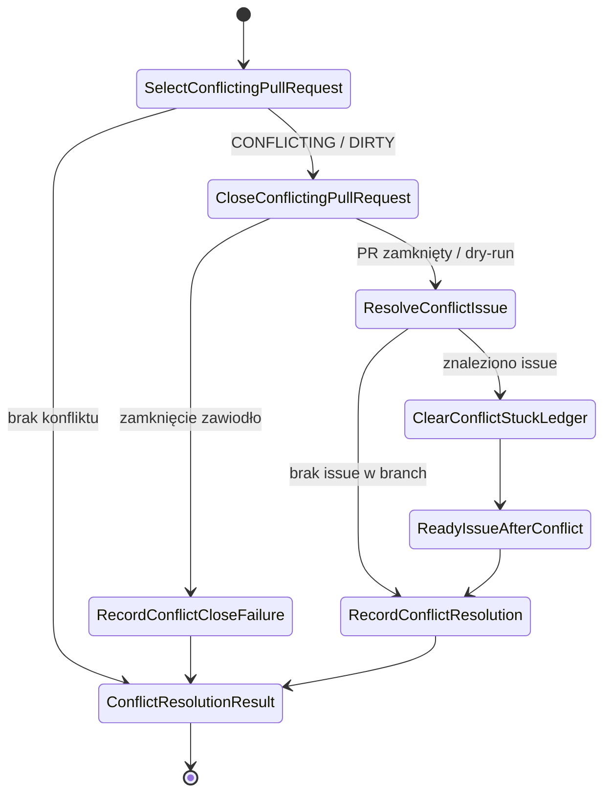
```mermaid
stateDiagram-v2
    [*] --> SelectConflictingPullRequest
    SelectConflictingPullRequest --> ConflictResolutionResult: brak konfliktu
    SelectConflictingPullRequest --> CloseConflictingPullRequest: CONFLICTING / DIRTY
    CloseConflictingPullRequest --> RecordConflictCloseFailure: zamknięcie zawiodło
    CloseConflictingPullRequest --> ResolveConflictIssue: PR zamknięty / dry-run
    ResolveConflictIssue --> RecordConflictResolution: brak issue w branch
    ResolveConflictIssue --> ClearConflictStuckLedger: znaleziono issue
    ClearConflictStuckLedger --> ReadyIssueAfterConflict
    ReadyIssueAfterConflict --> RecordConflictResolution
    RecordConflictCloseFailure --> ConflictResolutionResult
    RecordConflictResolution --> ConflictResolutionResult
    ConflictResolutionResult --> [*]
```

Pod-Fala wybiera najwyżej jeden konfliktujący PR w jednym pass. Wybór, zamknięcie
PR, wyprowadzenie numeru issue, wyczyszczenie ledgera, przywrócenie `ready` oraz
materializacja stanu są oddzielnymi procesami. Fala prowadzi każdą gałąź;
żaden proces nie iteruje po repozytoriach ani PR-ach i nie łączy kilku efektów.

### Plan przebiegu — `plan_pass`

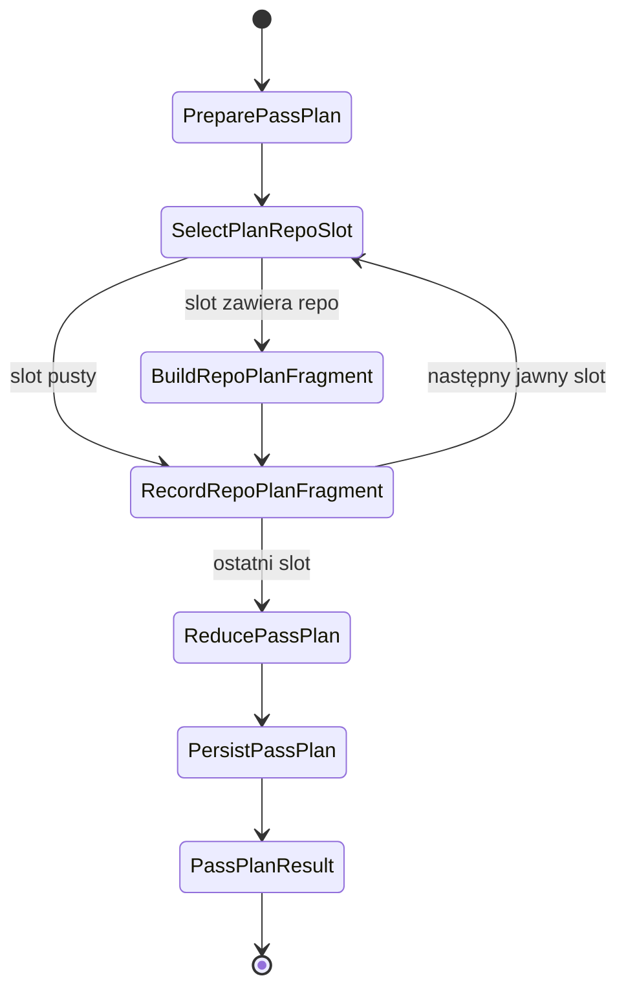
```mermaid
stateDiagram-v2
    [*] --> PreparePassPlan
    PreparePassPlan --> SelectPlanRepoSlot
    SelectPlanRepoSlot --> BuildRepoPlanFragment: slot zawiera repo
    SelectPlanRepoSlot --> RecordRepoPlanFragment: slot pusty
    BuildRepoPlanFragment --> RecordRepoPlanFragment
    RecordRepoPlanFragment --> SelectPlanRepoSlot: następny jawny slot
    RecordRepoPlanFragment --> ReducePassPlan: ostatni slot
    ReducePassPlan --> PersistPassPlan
    PersistPassPlan --> PassPlanResult
    PassPlanResult --> [*]
```

Pod-Fala rozwija pełny katalog do 30 jawnych slotów. Jeden czysty proces buduje
fragment planu jednego repozytorium na podstawie survey, stuck ledgera, budżetu
i PR-first. Fala prowadzi kolejność slotów. Osobny czysty reduktor zachowuje
kolejność katalogu i globalny budżet triage. Osobny efekt zapisuje plan oraz
akcje wyjaśniające odrzucone cele.

### Higiena gotowych issue — `ready_hygiene`

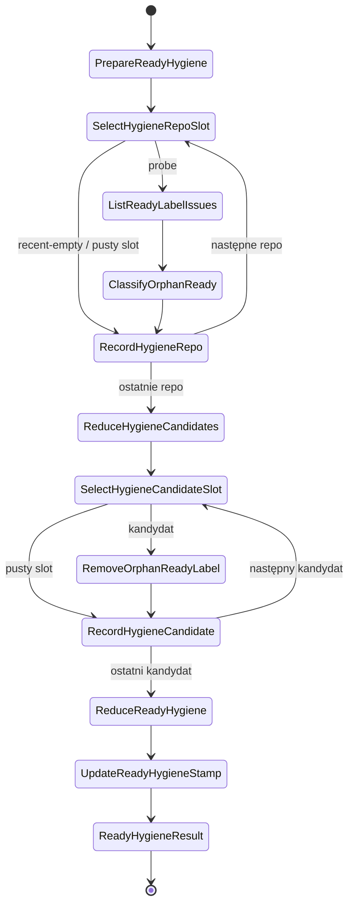
```mermaid
stateDiagram-v2
    [*] --> PrepareReadyHygiene
    PrepareReadyHygiene --> SelectHygieneRepoSlot
    SelectHygieneRepoSlot --> ListReadyLabelIssues: probe
    SelectHygieneRepoSlot --> RecordHygieneRepo: recent-empty / pusty slot
    ListReadyLabelIssues --> ClassifyOrphanReady
    ClassifyOrphanReady --> RecordHygieneRepo
    RecordHygieneRepo --> SelectHygieneRepoSlot: następne repo
    RecordHygieneRepo --> ReduceHygieneCandidates: ostatnie repo
    ReduceHygieneCandidates --> SelectHygieneCandidateSlot
    SelectHygieneCandidateSlot --> RemoveOrphanReadyLabel: kandydat
    SelectHygieneCandidateSlot --> RecordHygieneCandidate: pusty slot
    RemoveOrphanReadyLabel --> RecordHygieneCandidate
    RecordHygieneCandidate --> SelectHygieneCandidateSlot: następny kandydat
    RecordHygieneCandidate --> ReduceReadyHygiene: ostatni kandydat
    ReduceReadyHygiene --> UpdateReadyHygieneStamp
    UpdateReadyHygieneStamp --> ReadyHygieneResult
    ReadyHygieneResult --> [*]
```

Pod-Fala ma 30 jawnych slotów repozytoriów i 30 jawnych slotów osieroconych
issue. Listing, czysta klasyfikacja `ai:ready` bez `work:ready`, mutation effect,
redukcja oraz TTL są osobnymi procesami. Overflow katalogu lub kandydatów jest
fail-closed. Rate limit nie udaje pustej sondy i nie zapisuje empty stamp.

### Przegląd pull requestów — `survey_prs`

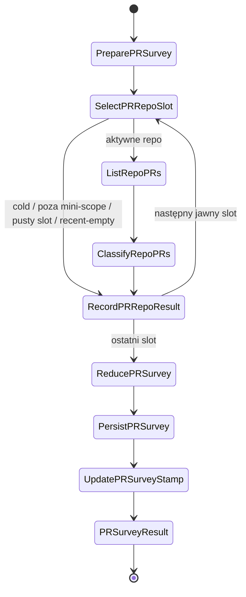
```mermaid
stateDiagram-v2
    [*] --> PreparePRSurvey
    PreparePRSurvey --> SelectPRRepoSlot
    SelectPRRepoSlot --> ListRepoPRs: aktywne repo
    SelectPRRepoSlot --> RecordPRRepoResult: cold / poza mini-scope / pusty slot / recent-empty
    ListRepoPRs --> ClassifyRepoPRs
    ClassifyRepoPRs --> RecordPRRepoResult
    RecordPRRepoResult --> SelectPRRepoSlot: następny jawny slot
    RecordPRRepoResult --> ReducePRSurvey: ostatni slot
    ReducePRSurvey --> PersistPRSurvey
    PersistPRSurvey --> UpdatePRSurveyStamp
    UpdatePRSurveyStamp --> PRSurveyResult
    PRSurveyResult --> [*]
```

Pod-Fala rozwija katalog do 30 jawnych slotów. Listing GitHub i klasyfikacja
manual/actionable są osobnymi procesami jednego repo. Repo-local reaction,
katalogowa redukcja, persist i efekt TTL są rozdzielone. Failed listing
pozostaje `probe_failed`; przekroczenie authored katalogu kończy się fail-closed.

### Domknięcie PR-ów — `closeout_prs` i `closeout_pr`

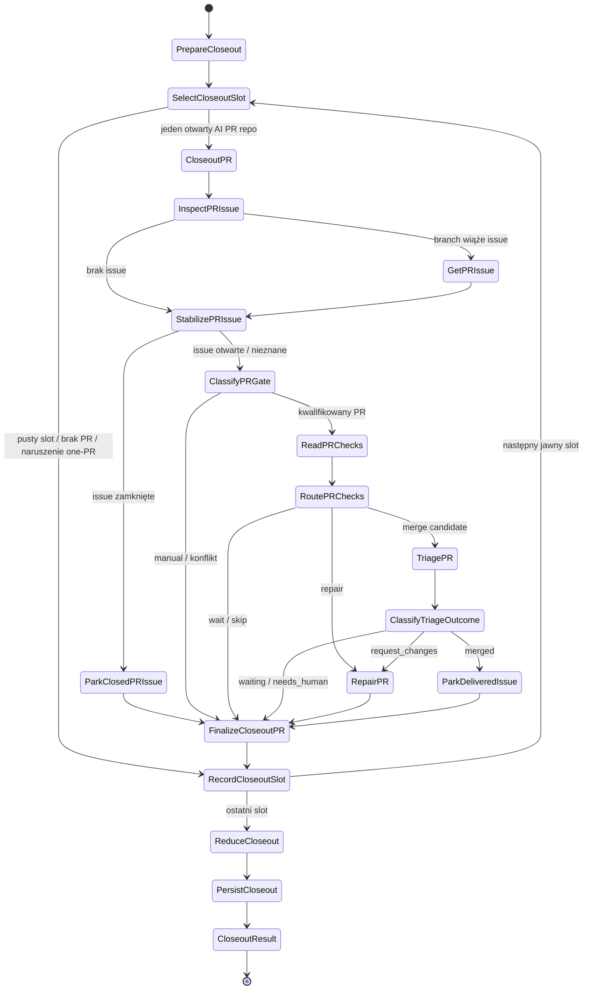
```mermaid
stateDiagram-v2
    [*] --> PrepareCloseout
    PrepareCloseout --> SelectCloseoutSlot
    SelectCloseoutSlot --> CloseoutPR: jeden otwarty AI PR repo
    SelectCloseoutSlot --> RecordCloseoutSlot: pusty slot / brak PR / naruszenie one-PR
    CloseoutPR --> InspectPRIssue
    InspectPRIssue --> GetPRIssue: branch wiąże issue
    InspectPRIssue --> StabilizePRIssue: brak issue
    GetPRIssue --> StabilizePRIssue
    StabilizePRIssue --> ParkClosedPRIssue: issue zamknięte
    StabilizePRIssue --> ClassifyPRGate: issue otwarte / nieznane
    ParkClosedPRIssue --> FinalizeCloseoutPR
    ClassifyPRGate --> FinalizeCloseoutPR: manual / konflikt
    ClassifyPRGate --> ReadPRChecks: kwalifikowany PR
    ReadPRChecks --> RoutePRChecks
    RoutePRChecks --> RepairPR: repair
    RoutePRChecks --> FinalizeCloseoutPR: wait / skip
    RoutePRChecks --> TriagePR: merge candidate
    TriagePR --> ClassifyTriageOutcome
    ClassifyTriageOutcome --> RepairPR: request_changes
    ClassifyTriageOutcome --> ParkDeliveredIssue: merged
    ClassifyTriageOutcome --> FinalizeCloseoutPR: waiting / needs_human
    RepairPR --> FinalizeCloseoutPR
    ParkDeliveredIssue --> FinalizeCloseoutPR
    FinalizeCloseoutPR --> RecordCloseoutSlot
    RecordCloseoutSlot --> SelectCloseoutSlot: następny jawny slot
    RecordCloseoutSlot --> ReduceCloseout: ostatni slot
    ReduceCloseout --> PersistCloseout
    PersistCloseout --> CloseoutResult
    CloseoutResult --> [*]
```

Rodzic rozwija katalog do 30 jawnych slotów i prowadzi wspólny budżet napraw
seryjnie między repozytoriami. Każdy kwalifikowany PR uruchamia tę samą
pod-Falę `closeout_pr`. Odczyt issue, checks, routing, naprawa, SHA-bound
triage/merge, parkowanie oraz redukcja pass state są osobnymi procesami.
Naruszenie inwariantu jednego otwartego AI PR na repo jest terminalnym,
fail-closed wynikiem slotu, a nie ukrytą pętlą.

### Przegląd inboxu — `survey_inbox`

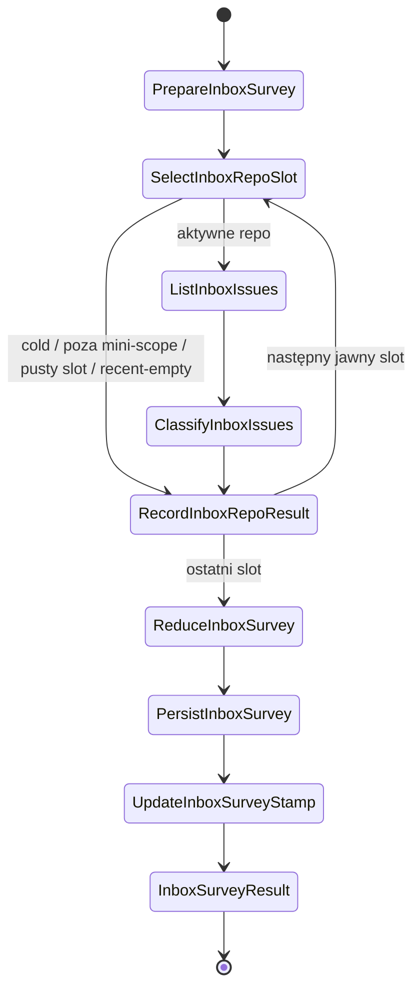
```mermaid
stateDiagram-v2
    [*] --> PrepareInboxSurvey
    PrepareInboxSurvey --> SelectInboxRepoSlot
    SelectInboxRepoSlot --> ListInboxIssues: aktywne repo
    SelectInboxRepoSlot --> RecordInboxRepoResult: cold / poza mini-scope / pusty slot / recent-empty
    ListInboxIssues --> ClassifyInboxIssues
    ClassifyInboxIssues --> RecordInboxRepoResult
    RecordInboxRepoResult --> SelectInboxRepoSlot: następny jawny slot
    RecordInboxRepoResult --> ReduceInboxSurvey: ostatni slot
    ReduceInboxSurvey --> PersistInboxSurvey
    PersistInboxSurvey --> UpdateInboxSurveyStamp
    UpdateInboxSurveyStamp --> InboxSurveyResult
    InboxSurveyResult --> [*]
```

Pod-Fala rozwija pełny katalog do 30 jawnych slotów. Każdy listing GitHub jest
osobnym procesem, a filtrowanie stuck ledger jest czystą klasyfikacją jednego
repo. Redukcja katalogu, zapis pass state i efekt stempla TTL są oddzielone.
Błąd listingu pozostaje jawnym `probe_failed` i nie udaje pustego inboxu.

### Walidacja self-repair — `self_repair_validate`

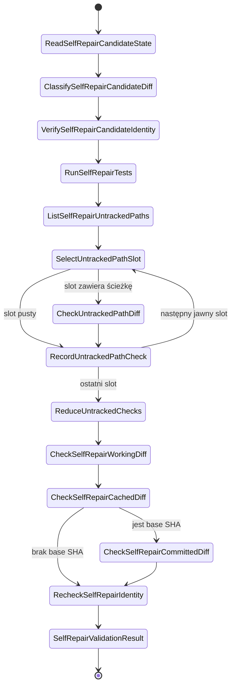
```mermaid
stateDiagram-v2
    [*] --> ReadSelfRepairCandidateState
    ReadSelfRepairCandidateState --> ClassifySelfRepairCandidateDiff
    ClassifySelfRepairCandidateDiff --> VerifySelfRepairCandidateIdentity
    VerifySelfRepairCandidateIdentity --> RunSelfRepairTests
    RunSelfRepairTests --> ListSelfRepairUntrackedPaths
    ListSelfRepairUntrackedPaths --> SelectUntrackedPathSlot
    SelectUntrackedPathSlot --> CheckUntrackedPathDiff: slot zawiera ścieżkę
    SelectUntrackedPathSlot --> RecordUntrackedPathCheck: slot pusty
    CheckUntrackedPathDiff --> RecordUntrackedPathCheck
    RecordUntrackedPathCheck --> SelectUntrackedPathSlot: następny jawny slot
    RecordUntrackedPathCheck --> ReduceUntrackedChecks: ostatni slot
    ReduceUntrackedChecks --> CheckSelfRepairWorkingDiff
    CheckSelfRepairWorkingDiff --> CheckSelfRepairCachedDiff
    CheckSelfRepairCachedDiff --> CheckSelfRepairCommittedDiff: jest base SHA
    CheckSelfRepairCachedDiff --> RecheckSelfRepairIdentity: brak base SHA
    CheckSelfRepairCommittedDiff --> RecheckSelfRepairIdentity
    RecheckSelfRepairIdentity --> SelfRepairValidationResult
    SelfRepairValidationResult --> [*]
```

Pod-Fala oddziela początkowy stan i klasę diffu, exact commit identity, pełny
lokalny test suite, listing untracked paths, maksymalnie 30 jawnych kontroli
`diff --no-index --check`, trzy tracked diff checks oraz końcowy identity
recheck. Każdy nieudany fakt kończy ścieżkę fail-closed. Izolowany `HOME` dla
testów pozostaje własnością pojedynczego procesu testowego.

### Przygotowanie self-repair — `self_repair_prepare`

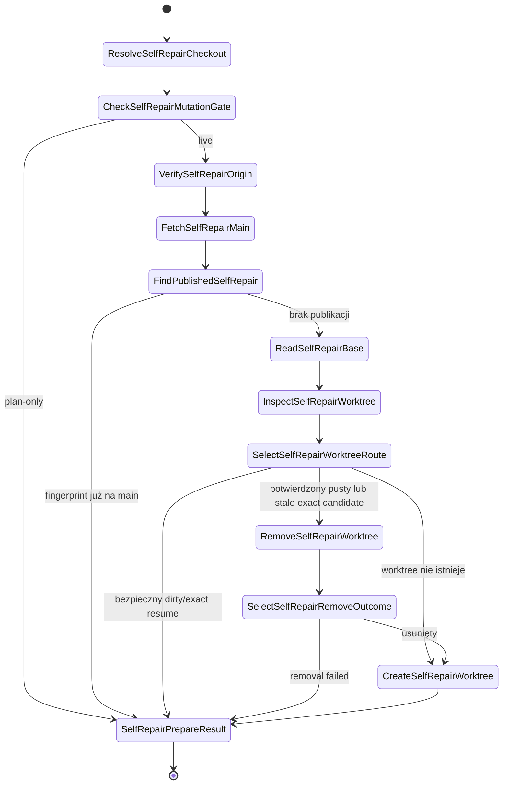
```mermaid
stateDiagram-v2
    [*] --> ResolveSelfRepairCheckout
    ResolveSelfRepairCheckout --> CheckSelfRepairMutationGate
    CheckSelfRepairMutationGate --> SelfRepairPrepareResult: plan-only
    CheckSelfRepairMutationGate --> VerifySelfRepairOrigin: live
    VerifySelfRepairOrigin --> FetchSelfRepairMain
    FetchSelfRepairMain --> FindPublishedSelfRepair
    FindPublishedSelfRepair --> SelfRepairPrepareResult: fingerprint już na main
    FindPublishedSelfRepair --> ReadSelfRepairBase: brak publikacji
    ReadSelfRepairBase --> InspectSelfRepairWorktree
    InspectSelfRepairWorktree --> SelectSelfRepairWorktreeRoute
    SelectSelfRepairWorktreeRoute --> RemoveSelfRepairWorktree: potwierdzony pusty lub stale exact candidate
    SelectSelfRepairWorktreeRoute --> SelfRepairPrepareResult: bezpieczny dirty/exact resume
    SelectSelfRepairWorktreeRoute --> CreateSelfRepairWorktree: worktree nie istnieje
    RemoveSelfRepairWorktree --> SelectSelfRepairRemoveOutcome
    SelectSelfRepairRemoveOutcome --> CreateSelfRepairWorktree: usunięty
    SelectSelfRepairRemoveOutcome --> SelfRepairPrepareResult: removal failed
    CreateSelfRepairWorktree --> SelfRepairPrepareResult
    SelfRepairPrepareResult --> [*]
```

Pod-Fala oddziela konfigurację checkoutu, mutation gate, weryfikację origin,
fetch, fingerprint na `main`, base SHA, inspekcję istniejącego worktree,
decyzję routingu oraz efekty remove/create. Nieczytelna własność, plan-only,
nieznany commit i dirty work poza aktualnym `origin/main` kończą się
fail-closed bez usuwania dowodów.

### Ograniczenie czasu implementacji — `reap_over_budget`

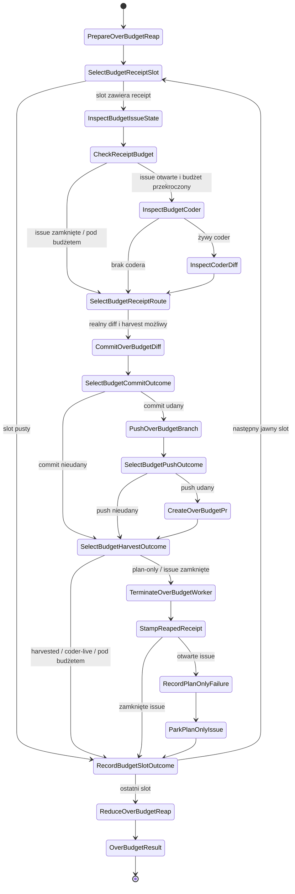
```mermaid
stateDiagram-v2
    [*] --> PrepareOverBudgetReap
    PrepareOverBudgetReap --> SelectBudgetReceiptSlot
    SelectBudgetReceiptSlot --> InspectBudgetIssueState: slot zawiera receipt
    SelectBudgetReceiptSlot --> RecordBudgetSlotOutcome: slot pusty
    InspectBudgetIssueState --> CheckReceiptBudget
    CheckReceiptBudget --> InspectBudgetCoder: issue otwarte i budżet przekroczony
    CheckReceiptBudget --> SelectBudgetReceiptRoute: issue zamknięte / pod budżetem
    InspectBudgetCoder --> InspectCoderDiff: żywy coder
    InspectBudgetCoder --> SelectBudgetReceiptRoute: brak codera
    InspectCoderDiff --> SelectBudgetReceiptRoute
    SelectBudgetReceiptRoute --> CommitOverBudgetDiff: realny diff i harvest możliwy
    CommitOverBudgetDiff --> SelectBudgetCommitOutcome
    SelectBudgetCommitOutcome --> PushOverBudgetBranch: commit udany
    SelectBudgetCommitOutcome --> SelectBudgetHarvestOutcome: commit nieudany
    PushOverBudgetBranch --> SelectBudgetPushOutcome
    SelectBudgetPushOutcome --> CreateOverBudgetPr: push udany
    SelectBudgetPushOutcome --> SelectBudgetHarvestOutcome: push nieudany
    CreateOverBudgetPr --> SelectBudgetHarvestOutcome
    SelectBudgetHarvestOutcome --> TerminateOverBudgetWorker: plan-only / issue zamknięte
    SelectBudgetHarvestOutcome --> RecordBudgetSlotOutcome: harvested / coder-live / pod budżetem
    TerminateOverBudgetWorker --> StampReapedReceipt
    StampReapedReceipt --> RecordPlanOnlyFailure: otwarte issue
    StampReapedReceipt --> RecordBudgetSlotOutcome: zamknięte issue
    RecordPlanOnlyFailure --> ParkPlanOnlyIssue
    ParkPlanOnlyIssue --> RecordBudgetSlotOutcome
    RecordBudgetSlotOutcome --> SelectBudgetReceiptSlot: następny jawny slot
    RecordBudgetSlotOutcome --> ReduceOverBudgetReap: ostatni slot
    ReduceOverBudgetReap --> OverBudgetResult
    OverBudgetResult --> [*]
```

Pod-Fala ma 30 jawnych slotów receiptów. Stan issue, budżet procesu, obecność
codera i klasyfikacja diffu są osobnymi faktami. Harvest realnego diffu jest
jawnym łańcuchem `commit → push → PR`, a nie funkcją-composerem. Niepewny diff
zachowuje żywego codera fail-closed. Tylko plan-only lub zamknięte issue prowadzi
do jawnej terminacji. Zapis receiptu, stuck ledger i parkowanie są oddzielnymi
efektami.

### Odzyskanie porzuconych etapów implementacji — `reap_stale_implementing`

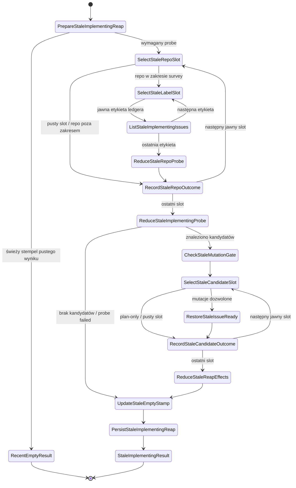
```mermaid
stateDiagram-v2
    [*] --> PrepareStaleImplementingReap
    PrepareStaleImplementingReap --> RecentEmptyResult: świeży stempel pustego wyniku
    PrepareStaleImplementingReap --> SelectStaleRepoSlot: wymagany probe
    SelectStaleRepoSlot --> SelectStaleLabelSlot: repo w zakresie survey
    SelectStaleRepoSlot --> RecordStaleRepoOutcome: pusty slot / repo poza zakresem
    SelectStaleLabelSlot --> ListStaleImplementingIssues: jawna etykieta ledgera
    ListStaleImplementingIssues --> SelectStaleLabelSlot: następna etykieta
    ListStaleImplementingIssues --> ReduceStaleRepoProbe: ostatnia etykieta
    ReduceStaleRepoProbe --> RecordStaleRepoOutcome
    RecordStaleRepoOutcome --> SelectStaleRepoSlot: następny jawny slot
    RecordStaleRepoOutcome --> ReduceStaleImplementingProbe: ostatni slot
    ReduceStaleImplementingProbe --> CheckStaleMutationGate: znaleziono kandydatów
    ReduceStaleImplementingProbe --> UpdateStaleEmptyStamp: brak kandydatów / probe failed
    CheckStaleMutationGate --> SelectStaleCandidateSlot
    SelectStaleCandidateSlot --> RestoreStaleIssueReady: mutacje dozwolone
    SelectStaleCandidateSlot --> RecordStaleCandidateOutcome: plan-only / pusty slot
    RestoreStaleIssueReady --> RecordStaleCandidateOutcome
    RecordStaleCandidateOutcome --> SelectStaleCandidateSlot: następny jawny slot
    RecordStaleCandidateOutcome --> ReduceStaleReapEffects: ostatni slot
    ReduceStaleReapEffects --> UpdateStaleEmptyStamp
    UpdateStaleEmptyStamp --> PersistStaleImplementingReap
    PersistStaleImplementingReap --> StaleImplementingResult
    RecentEmptyResult --> [*]
    StaleImplementingResult --> [*]
```

Pod-Fala rozwija pełny katalog do 30 jawnych slotów. Każde repo ma trzy
jawne odczyty etykiet aktywnego ledgera. Rate limit kończy probe repo
fail-closed bez udawania pustego wyniku. Mutation gate jest osobnym faktem, a
każde przywrócenie `ai:ready` osobnym efektem. Stempel TTL aktualizuje osobny
proces dopiero po redukcji kompletnego probe i efektów.

### Odświeżenie zajętości repozytoriów — `refresh_occupancy`

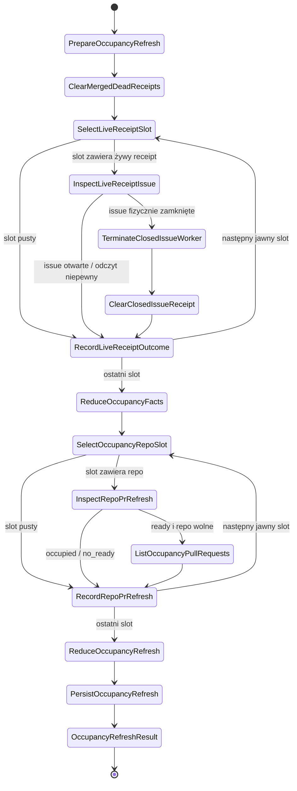
```mermaid
stateDiagram-v2
    [*] --> PrepareOccupancyRefresh
    PrepareOccupancyRefresh --> ClearMergedDeadReceipts
    ClearMergedDeadReceipts --> SelectLiveReceiptSlot
    SelectLiveReceiptSlot --> InspectLiveReceiptIssue: slot zawiera żywy receipt
    SelectLiveReceiptSlot --> RecordLiveReceiptOutcome: slot pusty
    InspectLiveReceiptIssue --> TerminateClosedIssueWorker: issue fizycznie zamknięte
    InspectLiveReceiptIssue --> RecordLiveReceiptOutcome: issue otwarte / odczyt niepewny
    TerminateClosedIssueWorker --> ClearClosedIssueReceipt
    ClearClosedIssueReceipt --> RecordLiveReceiptOutcome
    RecordLiveReceiptOutcome --> SelectLiveReceiptSlot: następny jawny slot
    RecordLiveReceiptOutcome --> ReduceOccupancyFacts: ostatni slot
    ReduceOccupancyFacts --> SelectOccupancyRepoSlot
    SelectOccupancyRepoSlot --> InspectRepoPrRefresh: slot zawiera repo
    SelectOccupancyRepoSlot --> RecordRepoPrRefresh: slot pusty
    InspectRepoPrRefresh --> ListOccupancyPullRequests: ready i repo wolne
    InspectRepoPrRefresh --> RecordRepoPrRefresh: occupied / no_ready
    ListOccupancyPullRequests --> RecordRepoPrRefresh
    RecordRepoPrRefresh --> SelectOccupancyRepoSlot: następny jawny slot
    RecordRepoPrRefresh --> ReduceOccupancyRefresh: ostatni slot
    ReduceOccupancyRefresh --> PersistOccupancyRefresh
    PersistOccupancyRefresh --> OccupancyRefreshResult
    OccupancyRefreshResult --> [*]
```

Pod-Fala ma jawne sloty dla receiptów oraz pełnego katalogu. Odczyt issue,
terminacja procesu, usunięcie receiptu i listing PR są oddzielnymi efektami.
Niepewny odczyt issue zachowuje zajętość fail-closed. Nieczytelny receipt nie
zajmuje całego katalogu, ale pozostaje jawnym faktem diagnostycznym. Czyste
reduktory składają occupancy i snapshot PR; osobny efekt zapisuje stan pass.

### Wybór repozytorium do implementacji — `select_implement`

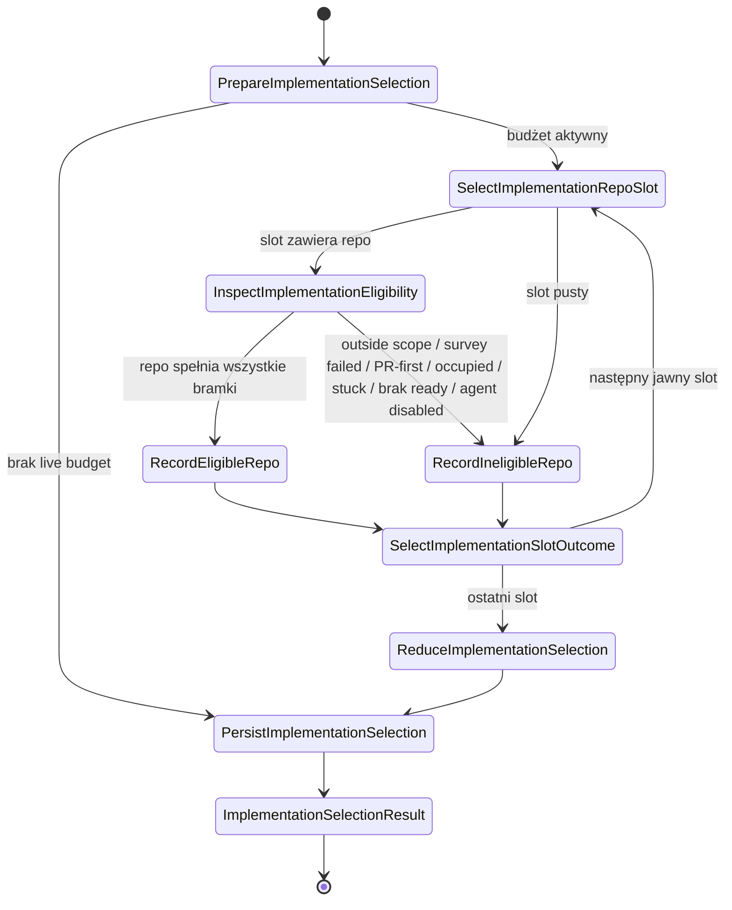
```mermaid
stateDiagram-v2
    [*] --> PrepareImplementationSelection
    PrepareImplementationSelection --> PersistImplementationSelection: brak live budget
    PrepareImplementationSelection --> SelectImplementationRepoSlot: budżet aktywny
    SelectImplementationRepoSlot --> InspectImplementationEligibility: slot zawiera repo
    SelectImplementationRepoSlot --> RecordIneligibleRepo: slot pusty
    InspectImplementationEligibility --> RecordEligibleRepo: repo spełnia wszystkie bramki
    InspectImplementationEligibility --> RecordIneligibleRepo: outside scope / survey failed / PR-first / occupied / stuck / brak ready / agent disabled
    RecordEligibleRepo --> SelectImplementationSlotOutcome
    RecordIneligibleRepo --> SelectImplementationSlotOutcome
    SelectImplementationSlotOutcome --> SelectImplementationRepoSlot: następny jawny slot
    SelectImplementationSlotOutcome --> ReduceImplementationSelection: ostatni slot
    ReduceImplementationSelection --> PersistImplementationSelection
    PersistImplementationSelection --> ImplementationSelectionResult
    ImplementationSelectionResult --> [*]
```

Pod-Fala rozwija pełny katalog do 30 jawnych slotów. Każdy slot sprawdza jeden
repozytoryjny zestaw twardych faktów: zakres, kompletność survey PR, PR-first,
occupancy, stuck ledger, obecność gotowego issue i dostępność executora. Fala
prowadzi rozłączne krawędzie `eligible` i `ineligible`. Czysty reduktor wybiera
pierwsze kwalifikujące się repo w kolejności konfiguracji; nie uruchamia procesu
ani mutacji. Osobny efekt materializuje plan implementacji.

### Higiena kolejki implementacji — `queue_conflict`

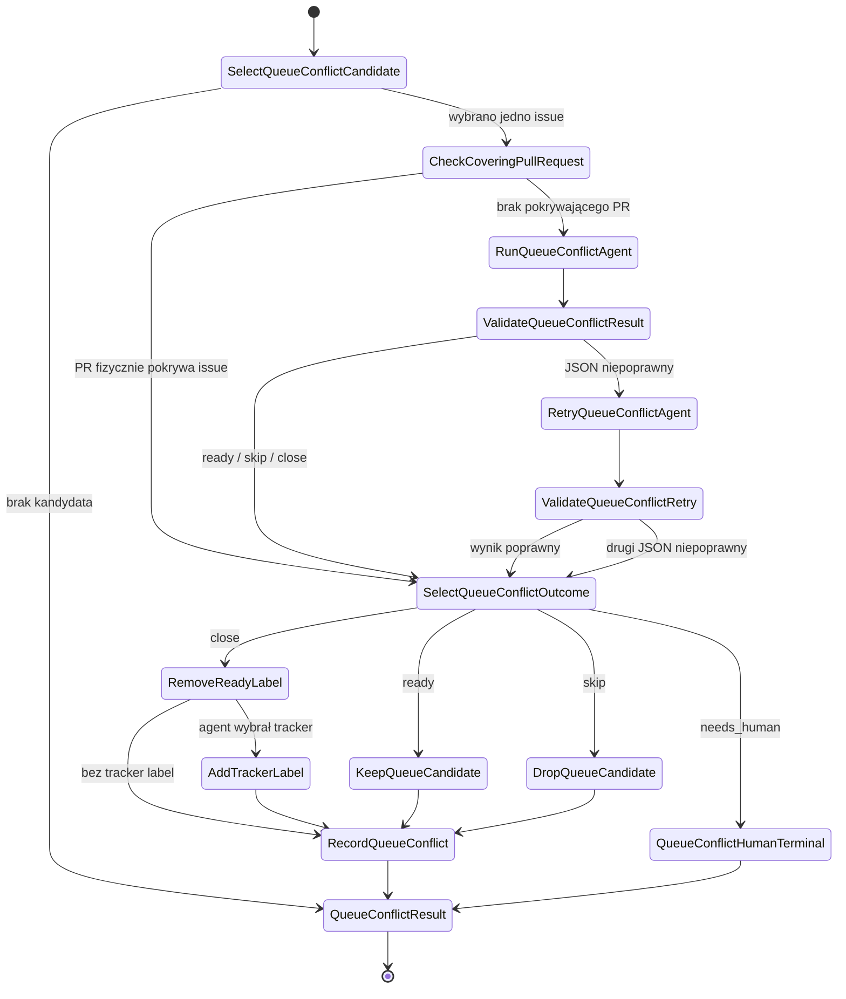
```mermaid
stateDiagram-v2
    [*] --> SelectQueueConflictCandidate
    SelectQueueConflictCandidate --> QueueConflictResult: brak kandydata
    SelectQueueConflictCandidate --> CheckCoveringPullRequest: wybrano jedno issue
    CheckCoveringPullRequest --> SelectQueueConflictOutcome: PR fizycznie pokrywa issue
    CheckCoveringPullRequest --> RunQueueConflictAgent: brak pokrywającego PR
    RunQueueConflictAgent --> ValidateQueueConflictResult
    ValidateQueueConflictResult --> RetryQueueConflictAgent: JSON niepoprawny
    ValidateQueueConflictResult --> SelectQueueConflictOutcome: ready / skip / close
    RetryQueueConflictAgent --> ValidateQueueConflictRetry
    ValidateQueueConflictRetry --> SelectQueueConflictOutcome: wynik poprawny
    ValidateQueueConflictRetry --> SelectQueueConflictOutcome: drugi JSON niepoprawny
    SelectQueueConflictOutcome --> KeepQueueCandidate: ready
    SelectQueueConflictOutcome --> DropQueueCandidate: skip
    SelectQueueConflictOutcome --> RemoveReadyLabel: close
    SelectQueueConflictOutcome --> QueueConflictHumanTerminal: needs_human
    RemoveReadyLabel --> AddTrackerLabel: agent wybrał tracker
    RemoveReadyLabel --> RecordQueueConflict: bez tracker label
    AddTrackerLabel --> RecordQueueConflict
    KeepQueueCandidate --> RecordQueueConflict
    DropQueueCandidate --> RecordQueueConflict
    RecordQueueConflict --> QueueConflictResult
    QueueConflictHumanTerminal --> QueueConflictResult
    QueueConflictResult --> [*]
```

Pod-Fala wybiera najwyżej jedno issue w jednym pass. Pokrycie przez otwarty PR
pozostaje twardym faktem. Pozostałą semantykę rozstrzyga agent, który zwraca
zamknięty wynik `ready | skip | close | needs_human`. Dokładny błąd walidatora
może uruchomić jeden retry. Python nie zastępuje poprawnego wyniku agenta
heurystyką ani statusem wykonania. Usunięcie `ai:ready`, opcjonalne dodanie
`ai:tracker`, aktualizacja kolejki i terminal są osobnymi efektami Fali.

### Higiena worktree — `reap_stale_worktrees`

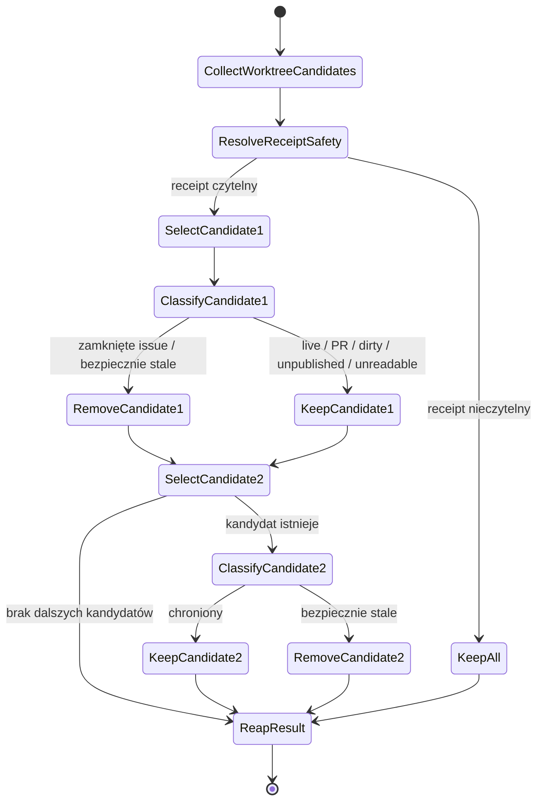
```mermaid
stateDiagram-v2
    [*] --> CollectWorktreeCandidates
    CollectWorktreeCandidates --> ResolveReceiptSafety
    ResolveReceiptSafety --> KeepAll: receipt nieczytelny
    ResolveReceiptSafety --> SelectCandidate1: receipt czytelny
    SelectCandidate1 --> ClassifyCandidate1
    ClassifyCandidate1 --> KeepCandidate1: live / PR / dirty / unpublished / unreadable
    ClassifyCandidate1 --> RemoveCandidate1: zamknięte issue / bezpiecznie stale
    RemoveCandidate1 --> SelectCandidate2
    KeepCandidate1 --> SelectCandidate2
    SelectCandidate2 --> ClassifyCandidate2: kandydat istnieje
    SelectCandidate2 --> ReapResult: brak dalszych kandydatów
    ClassifyCandidate2 --> KeepCandidate2: chroniony
    ClassifyCandidate2 --> RemoveCandidate2: bezpiecznie stale
    KeepCandidate2 --> ReapResult
    RemoveCandidate2 --> ReapResult
    KeepAll --> ReapResult
    ReapResult --> [*]
```

Pierwszy pion implementacji zachowa obecny `CLASSIFY_CAP`, ale przeniesie wybór,
klasyfikację, efekt `keep/remove` i wynik do osobnej pod-Fali. Kolejne sloty są
tym samym wzorcem co `Candidate2`; diagram skraca powtarzalne sloty, nie ukrywa
innej reguły routingu.

### Triage issue — `issue_triage`

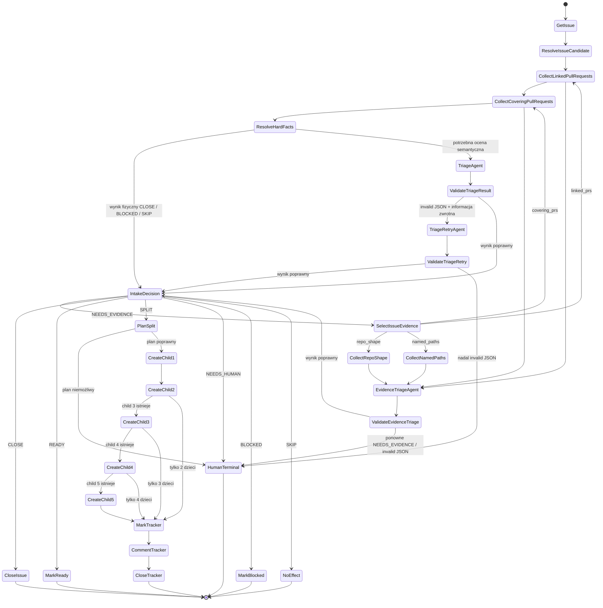
```mermaid
stateDiagram-v2
    [*] --> GetIssue
    GetIssue --> ResolveIssueCandidate
    ResolveIssueCandidate --> CollectLinkedPullRequests
    CollectLinkedPullRequests --> CollectCoveringPullRequests
    CollectCoveringPullRequests --> ResolveHardFacts
    ResolveHardFacts --> IntakeDecision: wynik fizyczny CLOSE / BLOCKED / SKIP
    ResolveHardFacts --> TriageAgent: potrzebna ocena semantyczna
    TriageAgent --> ValidateTriageResult
    ValidateTriageResult --> TriageRetryAgent: invalid JSON + informacja zwrotna
    TriageRetryAgent --> ValidateTriageRetry
    ValidateTriageRetry --> IntakeDecision: wynik poprawny
    ValidateTriageRetry --> HumanTerminal: nadal invalid JSON
    ValidateTriageResult --> IntakeDecision: wynik poprawny
    IntakeDecision --> SelectIssueEvidence: NEEDS_EVIDENCE
    SelectIssueEvidence --> CollectRepoShape: repo_shape
    SelectIssueEvidence --> CollectNamedPaths: named_paths
    SelectIssueEvidence --> CollectLinkedPullRequests: linked_prs
    SelectIssueEvidence --> CollectCoveringPullRequests: covering_prs
    CollectRepoShape --> EvidenceTriageAgent
    CollectNamedPaths --> EvidenceTriageAgent
    CollectLinkedPullRequests --> EvidenceTriageAgent
    CollectCoveringPullRequests --> EvidenceTriageAgent
    EvidenceTriageAgent --> ValidateEvidenceTriage
    ValidateEvidenceTriage --> IntakeDecision: wynik poprawny
    ValidateEvidenceTriage --> HumanTerminal: ponowne NEEDS_EVIDENCE / invalid JSON
    IntakeDecision --> CloseIssue: CLOSE
    IntakeDecision --> MarkReady: READY
    IntakeDecision --> PlanSplit: SPLIT
    IntakeDecision --> HumanTerminal: NEEDS_HUMAN
    IntakeDecision --> MarkBlocked: BLOCKED
    IntakeDecision --> NoEffect: SKIP
    PlanSplit --> HumanTerminal: plan niemożliwy
    PlanSplit --> CreateChild1: plan poprawny
    CreateChild1 --> CreateChild2
    CreateChild2 --> CreateChild3: child 3 istnieje
    CreateChild2 --> MarkTracker: tylko 2 dzieci
    CreateChild3 --> CreateChild4: child 4 istnieje
    CreateChild3 --> MarkTracker: tylko 3 dzieci
    CreateChild4 --> CreateChild5: child 5 istnieje
    CreateChild4 --> MarkTracker: tylko 4 dzieci
    CreateChild5 --> MarkTracker
    MarkTracker --> CommentTracker
    CommentTracker --> CloseTracker
    CloseIssue --> [*]
    MarkReady --> [*]
    MarkBlocked --> [*]
    CloseTracker --> [*]
    NoEffect --> [*]
    HumanTerminal --> [*]
```

### Implementacja issue — `issue_to_pr`

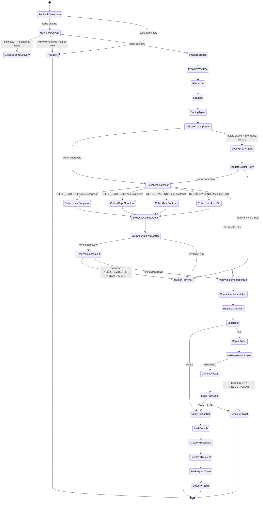
```mermaid
stateDiagram-v2
    [*] --> RecheckOpenIssue
    RecheckOpenIssue --> RecheckDelivery: issue otwarte
    RecheckOpenIssue --> NoEffect: issue zamknięte
    RecheckDelivery --> CloseExistingDelivery: istniejący PR dostarcza issue
    RecheckDelivery --> NoEffect: wznowiona gałąź ma kod celu
    RecheckDelivery --> PrepareBranch: brak dostawy
    PrepareBranch --> PrepareWorktree
    PrepareWorktree --> PlanIssue
    PlanIssue --> Localize
    Localize --> CodingAgent
    CodingAgent --> ValidateCodingResult
    ValidateCodingResult --> SelectCodingResult: wynik poprawny
    ValidateCodingResult --> CodingRetryAgent: invalid JSON + informacja zwrotna
    CodingRetryAgent --> ValidateCodingRetry
    ValidateCodingRetry --> SelectCodingResult: wynik poprawny
    ValidateCodingRetry --> HumanTerminal: nadal invalid JSON
    SelectCodingResult --> CollectIssueSnapshot: NEEDS_EVIDENCE(issue_snapshot)
    SelectCodingResult --> CollectRepoStructure: NEEDS_EVIDENCE(repo_structure)
    SelectCodingResult --> CollectTestContract: NEEDS_EVIDENCE(test_contract)
    SelectCodingResult --> CollectLocalizedDiff: NEEDS_EVIDENCE(localized_diff)
    CollectIssueSnapshot --> EvidenceCodingAgent
    CollectRepoStructure --> EvidenceCodingAgent
    CollectTestContract --> EvidenceCodingAgent
    CollectLocalizedDiff --> EvidenceCodingAgent
    EvidenceCodingAgent --> ValidateEvidenceCoding
    ValidateEvidenceCoding --> FinalizeCodingResult: wynik poprawny
    ValidateEvidenceCoding --> HumanTerminal: invalid JSON
    FinalizeCodingResult --> HumanTerminal: ponowne NEEDS_EVIDENCE / NEEDS_HUMAN
    SelectCodingResult --> VerifyImplementationDiff: IMPLEMENTED
    FinalizeCodingResult --> VerifyImplementationDiff: IMPLEMENTED
    VerifyImplementationDiff --> CommitImplementation
    CommitImplementation --> RebaseOntoMain
    RebaseOntoMain --> LocalTest
    LocalTest --> VerifyPublishDiff: PASS
    LocalTest --> RepairAgent: FAIL
    RepairAgent --> ValidateRepairResult
    ValidateRepairResult --> CommitRepair: REPAIRED
    ValidateRepairResult --> RepairTerminal: invalid JSON / NEEDS_HUMAN
    CommitRepair --> LocalTestAgain
    LocalTestAgain --> VerifyPublishDiff: PASS
    LocalTestAgain --> RepairTerminal: FAIL
    VerifyPublishDiff --> PushBranch
    PushBranch --> CreatePullRequest
    CreatePullRequest --> LabelPullRequest
    LabelPullRequest --> PullRequestOpen
    PullRequestOpen --> DeliveryResult
    DeliveryResult --> [*]
    NoEffect --> [*]
    HumanTerminal --> [*]
    RepairTerminal --> [*]
```

### Zamknięcie PR — `pr_triage`

```mermaid
stateDiagram-v2
    [*] --> InspectPullRequest
    InspectPullRequest --> ConflictRecovery: konflikt
    InspectPullRequest --> HumanTerminal: terminal ręczny
    InspectPullRequest --> CollectReviewEvidence: gotowy do recenzji
    CollectReviewEvidence --> ResolveShaReview
    ResolveShaReview --> ReviewVerdict: werdykt zapisany dla SHA
    ResolveShaReview --> ReviewAgent: brak werdyktu dla SHA
    ReviewAgent --> ValidateReviewResult
    ValidateReviewResult --> ReviewRetryAgent: invalid JSON + informacja zwrotna
    ReviewRetryAgent --> ValidateRetryResult
    ValidateRetryResult --> ReviewVerdict: wynik poprawny
    ValidateRetryResult --> HumanTerminal: nadal invalid JSON
    ValidateReviewResult --> ReviewVerdict: wynik poprawny
    ReviewVerdict --> SelectEvidenceCollector: NEEDS_EVIDENCE
    SelectEvidenceCollector --> CollectPrMetadata: pr_metadata
    SelectEvidenceCollector --> CollectChangedFiles: changed_files
    SelectEvidenceCollector --> CollectDiffTail: diff_tail
    SelectEvidenceCollector --> CollectCommitSummary: commit_summary
    CollectPrMetadata --> VerifyEvidenceSha
    CollectChangedFiles --> VerifyEvidenceSha
    CollectDiffTail --> VerifyEvidenceSha
    CollectCommitSummary --> VerifyEvidenceSha
    VerifyEvidenceSha --> EvidenceReviewAgent: SHA bez zmian
    VerifyEvidenceSha --> HumanTerminal: SHA zmienione / brak dowodu
    EvidenceReviewAgent --> ValidateEvidenceReview
    ValidateEvidenceReview --> ReviewVerdict: wynik poprawny
    ValidateEvidenceReview --> HumanTerminal: ponowne NEEDS_EVIDENCE / invalid JSON
    ReviewVerdict --> LocalMergeGate: APPROVE
    ReviewVerdict --> RepairPullRequest: REQUEST_CHANGES
    ReviewVerdict --> HumanTerminal: NEEDS_HUMAN
    RepairPullRequest --> CollectReviewEvidence: nowy SHA
    LocalMergeGate --> MergePullRequest: testy lokalne i fakty pozwalają
    LocalMergeGate --> RepairPullRequest: test lokalny nie przechodzi
    MergePullRequest --> CloseIssue
    CloseIssue --> Delivered
    ConflictRecovery --> [*]
    HumanTerminal --> [*]
    Delivered --> [*]
```

### Naprawa istniejącego PR — `pr_repair`

```mermaid
stateDiagram-v2
    [*] --> PrepareRepairWorktree
    PrepareRepairWorktree --> CollectRepairEvidence
    CollectRepairEvidence --> RepairAgent
    RepairAgent --> ValidateRepairResult
    ValidateRepairResult --> SelectRepairResult: wynik poprawny
    ValidateRepairResult --> RepairRetryAgent: invalid JSON + informacja zwrotna
    RepairRetryAgent --> ValidateRepairRetry
    ValidateRepairRetry --> SelectRepairResult: wynik poprawny
    ValidateRepairRetry --> HumanTerminal: nadal invalid JSON
    SelectRepairResult --> CollectPrMetadata: NEEDS_EVIDENCE(pr_metadata)
    SelectRepairResult --> CollectChangedFiles: NEEDS_EVIDENCE(changed_files)
    SelectRepairResult --> CollectTestContract: NEEDS_EVIDENCE(test_contract)
    SelectRepairResult --> CollectReviewFindings: NEEDS_EVIDENCE(review_findings)
    CollectPrMetadata --> EvidenceRepairAgent
    CollectChangedFiles --> EvidenceRepairAgent
    CollectTestContract --> EvidenceRepairAgent
    CollectReviewFindings --> EvidenceRepairAgent
    EvidenceRepairAgent --> ValidateEvidenceRepair
    ValidateEvidenceRepair --> FinalizeRepairResult: wynik poprawny
    ValidateEvidenceRepair --> HumanTerminal: invalid JSON
    FinalizeRepairResult --> HumanTerminal: ponowne NEEDS_EVIDENCE / NEEDS_HUMAN
    SelectRepairResult --> VerifyRepairDiff: REPAIRED
    FinalizeRepairResult --> VerifyRepairDiff: REPAIRED
    VerifyRepairDiff --> CommitRepair
    CommitRepair --> LocalRepairTest
    LocalRepairTest --> VerifyPublishDiff: PASS
    LocalRepairTest --> TestRepairAgent: FAIL
    TestRepairAgent --> ValidateTestRepair
    ValidateTestRepair --> VerifyTestRepairDiff: REPAIRED
    ValidateTestRepair --> RepairTerminal: invalid JSON / NEEDS_HUMAN
    VerifyTestRepairDiff --> CommitTestRepair
    CommitTestRepair --> LocalRepairTestAgain
    LocalRepairTestAgain --> VerifyPublishDiff: PASS
    LocalRepairTestAgain --> RepairTerminal: FAIL
    VerifyPublishDiff --> PushNewSha
    PushNewSha --> RepairResult
    RepairResult --> [*]
    HumanTerminal --> [*]
    RepairTerminal --> [*]
```

### Odzyskanie Lokaya — `daemon_cycle` + `self_repair`

```mermaid
stateDiagram-v2
    [*] --> BeginObservation
    BeginObservation --> RunFactoryPass
    RunFactoryPass --> ObserveCarrier
    ObserveCarrier --> RecordEvidence
    RecordEvidence --> [*]: healthy / progress / waiting / idle
    RecordEvidence --> ConfirmIncident: powtarzalna awaria nośnika
    ConfirmIncident --> PrepareRecovery
    PrepareRecovery --> RecoveryAgent
    RecoveryAgent --> ValidateRecoveryResult
    ValidateRecoveryResult --> RecoveryAgent: invalid JSON + informacja zwrotna
    ValidateRecoveryResult --> RecoveryEvidence: NEEDS_EVIDENCE
    RecoveryEvidence --> RecoveryAgent
    ValidateRecoveryResult --> ValidatePatch: FIXED
    ValidateRecoveryResult --> HumanTerminal: NEEDS_HUMAN
    ValidatePatch --> CommitRecovery
    CommitRecovery --> PushMainFastForward
    PushMainFastForward --> ActivateRelease
    ActivateRelease --> PreflightRelease
    PreflightRelease --> CloseIncident: PASS
    PreflightRelease --> ConfirmIncident: FAIL
    CloseIncident --> [*]
    HumanTerminal --> [*]
```

### Zgodność diagramu z implementacją

Diagram jest docelowym kontraktem maszyny. Nie oznacza, że każda pokazana
krawędź już istnieje. Implementacja może ruszyć dopiero po zaakceptowaniu tego
kontraktu. Aktualny audyt:

| Fragment | Stan obecny |
| --- | --- |
| `approve → lokalne testy → merge` | zaimplementowane w Fali |
| `request_changes → pr_repair → nowy SHA → recenzja` | zaimplementowane z zamkniętym wynikiem agenta, jedną rundą dowodu i jedną naprawą testów |
| `needs_human → terminal` | zaimplementowane w Fali |
| `needs_evidence → jeden kolektor z zamkniętego zbioru → ponów agenta raz` | zaimplementowane w Fali |
| `invalid JSON → feedback walidatora → ponów agenta raz` | zaimplementowane w Fali |
| `issue_triage` bez ukrytego drzewa Python | zaimplementowane w Fali wraz z pod-Falą `issue_split` |
| `issue_to_pr` bez ukrytego drzewa Python | zaimplementowane jako gate Fali + pod-Fala `issue_to_pr_delivery` |
| odzyskanie lokalnego work item bez globalnej awarii Lokaya | **do refaktoru** |

### Ścieżki Fali odpowiadające diagramowi

| Stan z diagramu | Ścieżka Fali | Efekt domenowy |
| --- | --- | --- |
| `DaemonCycle` | `daemon_cycle` | uruchamia przebieg i ewentualne odzyskanie |
| `FactoryPass` | `factory_pass` | wybiera jedną następną pracę w pełnym katalogu |
| `ReadySurvey` | `survey_ready` | seryjny odczyt i klasyfikacja gotowych issue |
| `TriageDispatch` | `triage_dispatch` | wybiera i uruchamia najwyżej jedno issue inbox |
| `ImplementationDispatch` | `implementation_dispatch` | wybiera i uruchamia najwyżej jeden gotowy ticket |
| `ConflictResolution` | `resolve_conflicts` | zamyka najwyżej jeden konfliktujący PR i ponownie ustawia issue jako ready |
| `ImplementationSelection` | `select_implement` | prowadzi katalog przez jawne bramki kwalifikacji repo |
| `PassPlan` | `plan_pass` | składa repozytoryjne fragmenty planu przez jawne sloty |
| `OccupancyRefresh` | `refresh_occupancy` | składa żywe receipty i repozytoryjne snapshoty PR przez jawne sloty |
| `StaleImplementingReap` | `reap_stale_implementing` | odzyskuje porzucone etapy przez jawne sloty repozytoriów i etykiet |
| `OverBudgetReap` | `reap_over_budget` | ogranicza receipt workera przez jawny harvest albo plan-only reap |
| `SelfRepairPrepare` | `self_repair_prepare` | przygotowuje lub bezpiecznie wznawia izolowany worktree przez pod-Falę |
| `SelfRepairValidate` | `self_repair_validate` | waliduje exact candidate, testy i diff przez pod-Falę |
| `InboxSurvey` | `survey_inbox` | przegląda inbox pełnego katalogu przez jawne sloty repozytoriów |
| `PRSurvey` | `survey_prs` | przegląda PR-y pełnego katalogu przez jawne sloty repozytoriów |
| `ReadyHygiene` | `ready_hygiene` | usuwa osierocone ready labels przez jawne sloty repo i issue |
| `CloseoutPRs` | `closeout_prs` | domyka katalog PR-ów przez jawne sloty i pod-Falę jednego PR |
| `CloseoutPR` | `closeout_pr` | prowadzi checks, repair, triage/merge i parkowanie jednego PR |
| `QueueConflict` | `queue_conflict` | jeden zamknięty werdykt agenta przed implementacją |
| `StaleWorktreeHygiene` | `stale_worktree_reap` | klasyfikuje i usuwa ograniczoną liczbę bezpiecznie starych worktree |
| `TriageInbox` | `issue_triage` | `CLOSE`, `READY`, `SPLIT`, `NEEDS_HUMAN` |
| `SplitIssue` | `issue_split` | do 5 dzieci, tracker i zamknięcie rodzica |
| `ImplementIssue` | `issue_to_pr` | jawny gate faktów issue i istniejącej dostawy |
| `ImplementIssueDelivery` | `issue_to_pr_delivery` | otwarty i oznaczony PR dla issue |
| `ReviewPullRequest` | `pr_triage` | merge, naprawa, dowody albo terminal ręczny |
| `RepairPullRequest` | `pr_repair` | nowy SHA na istniejącym PR |
| `SelfRepair` | `self_repair` | zweryfikowany fast-forward Lokaya |

### Reguły przejść

1. GitHub przechowuje stan domenowy. Dziennik Fali przechowuje wykonanie i
   obserwowalność. Etykieta nie może rekonstruować ani nadpisywać werdyktu.
2. Wynik agenta jest związany z konkretnym SHA i ma zamknięty schemat. Informacje
   `skipped`, `cached` i `already_reviewed_head` są tylko metadanymi wykonania.
3. Każda strzałka oznacza proces, który można osobno ponowić i obserwować.
4. Złożona gałąź jest osobną ścieżką lub pod-Falą. Nie wolno implementować jej
   jako rozbudowanego dispatchera Python.
5. Efekty uboczne następują dopiero po deterministycznej krawędzi Fali:
   etykieta, commit, push, utworzenie PR, merge i zamknięcie issue.
6. Lokay nie używa GitHub Actions. Testy i walidacja wykonują się lokalnie w
   zadeklarowanym środowisku repozytorium. LaunchAgent daje stały heartbeat.

## Safety

- Live mutation requires explicit live mode and a healthy preflight lease.
- Dry-run never mutates and is not a substitute agent.
- Issue bodies and repository content are untrusted input to the executor.
- Product runtime does not force-push or delete repositories.
- Invalid structured review, requested changes, secrets, and human-review requirements fail closed.
- Failed local verification, manual review, and survey errors are not reported as successful progress.

## Commands and layout

| Path or command | Purpose |
| --- | --- |
| `uv run lokay validate --config config.yaml` | Validate configuration |
| `uv run lokay-repos --config config.yaml` | List managed repositories |
| `uv run lokay status --config config.yaml` | Readiness, health, K, per-repo work, human residuals (`--local` / `--human`) |
| `~/.lokay/last-pass.json` | Compact pass receipt after each tick (LaunchAgent-friendly) |
| `uv run lokay path --describe` | Inspect materialized workflow paths |
| `uv run lokay mill --config config.yaml --live --max-passes 8` | Run a bounded live mill |
| `src/lokay/proc/` | Unix atoms |
| `src/lokay/compose/` | Path entrypoints and top-level mill policy |
| `fala/` | Authored Fala package |
| `scripts/lokay-mill-daemon.sh` | Launchd-compatible one-pass wrapper |

## Binding documentation

- [`docs/WORKING.md`](docs/WORKING.md) — working-machine contract and tick order
- [`docs/AUTONOMY.md`](docs/AUTONOMY.md) — autonomous mill Definition of Working, night profile, canaries
- [`docs/MILL_HEALTH.md`](docs/MILL_HEALTH.md) — mill health without watching GitHub
- [`docs/GRAPH.md`](docs/GRAPH.md) — Fala paths and conduction
- [`docs/UNIX.md`](docs/UNIX.md) — process boundaries and JSON envelopes
- [`docs/NO_STUBS.md`](docs/NO_STUBS.md) — real-agent requirement
- [`docs/HTMX.md`](docs/HTMX.md), [`docs/ALPINE.md`](docs/ALPINE.md), [`docs/PLATFORM_UI.md`](docs/PLATFORM_UI.md) — UI boundaries
- [`repos.mikolaj92.yaml`](repos.mikolaj92.yaml) — managed repository inventory


## Local status dashboard

Run the read-only FastAPI dashboard on localhost:

```bash
uv run lokay-status-server --config config.yaml
# http://127.0.0.1:8766
```

The server does not survey GitHub or mutate the mill. It renders the current local
pass receipt, 24-hour and 7-day event throughput, supported repositories, per-repo
work, blockers, and a bounded history of completed pass receipts. Core UI assets
come from the pinned app-factory platform at same-origin `/static/platform`.
