# Lokay

Lokay continuously mills work across configured GitHub repositories: select then **serial** `issue_to_pr` (ticket after ticket; default K=1) with a real configured coding executor. Housecleaning (survey, triage, close-out, leftover reaps) runs only on a pass with no selected work.

## What one tick does

1. Opens the pass and selects one implementable catalog row from the cheap prior catalog / live occupancy (`select_implement` after `factory_begin`).
2. When `select_implement.route == selected`, runs the contradiction gate and detached `issue_to_pr` (`queue_conflict` → `dispatch_implement`), then health and the last-pass receipt. Surveys, triage, close-out, occupancy refresh, and leftover reaps do not run in that pass — they must not consume the short pass ceiling before start or the receipt.
3. When no row is selected, housecleans: surveys every enabled repository for inbox issues, open catalog issues (human stops exclude; `work:ready` / `ai:ready` are not a gate), and open `ai/fix/*` pull requests; triages undecided issues through `issue_triage`; applies per-repo PR-first close-out (conflicts closed and re-readied, failed work enters `pr_repair`, approved mergeable work enters `pr_triage`); reaps leftover in-flight cache, over-budget plan-only, occupancy, and leftover worktrees.
4. Reports truthful health. Remaining work without progress is not reported as idle; waiting and survey errors remain distinct outcomes. Never a second AI PR in the same repo. Serial by design (`limits.max_issue_to_pr_per_pass`, default **1**).

The top-level Lokay runs the parent `factory_pass` Fala. Catalog surveys, planning, closeout, dispatch and recovery are authored paths or nested authored paths. Parent and child runs use separate journals.

## Architecture

- **Core value:** authored Fala process graph(s) (`fala/`). Workers, GitHub, and atom bodies are replaceable blocks under JSON contracts — see `docs/PROCESS.md`.
- `src/lokay/proc/`: small command-line atoms. They exchange JSON envelopes on stdout.
- `fala/lokay.fala-package.toml`: authored parent `factory_pass` plus child conduction for `issue_triage`, `pr_triage`, `pr_repair`, and `issue_to_pr`.
- `src/lokay/compose/`: thin graph and read-only status entrypoints; product ordering stays in Fala.
- `executor.command` and `executor.args`: the sole nondeterministic coding slot. Lokay rejects fake, stub, and no-op agents.
- Local verification is repository-declared (`[tool.lokay] test` in the worktree `pyproject.toml`). No declaration is an honest skip — Lokay does not invent `pytest` from `pyproject` / `tests/`.
- `repos.mikolaj92.yaml`: managed repository scope.

There is no alternate Python fallback graph and no Hermes/Kanban execution ledger.

## Quick start

Requirements: Python 3.12+, [`uv`](https://docs.astral.sh/uv/), authenticated GitHub CLI `gh`, and a local Fala checkout at `../Fala` as configured in `pyproject.toml`. Verification is local; Lokay does not use GitHub Actions.

```bash
uv sync
cp config.example.yaml config.yaml
uv run lokay validate --config config.yaml
uv run lokay-repos --config config.yaml
uv run lokay status --config config.yaml
uv run lokay path --describe
```

Dry-run is the default unless live mode is explicit:

```bash
uv run lokay tick --config config.yaml
uv run lokay mill --config config.yaml --live --max-passes 8
```

For a documented night / live autonomous profile (merge on, local verification,
serial K=1), see `config.live-autonomous.example.yaml` and
[`docs/AUTONOMY.md`](docs/AUTONOMY.md).

## Continuous operation

The product daemon entrypoint owns one OS advisory lock across preflight and work:

```bash
uv run lokay-daemon --config config.yaml --max-passes 8 \
  --outbox ~/.lokay/preflight-bootstrap-incidents.log
```

This machine uses LaunchAgent label `ai.mikolaj.lokay-mill`, `scripts/lokay-mill-daemon.sh`, and logs under `~/.lokay/logs/`. The repository does not install or version a LaunchAgent plist.

## Maszyna stanów Lokaya

Lokay jest maszyną stanów sterowaną przez Falę. Stan domenowy pochodzi z
GitHuba (`issue`, PR, SHA, merge), a Fala wybiera następny minimalny proces
Unixowy. Proces może odczytać fakt albo wykonać jeden efekt uboczny. Nie może
ukrywać kolejnego grafu. Agent występuje tylko na granicy niedeterministycznej
i zwraca jeden wynik z zamkniętego schematu. Recenzja PR może poprosić o dokładnie
jeden dodatkowy fakt: `pr_metadata`, `changed_files`, `diff_tail` albo
`commit_summary`. Każdy rodzaj ma osobny kolektor Unixowy. Fala uruchamia tylko
wybrany kolektor, ponawia agenta raz i kieruje drugą prośbę o dowody do terminala
ręcznego.

Ten diagram jest kontraktem projektowym. **Każda zmiana przepływu zaczyna się
od zmiany i przeglądu diagramu. Dopiero zaakceptowany diagram wolno zakodować
w pakiecie Fali.** Test sprawdza, że diagram oraz `fala/lokay.fala-package.toml`
wymieniają te same ścieżki.

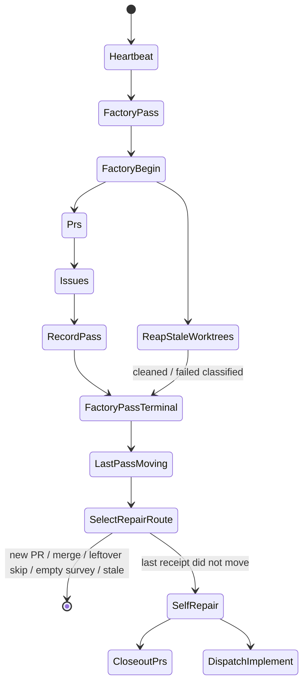
```mermaid
stateDiagram-v2
    [*] --> Heartbeat
    Heartbeat --> FactoryPass
    FactoryPass --> FactoryBegin
    FactoryBegin --> Prs
    FactoryBegin --> ReapStaleWorktrees
    Prs --> Issues
    Issues --> RecordPass
    RecordPass --> FactoryPassTerminal
    ReapStaleWorktrees --> FactoryPassTerminal: cleaned / failed classified
    FactoryPassTerminal --> LastPassMoving
    LastPassMoving --> SelectRepairRoute
    SelectRepairRoute --> [*]: new PR / merge / leftover skip / empty survey / stale
    SelectRepairRoute --> SelfRepair: last receipt did not move
    SelfRepair --> CloseoutPrs
    SelfRepair --> DispatchImplement
```

### Otwarcie workspace passu — `factory_begin`

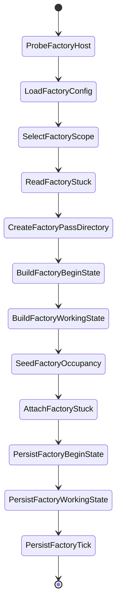
```mermaid
stateDiagram-v2
    [*] --> ProbeFactoryHost
    ProbeFactoryHost --> LoadFactoryConfig
    LoadFactoryConfig --> SelectFactoryScope
    SelectFactoryScope --> ReadFactoryStuck
    ReadFactoryStuck --> CreateFactoryPassDirectory
    CreateFactoryPassDirectory --> BuildFactoryBeginState
    BuildFactoryBeginState --> BuildFactoryWorkingState
    BuildFactoryWorkingState --> SeedFactoryOccupancy
    SeedFactoryOccupancy --> AttachFactoryStuck
    AttachFactoryStuck --> PersistFactoryBeginState
    PersistFactoryBeginState --> PersistFactoryWorkingState
    PersistFactoryWorkingState --> PersistFactoryTick
    PersistFactoryTick --> [*]
```

NODE agent owns this graph. Each effector is a LEAF agent (one job, one
process). `harvest_factory_children` is not a leaf here — it already
invokes child Fala `child_harvest` and must not sit on this path, or a
harvest skip would eat the factory. No `when` / idle on these leaves.

| Effector | Agent | Kind |
| --- | --- | --- |
| `probe_factory_host` | leaf:probe_factory_host | LEAF |
| `load_factory_config` | leaf:load_factory_config | LEAF |
| `select_factory_scope` | leaf:select_factory_scope | LEAF |
| `read_factory_stuck` | leaf:read_factory_stuck | LEAF |
| `create_factory_pass_dir` | leaf:create_factory_pass_dir | LEAF |
| `build_factory_begin_state` | leaf:build_factory_begin_state | LEAF |
| `build_factory_working_state` | leaf:build_factory_working_state | LEAF |
| `seed_factory_occupancy` | leaf:seed_factory_occupancy | LEAF |
| `attach_factory_stuck` | leaf:attach_factory_stuck | LEAF |
| `persist_factory_begin_state` | leaf:persist_factory_begin_state | LEAF |
| `persist_factory_working_state` | leaf:persist_factory_working_state | LEAF |
| `persist_factory_tick` | leaf:persist_factory_tick | LEAF |
| `harvest_factory_children` | child:child_harvest | child Fala, off this path |

### Przegląd gotowych issue — `survey_ready`

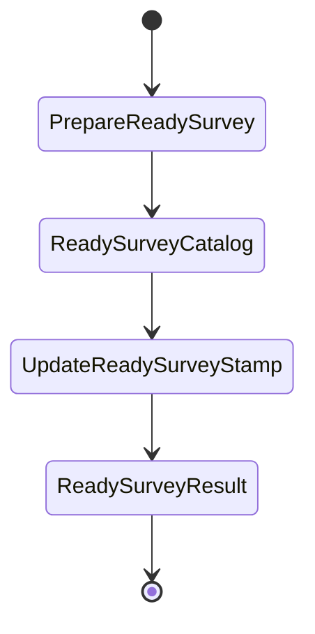
```mermaid
stateDiagram-v2
    [*] --> PrepareReadySurvey
    PrepareReadySurvey --> ReadySurveyCatalog
    ReadySurveyCatalog --> UpdateReadySurveyStamp
    UpdateReadySurveyStamp --> ReadySurveyResult
    ReadySurveyResult --> [*]
```

Pod-Fala ma trzy kroki: przygotowanie (TTL, katalog, hot/cold), jeden atom
katalogu, który w procesie listuje / klasyfikuje / parkuje zablokowane issue
i zapisuje remaining, oraz efekt stamp. Nie ma 30-slotowego rozwinięcia Fali.
`work:ready` / `ai:ready` nie są bramką. Overflow katalogu jest fail-closed.
Conduction niesie kwit; remaining liczy się z wylistowanych wierszy w procesie.

### Uruchomienie triage — `dispatch_triage`

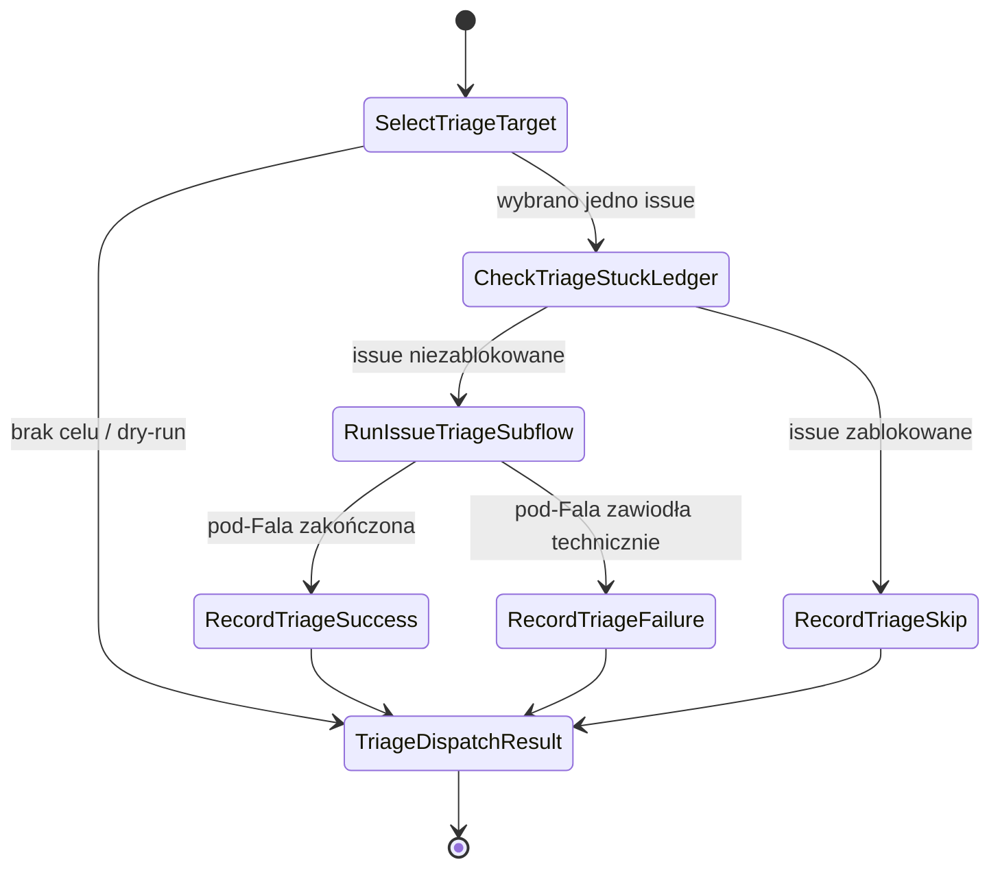
```mermaid
stateDiagram-v2
    [*] --> SelectTriageTarget
    SelectTriageTarget --> TriageDispatchResult: brak celu / dry-run
    SelectTriageTarget --> CheckTriageStuckLedger: wybrano jedno issue
    CheckTriageStuckLedger --> RecordTriageSkip: issue zablokowane
    CheckTriageStuckLedger --> RunIssueTriageSubflow: issue niezablokowane
    RunIssueTriageSubflow --> RecordTriageSuccess: pod-Fala zakończona
    RunIssueTriageSubflow --> RecordTriageFailure: pod-Fala zawiodła technicznie
    RecordTriageSuccess --> TriageDispatchResult
    RecordTriageFailure --> TriageDispatchResult
    RecordTriageSkip --> TriageDispatchResult
    TriageDispatchResult --> [*]
```

Pod-Fala uruchamia najwyżej jeden cel triage w jednym pass. Semantyczne drzewo
`issue_triage` pozostaje osobną autorską pod-Falą; dispatcher tylko wybiera cel,
sprawdza fizyczny ledger, uruchamia ją i zapisuje jej zamknięty wynik.

### Uruchomienie implementacji — `dispatch_implement`


```mermaid
stateDiagram-v2
    [*] --> SelectImplementationCandidate
    SelectImplementationCandidate --> DispatchResult: brak kandydata / brak budżetu / dry-run
    SelectImplementationCandidate --> InspectRepositoryMutex: wybrano jedno repo i issue
    InspectRepositoryMutex --> KeepCandidateQueued: mutex zajęty lub nieznany
    InspectRepositoryMutex --> VerifyIssueReady: mutex wolny
    VerifyIssueReady --> DropStaleCandidate: issue nie jest już fizycznie open albo ma human stop
    VerifyIssueReady --> LaunchIssueToPullRequest: issue nadal gotowe
    LaunchIssueToPullRequest --> RecordDispatchSuccess: worker uruchomiony
    LaunchIssueToPullRequest --> RecordDispatchFailure: uruchomienie nieudane
    RecordDispatchSuccess --> PersistStuckLedger
    RecordDispatchFailure --> PersistStuckLedger
    PersistStuckLedger --> LabelIssueBlocked: osiągnięto ograniczony próg awarii
    PersistStuckLedger --> DispatchResult: można spróbować w późniejszym pass
    LabelIssueBlocked --> PersistBlockedState
    PersistBlockedState --> ParkPlanOnly: wynik plan_only
    PersistBlockedState --> DispatchResult: inna ograniczona awaria
    ParkPlanOnly --> DispatchResult
    PersistStuckLedger --> WriteDispatchReceipt: worker uruchomiony
    WriteDispatchReceipt --> DispatchResult
    KeepCandidateQueued --> DispatchResult
    DropStaleCandidate --> DispatchResult
    DispatchResult --> [*]
```

Pod-Fala wybiera najwyżej jeden ticket w jednym pass. `K` jest seryjnym budżetem
kolejnych passów, nie pętlą ani równoległym schedulerem ukrytym w procesie.
Każdy węzeł wykonuje jeden odczyt faktu, jedną mutację albo jedną redukcję stanu.

### Odzyskanie konfliktującego PR — `resolve_conflicts`

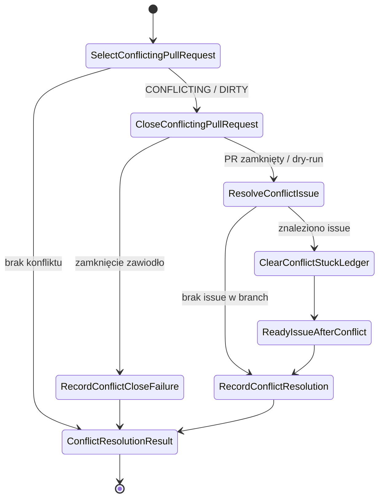
```mermaid
stateDiagram-v2
    [*] --> SelectConflictingPullRequest
    SelectConflictingPullRequest --> ConflictResolutionResult: brak konfliktu
    SelectConflictingPullRequest --> CloseConflictingPullRequest: CONFLICTING / DIRTY
    CloseConflictingPullRequest --> RecordConflictCloseFailure: zamknięcie zawiodło
    CloseConflictingPullRequest --> ResolveConflictIssue: PR zamknięty / dry-run
    ResolveConflictIssue --> RecordConflictResolution: brak issue w branch
    ResolveConflictIssue --> ClearConflictStuckLedger: znaleziono issue
    ClearConflictStuckLedger --> ReadyIssueAfterConflict
    ReadyIssueAfterConflict --> RecordConflictResolution
    RecordConflictCloseFailure --> ConflictResolutionResult
    RecordConflictResolution --> ConflictResolutionResult
    ConflictResolutionResult --> [*]
```

Pod-Fala wybiera najwyżej jeden konfliktujący PR w jednym pass. Wybór, zamknięcie
PR, wyprowadzenie numeru issue, wyczyszczenie ledgera, przywrócenie `ready` oraz
materializacja stanu są oddzielnymi procesami. Fala prowadzi każdą gałąź;
żaden proces nie iteruje po repozytoriach ani PR-ach i nie łączy kilku efektów.

### Plan przebiegu — `plan_pass`

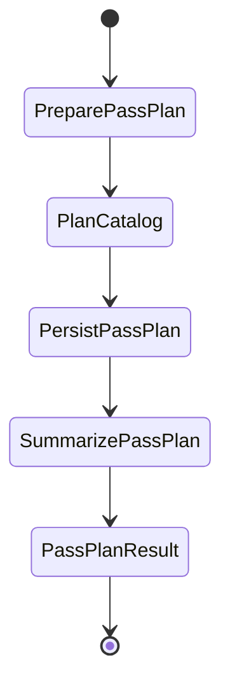
```mermaid
stateDiagram-v2
    [*] --> PreparePassPlan
    PreparePassPlan --> PlanCatalog
    PlanCatalog --> PersistPassPlan
    PersistPassPlan --> SummarizePassPlan
    SummarizePassPlan --> PassPlanResult
    PassPlanResult --> [*]
```

Pod-Fala ma cztery kroki: przygotowanie katalogu, jeden atom katalogu, który
w procesie buduje fragmenty planu i redukuje globalny budżet triage, persist
oraz summarize. Nie ma 30-slotowego rozwinięcia Fali. Overflow katalogu jest
fail-closed. Jeden czysty proces nadal buduje fragment jednego repozytorium
na podstawie survey, stuck ledgera, budżetu i PR-first; atom katalogu składa
je w procesie. Osobny efekt zapisuje plan oraz akcje wyjaśniające odrzucone
cele.

### Bezpośrednie wejście Lokaya — `product_entry`

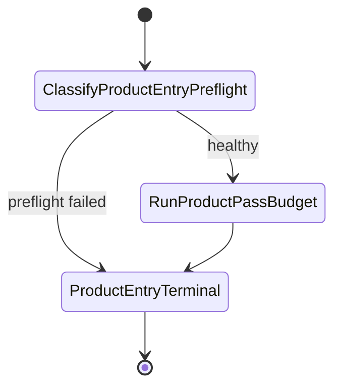
```mermaid
stateDiagram-v2
    [*] --> ClassifyProductEntryPreflight
    ClassifyProductEntryPreflight --> RunProductPassBudget: healthy
    ClassifyProductEntryPreflight --> ProductEntryTerminal: preflight failed
    RunProductPassBudget --> ProductEntryTerminal
    ProductEntryTerminal --> [*]
```

Wrapper bezpośredniego CLI posiada tylko capability unikalnej health lease,
jeden preflight i jej bezpieczne revoke. Zamknięty wynik przekazuje do Fali.
Fala, a nie `compose/mill.py`, wybiera terminal preflight albo istniejącą
`product_pass_budget` pod-Falę. Wrapper nie odtwarza pętli passów ani routingu.

### Wejście jednej self-repair — `self_repair_entry`

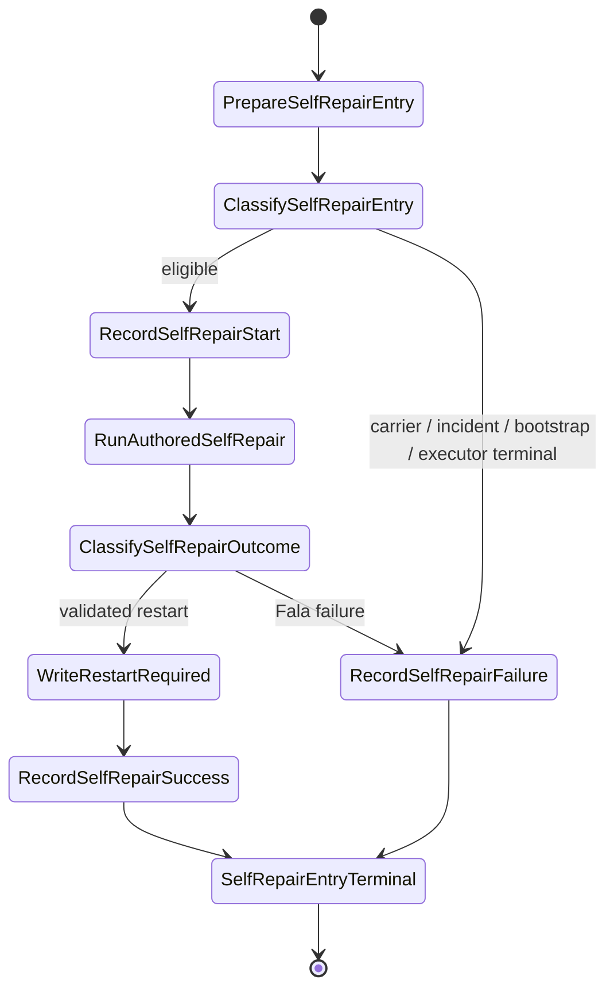
```mermaid
stateDiagram-v2
    [*] --> PrepareSelfRepairEntry
    PrepareSelfRepairEntry --> ClassifySelfRepairEntry
    ClassifySelfRepairEntry --> RecordSelfRepairStart: eligible
    ClassifySelfRepairEntry --> RecordSelfRepairFailure: carrier / incident / bootstrap / executor terminal
    RecordSelfRepairStart --> RunAuthoredSelfRepair
    RunAuthoredSelfRepair --> ClassifySelfRepairOutcome
    ClassifySelfRepairOutcome --> WriteRestartRequired: validated restart
    ClassifySelfRepairOutcome --> RecordSelfRepairFailure: Fala failure
    WriteRestartRequired --> RecordSelfRepairSuccess
    RecordSelfRepairSuccess --> SelfRepairEntryTerminal
    RecordSelfRepairFailure --> SelfRepairEntryTerminal
    SelfRepairEntryTerminal --> [*]
```

Pod-Fala przygotowuje incident identity, klasyfikuje preconditions, zapisuje
jawny event start/failure/success, uruchamia dokładnie jedną istniejącą
`self_repair` pod-Falę, klasyfikuje jej zamknięty wynik, zapisuje restart marker
i kończy terminalem. Compatibility wrapper nie rekonstruuje precondition ani
post-result routing w Pythonie.

### Wejście jednego heartbeat daemona — `daemon_entry`

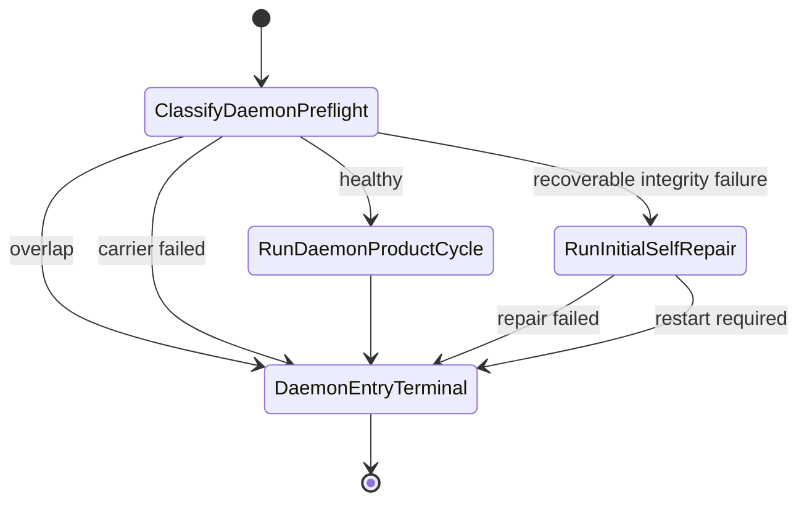
```mermaid
stateDiagram-v2
    [*] --> ClassifyDaemonPreflight
    ClassifyDaemonPreflight --> RunDaemonProductCycle: healthy
    ClassifyDaemonPreflight --> DaemonEntryTerminal: overlap
    ClassifyDaemonPreflight --> DaemonEntryTerminal: carrier failed
    ClassifyDaemonPreflight --> RunInitialSelfRepair: recoverable integrity failure
    RunDaemonProductCycle --> DaemonEntryTerminal
    RunInitialSelfRepair --> DaemonEntryTerminal: repair failed
    RunInitialSelfRepair --> DaemonEntryTerminal: restart required
    DaemonEntryTerminal --> [*]
```

Wrapper daemona posiada tylko nierozdzielną fizyczną capability: singleton lock,
unikalną ścieżkę health lease i jeden preflight, którego lease musi pozostać w
środowisku rodzica. Następnie przekazuje zamknięty wynik preflight do Fali.
Fala wybiera produkt, overlap, carrier terminal albo jedną pod-Falę
self-repair. Pythonowy entrypoint nie wybiera już kolejności produktu i
recovery. Zapis outboxu i kod procesu są mechanicznym raportowaniem terminala.

### Jeden mechaniczny intake check — `intake_check_execution`

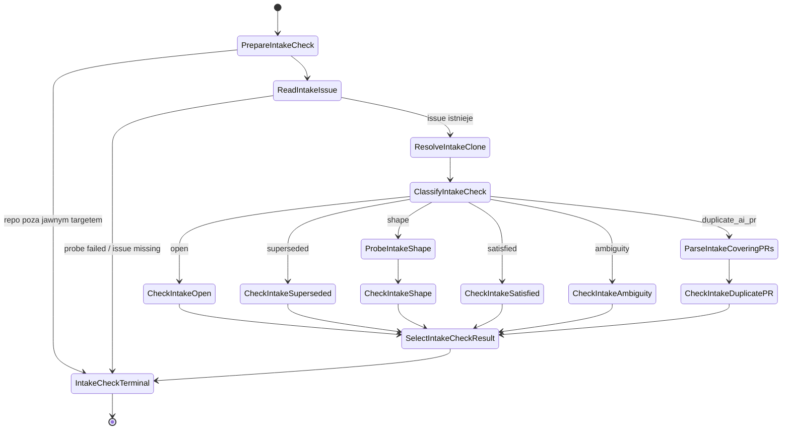
```mermaid
stateDiagram-v2
    [*] --> PrepareIntakeCheck
    PrepareIntakeCheck --> IntakeCheckTerminal: repo poza jawnym targetem
    PrepareIntakeCheck --> ReadIntakeIssue
    ReadIntakeIssue --> ResolveIntakeClone: issue istnieje
    ReadIntakeIssue --> IntakeCheckTerminal: probe failed / issue missing
    ResolveIntakeClone --> ClassifyIntakeCheck
    ClassifyIntakeCheck --> CheckIntakeOpen: open
    ClassifyIntakeCheck --> CheckIntakeSuperseded: superseded
    ClassifyIntakeCheck --> ProbeIntakeShape: shape
    ClassifyIntakeCheck --> CheckIntakeSatisfied: satisfied
    ClassifyIntakeCheck --> CheckIntakeAmbiguity: ambiguity
    ClassifyIntakeCheck --> ParseIntakeCoveringPRs: duplicate_ai_pr
    ProbeIntakeShape --> CheckIntakeShape
    ParseIntakeCoveringPRs --> CheckIntakeDuplicatePR
    CheckIntakeOpen --> SelectIntakeCheckResult
    CheckIntakeSuperseded --> SelectIntakeCheckResult
    CheckIntakeShape --> SelectIntakeCheckResult
    CheckIntakeSatisfied --> SelectIntakeCheckResult
    CheckIntakeAmbiguity --> SelectIntakeCheckResult
    CheckIntakeDuplicatePR --> SelectIntakeCheckResult
    SelectIntakeCheckResult --> IntakeCheckTerminal
    IntakeCheckTerminal --> [*]
```

Pod-Fala wykonuje dokładnie jeden wybrany mechaniczny check. Odczyt issue,
rozwiązanie checkoutu, klasyfikacja typu checku, bounded collector kształtu,
parsowanie covering-PR evidence, osobne czyste reguły i terminal są jawnymi
node’ami. Fala wybiera gałąź; proces CLI nie rekonstruuje drzewa przez `if/elif`.
To narzędzie nie podejmuje końcowej semantycznej decyzji triage.

### Deterministyczny plan jednego issue — `plan_issue_execution`

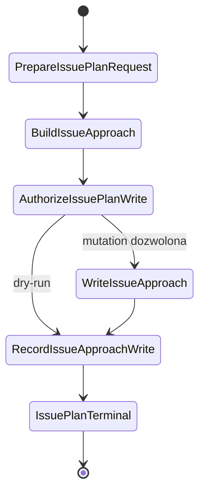
```mermaid
stateDiagram-v2
    [*] --> PrepareIssuePlanRequest
    PrepareIssuePlanRequest --> BuildIssueApproach
    BuildIssueApproach --> AuthorizeIssuePlanWrite
    AuthorizeIssuePlanWrite --> WriteIssueApproach: mutation dozwolona
    AuthorizeIssuePlanWrite --> RecordIssueApproachWrite: dry-run
    WriteIssueApproach --> RecordIssueApproachWrite
    RecordIssueApproachWrite --> IssuePlanTerminal
    IssuePlanTerminal --> [*]
```

Pod-Fala tworzy jeden deterministyczny `approach.md`. Normalizacja issue,
budowa planu, mutation gate, pojedynczy zapis, stabilizacja dry-run i terminal są
osobnymi procesami. Nie ma opcjonalnego atrapowego LLM: ten krok nie wymaga
semantycznej decyzji, bo zamknięty plan jest mechaniczną transformacją treści
issue. Gdy późniejszy krok potrzebuje semantyki, korzysta z jawnego agenta w
odpowiedniej pod-Fali.

### Jedna zmiana etapu issue — `stage_label_execution`

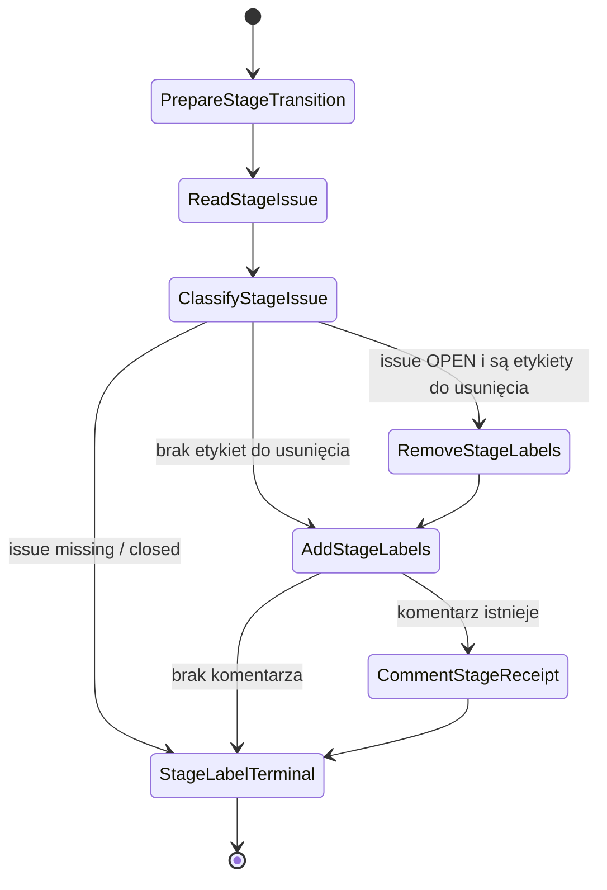
```mermaid
stateDiagram-v2
    [*] --> PrepareStageTransition
    PrepareStageTransition --> ReadStageIssue
    ReadStageIssue --> ClassifyStageIssue
    ClassifyStageIssue --> StageLabelTerminal: issue missing / closed
    ClassifyStageIssue --> RemoveStageLabels: issue OPEN i są etykiety do usunięcia
    ClassifyStageIssue --> AddStageLabels: brak etykiet do usunięcia
    RemoveStageLabels --> AddStageLabels
    AddStageLabels --> CommentStageReceipt: komentarz istnieje
    AddStageLabels --> StageLabelTerminal: brak komentarza
    CommentStageReceipt --> StageLabelTerminal
    StageLabelTerminal --> [*]
```

Pod-Fala zmienia jeden etap jednego issue. Plan przejścia, świeży stan issue,
klasyfikacja, usunięcie starych etykiet, dodanie nowych etykiet, opcjonalny
receipt i terminal są osobnymi procesami. Fala prowadzi kolejność efektów.
Issue zamknięte nie uruchamia żadnej mutacji, a dry-run raportuje plan zamiast
udawać zastosowany etap.

### Publikacja jednego PR — `pr_create_execution`

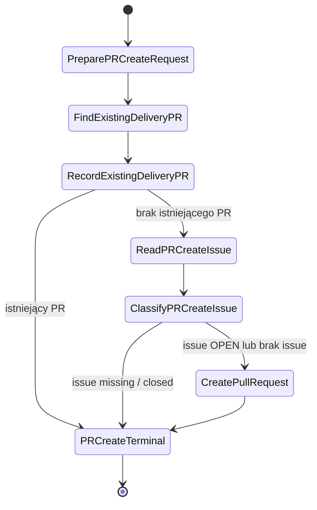
```mermaid
stateDiagram-v2
    [*] --> PreparePRCreateRequest
    PreparePRCreateRequest --> FindExistingDeliveryPR
    FindExistingDeliveryPR --> RecordExistingDeliveryPR
    RecordExistingDeliveryPR --> ReadPRCreateIssue: brak istniejącego PR
    RecordExistingDeliveryPR --> PRCreateTerminal: istniejący PR
    ReadPRCreateIssue --> ClassifyPRCreateIssue
    ClassifyPRCreateIssue --> CreatePullRequest: issue OPEN lub brak issue
    ClassifyPRCreateIssue --> PRCreateTerminal: issue missing / closed
    CreatePullRequest --> PRCreateTerminal
    PRCreateTerminal --> [*]
```

Pod-Fala publikuje jeden PR. Normalizacja head/issue/body, covering-PR lookup,
ponowny fizyczny odczyt issue, klasyfikacja stanu, pojedynczy efekt `gh pr
create` oraz terminal są osobnymi procesami. Fala nie pozwala uruchomić efektu,
gdy istnieje już covering PR albo issue przestało być otwarte. Dry-run pozostaje
planem fizycznego efektu, a nie udawanym utworzeniem PR.

### Obserwacyjny snapshot statusu — `status_snapshot`

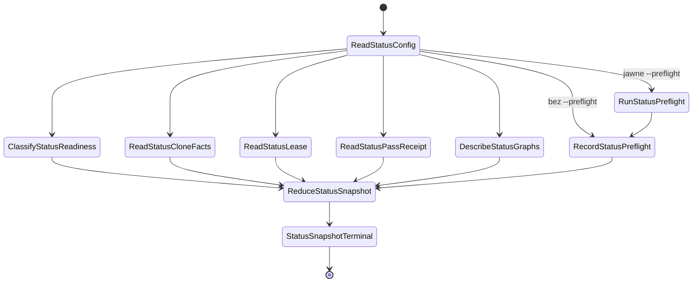
```mermaid
stateDiagram-v2
    [*] --> ReadStatusConfig
    ReadStatusConfig --> ClassifyStatusReadiness
    ReadStatusConfig --> ReadStatusCloneFacts
    ReadStatusConfig --> ReadStatusLease
    ReadStatusConfig --> ReadStatusPassReceipt
    ReadStatusConfig --> DescribeStatusGraphs
    ReadStatusConfig --> RunStatusPreflight: jawne --preflight
    ReadStatusConfig --> RecordStatusPreflight: bez --preflight
    RunStatusPreflight --> RecordStatusPreflight
    ClassifyStatusReadiness --> ReduceStatusSnapshot
    ReadStatusCloneFacts --> ReduceStatusSnapshot
    ReadStatusLease --> ReduceStatusSnapshot
    ReadStatusPassReceipt --> ReduceStatusSnapshot
    DescribeStatusGraphs --> ReduceStatusSnapshot
    RecordStatusPreflight --> ReduceStatusSnapshot
    ReduceStatusSnapshot --> StatusSnapshotTerminal
    StatusSnapshotTerminal --> [*]
```

Status nie uruchamia produktu, passa ani survey GitHub. Pod-Fala składa tylko
read-only fakty konfiguracji, brakujących checkoutów, lease, opisu grafów,
opcjonalnego preflightu i ostatniego trwałego receipt. `--full` oznacza pełny
widok dostępnego snapshotu, a nie synchroniczny pass. Żaden node nie zapisuje
receiptu, etykiety ani innego stanu domenowego. Dashboard i CLI czytają ten sam
zamknięty wynik.

### Aktywacja dokładnej samonaprawy — `self_repair_activate_execution`

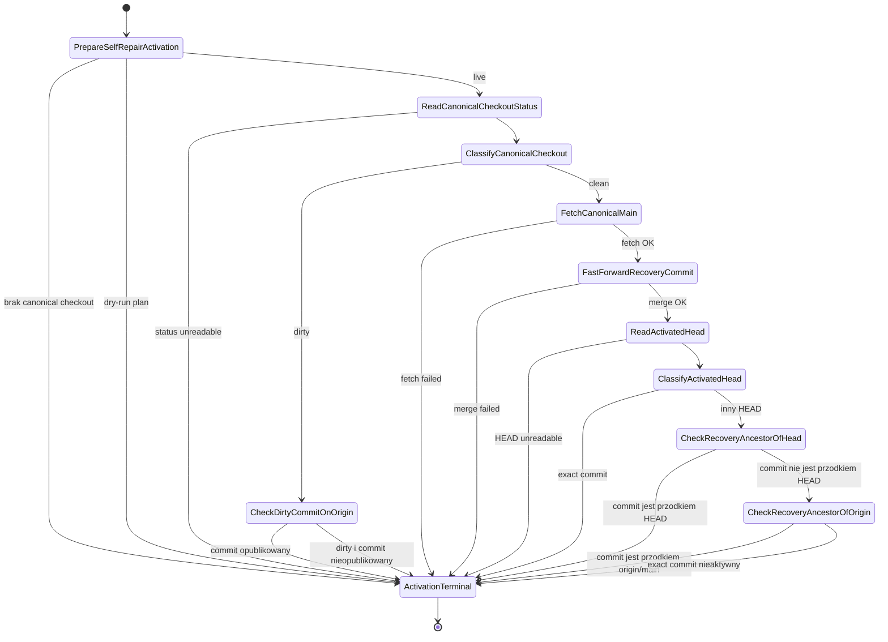
```mermaid
stateDiagram-v2
    [*] --> PrepareSelfRepairActivation
    PrepareSelfRepairActivation --> ActivationTerminal: brak canonical checkout
    PrepareSelfRepairActivation --> ActivationTerminal: dry-run plan
    PrepareSelfRepairActivation --> ReadCanonicalCheckoutStatus: live
    ReadCanonicalCheckoutStatus --> ClassifyCanonicalCheckout
    ReadCanonicalCheckoutStatus --> ActivationTerminal: status unreadable
    ClassifyCanonicalCheckout --> CheckDirtyCommitOnOrigin: dirty
    CheckDirtyCommitOnOrigin --> ActivationTerminal: commit opublikowany
    CheckDirtyCommitOnOrigin --> ActivationTerminal: dirty i commit nieopublikowany
    ClassifyCanonicalCheckout --> FetchCanonicalMain: clean
    FetchCanonicalMain --> FastForwardRecoveryCommit: fetch OK
    FetchCanonicalMain --> ActivationTerminal: fetch failed
    FastForwardRecoveryCommit --> ReadActivatedHead: merge OK
    FastForwardRecoveryCommit --> ActivationTerminal: merge failed
    ReadActivatedHead --> ClassifyActivatedHead
    ReadActivatedHead --> ActivationTerminal: HEAD unreadable
    ClassifyActivatedHead --> ActivationTerminal: exact commit
    ClassifyActivatedHead --> CheckRecoveryAncestorOfHead: inny HEAD
    CheckRecoveryAncestorOfHead --> ActivationTerminal: commit jest przodkiem HEAD
    CheckRecoveryAncestorOfHead --> CheckRecoveryAncestorOfOrigin: commit nie jest przodkiem HEAD
    CheckRecoveryAncestorOfOrigin --> ActivationTerminal: commit jest przodkiem origin/main
    CheckRecoveryAncestorOfOrigin --> ActivationTerminal: exact commit nieaktywny
    ActivationTerminal --> [*]
```

Pod-Fala aktywuje jeden dokładny, wcześniej zwalidowany commit. Konfiguracja i
mutation gate, status checkoutu, ancestry, fetch, fast-forward, odczyt HEAD oraz
terminal są osobnymi procesami. Jedynymi efektami są pojedynczy `fetch` i
pojedynczy `merge --ff-only`. Fala decyduje, które z nich wolno uruchomić.
Dirty checkout nigdy nie jest czyszczony ani nadpisywany.

### Dowód rzeczywistego diffu — `assert_real_diff_execution`

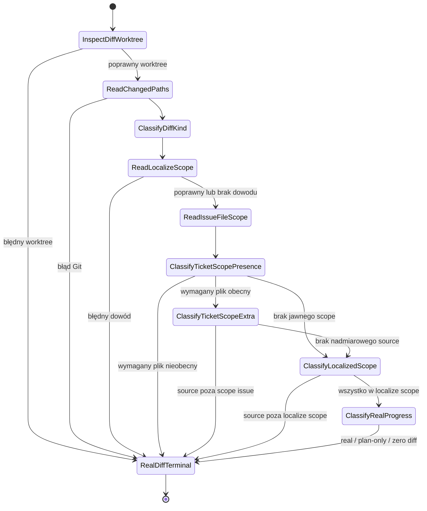
```mermaid
stateDiagram-v2
    [*] --> InspectDiffWorktree
    InspectDiffWorktree --> ReadChangedPaths: poprawny worktree
    InspectDiffWorktree --> RealDiffTerminal: błędny worktree
    ReadChangedPaths --> ClassifyDiffKind
    ReadChangedPaths --> RealDiffTerminal: błąd Git
    ClassifyDiffKind --> ReadLocalizeScope
    ReadLocalizeScope --> ReadIssueFileScope: poprawny lub brak dowodu
    ReadLocalizeScope --> RealDiffTerminal: błędny dowód
    ReadIssueFileScope --> ClassifyTicketScopePresence
    ClassifyTicketScopePresence --> ClassifyTicketScopeExtra: wymagany plik obecny
    ClassifyTicketScopePresence --> ClassifyLocalizedScope: brak jawnego scope
    ClassifyTicketScopePresence --> RealDiffTerminal: wymagany plik nieobecny
    ClassifyTicketScopeExtra --> ClassifyLocalizedScope: brak nadmiarowego source
    ClassifyTicketScopeExtra --> RealDiffTerminal: source poza scope issue
    ClassifyLocalizedScope --> ClassifyRealProgress: wszystko w localize scope
    ClassifyLocalizedScope --> RealDiffTerminal: source poza localize scope
    ClassifyRealProgress --> RealDiffTerminal: real / plan-only / zero diff
    RealDiffTerminal --> [*]
```

Pod-Fala składa wyłącznie mechaniczne fakty. Odczyt Git, walidacja dowodu
`localize.json`, rozpoznanie jawnego scope issue, obecność wymaganego pliku,
nadmiarowe ścieżki source i rodzaj postępu są osobnymi procesami. Fala prowadzi
kolejność odmów. Nie ma tu decyzji semantycznej ani agenta: wynik zależy tylko
od fizycznego diffu i już zapisanych, zamkniętych dowodów.

### Jedna relokalizacja off-goal — `relocalize_off_goal`

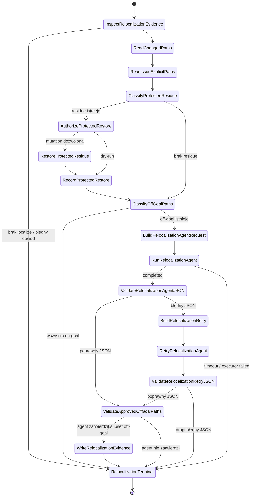
```mermaid
stateDiagram-v2
    [*] --> InspectRelocalizationEvidence
    InspectRelocalizationEvidence --> RelocalizationTerminal: brak localize / błędny dowód
    InspectRelocalizationEvidence --> ReadChangedPaths
    ReadChangedPaths --> ReadIssueExplicitPaths
    ReadIssueExplicitPaths --> ClassifyProtectedResidue
    ClassifyProtectedResidue --> AuthorizeProtectedRestore: residue istnieje
    ClassifyProtectedResidue --> ClassifyOffGoalPaths: brak residue
    AuthorizeProtectedRestore --> RestoreProtectedResidue: mutation dozwolona
    AuthorizeProtectedRestore --> RecordProtectedRestore: dry-run
    RestoreProtectedResidue --> RecordProtectedRestore
    RecordProtectedRestore --> ClassifyOffGoalPaths
    ClassifyOffGoalPaths --> RelocalizationTerminal: wszystko on-goal
    ClassifyOffGoalPaths --> BuildRelocalizationAgentRequest: off-goal istnieje
    BuildRelocalizationAgentRequest --> RunRelocalizationAgent
    RunRelocalizationAgent --> ValidateRelocalizationAgentJSON: completed
    RunRelocalizationAgent --> RelocalizationTerminal: timeout / executor failed
    ValidateRelocalizationAgentJSON --> ValidateApprovedOffGoalPaths: poprawny JSON
    ValidateRelocalizationAgentJSON --> BuildRelocalizationRetry: błędny JSON
    BuildRelocalizationRetry --> RetryRelocalizationAgent
    RetryRelocalizationAgent --> ValidateRelocalizationRetryJSON
    ValidateRelocalizationRetryJSON --> ValidateApprovedOffGoalPaths: poprawny JSON
    ValidateRelocalizationRetryJSON --> RelocalizationTerminal: drugi błędny JSON
    ValidateApprovedOffGoalPaths --> WriteRelocalizationEvidence: agent zatwierdził subset off-goal
    ValidateApprovedOffGoalPaths --> RelocalizationTerminal: agent nie zatwierdził
    WriteRelocalizationEvidence --> RelocalizationTerminal
    RelocalizationTerminal --> [*]
```

Pod-Fala wykonuje najwyżej jedną semantyczną relokalizację. Chronione residue,
mutation gate i restore są mechanicznymi faktami/efektami. Agent zwraca zamknięty
JSON `paths + notes`; poprawny wynik jest autorytatywny, ale fizyczny validator
może zachować tylko istniejący subset bieżących off-goal paths. Błędny JSON ma
dokładny feedback i jeden retry. Timeout, executor failure, brak zatwierdzonych
ścieżek albo drugi błędny JSON kończą się jawnie bez rozszerzenia scope.

### Lokalizacja zakresu zmiany — `localize_execution`

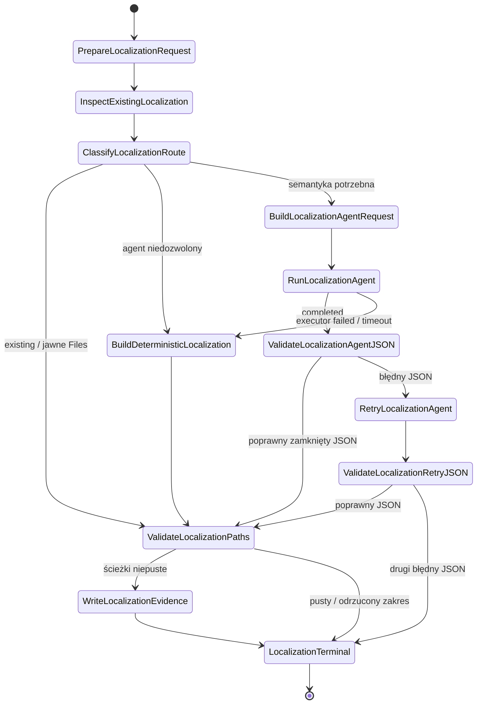
```mermaid
stateDiagram-v2
    [*] --> PrepareLocalizationRequest
    PrepareLocalizationRequest --> InspectExistingLocalization
    InspectExistingLocalization --> ClassifyLocalizationRoute
    ClassifyLocalizationRoute --> ValidateLocalizationPaths: existing / jawne Files
    ClassifyLocalizationRoute --> BuildDeterministicLocalization: agent niedozwolony
    ClassifyLocalizationRoute --> BuildLocalizationAgentRequest: semantyka potrzebna
    BuildLocalizationAgentRequest --> RunLocalizationAgent
    RunLocalizationAgent --> ValidateLocalizationAgentJSON: completed
    RunLocalizationAgent --> BuildDeterministicLocalization: executor failed / timeout
    ValidateLocalizationAgentJSON --> ValidateLocalizationPaths: poprawny zamknięty JSON
    ValidateLocalizationAgentJSON --> RetryLocalizationAgent: błędny JSON
    RetryLocalizationAgent --> ValidateLocalizationRetryJSON
    ValidateLocalizationRetryJSON --> ValidateLocalizationPaths: poprawny JSON
    ValidateLocalizationRetryJSON --> LocalizationTerminal: drugi błędny JSON
    BuildDeterministicLocalization --> ValidateLocalizationPaths
    ValidateLocalizationPaths --> WriteLocalizationEvidence: ścieżki niepuste
    ValidateLocalizationPaths --> LocalizationTerminal: pusty / odrzucony zakres
    WriteLocalizationEvidence --> LocalizationTerminal
    LocalizationTerminal --> [*]
```

Fala wybiera istniejący dowód, jawne ścieżki issue, deterministyczny fallback
albo jeden agent semantyczny. Agent zwraca zamknięty JSON `paths + notes`.
Błędny JSON dostaje dokładny feedback walidatora i najwyżej jeden retry.
Python nie zamienia awarii agenta w ukrytą decyzję semantyczną: Fala jawnie
prowadzi fallback albo terminal. Przygotowanie requestu, tree fact, agent call,
walidacja JSON, walidacja fizycznych ścieżek, zapis i terminal są osobnymi
procesami.

### Lokalne testy repozytorium — `test_local_execution`

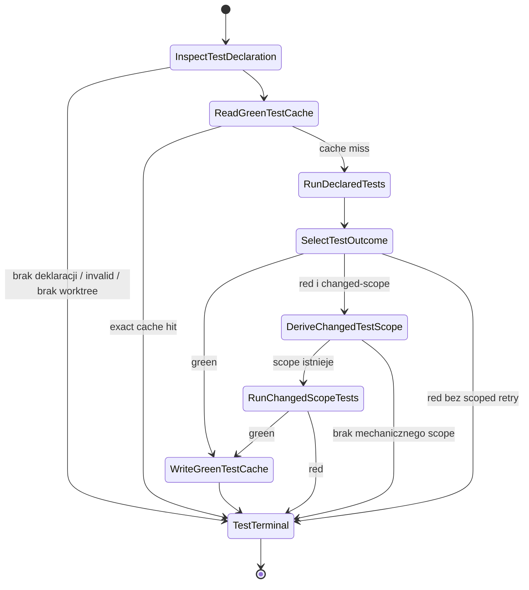
```mermaid
stateDiagram-v2
    [*] --> InspectTestDeclaration
    InspectTestDeclaration --> TestTerminal: brak deklaracji / invalid / brak worktree
    InspectTestDeclaration --> ReadGreenTestCache
    ReadGreenTestCache --> TestTerminal: exact cache hit
    ReadGreenTestCache --> RunDeclaredTests: cache miss
    RunDeclaredTests --> SelectTestOutcome
    SelectTestOutcome --> WriteGreenTestCache: green
    SelectTestOutcome --> DeriveChangedTestScope: red i changed-scope
    SelectTestOutcome --> TestTerminal: red bez scoped retry
    DeriveChangedTestScope --> RunChangedScopeTests: scope istnieje
    DeriveChangedTestScope --> TestTerminal: brak mechanicznego scope
    RunChangedScopeTests --> WriteGreenTestCache: green
    RunChangedScopeTests --> TestTerminal: red
    WriteGreenTestCache --> TestTerminal
    TestTerminal --> [*]
```

Deklaracja, exact cache, pełne uruchomienie, mechaniczne wyznaczenie changed scope,
jedno scoped uruchomienie, zapis cache i terminal są osobnymi procesami. Fala
prowadzi jedyne drzewo. Brak deklaracji jest zamkniętym wynikiem `skip`; czerwony
wynik pozostaje fail-closed. Nie ma agenta, ponieważ routing opiera się wyłącznie
na deklaracji repo, SHA, diffie i kodzie wyjścia procesu.

### Budżet kolejnych passów — `product_pass_budget`

```mermaid
stateDiagram-v2
    [*] --> PrepareProductBudget
    PrepareProductBudget --> RunFactoryPassSlot
    RunFactoryPassSlot --> RunLeftoverCloseout
    RunLeftoverCloseout --> EvaluateProductPass
    EvaluateProductPass --> RunFactoryPassSlot: continue i następny jawny slot
    EvaluateProductPass --> SelectProductBudgetResult: idle / waiting / hard failure / plateau
    EvaluateProductPass --> SelectProductBudgetResult: budżet wyczerpany
    SelectProductBudgetResult --> ProductBudgetResult
    ProductBudgetResult --> [*]
```

Fala rozwija do ośmiu kolejnych, jawnych slotów `factory_pass`. Każdy slot ma
osobny leftover-closeout effect i czysty evaluator porównujący fizyczny wynik
z poprzednim slotem. Python nie prowadzi pętli, nie wybiera następnego passu i
nie rekonstruuje terminala. `K` pozostaje budżetem seryjnych passów, nigdy
harmonogramem równoległych worktree. Wartość większa niż authored limit kończy
się fail-closed.

### Domknięcie pozostałych etykiet — `leftover_closeout`

```mermaid
stateDiagram-v2
    [*] --> PrepareLeftoverCloseout
    PrepareLeftoverCloseout --> LeftoverCatalog
    LeftoverCatalog --> UpdateLeftoverStamp
    UpdateLeftoverStamp --> LeftoverCloseoutResult
    LeftoverCloseoutResult --> [*]
```

Pod-Fala ma trzy kroki: przygotowanie (TTL, katalog, mutation policy), jeden
atom katalogu, który w procesie listuje CLOSED ready labels, deduplikuje i
parkowuje, i efekt stamp. Nie ma 30-slotowego rozwinięcia Fali. Overflow
katalogu lub kandydatów kończy się fail-closed. Błąd sondy nie udaje pustego
katalogu i nie zapisuje empty stamp. Nie ma agenta: stan CLOSED, etykiety i
mutation policy są faktami mechanicznymi.

### Higiena gotowych issue — `ready_hygiene`

```mermaid
stateDiagram-v2
    [*] --> PrepareReadyHygiene
    PrepareReadyHygiene --> ReadyHygieneCatalog
    ReadyHygieneCatalog --> UpdateReadyHygieneStamp
    UpdateReadyHygieneStamp --> ReadyHygieneResult
    ReadyHygieneResult --> [*]
```

Pod-Fala ma trzy kroki: przygotowanie (TTL, katalog, mutation policy), jeden
atom katalogu, który w procesie listuje / klasyfikuje / zdejmuje osierocone
`ai:ready`, i efekt stamp. Nie ma 30-slotowego rozwinięcia Fali. Overflow
katalogu lub kandydatów jest fail-closed. Rate limit nie udaje pustej sondy
i nie zapisuje empty stamp.

### Przegląd pull requestów — `survey_prs`

```mermaid
stateDiagram-v2
    [*] --> PreparePRSurvey
    PreparePRSurvey --> SelectPRRepoSlot
    SelectPRRepoSlot --> ListRepoPRs: aktywne repo
    SelectPRRepoSlot --> RecordPRRepoResult: cold / poza mini-scope / pusty slot / recent-empty
    ListRepoPRs --> ClassifyRepoPRs
    ClassifyRepoPRs --> RecordPRRepoResult
    RecordPRRepoResult --> SelectPRRepoSlot: następny jawny slot
    RecordPRRepoResult --> ReducePRSurvey: ostatni slot
    ReducePRSurvey --> PersistPRSurvey
    PersistPRSurvey --> UpdatePRSurveyStamp
    UpdatePRSurveyStamp --> PRSurveyResult
    PRSurveyResult --> [*]
```

Pod-Fala rozwija katalog do 30 jawnych slotów. Listing GitHub i klasyfikacja
manual/actionable są osobnymi procesami jednego repo. Repo-local reaction,
katalogowa redukcja, persist i efekt TTL są rozdzielone. Failed listing
pozostaje `probe_failed`; przekroczenie authored katalogu kończy się fail-closed.

### Recenzja i merge PR-ów — `prs`

```mermaid
stateDiagram-v2
    [*] --> ListOpenPrs
    ListOpenPrs --> SelectNextPr
    SelectNextPr --> RunPrTriageSubflow: jest otwarty PR
    SelectNextPr --> SummarizePrs: pusta lista
    RunPrTriageSubflow --> SummarizePrs
    SummarizePrs --> [*]
```

NODE `prs` ma cztery węzły. `list_open_prs` i `select_next_pr` są liśćmi.
`run_pr_triage_subflow` jest slotem dziecka: uruchamia pod-Falę `pr_triage`
(w tym `pr_repair`). Internals recenzji i naprawy należą do osobnego agenta
tego dziecka. `summarize_prs` jest liściem. Pusta lista pomija dziecko i nie
psuje passu. Nie ma 30-slotowego katalogu ani leftover overflow.

### Domknięcie PR-ów — `closeout_prs` i `closeout_pr`

```mermaid
stateDiagram-v2
    [*] --> PrepareCloseout
    PrepareCloseout --> CloseoutCatalog
    CloseoutCatalog --> PersistCloseout
    PersistCloseout --> SummarizeCloseout
    SummarizeCloseout --> CloseoutResult
    CloseoutResult --> [*]
```

Rodzic ma cztery kroki: przygotowanie katalogu, jeden atom katalogu, który
w procesie wybiera najwyżej jeden AI PR na repo i uruchamia pod-Falę
`closeout_pr`, persist oraz summarize. Nie ma 30-slotowego rozwinięcia Fali.
Overflow katalogu i naruszenie inwariantu jednego otwartego AI PR na repo są
fail-closed. Wspólny budżet napraw zostaje seryjny między repozytoriami.

```mermaid
stateDiagram-v2
    [*] --> InspectPRIssue
    InspectPRIssue --> GetPRIssue: branch wiąże issue
    InspectPRIssue --> StabilizePRIssue: brak issue
    GetPRIssue --> StabilizePRIssue
    StabilizePRIssue --> ParkClosedPRIssue: issue zamknięte
    StabilizePRIssue --> ClassifyPRGate: issue otwarte / nieznane
    ParkClosedPRIssue --> FinalizeCloseoutPR
    ClassifyPRGate --> FinalizeCloseoutPR: manual / konflikt
    ClassifyPRGate --> ReadPRChecks: kwalifikowany PR
    ReadPRChecks --> RoutePRChecks
    RoutePRChecks --> RepairPR: repair
    RoutePRChecks --> FinalizeCloseoutPR: wait / skip
    RoutePRChecks --> TriagePR: merge candidate
    TriagePR --> ClassifyTriageOutcome
    ClassifyTriageOutcome --> RepairPR: request_changes
    ClassifyTriageOutcome --> ParkDeliveredIssue: merged
    ClassifyTriageOutcome --> FinalizeCloseoutPR: waiting / needs_human
    RepairPR --> FinalizeCloseoutPR
    ParkDeliveredIssue --> FinalizeCloseoutPR
    FinalizeCloseoutPR --> CloseoutPRResult
    CloseoutPRResult --> [*]
```

Każdy kwalifikowany PR uruchamia tę samą pod-Falę `closeout_pr`. Odczyt
issue, checks, routing, naprawa, SHA-bound triage/merge i parkowanie są
osobnymi procesami jednego PR.

### Przegląd inboxu — `survey_inbox`

```mermaid
stateDiagram-v2
    [*] --> PrepareInboxSurvey
    PrepareInboxSurvey --> InboxSurveyCatalog
    InboxSurveyCatalog --> UpdateInboxSurveyStamp
    UpdateInboxSurveyStamp --> InboxSurveyResult
    InboxSurveyResult --> [*]
```

Pod-Fala ma trzy kroki: przygotowanie (TTL, katalog, hot/cold), jeden atom
katalogu, który w procesie listuje / klasyfikuje undecided issue i zapisuje
`remaining_inbox` z wylistowanych wierszy, oraz efekt stamp. Nie ma
30-slotowego rozwinięcia Fali. Etykiety bez `ai:ready` / `ai:blocked` /
`ai:needs-feedback` nadal liczą się jako inbox. Overflow katalogu jest
fail-closed. Błąd listingu pozostaje jawnym `probe_failed` i nie udaje
pustego inboxu. Conduction niesie kwit, nie listy issue.

### Walidacja self-repair — `self_repair_validate`

```mermaid
stateDiagram-v2
    [*] --> ReadSelfRepairCandidateState
    ReadSelfRepairCandidateState --> ClassifySelfRepairCandidateDiff
    ClassifySelfRepairCandidateDiff --> VerifySelfRepairCandidateIdentity
    VerifySelfRepairCandidateIdentity --> RunSelfRepairTests
    RunSelfRepairTests --> ListSelfRepairUntrackedPaths
    ListSelfRepairUntrackedPaths --> SelectUntrackedPathSlot
    SelectUntrackedPathSlot --> CheckUntrackedPathDiff: slot zawiera ścieżkę
    SelectUntrackedPathSlot --> RecordUntrackedPathCheck: slot pusty
    CheckUntrackedPathDiff --> RecordUntrackedPathCheck
    RecordUntrackedPathCheck --> SelectUntrackedPathSlot: następny jawny slot
    RecordUntrackedPathCheck --> ReduceUntrackedChecks: ostatni slot
    ReduceUntrackedChecks --> CheckSelfRepairWorkingDiff
    CheckSelfRepairWorkingDiff --> CheckSelfRepairCachedDiff
    CheckSelfRepairCachedDiff --> CheckSelfRepairCommittedDiff: jest base SHA
    CheckSelfRepairCachedDiff --> RecheckSelfRepairIdentity: brak base SHA
    CheckSelfRepairCommittedDiff --> RecheckSelfRepairIdentity
    RecheckSelfRepairIdentity --> SelfRepairValidationResult
    SelfRepairValidationResult --> [*]
```

Pod-Fala oddziela początkowy stan i klasę diffu, exact commit identity, pełny
lokalny test suite, listing untracked paths, maksymalnie 30 jawnych kontroli
`diff --no-index --check`, trzy tracked diff checks oraz końcowy identity
recheck. Każdy nieudany fakt kończy ścieżkę fail-closed. Izolowany `HOME` dla
testów pozostaje własnością pojedynczego procesu testowego.

### Przygotowanie self-repair — `self_repair_prepare`

```mermaid
stateDiagram-v2
    [*] --> ResolveSelfRepairCheckout
    ResolveSelfRepairCheckout --> CheckSelfRepairMutationGate
    CheckSelfRepairMutationGate --> SelfRepairPrepareResult: plan-only
    CheckSelfRepairMutationGate --> VerifySelfRepairOrigin: live
    VerifySelfRepairOrigin --> FetchSelfRepairMain
    FetchSelfRepairMain --> FindPublishedSelfRepair
    FindPublishedSelfRepair --> SelfRepairPrepareResult: fingerprint już na main
    FindPublishedSelfRepair --> ReadSelfRepairBase: brak publikacji
    ReadSelfRepairBase --> InspectSelfRepairWorktree
    InspectSelfRepairWorktree --> SelectSelfRepairWorktreeRoute
    SelectSelfRepairWorktreeRoute --> RemoveSelfRepairWorktree: potwierdzony pusty lub stale exact candidate
    SelectSelfRepairWorktreeRoute --> SelfRepairPrepareResult: bezpieczny dirty/exact resume
    SelectSelfRepairWorktreeRoute --> CreateSelfRepairWorktree: worktree nie istnieje
    RemoveSelfRepairWorktree --> SelectSelfRepairRemoveOutcome
    SelectSelfRepairRemoveOutcome --> CreateSelfRepairWorktree: usunięty
    SelectSelfRepairRemoveOutcome --> SelfRepairPrepareResult: removal failed
    CreateSelfRepairWorktree --> SelfRepairPrepareResult
    SelfRepairPrepareResult --> [*]
```

Pod-Fala oddziela konfigurację checkoutu, mutation gate, weryfikację origin,
fetch, fingerprint na `main`, base SHA, inspekcję istniejącego worktree,
decyzję routingu oraz efekty remove/create. Nieczytelna własność, plan-only,
nieznany commit i dirty work poza aktualnym `origin/main` kończą się
fail-closed bez usuwania dowodów.

### Ograniczenie czasu implementacji — `reap_over_budget`

```mermaid
stateDiagram-v2
    [*] --> PrepareOverBudgetReap
    PrepareOverBudgetReap --> OverBudgetCatalog
    OverBudgetCatalog --> SummarizeOverBudgetReap
    SummarizeOverBudgetReap --> OverBudgetResult
    OverBudgetResult --> [*]
```

Pod-Fala ma trzy kroki: przygotowanie receiptów, jeden atom katalogu, który
w procesie inspect / harvest / reap i redukuje wynik, oraz summarize. Nie ma
723-slotowego rozwinięcia Fali. Harvest realnego diffu pozostaje łańcuchem
`commit → push → PR` wewnątrz atomu katalogu. Niepewny diff zachowuje żywego
codera fail-closed. Tylko plan-only lub zamknięte issue prowadzi do terminacji.
Zapis receiptu, stuck ledger i parkowanie są oddzielnymi efektami wywoływanymi
w procesie.

### Odzyskanie porzuconych etapów implementacji — `reap_stale_implementing`

```mermaid
stateDiagram-v2
    [*] --> PrepareStaleImplementingReap
    PrepareStaleImplementingReap --> StaleImplementingCatalog
    StaleImplementingCatalog --> PersistStaleImplementingReap
    PersistStaleImplementingReap --> SummarizeStaleImplementingReap
    SummarizeStaleImplementingReap --> StaleImplementingResult
    StaleImplementingResult --> [*]
```

Pod-Fala ma cztery kroki: przygotowanie (TTL, katalog, zakres), jeden atom
katalogu, który w procesie listuje leftover ledger labels, przywraca
`ai:ready` i aktualizuje stempel, persist oraz summarize. Nie ma 30-slotowego
rozwinięcia Fali. Świeży pusty stempel, probe i mutacje zostają wewnątrz
atomu katalogu, nie osobnymi krawędziami Fali. Overflow katalogu lub
kandydatów jest fail-closed. Rate limit nie udaje pustej sondy i nie zapisuje
empty stamp.

### Odświeżenie zajętości repozytoriów — `refresh_occupancy`

```mermaid
stateDiagram-v2
    [*] --> PrepareOccupancyRefresh
    PrepareOccupancyRefresh --> OccupancyCatalog
    OccupancyCatalog --> PersistOccupancyRefresh
    PersistOccupancyRefresh --> SummarizeOccupancyRefresh
    SummarizeOccupancyRefresh --> OccupancyRefreshResult
    OccupancyRefreshResult --> [*]
```

Pod-Fala ma cztery kroki: przygotowanie receiptów i katalogu, jeden atom
katalogu, który w procesie czyści martwe receipty, odczytuje żywe issue,
terminuje zamknięte workery i odświeża snapshoty PR, persist oraz summarize.
Nie ma 30-slotowego rozwinięcia Fali. Niepewny odczyt issue zachowuje
zajętość fail-closed. Nieczytelny receipt nie zajmuje całego katalogu, ale
pozostaje jawnym faktem diagnostycznym. Overflow receiptów lub repozytoriów
jest fail-closed.

### Wybór repozytorium do implementacji — `select_implement`

```mermaid
stateDiagram-v2
    [*] --> PrepareImplementationSelection
    PrepareImplementationSelection --> ImplementationSelectionCatalog
    ImplementationSelectionCatalog --> PersistImplementationSelection
    PersistImplementationSelection --> SummarizeImplementationSelection
    SummarizeImplementationSelection --> ImplementationSelectionResult
    ImplementationSelectionResult --> [*]
```

Pod-Fala ma cztery kroki: przygotowanie katalogu, jeden atom katalogu, który
w procesie sprawdza kwalifikację każdego repo i redukuje wybór, persist oraz
summarize. Nie ma 30-slotowego rozwinięcia Fali. Overflow katalogu jest
fail-closed. Atom katalogu sprawdza twardy zestaw faktów: zakres, kompletność
survey PR, PR-first, occupancy, stuck ledger, obecność otwartego issue (inbox
albo ready; `work:ready` nie jest bramką) i dostępność executora. Otwarte
issue z inboxu jest pracą: nie wolno ignorować inboxu, bo brak drugiej
etykiety ready. Czysty reduktor wybiera pierwsze kwalifikujące się repo w
kolejności konfiguracji; nie uruchamia procesu ani mutacji. Osobny efekt
materializuje plan implementacji. Brak live budget kończy się w procesie
katalogu, nie osobną krawędzią Fali.

### Higiena kolejki implementacji — `queue_conflict`

```mermaid
stateDiagram-v2
    [*] --> SelectQueueConflictCandidate
    SelectQueueConflictCandidate --> QueueConflictResult: brak kandydata
    SelectQueueConflictCandidate --> CheckCoveringPullRequest: wybrano jedno issue
    CheckCoveringPullRequest --> SelectQueueConflictOutcome: PR fizycznie pokrywa issue
    CheckCoveringPullRequest --> RunQueueConflictAgent: brak pokrywającego PR
    RunQueueConflictAgent --> ValidateQueueConflictResult
    ValidateQueueConflictResult --> RetryQueueConflictAgent: JSON niepoprawny
    ValidateQueueConflictResult --> SelectQueueConflictOutcome: ready / skip / close
    RetryQueueConflictAgent --> ValidateQueueConflictRetry
    ValidateQueueConflictRetry --> SelectQueueConflictOutcome: wynik poprawny
    ValidateQueueConflictRetry --> SelectQueueConflictOutcome: drugi JSON niepoprawny
    SelectQueueConflictOutcome --> KeepQueueCandidate: ready
    SelectQueueConflictOutcome --> DropQueueCandidate: skip
    SelectQueueConflictOutcome --> RemoveReadyLabel: close
    SelectQueueConflictOutcome --> QueueConflictHumanTerminal: needs_human
    RemoveReadyLabel --> AddTrackerLabel: agent wybrał tracker
    RemoveReadyLabel --> RecordQueueConflict: bez tracker label
    AddTrackerLabel --> RecordQueueConflict
    KeepQueueCandidate --> RecordQueueConflict
    DropQueueCandidate --> RecordQueueConflict
    QueueConflictHumanTerminal --> RecordQueueConflict
    RecordQueueConflict --> AdvanceImplementationSelection
    AdvanceImplementationSelection --> QueueConflictResult
    QueueConflictResult --> [*]
```

Pod-Fala wybiera najwyżej jedno issue w jednym pass. Pokrycie przez otwarty PR
pozostaje twardym faktem. Pozostałą semantykę rozstrzyga agent, który zwraca
zamknięty wynik `ready | skip | close | needs_human`. Dokładny błąd walidatora
może uruchomić jeden retry. Python nie zastępuje poprawnego wyniku agenta
heurystyką ani statusem wykonania. Usunięcie `ai:ready`, opcjonalne dodanie
`ai:tracker`, aktualizacja kolejki i terminal są osobnymi efektami Fali.
Po `needs_human` / skip / close atom `advance_implementation_selection`
ponownie redukuje katalog i zapisuje następne implementowalne issue
(`clean_repos`). Jedno zaparkowane product issue nie opróżnia slotu K=1,
gdy w katalogu zostaje kolejny wiersz.

### Higiena worktree — `reap_stale_worktrees`

```mermaid
stateDiagram-v2
    [*] --> CollectWorktreeCandidates
    CollectWorktreeCandidates --> StaleWorktreeCatalog
    StaleWorktreeCatalog --> SummarizeStaleWorktreeReap
    SummarizeStaleWorktreeReap --> ReapResult
    ReapResult --> [*]
```

Pod-Fala ma trzy liście: `collect` → `catalog` → `summarize`. Każdy
liść składa dwa małe kroki: collect to `protection` albo `bound_slots`;
catalog to `overflow_skip` albo `apply_slot`; summarize to `skip_result`
albo `persist_result`. Nie ma `leftover_closeout` w tym grafie. Nie ma
jednego tłustego reapa, który parkuje leftover labels. Nie ma 4-slotowego
rozwinięcia Fali (14 efektorów). Overflow katalogu pomija reap (`skip`)
i nie kończy passu fail-closed — nie blokuje PR-ów ani issue. Atom
katalogu zachowuje `CLASSIFY_CAP` i reguły KEEP (live i2pr / occupancy /
`pr_survey_failed` / covering PR / dirty unpublished / nieczytelny git).
W `factory_pass` ten reap jest osobnym dzieckiem od `factory_begin`.
Rzuca / puste / `process.failed` to sklasyfikowany `route=failed`, nie
abort passu. `prs` i `issues` nie czekają na sukces sprzątania. `record_pass`
też nie. Leftover work copies nie zjadają issue-to-PR.

### Otwarte issue do PR — `issues`

```mermaid
stateDiagram-v2
    [*] --> ListOpenIssues
    ListOpenIssues --> SelectNextIssue
    SelectNextIssue --> IssuesRunTriage: jest issue
    SelectNextIssue --> SelectIssueDo: pusta lista / leftover
    IssuesRunTriage --> SelectIssueDo
    SelectIssueDo --> IssuesLaunchPr: robić
    SelectIssueDo --> SummarizeIssues: sito nie robić
    IssuesLaunchPr --> SummarizeIssues
    SummarizeIssues --> [*]
```

Dziecko `issues` jest węzłem Fali. Sześć krawędzi, nie jeden tłusty proces.
Liście: `list_open_issues`, `select_next_issue`, `select_issue_do`,
`summarize_issues`. Węzły-dzieci: `issues_run_triage` → Fala `issue_triage`,
`issues_launch_pr` → Fala `issue_to_pr`. Po `select_issue_do` skip leftover
zostaje kolejką: następny pick to następny wiersz, nie `rows[0]` w kółko.
`leftover` jest na kwicie i na last-pass remaining. `leftover=0` tylko gdy
lista się wyczerpała. Bez bramki `work:ready` / `ai:ready` i bez 30 slotów.
Jeden implement na pass.

### Otwarte PR — `prs`

```mermaid
stateDiagram-v2
    [*] --> ListOpenPrs
    ListOpenPrs --> SelectNextPr
    SelectNextPr --> RunPrTriageSubflow: jest PR
    SelectNextPr --> SummarizePrs: pusta lista
    RunPrTriageSubflow --> SummarizePrs
    SummarizePrs --> [*]
```

Dziecko `prs` jest osobną Falą. Rodzic go tylko woła. Ta zmiana nie przepisuje
jego atomów.

### Triage issue — `issue_triage`

Dziecko rodzica `issues`. **Sito tylko:** robić / nie / oznaczyć / człowiek.
Nie implementuje. Nie zamyka cudzego issue. Werdykt zamknąć oznacza
oznaczenie (`ai:blocked`), nie `close_issue`. `issue_split` jest osobną
pod-Falą na później.

```mermaid
stateDiagram-v2
    [*] --> GetIssue
    GetIssue --> ResolveIssueCandidate
    ResolveIssueCandidate --> CollectLinkedPullRequests
    CollectLinkedPullRequests --> CollectCoveringPullRequests
    CollectCoveringPullRequests --> ResolveHardFacts
    ResolveHardFacts --> SitoDecision: wynik fizyczny oznaczyć / nie
    ResolveHardFacts --> TriageAgent: potrzebna ocena semantyczna
    TriageAgent --> ValidateTriageResult
    ValidateTriageResult --> TriageRetryAgent: invalid JSON + informacja zwrotna
    TriageRetryAgent --> ValidateTriageRetry
    ValidateTriageRetry --> SitoDecision: wynik poprawny
    ValidateTriageRetry --> HumanTerminal: nadal invalid JSON
    ValidateTriageResult --> SitoDecision: wynik poprawny
    SitoDecision --> SelectIssueEvidence: NEEDS_EVIDENCE
    SelectIssueEvidence --> CollectRepoShape: repo_shape
    SelectIssueEvidence --> CollectNamedPaths: named_paths
    SelectIssueEvidence --> CollectLinkedPullRequests: linked_prs
    SelectIssueEvidence --> CollectCoveringPullRequests: covering_prs
    CollectRepoShape --> EvidenceTriageAgent
    CollectNamedPaths --> EvidenceTriageAgent
    CollectLinkedPullRequests --> EvidenceTriageAgent
    CollectCoveringPullRequests --> EvidenceTriageAgent
    EvidenceTriageAgent --> ValidateEvidenceTriage
    ValidateEvidenceTriage --> SitoDecision: wynik poprawny
    ValidateEvidenceTriage --> HumanTerminal: ponowne NEEDS_EVIDENCE / invalid JSON
    SitoDecision --> MarkReady: robić
    SitoDecision --> ApplySkip: nie
    SitoDecision --> MarkBlocked: nie
    SitoDecision --> MarkIssue: zamknąć
    SitoDecision --> HumanTerminal: człowiek
    MarkReady --> [*]
    ApplySkip --> [*]
    MarkBlocked --> [*]
    MarkIssue --> [*]
    HumanTerminal --> [*]
```

Sito nie rozcina issue, nie otwiera PR i nie zamyka cudzego issue. Rodzic
`issues` woła `issue_to_pr` tylko po **robić**. Incydent preflight to **nie**
(liść `apply_issue_blocked` zostaje jednym zadaniem). Werdykt zamknąć idzie
do `apply_issue_mark` (etykieta + komentarz). `issue_split` nie jest wyjściem
tego sita. Zamknięcie po merge zostaje w `pr_triage` (`close_issue`).

### Implementacja issue — `issue_to_pr`

```mermaid
stateDiagram-v2
    [*] --> RecheckOpenIssue
    RecheckOpenIssue --> RecheckDelivery: issue otwarte
    RecheckOpenIssue --> NoEffect: issue zamknięte
    RecheckDelivery --> CloseExistingDelivery: istniejący PR dostarcza issue
    RecheckDelivery --> NoEffect: wznowiona gałąź ma kod celu
    RecheckDelivery --> PrepareBranch: brak dostawy
    PrepareBranch --> PrepareWorktree
    PrepareWorktree --> PlanIssue
    PlanIssue --> Localize
    Localize --> CodingExecution
    CodingExecution --> HumanTerminal: human
    CodingExecution --> VerifyImplementationDiff: implemented
    CodingExecution --> DeliveryResult: failed
    VerifyImplementationDiff --> CommitImplementation
    CommitImplementation --> RebaseOntoMain
    RebaseOntoMain --> LocalTest
    LocalTest --> VerifyPublishDiff: PASS
    LocalTest --> LocalRepair: FAIL
    LocalRepair --> VerifyPublishDiff: PASS
    LocalRepair --> RepairTerminal: FAIL / human
    VerifyPublishDiff --> PushBranch
    PushBranch --> CreatePullRequest
    CreatePullRequest --> LabelPullRequest
    LabelPullRequest --> PullRequestOpen
    PullRequestOpen --> DeliveryResult
    DeliveryResult --> [*]
    NoEffect --> [*]
    HumanTerminal --> [*]
    RepairTerminal --> [*]
```

Rodzic `issue_to_pr_delivery` nie trzyma gniazda kodu ani naprawy testów.
`plan_issue`, `localize`, `test_local_execution` i `pr_create` zostają osobnymi
węzłami (każde jest własną Falą). Dwa wyjęte dzieci:

### Wynik kodowania — `coding_execution`

```mermaid
stateDiagram-v2
    [*] --> CodingAgent
    CodingAgent --> ValidateCodingResult
    ValidateCodingResult --> SelectCodingResult: wynik poprawny
    ValidateCodingResult --> CodingRetryAgent: invalid JSON + informacja zwrotna
    CodingRetryAgent --> ValidateCodingRetry
    ValidateCodingRetry --> SelectCodingResult: wynik poprawny
    ValidateCodingRetry --> HumanTerminal: nadal invalid JSON
    SelectCodingResult --> CollectIssueSnapshot: NEEDS_EVIDENCE(issue_snapshot)
    SelectCodingResult --> CollectRepoStructure: NEEDS_EVIDENCE(repo_structure)
    SelectCodingResult --> CollectTestContract: NEEDS_EVIDENCE(test_contract)
    SelectCodingResult --> CollectLocalizedDiff: NEEDS_EVIDENCE(localized_diff)
    CollectIssueSnapshot --> EvidenceCodingAgent
    CollectRepoStructure --> EvidenceCodingAgent
    CollectTestContract --> EvidenceCodingAgent
    CollectLocalizedDiff --> EvidenceCodingAgent
    EvidenceCodingAgent --> ValidateEvidenceCoding
    ValidateEvidenceCoding --> FinalizeCodingResult: wynik poprawny
    ValidateEvidenceCoding --> HumanTerminal: invalid JSON
    FinalizeCodingResult --> HumanTerminal: ponowne NEEDS_EVIDENCE / NEEDS_HUMAN
    SelectCodingResult --> CodingResult: IMPLEMENTED
    FinalizeCodingResult --> CodingResult: IMPLEMENTED
    CodingResult --> [*]
    HumanTerminal --> [*]
```

### Naprawa testu lokalnego — `local_repair_execution`

```mermaid
stateDiagram-v2
    [*] --> RepairAgent
    RepairAgent --> ValidateRepairResult
    ValidateRepairResult --> CommitRepair: REPAIRED
    ValidateRepairResult --> RepairTerminal: invalid JSON / NEEDS_HUMAN
    CommitRepair --> LocalTestAgain
    LocalTestAgain --> RepairResult: PASS
    LocalTestAgain --> RepairTerminal: FAIL
    RepairResult --> [*]
    RepairTerminal --> [*]
```

### Zamknięcie PR — `pr_triage`

```mermaid
stateDiagram-v2
    [*] --> InspectPullRequest
    InspectPullRequest --> ConflictRecovery: konflikt
    InspectPullRequest --> WaitChecks: pending / offline
    InspectPullRequest --> RepairPullRequest: czerwone CI
    InspectPullRequest --> HumanTerminal: terminal ręczny
    InspectPullRequest --> CollectReviewEvidence: gotowy do recenzji
    CollectReviewEvidence --> ResolveShaReview
    ResolveShaReview --> ReviewVerdict: werdykt zapisany dla SHA
    ResolveShaReview --> ReviewAgent: brak werdyktu dla SHA
    ReviewAgent --> ValidateReviewResult
    ValidateReviewResult --> ReviewRetryAgent: invalid JSON + informacja zwrotna
    ReviewRetryAgent --> ValidateRetryResult
    ValidateRetryResult --> ReviewVerdict: wynik poprawny
    ValidateRetryResult --> HumanTerminal: nadal invalid JSON
    ValidateReviewResult --> ReviewVerdict: wynik poprawny
    ReviewVerdict --> SelectEvidenceCollector: NEEDS_EVIDENCE
    SelectEvidenceCollector --> CollectPrMetadata: pr_metadata
    SelectEvidenceCollector --> CollectChangedFiles: changed_files
    SelectEvidenceCollector --> CollectDiffTail: diff_tail
    SelectEvidenceCollector --> CollectCommitSummary: commit_summary
    CollectPrMetadata --> VerifyEvidenceSha
    CollectChangedFiles --> VerifyEvidenceSha
    CollectDiffTail --> VerifyEvidenceSha
    CollectCommitSummary --> VerifyEvidenceSha
    VerifyEvidenceSha --> EvidenceReviewAgent: SHA bez zmian
    VerifyEvidenceSha --> HumanTerminal: SHA zmienione / brak dowodu
    EvidenceReviewAgent --> ValidateEvidenceReview
    ValidateEvidenceReview --> ReviewVerdict: wynik poprawny
    ValidateEvidenceReview --> HumanTerminal: ponowne NEEDS_EVIDENCE / invalid JSON
    ReviewVerdict --> LocalMergeGate: APPROVE
    ReviewVerdict --> RepairPullRequest: REQUEST_CHANGES
    ReviewVerdict --> HumanTerminal: NEEDS_HUMAN
    LocalMergeGate --> MergePullRequest: testy lokalne i fakty pozwalają
    LocalMergeGate --> RepairPullRequest: test lokalny nie przechodzi
    MergePullRequest --> CloseIssue
    CloseIssue --> Delivered
    RepairPullRequest --> [*]: nowy SHA, recenzja w następnym passie
    ConflictRecovery --> [*]
    HumanTerminal --> [*]
    WaitChecks --> [*]
    Delivered --> [*]
```

### Naprawa istniejącego PR — `pr_repair`

```mermaid
stateDiagram-v2
    [*] --> PrepareRepairWorktree
    PrepareRepairWorktree --> CollectRepairEvidence
    CollectRepairEvidence --> RepairAgent
    RepairAgent --> ValidateRepairResult
    ValidateRepairResult --> SelectRepairResult: wynik poprawny
    ValidateRepairResult --> RepairRetryAgent: invalid JSON + informacja zwrotna
    RepairRetryAgent --> ValidateRepairRetry
    ValidateRepairRetry --> SelectRepairResult: wynik poprawny
    ValidateRepairRetry --> HumanTerminal: nadal invalid JSON
    SelectRepairResult --> CollectPrMetadata: NEEDS_EVIDENCE(pr_metadata)
    SelectRepairResult --> CollectChangedFiles: NEEDS_EVIDENCE(changed_files)
    SelectRepairResult --> CollectTestContract: NEEDS_EVIDENCE(test_contract)
    SelectRepairResult --> CollectReviewFindings: NEEDS_EVIDENCE(review_findings)
    CollectPrMetadata --> EvidenceRepairAgent
    CollectChangedFiles --> EvidenceRepairAgent
    CollectTestContract --> EvidenceRepairAgent
    CollectReviewFindings --> EvidenceRepairAgent
    EvidenceRepairAgent --> ValidateEvidenceRepair
    ValidateEvidenceRepair --> FinalizeRepairResult: wynik poprawny
    ValidateEvidenceRepair --> HumanTerminal: invalid JSON
    FinalizeRepairResult --> HumanTerminal: ponowne NEEDS_EVIDENCE / NEEDS_HUMAN
    SelectRepairResult --> VerifyRepairDiff: REPAIRED
    FinalizeRepairResult --> VerifyRepairDiff: REPAIRED
    VerifyRepairDiff --> CommitRepair
    CommitRepair --> LocalRepairTest
    LocalRepairTest --> VerifyPublishDiff: PASS
    LocalRepairTest --> TestRepairAgent: FAIL
    TestRepairAgent --> ValidateTestRepair
    ValidateTestRepair --> VerifyTestRepairDiff: REPAIRED
    ValidateTestRepair --> RepairTerminal: invalid JSON / NEEDS_HUMAN
    VerifyTestRepairDiff --> CommitTestRepair
    CommitTestRepair --> LocalRepairTestAgain
    LocalRepairTestAgain --> VerifyPublishDiff: PASS
    LocalRepairTestAgain --> RepairTerminal: FAIL
    VerifyPublishDiff --> PushNewSha
    PushNewSha --> RepairResult
    RepairResult --> [*]
    HumanTerminal --> [*]
    RepairTerminal --> [*]
```

### Odzyskanie Lokaya — `daemon_cycle` + `self_repair`

Repair is a side child. It never replaces the factory mill. The moving
gate is one leaf (`last_pass_moving`: new PR or merge only). A second
leaf (`select_repair_route`) composes leftover skip, empty survey, stale
receipt, occupied, and soft health. Repair is the `self_repair` child
graph — activate stays a leaf inside that child, not inside
`recovery_mill`. After one repair the graph always returns to PRs /
issues.

```mermaid
stateDiagram-v2
    [*] --> LastPassMoving
    LastPassMoving --> SelectRepairRoute
    SelectRepairRoute --> RunFactoryPass: new PR / merge
    SelectRepairRoute --> RunFactoryPass: leftover skip / empty survey / stale
    SelectRepairRoute --> SelfRepair: last receipt did not move
    SelfRepair --> RunFactoryPass
    RunFactoryPass --> CloseoutPrs
    RunFactoryPass --> DispatchImplement
    CloseoutPrs --> [*]
    DispatchImplement --> [*]
    SelfRepair --> SelfRepairPrepare
    SelfRepairPrepare --> SelfRepairRunAgent
    SelfRepairRunAgent --> SelfRepairCommit
    SelfRepairCommit --> SelfRepairValidate
    SelfRepairValidate --> SelfRepairPushMain
    SelfRepairPushMain --> SelfRepairActivate
    SelfRepairActivate --> SelfRepairPreflight
    SelfRepairPreflight --> SelfRepairClose
    SelfRepairClose --> RunFactoryPass
```

### Zgodność diagramu z implementacją

Diagram jest docelowym kontraktem maszyny. Nie oznacza, że każda pokazana
krawędź już istnieje. Implementacja może ruszyć dopiero po zaakceptowaniu tego
kontraktu. Aktualny audyt:

| Fragment | Stan obecny |
| --- | --- |
| `approve → lokalne testy → merge` | zaimplementowane w Fali |
| `request_changes → pr_repair → nowy SHA → recenzja` | zaimplementowane z zamkniętym wynikiem agenta, jedną rundą dowodu i jedną naprawą testów; recenzja wraca w następnym passie |
| `czerwone CI / czerwony test lokalny → pr_repair` | zaimplementowane: `pr_repair` zostaje osobną NODE-Falą, nie jest włączany w `pr_triage` |
| `pending / offline → czekanie` | zaimplementowane w Fali; pass nie pada |
| `needs_human → terminal` | zaimplementowane w Fali |
| `needs_evidence → jeden kolektor z zamkniętego zbioru → ponów agenta raz` | zaimplementowane w Fali |
| `invalid JSON → feedback walidatora → ponów agenta raz` | zaimplementowane w Fali |
| `issue_triage` sito (robić / nie / oznaczyć / człowiek) | zaimplementowane w Fali; nie implementuje; nie zamyka cudzego issue; `issue_split` jest późniejszym dzieckiem |
| `issue_to_pr` bez ukrytego drzewa Python | zaimplementowane jako gate Fali + pod-Fala `issue_to_pr_delivery` |
| odzyskanie lokalnego work item bez globalnej awarii Lokaya | jawna allowlista carrier events/health; lokalny błąd nigdy nie wchodzi do globalnego quorum |

### Ścieżki Fali odpowiadające diagramowi

| Stan z diagramu | Ścieżka Fali | Efekt domenowy |
| --- | --- | --- |
| `DaemonCycle` | `daemon_cycle` | last_pass_moving leaf + select_repair_route; self_repair child only when not moving; then PRs/issues |
| `FactoryPass` | `factory_pass` | open, PRs, issues, receipt; leftover work-copy cleanup is a sibling child |
| `Issues` | `issues` | lista otwartych z GitHuba, sito jednego, jeden issue_to_pr albo skip |
| `OpenPRs` | `prs` | lista otwartych PR, recenzja albo merge |
| `FactoryBegin` | `factory_begin` | krótka sonda hosta, katalog i workspace passu |
| `ChildHarvest` | `child_harvest` | prowadzi lokalne child facts, jawne redukcje, 30 repo-slotów CLOSED i cleanup |
| `ReadySurvey` | `survey_ready` | listuje i klasyfikuje gotowe issue jednym atomem katalogu |
| `TriageDispatch` | `triage_dispatch` | wybiera i uruchamia najwyżej jedno issue inbox |
| `ImplementationDispatch` | `implementation_dispatch` | wybiera i uruchamia najwyżej jeden gotowy ticket |
| `ConflictResolution` | `resolve_conflicts` | zamyka najwyżej jeden konfliktujący PR i ponownie ustawia issue jako ready |
| `ImplementationSelection` | `select_implement` | jeden atom katalogu: kwalifikacja repo do issue_to_pr |
| `PassPlan` | `plan_pass` | jeden atom katalogu: fragmenty planu i budżet triage |
| `OccupancyRefresh` | `refresh_occupancy` | jeden atom katalogu: żywe receipty i snapshoty PR |
| `StaleImplementingReap` | `reap_stale_implementing` | jeden atom katalogu: odzysk porzuconych etapów |
| `OverBudgetReap` | `reap_over_budget` | jeden atom katalogu: harvest albo plan-only reap |
| `SelfRepairPrepare` | `self_repair_prepare` | przygotowuje lub bezpiecznie wznawia izolowany worktree przez pod-Falę |
| `SelfRepairValidate` | `self_repair_validate` | waliduje exact candidate, testy i diff przez pod-Falę |
| `InboxSurvey` | `survey_inbox` | przegląda inbox pełnego katalogu jednym atomem katalogu |
| `PRSurvey` | `survey_prs` | przegląda PR-y pełnego katalogu przez jawne sloty repozytoriów |
| `ProductPassBudget` | `product_pass_budget` | prowadzi bounded serię passów i terminale bez Pythonowej pętli |
| `LocalizeExecution` | `localize_execution` | prowadzi existing/hints/fallback/agent JSON/retry/write i terminal |
| `SelfRepairEntry` | `self_repair_entry` | prowadzi preconditions, events, istniejącą self_repair pod-Falę i restart terminal |
| `ProductEntry` | `product_entry` | prowadzi zamknięty preflight do terminala albo authored budżetu passów |
| `DaemonEntry` | `daemon_entry` | prowadzi zamknięty wynik preflight do produktu, terminala albo jednej self-repair pod-Fali |
| `IntakeCheckExecution` | `intake_check_execution` | prowadzi jeden wybrany mechaniczny intake check przez jawną gałąź |
| `PlanIssueExecution` | `plan_issue_execution` | prowadzi deterministic approach build, mutation gate, write i terminal |
| `StageLabelExecution` | `stage_label_execution` | prowadzi fresh issue gate oraz osobne remove/add/comment efekty etapu |
| `PRCreateExecution` | `pr_create_execution` | prowadzi duplicate/issue facts i pojedynczy fizyczny efekt publikacji PR |
| `StatusSnapshot` | `status_snapshot` | składa read-only config, lease, grafy i ostatni pass receipt bez uruchamiania produktu |
| `SelfRepairActivateExecution` | `self_repair_activate_execution` | aktywuje dokładny recovery commit przez jawne fakty Git i efekty |
| `AssertRealDiffExecution` | `assert_real_diff_execution` | składa fizyczny diff, scope issue/localize i zamknięty terminal |
| `RelocalizeOffGoal` | `relocalize_off_goal` | prowadzi protected restore i jeden agentowy bounded scope expansion |
| `TestLocalExecution` | `test_local_execution` | prowadzi deklarację, cache, full/scoped test i terminal |
| `ReadyHygiene` | `ready_hygiene` | usuwa osierocone ready labels przez jeden atom katalogu |
| `LeftoverCloseout` | `leftover_closeout` | jeden atom katalogu: CLOSED ready labels |
| `OpenPRs` | `prs` | lista żywych otwartych PR, recenzja/naprawa/merge jednego |
| `OpenIssues` | `issues` | lista otwartych issue, sito, kod i PR |
| `CloseoutPRs` | `closeout_prs` | jeden atom katalogu: PR-y przez pod-Falę jednego PR |
| `CloseoutPR` | `closeout_pr` | prowadzi checks, repair, triage/merge i parkowanie jednego PR |
| `QueueConflict` | `queue_conflict` | jeden zamknięty werdykt agenta przed implementacją |
| `StaleWorktreeHygiene` | `stale_worktree_reap` | jeden atom katalogu: klasyfikacja i usuwanie bezpiecznie starych worktree |
| `OpenIssues` | `issues` | lista otwartych issue, sito, kod i PR |
| `OpenPRs` | `prs` | lista otwartych PR, recenzja i merge jednego |
| `TriageInbox` | `issue_triage` | sito: robić, nie, oznaczyć, człowiek |
| `SplitIssue` | `issue_split` | do 5 dzieci, tracker i zamknięcie rodzica |
| `ImplementIssue` | `issue_to_pr` | jawny gate faktów issue i istniejącej dostawy |
| `ImplementIssueDelivery` | `issue_to_pr_delivery` | cienki przewodnik: gałąź, plan, localize, kod, test, PR |
| `CodingExecution` | `coding_execution` | jeden wynik kodowania: retry JSON, jedna runda dowodu, terminal; nested fire to classified failed |
| `LocalRepairExecution` | `local_repair_execution` | jedna naprawa z logu testu i recheck |
| `ReviewPullRequest` | `pr_triage` | merge, naprawa, dowody albo terminal ręczny |
| `RepairPullRequest` | `pr_repair` | nowy SHA na istniejącym PR |
| `SelfRepair` | `self_repair` | named children only: prepare/run_agent/commit/validate/push/activate/preflight/close; gate and mill stay outside |

### Reguły przejść

1. GitHub przechowuje stan domenowy. Dziennik Fali przechowuje wykonanie i
   obserwowalność. Etykieta nie może rekonstruować ani nadpisywać werdyktu.
2. Wynik agenta jest związany z konkretnym SHA i ma zamknięty schemat. Informacje
   `skipped`, `cached` i `already_reviewed_head` są tylko metadanymi wykonania.
3. Każda strzałka oznacza proces, który można osobno ponowić i obserwować.
4. Złożona gałąź jest osobną ścieżką lub pod-Falą. Nie wolno implementować jej
   jako rozbudowanego dispatchera Python.
5. Efekty uboczne następują dopiero po deterministycznej krawędzi Fali:
   etykieta, commit, push, utworzenie PR, merge i zamknięcie issue.
6. Lokay nie używa GitHub Actions. Testy i walidacja wykonują się lokalnie w
   zadeklarowanym środowisku repozytorium. LaunchAgent daje stały heartbeat.

## Safety

- Live mutation requires explicit live mode and a healthy preflight lease.
- Dry-run never mutates and is not a substitute agent.
- Issue bodies and repository content are untrusted input to the executor.
- Product runtime does not force-push or delete repositories.
- Invalid structured review, requested changes, secrets, and human-review requirements fail closed.
- Failed local verification, manual review, and survey errors are not reported as successful progress.

## Commands and layout

| Path or command | Purpose |
| --- | --- |
| `uv run lokay validate --config config.yaml` | Validate configuration |
| `uv run lokay-repos --config config.yaml` | List managed repositories |
| `uv run lokay status --config config.yaml` | Readiness, health, K, per-repo work, human residuals (`--local` / `--human`) |
| `~/.lokay/last-pass.json` | Compact pass receipt after each tick (LaunchAgent-friendly) |
| `~/.lokay/fala/` | Fala pass journals (`state.sqlite` and nested). Hard 64 MiB ceiling; over-cap is rotated, fail-closed if the file cannot be cut |
| `uv run lokay path --describe` | Inspect materialized workflow paths |
| `uv run lokay mill --config config.yaml --live --max-passes 8` | Run a bounded live mill |
| `src/lokay/proc/` | Unix atoms |
| `src/lokay/compose/` | Path entrypoints and top-level mill policy |
| `fala/` | Authored Fala package |
| `scripts/lokay-mill-daemon.sh` | Launchd-compatible one-pass wrapper |

## Binding documentation

- [`docs/WORKING.md`](docs/WORKING.md) — working-machine contract and tick order
- [`docs/AUTONOMY.md`](docs/AUTONOMY.md) — autonomous mill Definition of Working, night profile, canaries
- [`docs/MILL_HEALTH.md`](docs/MILL_HEALTH.md) — mill health without watching GitHub
- [`docs/GRAPH.md`](docs/GRAPH.md) — Fala paths and conduction
- [`docs/UNIX.md`](docs/UNIX.md) — process boundaries and JSON envelopes
- [`docs/NO_STUBS.md`](docs/NO_STUBS.md) — real-agent requirement
- [`docs/HTMX.md`](docs/HTMX.md), [`docs/ALPINE.md`](docs/ALPINE.md), [`docs/PLATFORM_UI.md`](docs/PLATFORM_UI.md) — UI boundaries
- [`repos.mikolaj92.yaml`](repos.mikolaj92.yaml) — managed repository inventory


## Local status dashboard

Run the read-only FastAPI dashboard on localhost:

```bash
uv run lokay-status-server --config config.yaml
# http://127.0.0.1:8766
```

The server does not survey GitHub or mutate the mill. It renders the current local
pass receipt, 24-hour and 7-day event throughput, supported repositories, per-repo
work, blockers, and a bounded history of completed pass receipts. Core UI assets
come from the pinned app-factory platform at same-origin `/static/platform`.
