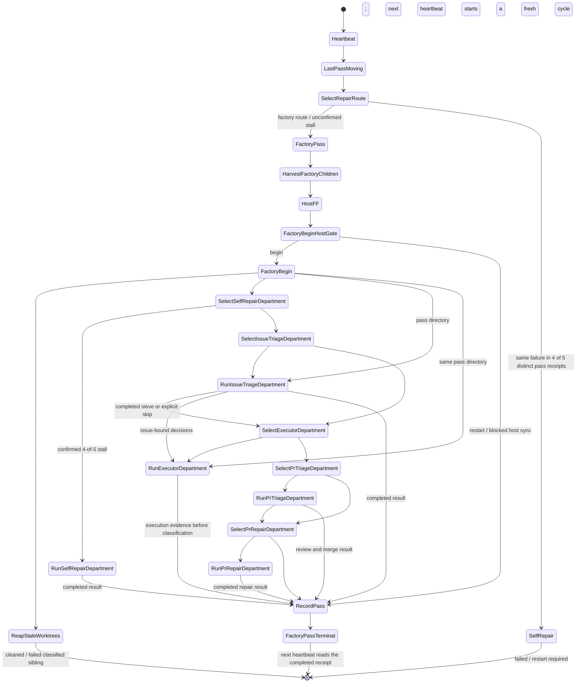

# Lokay

Lokay continuously delivers work across configured GitHub repositories through five departments composed by Fala. Implementation is **serial** `issue_to_pr` (ticket after ticket; default K=1), with a real configured coding executor. Done means quality code merged to `main`, not merely a started worker.

## What one tick does

`daemon_cycle` chooses recovery XOR one `factory_pass`. The factory starts with
`host_ff` → `factory_begin_host_gate` → `factory_begin` (on the begin route).
The parent selects and conditionally runs these departments in authored order:

1. `run_self_repair_department`: repairs a confirmed factory stall; off when the recovery gate excludes it. Repair and product work are exclusive.
2. `run_issue_triage_department`: lists and triages intentional issues, marks decisions and handles bounded split/intake work. It does not start coding.
3. `run_executor_department`: selects executable work and dispatches the child `issue_to_pr`, up to the serial budget. This is where implementation lives; `select_implement` is not the first step of the parent.
4. `run_pr_triage_department`: checks and reviews existing PRs, then waits, requests repair, or merges eligible quality code. A skip without merge consumes `(repo, pr, head_sha)` and leftover walks to the next open lokay PR. Incomplete review (no vendor comments and no complete JSON: timeout, not JSON, plugin_error, empty-comment budget) is not a review and KEEP the SHA. Vendor `comments[]` close the review even when budget or terminal is partial: findings → `request_changes` → `pr_repair`. Merge is `outcome=merge` after complete JSON v1 and `approve`, never after occupancy.
5. `run_pr_repair_department`: invokes `pr_repair` only for the preceding PR-triage repair verdict, without starting another merge process inside that department.

Within PR triage, after selecting its exact candidate and before launching
review, Lokay reconciles any durable repair-push intent against the live PR
identity, scoped to the selected repository/PR. Verified pre-publication
checkpoints bind start/target SHA, branch, task/review, repair run and declared-test
run before push preflight. Pre-attempt and unchanged-remote recovery retry only
that exact tested target; closed/merged observations retain terminal evidence
without spending repair budget. A recovered push consumes this pass without
review or merge; unavailable or mismatched identities KEEP at the queue tail. This runs even when
`pr_repair` is disabled, and dry-run never probes GitHub.
`record_pass` collects department results, then `factory_pass_terminal` returns
the receipt. Compact `pr_triage` and `pr_repair` evidence remain independent:
blocked repair records `health=pr_repair_blocked` and its named reason; a confirmed
new repair SHA is progress (`health=repairing`), not `new_pr` or `merge`.
PR receipt evidence is a bounded scalar projection, never the transport's
`terminal` dictionary. Repair evidence retains the authorized start SHA, new
head SHA when known, attempts and publication flags. `root_reason` preserves
the child's named failure independently of the parent reason; `trace` carries
`db`, `run_id` and `path_id` to the full durable Fala evidence outside the receipt.
Skip memory uses separate `skipped_issue_repo` and `skipped_pr_repo` tuples.
`skipped_repo` remains a PR-only compatibility alias. Complete legacy PR-only
receipts are accepted; mixed issue/PR legacy identities are not inferred. `reap_stale_worktrees` is a sibling from `factory_begin`, not a
prerequisite for departments or the receipt. A started worker is occupancy;
only a published PR or merge is delivery. Remaining work is not silently idle.

`executor_rows` and `product_pass_budget` use native Fala bounded templates.
The first slot is explicit (no previous receipt); slots 2–8 share one template.
Expansion preserves the serial graph, gates and receipts; default K=1 is unchanged.

`product_entry` / `product_pass_budget` are the separate CLI multi-pass entry,
including `leftover_closeout`; they are not the LaunchAgent tick. Parent and
child runs use separate journals. CLI availability alone does not make an old
survey/plan path part of the live department spine; see `docs/UNIX.md`.

## Architecture

- **Core value:** authored Fala process graph(s) (`fala/`). Workers, GitHub, and atom bodies are replaceable blocks under JSON contracts — see `docs/PROCESS.md`.
- `src/lokay/proc/`: small command-line atoms. They exchange JSON envelopes on stdout.
- `fala/lokay.fala-package.toml`: authored parent `factory_pass` plus child conduction for `issue_triage`, `pr_triage`, `pr_repair`, and `issue_to_pr`.
- `src/lokay/compose/`: thin graph and read-only status entrypoints; product ordering stays in Fala.
- `executor.command` and `executor.args`: the sole nondeterministic coding slot. Lokay rejects fake, stub, and no-op agents.
- Local verification is repository-declared (`[tool.lokay] test` in the worktree `pyproject.toml`). Lokay does not invent `pytest` from `pyproject` / `tests/`. Missing declaration stays an honest skip for delivery, but PR repair cannot publish it.
- `repos.mikolaj92.yaml`: managed repository scope.

There is no alternate Python fallback graph and no Hermes/Kanban execution ledger.

## Quick start

Requirements: Python 3.12+, [`uv`](https://docs.astral.sh/uv/), and authenticated GitHub CLI `gh`. `uv sync --extra dev` installs the pinned Python dependencies and Mojo 1.0.0 toolchain; no separate Fala checkout or Pixi environment is needed. Verification is local; Lokay does not use GitHub Actions.

```bash
uv sync
cp config.example.yaml config.yaml
uv run lokay validate --config config.yaml
uv run lokay-repos --config config.yaml
uv run lokay status --config config.yaml
uv run lokay path --describe
```

Dry-run is the default unless live mode is explicit:

```bash
uv run lokay tick --config config.yaml
uv run lokay work --config config.yaml --live --max-passes 8
```

For a documented night / live autonomous profile (merge on, local verification,
serial K=1), see `config.live-autonomous.example.yaml` and
[`docs/AUTONOMY.md`](docs/AUTONOMY.md).

## Continuous operation

The product daemon entrypoint owns one OS advisory lock across preflight and work:

```bash
uv run lokay-daemon --config config.yaml --max-passes 8 \
  --outbox ~/.lokay/preflight-bootstrap-incidents.log
```

This machine uses LaunchAgent label `ai.mikolaj.lokay`, `scripts/lokay-service.sh`, and logs under `~/.lokay/logs/`. The repository does not install or version a LaunchAgent plist.

## Maszyna stanów Lokaya

Lokay jest maszyną stanów sterowaną przez Falę. Stan domenowy pochodzi z
GitHuba (`issue`, PR, SHA, merge), a Fala wybiera następny minimalny proces
Unixowy. Proces może odczytać fakt albo wykonać jeden efekt uboczny. Nie może
ukrywać kolejnego grafu. Agent występuje tylko na granicy niedeterministycznej
i zwraca jeden wynik z zamkniętego schematu. Recenzja PR może poprosić o dokładnie
jeden dodatkowy fakt: `pr_metadata`, `changed_files`, `diff_tail` albo
`commit_summary`. Każdy rodzaj ma osobny kolektor Unixowy. Fala uruchamia tylko
wybrany kolektor, a druga prośba o dowody trafia do terminala ręcznego. Recenzja
`select_pr_review_scope` bierze zakres z diffu hosta, bez drugiego OCR.
Dopiero zgodny zakres uruchamia `pr_review_agent` (`ocr review`).
Błędny wynik kończy się fail-closed, bez generatywnego retry.

`status=complete` zamyka decyzję, nie fałszuje wykonania silnika. Poprawnie
zakotwiczone findings wystarczają do `request_changes` także przy częściowym
przeglądzie. `evidence` zachowuje terminal, budżet, awarię i zredagowane warningi,
a `coverage` rzeczywiste selected/completed/failed/reused/waived. Te dane trafiają
do trwałego artefaktu. `approve` nadal wymaga kompletnego przeglądu całego
zakresu bez materialnych warningów; pusta recenzja częściowa pozostaje KEEP.

Ten diagram jest kontraktem projektowym. **Każda zmiana przepływu zaczyna się
od zmiany i przeglądu diagramu. Dopiero zaakceptowany diagram wolno zakodować
w pakiecie Fali.** Test sprawdza, że diagram oraz `fala/lokay.fala-package.toml`
wymieniają te same ścieżki.


```mermaid
stateDiagram-v2
    [*] --> Heartbeat
    Heartbeat --> LastPassMoving
    LastPassMoving --> SelectRepairRoute
    SelectRepairRoute --> FactoryPass: factory route / unconfirmed stall
    SelectRepairRoute --> SelfRepair: same failure in 4 of 5 distinct pass receipts
    SelfRepair --> [*]: failed / restart required; next heartbeat starts a fresh cycle
    FactoryPass --> HarvestFactoryChildren
    HarvestFactoryChildren --> HostFF
    HostFF --> FactoryBeginHostGate
    FactoryBeginHostGate --> FactoryBegin: begin
    FactoryBeginHostGate --> RecordPass: restart / blocked host sync
    FactoryBegin --> ReapStaleWorktrees
    FactoryBegin --> SelectSelfRepairDepartment
    SelectSelfRepairDepartment --> RunSelfRepairDepartment: confirmed 4-of-5 stall
    SelectSelfRepairDepartment --> SelectIssueTriageDepartment
    SelectIssueTriageDepartment --> RunIssueTriageDepartment
    SelectIssueTriageDepartment --> SelectExecutorDepartment
    RunIssueTriageDepartment --> SelectExecutorDepartment: completed sieve or explicit skip
    RunIssueTriageDepartment --> RunExecutorDepartment: issue-bound decisions
    FactoryBegin --> RunIssueTriageDepartment: pass directory
    FactoryBegin --> RunExecutorDepartment: same pass directory
    SelectExecutorDepartment --> RunExecutorDepartment
    SelectExecutorDepartment --> SelectPrTriageDepartment
    SelectPrTriageDepartment --> RunPrTriageDepartment
    SelectPrTriageDepartment --> SelectPrRepairDepartment
    RunPrTriageDepartment --> SelectPrRepairDepartment
    SelectPrRepairDepartment --> RunPrRepairDepartment
    SelectPrRepairDepartment --> RecordPass
    RunSelfRepairDepartment --> RecordPass: completed result
    RunIssueTriageDepartment --> RecordPass: completed result
    RunExecutorDepartment --> RecordPass: execution evidence before classification
    RunPrTriageDepartment --> RecordPass: review and merge result
    RunPrRepairDepartment --> RecordPass: completed repair result
    RecordPass --> FactoryPassTerminal
    ReapStaleWorktrees --> [*]: cleaned / failed classified sibling
    FactoryPassTerminal --> [*]: next heartbeat reads the completed receipt
```

### Ścieżki Fali

Tabela jest artefaktem pakietu Fala; sprawdza to `lokay-readme-check`.

<!-- fala-paths:begin (generated from fala/lokay.fala-package.toml) -->
| Ścieżka Fali | Tytuł |
| --- | --- |
| `daemon_cycle` | Lokay daemon cycle |
| `factory_pass` | Lokay factory pass |
| `issue_to_pr` | Issue to PR gate |
| `issue_to_pr_delivery` | Issue to PR delivery |
| `coding_execution` | One coding result |
| `local_repair_execution` | One local-test repair |
| `issue_triage` | Issue triage sito |
| `issue_split` | Bounded issue split |
| `pr_repair` | PR repair |
| `pr_triage` | PR review outcome |
| `self_repair` | Lokay emergency self-repair |
| `stale_worktree_reap` | Stale worktree hygiene |
| `implementation_dispatch` | Serial implementation dispatch |
| `triage_dispatch` | Serial triage dispatch |
| `queue_conflict` | One semantic queue conflict |
| `select_implement` | Bounded implementation repository selection |
| `self_repair_prepare` | Explicit self-repair worktree preparation |
| `self_repair_validate` | Explicit self-repair candidate validation |
| `closeout_pr` | One explicit AI PR closeout |
| `ready_hygiene` | Bounded orphan-ready hygiene |
| `product_pass_budget` | Authored bounded product pass budget |
| `test_local_execution` | Declared local test execution |
| `leftover_closeout` | Leftover closed-ready closeout |
| `factory_begin` | Factory pass workspace opening |
| `localize_execution` | Localization execution |
| `relocalize_off_goal` | One bounded off-goal relocalization |
| `assert_real_diff_execution` | Physical real-diff assertion |
| `self_repair_activate_execution` | Exact self-repair activation |
| `status_snapshot` | Read-only status snapshot |
| `pr_create_execution` | One pull-request publication |
| `stage_label_execution` | One issue-stage transition |
| `plan_issue_execution` | Deterministic issue approach |
| `intake_check_execution` | One mechanical intake check |
| `daemon_entry` | One daemon heartbeat entry |
| `self_repair_entry` | One self-repair entry |
| `child_harvest` | One detached-child harvest |
| `product_entry` | One direct product entry |
| `self_repair_department` | Self-repair department |
| `issue_triage_department` | Issue triage department |
| `issue_sieve_row` | One issue sieve row |
| `issue_sieve_rows` | Authored issue sieve row budget |
| `executor_department` | Executor department |
| `executor_rows` | Authored executor row budget |
| `executor_row` | One executor row |
| `pr_triage_department` | PR triage department |
| `cross_repo_release_train` | Serial cross-repo release train |
<!-- fala-paths:end -->

Diagramy projektowe per ścieżka, audyt zgodności i mapowanie stanów:
[docs/FALA_PATHS.md](docs/FALA_PATHS.md).

### Reguły przejść

1. GitHub przechowuje stan domenowy. Dziennik Fali przechowuje wykonanie i
   obserwowalność. Etykieta nie może rekonstruować ani nadpisywać werdyktu.
2. Wynik agenta jest związany z konkretnym SHA i ma zamknięty schemat. Informacje
   `skipped`, `cached` i `already_reviewed_head` są tylko metadanymi wykonania.
3. Każda strzałka oznacza proces, który można osobno ponowić i obserwować.
4. Złożona gałąź jest osobną ścieżką lub pod-Falą. Nie wolno implementować jej
   jako rozbudowanego dispatchera Python.
5. Efekty uboczne następują dopiero po deterministycznej krawędzi Fali:
   etykieta, commit, push, utworzenie PR, merge i zamknięcie issue.
6. Lokay nie używa GitHub Actions. Testy i walidacja wykonują się lokalnie w
   zadeklarowanym środowisku repozytorium. LaunchAgent daje stały heartbeat.

## Safety

- Live mutation requires explicit live mode and a healthy preflight lease.
- Dry-run never mutates and is not a substitute agent.
- Issue bodies and repository content are untrusted input to the executor.
- Product runtime does not force-push or delete repositories.
- Invalid structured review, requested changes, secrets, and human-review requirements fail closed.
- Failed local verification, manual review, and survey errors are not reported as successful progress.

## Commands and layout

| Path or command | Purpose |
| --- | --- |
| `uv run lokay validate --config config.yaml` | Validate configuration |
| `uv run lokay-repos --config config.yaml` | List managed repositories |
| `uv run lokay status --config config.yaml` | Readiness, health, K, per-repo work, human residuals (`--local` / `--human`) |
| `~/.lokay/last-pass.json` | Compact pass receipt after each tick (LaunchAgent-friendly) |
| `~/.lokay/fala/<path>/` | Fala pass journals (`state.sqlite` next to the materialized package). 64 MiB ceiling; one oversized journal per tick, smallest first, and only when it has terminal-run candidates. `fala.maintain_journal` deletes terminal runs older than `retention.max_age_days` (newest `retention.journal_keep_last` kept) and VACUUMs when free space can hold the compact copy plus a 16 MiB margin. No terminal candidates means the slot stays unused. Created and running leftovers are not finalized here. Unreadable journals and live writers (1 h grace) are retained (`docs/RETENTION.md`). Fail-closed if Fala cannot reclaim the file. Nested children never share the tree-root sqlite |
| `uv run lokay path --describe` | Inspect materialized workflow paths |
| `uv run lokay work --config config.yaml --live --max-passes 8` | Run a bounded live lokay |
| `src/lokay/proc/` | Unix atoms |
| `src/lokay/compose/` | Path entrypoints and top-level lokay policy |
| `fala/` | Authored Fala package |
| `scripts/lokay-service.sh` | Launchd-compatible bounded-run caretaker |

## Binding documentation

- [`docs/WORKING.md`](docs/WORKING.md) — working-machine contract and tick order
- [`docs/AUTONOMY.md`](docs/AUTONOMY.md) — autonomous lokay Definition of Working, night profile, canaries
- [`docs/HEALTH.md`](docs/HEALTH.md) — lokay health without watching GitHub
- [`docs/GRAPH.md`](docs/GRAPH.md) — Fala paths and conduction
- [`docs/DARK_FACTORY_ARCHETYPE.md`](docs/DARK_FACTORY_ARCHETYPE.md) — wspólna geometria dark factories: control plane, bounded workers, gates, capabilities, reconciliation i confirmed delivery
- [`docs/UNIX.md`](docs/UNIX.md) — process boundaries and JSON envelopes
- [`docs/NO_STUBS.md`](docs/NO_STUBS.md) — real-agent requirement
- [`docs/HTMX.md`](docs/HTMX.md), [`docs/ALPINE.md`](docs/ALPINE.md), [`docs/PLATFORM_UI.md`](docs/PLATFORM_UI.md) — UI boundaries
- [`docs/ATOM_INVENTORY.md`](docs/ATOM_INVENTORY.md) — read-only authored graph-to-source inventory
- [`repos.mikolaj92.yaml`](repos.mikolaj92.yaml) — managed repository inventory


## Local status dashboard

Run the read-only FastAPI dashboard on localhost:

```bash
uv run lokay-status-server --config config.yaml
# http://127.0.0.1:8766
```

The server does not survey GitHub or mutate the lokay. It renders the current local
pass receipt, 24-hour and 7-day event throughput, supported repositories, per-repo
work, blockers, and a bounded history of completed pass receipts. Core UI assets
come from the pinned app-factory platform at same-origin `/static/platform`.

## License

MIT. See [LICENSE](LICENSE).
