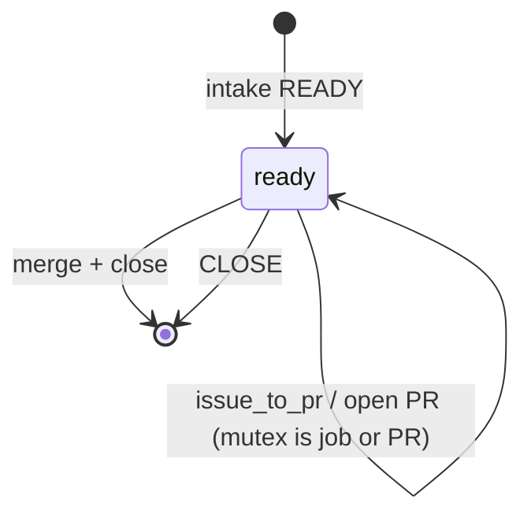

# Autonomy (Definition of Working)

Lokay is **working as an autonomous mill** when it continuously turns human-authored
issues into **merged quality code on `main`** across the managed catalog — without
new human gates, without freezing clean repos behind a busy peer, and without
treating honest waits as recovery stalls.

That merge is the **only Definition of Done** ([`WORKING.md`](WORKING.md)).
A green agent, a plan-only worktree, a pass receipt, or a green test suite is
not output. Broken toys shipped fast are worthless; machines that only feed
machines are worthless. Bounded misses must free the slot.

Design law: **Fala coordinates; small atoms do one job.** Certainty scaffolding
here is additive (tests / fixtures / docs / config profile). Fleet pass order
lives in parent Fala ``factory_pass`` (`host_ff → survey_prs → survey_inbox → survey_ready
→ plan → triage → conflicts → closeout → occupancy → reap leftover worktrees → select → queue_conflict → implement →
health → receipt`). Serial by design (default K=1).
`compose_tick` is a thin in-process bridge for canaries/CLI — not the multi-repo
brain. The promises below are the public surface that must remain.

## Product law: trust the issue author

**Humans author intentional issues; the mill consumes.**

When an issue is created or owned by the trusted operator (`github.assignee`,
default **mikolaj92**), assume it makes sense. Prefer **READY → implement**
autonomy. Do **not** invent distrustful human gates, clarification loops, or
“are you sure?” parking for ordinary intentional work.

Deeper skepticism — if distinguished at all — is for foreign/external authors,
not for the operator’s own issues. Deterministic intake still applies
shape/superseded/duplicate/size rules (`CLOSE` / `SPLIT` / `READY`), but those
are fitness checks, not author distrust.

Foreign tickets that object to the mill’s **essence** (soul, quintessence,
“should be a harness / kanban / something else”) CLOSE. Foreign tickets that
report a hang or that it does not work as described stay. Operator tickets
always stay — even when they rewrite the product.

Maximize autonomy. Minimize `NEEDS_HUMAN` / `ai:needs-feedback`: it is a **rare
residual** after rules fail closed (missing evidence), never the default exit
for oversized work (auto-`SPLIT`) or obsolete playbooks (`CLOSE`).

Residual mailbox (`lokay status --human`) is exception reporting, not a
workflow step and not a mill brake.

## Issue ledger = chat with the mill

The issue is the conversation for **decisions**. In-flight work is a fact
(live `issue_to_pr` receipt or covering open PR), not an exclusive label.

| Stage | Label | Set by |
| --- | --- | --- |
| ready | `ai:ready` | intake READY — stays through implement / PR |
| clear | (removes ready) | `pr_triage` → `stage_clear` then `close_issue` |

Reuse: `ai:blocked`, `ai:needs-feedback`, `ai:needs-review`, `ai:tracker`.
PR chrome `ai:pr-opened` / `ai:generated` stay on the **PR**. Fala still has
`stage_implementing` / `stage_pr_open` / `stage_repairing` nodes; they keep
`ai:ready` and strip leftover cache. They do not mint `ai:in-progress`,
`ai:pr-open`, `ai:ci-waiting`, or `ai:repairing`.



Atom: `lokay-stage-label --stage <name>`. In-flight names map to ready.

## Product promises (mill pass)

1. **Per-repo PR-first** — An actionable `ai/fix/*` PR in repo A does **not**
   block inbox triage or `issue_to_pr` in clean repo B. Never open a second AI PR
   in a repo that already has one.
2. **Serial by design** — Ticket after ticket. `limits.max_issue_to_pr_per_pass`
   (default **1**) is an optional pass budget, **not** concurrent worktrees /
   Pi / tmux. `K>1` is rare breadth across already-isolated clean repos.
3. **Contradiction gate** — `lokay-queue-conflict` is queue hygiene before
   `issue_to_pr` (SKIP/defer or CLOSE/demote on clear conflicts). Not a
   parallel scheduler; does not invent NEEDS_HUMAN for intentional tickets.
4. **Intake gates implement** — Deterministic intake yields `CLOSE` | `SPLIT` |
   `READY` (rare `NEEDS_HUMAN`). Only `READY` + `--require-ready` may call
   `issue_to_pr`. CLOSE/SPLIT never implement. Trusted-author ordinary work
   prefers READY.
5. **Plan before agent (evidence)** — On the serial `issue_to_pr` path,
   `lokay-plan-issue` writes `.lokay/approach.md` after `worktree_add` and
   **before** `run_agent` (goal / likely files / test plan / non-goals).
   Trust-with-evidence for intentional issues — **not** a human approval gate
   and not `NEEDS_HUMAN` by default. `pr_review` is blind to the plan
   (ticket + code diff + tests only).
6. **Trusted merge policy** — With merge armed: pending checks → `waiting`;
   red checks → `repair`; approve + green → merge; secrets / needs_human /
   escalated `ai:needs-review` → fail closed.
7. **Narrow recovery** — Mill `health=waiting` / `repairing` (and soft
   merge_policy reasons) never mint recovery stall fingerprints or fill the
   4-of-5 self-repair quorum.
8. **Collector boundary** — When the separate intake gate classifies a seed as
   unbounded collection work, the coding task is only a bounded collector
   bootstrap patch. Its destination deployment starts the collector durably in
   the background after merge; Pi and the mill neither populate collection data
   nor wait for completion. A later issue evaluates collection progress.

## Event wake vs cron

The LaunchAgent cron (`ai.mikolaj.lokay-mill` → `scripts/lokay-mill-daemon.sh`)
remains the steady heartbeat. **Event wake** nudges the same mill host sooner
when GitHub signals new work — it does **not** start a second parallel coding
fleet. Serial by design (default K=1) is unchanged; the mill lock still
serializes overlap.

| Signal | Workflow | `lokay-wake` path |
| --- | --- | --- |
| Issue opened / labeled `ai:ready` | `.github/workflows/lokay-wake-issue.yml` | `issue_triage` |
| PR checks complete (`workflow_run` / AI-PR `check_*`) | `.github/workflows/lokay-wake-checks.yml` | `pr_triage` (pr+branch) or bounded `factory_pass` (max-passes 1) |
| Manual / factory nudge | `workflow_dispatch` or `--reason factory` | bounded `factory_pass` |

**Design B (preferred):** run wake jobs on a **self-hosted** Actions runner on
the mill Mac, labeled `lokay-mill`. The job calls `uv run lokay-wake` against
the existing checkout (`LOKAY_ROOT`, default `~/Developer/OSS/lokay`) — same
`gh` auth, clones, and Pi executor as the LaunchAgent.

Enable:

1. Install/register a GitHub self-hosted runner on the mill host; add labels
   `self-hosted` and `lokay-mill`.
2. Set repository variables: `LOKAY_ROOT` (optional), `LOKAY_CONFIG` (optional),
   `LOKAY_WAKE_LIVE=true` only when live mutations are intended (default omits
   `--live` → planned / dry-run path).
3. Copy or mirror the wake workflows into managed catalog repos that should
   wake this runner (org-level runner registration makes `runs-on:
   [self-hosted, lokay-mill]` available fleet-wide).

Atom: `lokay-wake --reason …` (JSON envelope). `--plan-only` prints routing
without invoking Fala. Spam / `invalid` / `wontfix` labels skip; labeled
events only wake on `ai:ready`.

**Residual risk:** live wake uses the mill host credentials; prefer host-local
`gh` over putting long-lived PATs in Actions secrets.

## Night mill profile

Default example stays dry-run (`config.example.yaml`). For a live night mill,
use the documented profile:

```bash
cp config.live-autonomous.example.yaml config.yaml
# Or point LaunchAgent at the live profile path.
uv run lokay validate --config config.yaml
uv run lokay status --config config.yaml --local
uv run lokay-mill --config config.yaml --live --max-passes 8
```

Profile knobs (also overridable via env):

| Knob | Live autonomous |
| --- | --- |
| `mode` | `live` (`LOKAY_MODE=live`) |
| `executor.enabled` | `true` (`LOKAY_EXECUTOR_ENABLED=1`) |
| `merge.enabled` | `true` (`LOKAY_MERGE_ENABLED=1`) |
| `merge.require_checks` | `true` (`LOKAY_REQUIRE_CHECKS=1`) |
| `merge.require_llm_review` | `true` (`LOKAY_REQUIRE_LLM_REVIEW=1`) |
| `limits.max_issue_to_pr_per_pass` | `1` (serial by design) |

## Hermetic canaries

Contract tests pin the promises without live network / gh mutation:

```bash
uv run pytest -q tests/test_autonomy_contracts.py
```

Broader related suites: `tests/test_global_pr_first.py`,
`tests/test_intake*.py`, `tests/test_merge_policy.py`,
`tests/test_recovery_history.py`. Fixtures live under `tests/fixtures/autonomy.py`.

Do **not** add live canaries that mutate real repos. Do **not** ship
canary-only “fixes” (`LOKAY_CANARY.md` style) — see [`NO_STUBS.md`](NO_STUBS.md).

## Reading `lokay status` and `last-pass.json`

```bash
uv run lokay status --config config.yaml
uv run lokay status --config config.yaml --local   # readiness + last_pass
uv run lokay status --config config.yaml --human   # residual mailbox only
```

Each tick writes a compact receipt (default `~/.lokay/last-pass.json`):

```bash
jq '{health, idle, progress, merge_enabled, require_checks, require_llm_review, k: .max_issue_to_pr_per_pass, remaining, by_repo}' \
  ~/.lokay/last-pass.json
```

### Light observability (not a metrics product)

Glance ratios from the receipt are fine — ready / open AI PRs / mergeable-green /
progress / residual human count. Do **not** grow a heavy metrics subsystem,
dashboards, or second ledger around them.

```bash
jq '{
  health,
  progress,
  ready: .remaining.ready,
  open_ai_prs: .remaining.open_ai_prs,
  actionable_prs: .remaining.actionable_open_ai_prs,
  mergeable_green: .remaining.mergeable_green,
  issue_to_pr_started: .remaining.issue_to_pr_started,
  human_residuals: .human_residuals.count
}' ~/.lokay/last-pass.json
```

Intake `CLOSE` / `SPLIT` show up as pass `progress` + action steps in the tick
envelope (and daemon logs), not as a separate time-series product. Keep it light.

| `health` | Meaning for autonomy |
| --- | --- |
| `idle` | No remaining actionable work |
| `progress` | Queue moved this pass |
| `waiting` | Pending CI / review limbo — honest wait, not stall |
| `repairing` | Repair / request_changes cycle — honest wait |
| `stall` | Actionable work with no progress — investigate |
| `survey_error` | List atoms failed — fix auth/network before trusting idle |

`ok=false` means **not working** (work remains but mill not live-ready, or
survey errors). Soft waits with `ok=true` are healthy autonomy.

Details: [`WORKING.md`](WORKING.md), [`MILL_HEALTH.md`](MILL_HEALTH.md),
[`GRAPH.md`](GRAPH.md).
