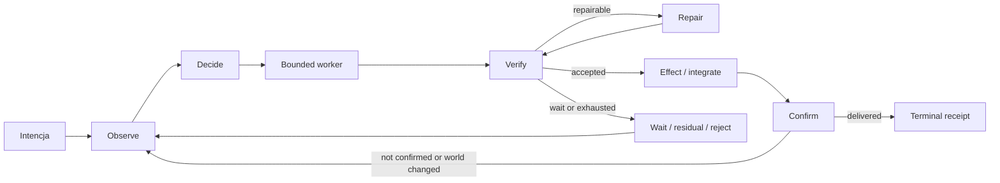
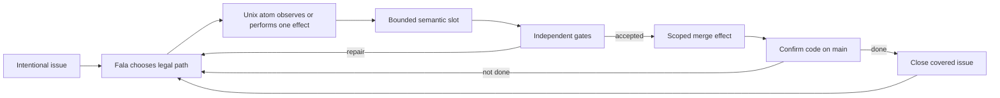

# Esencja dark software factory

To nie jest wspólna implementacja ani dokładna geometria wszystkich projektów.
To **podobieństwo rodzinne**: kilka rzeczy, które je łączą, kilka osi, które je
dzielą, oraz konkretny kształt, jaki temu archetypowi nadaje Lokay.

Dokument jest źródłem idei, nie wiążącą specyfikacją procesu. Wiążące są
[`README.md`](../README.md), [`PROCESS.md`](PROCESS.md) i [`GRAPH.md`](GRAPH.md).

## Teza Lokaya — obecna od początku

> **Graf jest wartością, ponieważ graf jest procesem. Węzły są wymiennymi
> wykonawcami kontraktu.**

To nie jest wniosek dopisany po analizie konkurencji. Jest to pierwotna zasada
Lokaya, widoczna od pierwszej wersji: najpierw powstały małe programy Unixowe,
a następnie Fala przejęła wyłączną własność ich kolejności. Analiza innych dark
factories jedynie pomogła nazwać szerszy archetyp, do którego ta zasada należy.

```text
wartość trwała = proces: kolejność + stan + bramki + powroty + Done
wartość wymienna = wykonawca kroku: program | agent | człowiek
```

Proces nie powinien zależeć od natury wykonawcy. Ten sam logiczny węzeł może
dziś realizować program Unixowy, model, człowiek albo usługa. Ważne jest tylko,
że przyjmuje określone wejście, ma określone capabilities, wykonuje jedną rolę
i zwraca wynik zgodny z kontraktem.

Tożsamość wykonawcy jest szczegółem implementacyjnym. **Położenie węzła w
grafie, jego kontrakt oraz relacje z innymi węzłami są wiedzą o tym, jak
powstaje rezultat.** Ta wiedza kumuluje się w procesie i pozostaje po wymianie
każdego pojedynczego elementu.

## Archetyp

Dark software factory przenosi brzemię z pamięci, uwagi i dobrej woli
pojedynczych wykonawców na wykonywalny proces.

W tym przesunięciu proces sam staje się wartością. Wiedza o tym, jak przyjąć
pracę, wykonać ją, sprawdzić, naprawić i dostarczyć, jest utrwalona,
powtarzalna i może przeżyć zmianę wykonawcy.

Dark factory zmienia wykonawcę i tempo działania, ale nie podstawową geometrię
procesu:

> **trwały proces otacza niedeterministycznego wykonawcę, prowadzi pracę przez
> jawne stany, niezależnie sprawdza rezultat i domyka pętlę do potwierdzonego
> efektu w świecie.**

„Dark” nie oznacza braku ludzi ani procesu. Oznacza, że proces potrafi wykonać
zwykły cykl bez ludzi służących jako żywy klej pomiędzy każdym etapem. Ludzie
pozostają autorami intencji, projektantami procesu i właścicielami polityki;
maszyny stają się jego naturalnymi wykonawcami.

Najkrócej:

```text
intencja
→ obserwacja świata
→ wybór legalnego kroku
→ ograniczony wykonawca
→ niezależna weryfikacja
→ naprawa albo integracja
→ potwierdzenie efektu
→ ponowna obserwacja
```

Agent nie jest fabryką. Człowiek też nie jest fabryką. Program Unixowy nie
jest fabryką. Każdy z nich jest tylko wymiennym organem procesu.

```text
węzeł = rola + kontrakt + capabilities
wykonawca = aktualna implementacja węzła
fabryka = graf węzłów + stan + reguły przejść
```

Dlatego optymalizujemy graf, a nie przywiązanie do konkretnego workera. Lepszy
agent ulepsza jeden element. Lepszy proces ulepsza pracę każdego obecnego i
przyszłego wykonawcy.

### Ta sama geometria co w zespole inżynierskim

| Dojrzały zespół | Dark factory | Funkcja procesu |
| --- | --- | --- |
| backlog, ticket, spec | trwała intencja | praca nie znika wraz z rozmową |
| tech lead / właściciel procesu | graf, state machine, policy | ustala legalną kolejność |
| przydział i ownership | scheduler, lease, occupancy | jedna praca ma jawnego wykonawcę |
| branch i środowisko deweloperskie | worktree lub sandbox | izoluje zmianę |
| inżynier | bounded coding worker | wykonuje lokalny osąd i zmianę |
| code review | niezależny reviewer/gate | oddziela autora od akceptacji |
| CI i quality standards | mechaniczne gates | zamienia oczekiwania w dowód |
| prośba o poprawki | bounded repair edge | błąd wraca kontrolowaną drogą |
| release manager / merge queue | integrator i merge policy | chroni wspólny zasób |
| incident process i handover | journal, resume, reconciliation | proces przeżywa utratę wykonawcy |
| audyt i metryki delivery | evidence i receipts | pozwala odtworzyć decyzje i wynik |
| kod na produkcji lub `main` | confirmed terminal effect | odróżnia aktywność od dostarczenia |

Różnica polega przede wszystkim na tym, **kto niesie koordynację**. Najpierw
noszą ją ludzie w głowach i wiadomościach. Potem zostaje utrwalona w procesie.
W dark factory proces staje się wykonywalnym grafem.

Nie chodzi o usunięcie osądu. Proces decyduje, **gdzie osąd jest potrzebny,
kto może go wykonać, jaki dowód po nim pozostaje i co wolno zrobić dalej**.
Wartość nie jest już zamknięta w jednym wykonawcy: pozostaje w procesie, gdy
człowiek lub agent zostaje wymieniony.

## Co je łączy

Niezależnie od języka, DSL-a i infrastruktury, projekty z tej rodziny zwykle
mają te same elementy:

1. **Intencja istnieje poza promptem** — jako issue, ticket, spec, packet albo
   manifest.
2. **Proces istnieje poza agentem** — runtime, graf lub state machine określa,
   co może nastąpić.
3. **Agent ma ograniczoną rolę** — interpretuje, planuje, koduje albo ocenia,
   ale nie jest jednocześnie całym systemem sterowania.
4. **Stan przeżywa sesję** — journal, baza, host domenowy lub artefakty pozwalają
   wrócić po restarcie.
5. **Efekty są jawne** — commit, push, PR, review i merge są rozpoznawalnymi
   operacjami, a nie ukrytym fragmentem rozmowy.
6. **Rezultat jest sprawdzany z zewnątrz** — przez testy, checks, review,
   acceptance, policy albo holdouty.
7. **Błąd ma drogę w procesie** — wait, retry, repair, rebase, reject lub
   residual; nie tylko „agent spróbuje jeszcze raz”.
8. **Done jest faktem poza agentem** — artefakt został opublikowany, scalony lub
   wdrożony i można to ponownie zaobserwować.

Ich wspólną cechą nie jest więc „wiele agentów” ani „graf”. Jest nią
**przeniesienie brzemienia koordynacji, pamięci i kontroli jakości z wykonawcy
na proces — oraz uznanie samego procesu za kumulowaną wartość**. Wykonawcą może
być człowiek albo model; maszyna po prostu znacznie lepiej pasuje do roli,
którą procesy korporacyjne próbowały wcześniej narzucić ludziom.

## Co je dzieli

Archetyp nie przesądza najważniejszych decyzji produktowych:

| Pytanie | Możliwe geometrie |
| --- | --- |
| Kto tworzy proces? | człowiek wersjonuje stały graf / agent proponuje task DAG ograniczony przez runtime |
| Co jest pracą? | issue / spec / packet / scenario / pojedynczy run |
| Gdzie jest prawda? | host domenowy, np. GitHub / własna baza control plane'u / oba |
| Jak wraca się po awarii? | resume checkpointu / świeża reconciliation ze światem |
| Jak szeroki jest agent? | cała faza / jeden ograniczony krok semantyczny |
| Kto posiada skutki uboczne? | agent z credentials / scoped tools / osobny capability gateway |
| Kto definiuje sukces? | implementer / repo checks / niezależny reviewer / protected acceptance lub holdout |
| Jak płynie praca? | seryjnie / równoległy DAG |
| Jak kończy się proces? | artefakt / PR / potwierdzony merge lub deploy |
| Gdzie jest człowiek? | prowadzi proces / zatwierdza granice / obsługuje tylko residuals |
| Jaki jest zakres produktu? | uniwersalny workflow runtime / jedna opiniotwórcza fabryka |
| Jak długo żyje system? | jeden run / ciągły controller floty |

Dlatego Fabro, Optio, Detent, Lightsout, egg, Spec Kitty i Lokay mogą należeć
do tej samej rodziny, a jednocześnie być bardzo różnymi produktami.

## Wspólny kształt grafu

Graf archetypu ma trzy pętle, nie jedną linię.



### Pętla pracy

```text
worker → verify → repair → verify
```

Produkuje dobry kandydat, ale jeszcze nie musi dostarczać go do świata.

### Pętla integracji

```text
fresh facts → policy → effect → confirm
```

Chroni wspólny zasób: docelową gałąź, release albo środowisko.

### Pętla życia

```text
observe → reconcile → act → observe
```

Sprawia, że system przeżywa restart, utracony event, zmianę base i częściowo
wykonany efekt.

To właśnie odróżnia fabrykę od jednorazowego workflow agenta.

## Jak zbudować konkretny graf z archetypu

Nie zaczyna się od node'a „agent”. Zaczyna się od czterech pytań:

1. **Jaki zewnętrzny fakt oznacza Done?**
2. **Jakie fakty pozwalają wybrać następny krok?**
3. **Gdzie naprawdę potrzebny jest niedeterministyczny osąd?**
4. **Jak system wraca po błędzie i po restarcie?**

Następnie każdą ważną operację rozkłada się na:

```text
observe fact
→ select legal route
→ perform bounded effect
→ confirm new fact
```

A każda pętla musi mieć:

- nazwany powód powrotu,
- nową obserwację albo nowy artefakt,
- ograniczony budżet,
- uczciwe wyjście po jego wyczerpaniu.

Najważniejsza reguła konstrukcyjna:

> **Niedeterministyczny worker może wytwarzać propozycje i artefakty, ale graf,
> bramki i zewnętrzny świat rozstrzygają, co wydarzy się dalej i czy praca jest
> skończona.**

## Geometria Lokaya wokół archetypu

Lokay nie jest neutralnym workflow runtime'em. Jest konkretnym wyborem na
powyższych osiach:

```text
ciągła flota repozytoriów
+ intencjonalne GitHub issue jako praca
+ GitHub/Git jako prawda domenowa
+ kolejność należąca do Fali
+ małe Unix atoms posiadające fakty i efekty
+ agent tylko w ograniczonych slotach semantycznych
+ domyślnie seryjna praca
+ per-repo PR-first
+ niezależne testy i review
+ bounded repair i powroty między passami
+ autonomiczny, fizycznie potwierdzony merge
+ self-repair fabryki
```

Mapowanie jest proste:

| Archetyp | Lokay |
| --- | --- |
| Intencja | otwarte, intencjonalne issue |
| Observe | atomy czytające GitHub, Git, worktree i receipts |
| Decide | Fala i jawne selektory route |
| Worker | wymienny coding/review executor |
| Verify | real diff, testy, checks i niezależny review |
| Repair | ograniczony local repair i PR repair |
| Effect | osobne atomy commit, push, PR, merge i close |
| Confirm | ponowny odczyt fizycznego stanu GitHuba/Gita |
| Done | jakościowy kod scalony do `main` |
| Life loop | kolejne passy, reconciliation, cleanup i self-repair |

Naszą geometrię można więc streścić tak:



Nie wszystkie node'y występują w każdym przebiegu, a wiążący graf jest dużo
bardziej szczegółowy. To tylko jego esencja.

## Inwarianty naszej geometrii

1. **Graf jest produktem.** Jego węzły mogą zmieniać implementację bez zmiany
   znaczenia procesu.
2. **Order lives in Fala.** Agent, Python i UI nie posiadają drugiego workflow.
3. **Agent verdict nie jest efektem.** Osąd może wybrać kandydacką trasę, ale
   nie wykonuje merge.
4. **Efekty są oddzielone od semantycznej pracy.** Coding worker nie jest
   publisherem ani integratorem.
5. **Krytyczne fakty pochodzą ze świata.** Journal nie może sam ogłosić Done.
6. **Każda naprawa jest ograniczona.** Brak postępu musi zwolnić slot.
7. **Proces jest cykliczny.** CI, review, konflikt i restart wracają przez
   ponowną obserwację.
8. **Serialność jest świadomą polityką.** Nie jest ukrytym brakiem schedulera.
9. **Człowiek definiuje intencję i politykę.** Nie prowadzi zwykłej pracy krok
   po kroku.
10. **Jedynym sukcesem produktu jest delivery.** Aktywność, plan, test i
    otwarty PR są tylko stanami pośrednimi.

## Jak czerpać z innych projektów

Nie kopiujemy feature'u ani ich całego grafu. Pytamy:

> **Jaki inwariant ten mechanizm chroni i gdzie ten inwariant leży w naszej
> geometrii?**

Przykłady:

- protected tests z Lightsout → wykonawca nie może zmienić własnego egzaminu,
- reconciliation z Optio → po zdarzeniu lub restarcie najpierw obserwujemy
  świat,
- merge train z Detent → integracja ma świeżą i uporządkowaną bramę,
- capability gateway z egg → zakazany efekt jest fizycznie niedostępny,
- sandbox Last Light → wykonanie narzędzi ma inną granicę zaufania niż model,
- session policy Agent Runner → resume jest jawną decyzją procesu,
- holdouty Dark Factory/OctopusGarden → część acceptance należy do niezależnego
  właściciela,
- explain z Grain → decyzję można odtworzyć z faktów i policy bez czytania
  rozmowy modelu.

Możemy przyjąć inwariant bez przyjmowania cudzej topologii. Lokay może mieć
capability boundary bez enterprise approval chain, protected acceptance bez
kopiowania ledgeru Lightsout i uporządkowaną integrację bez porzucania K=1.

## Test lakmusowy

Esencję projektu odsłania sześć pytań:

1. Kto wybiera następny krok: runtime czy model?
2. Kto posiada nieodwracalne efekty?
3. Kto niezależnie ocenia artefakt?
4. Co dzieje się po killu w połowie operacji?
5. Jaki zewnętrzny fakt oznacza Done?
6. Czy system potrafi dojść do tego faktu bez człowieka prowadzącego każdy
   etap?

Jeśli odpowiedziami są głównie prompt i pamięć agenta, jest to agentic
workflow. Jeśli odpowiedziami są graf, stan, policy, capabilities, evidence i
reconciliation, jest to dark factory.

## Ślad tej idei w historii Lokaya

Historia repozytorium pokazuje, że ta zasada nie została wymyślona na potrzeby
niniejszego dokumentu:

- `026650e` — pierwsza wersja definiowała Lokaya jako pipeline małych programów
  i zasadę `one process = one job`;
- `832e69c` — pół godziny później Fala przejęła kolejność nad atomowymi krokami,
  a `GRAPH.md` otwierało zdanie **“Order is the product”**;
- `a9dc1c8` — usunięto alternatywny Pythonowy composer: Fala została jedynym
  właścicielem workflow;
- `3996b98` — coding harness został nazwany Unixowym slotem, nie zależnością od
  vendora;
- `e8fee80` — binding `PROCESS.md` zapisał wprost: **“The product of Lokay is
  the process graph(s), not the workers”** oraz możliwość zastąpienia ciała
  węzła funkcją albo agentem bez zmiany grafu.

To jest ciąg jednej myśli:

```text
małe programy
→ graf posiada kolejność
→ graf jest jedynym composerem
→ wykonawca jest wymiennym slotem
→ proces, nie worker, jest produktem
```

Potwierdza to także historia rozmów zachowana w TencentDB. 15 sierpnia 2026
Patryk opisał cel wprost: mamy „przede wszystkim skupić się na opisaniu całego
procesu”; Fala jest reprezentacją grafu i przepływu informacji właśnie po to,
aby „małe uniksowe klocuszki” można było zmieniać, edytować i łatwo naprawiać.
31 sierpnia doprecyzował inwersję:

> **To nie jest agent. Agent jest częścią — i to nie jedną. Mamy program
> komputerowy z LLM, a nie LLM, który używa różnych narzędzi.**

To rozstrzyga kierunek zależności:

```text
NIE:  agent → używa programów jako swoich narzędzi
TAK:  graf procesu → składa programy, z których część używa agentów
```

## Źródła archetypu

Synteza powstała ze statycznego przeglądu kodu projektów:

- [Fabro](https://github.com/fabro-sh/fabro),
  [Optio](https://github.com/jonwiggins/optio),
  [TAKT](https://github.com/nrslib/takt),
  [Miniforge](https://github.com/miniforge-ai/miniforge),
  [Last Light](https://github.com/nearform/lastlight),
  [Lightsout](https://github.com/dc-devs/lightsout),
  [Detent](https://github.com/digitaldrywood/detent),
  [Agent Runner](https://github.com/Codagent-AI/agent-runner),
  [Herdr](https://github.com/sean1588/herdr-orchestrator) i
  [Dark Factory](https://github.com/jleechanorg/dark-factory),
- [Shipfox](https://github.com/ShipfoxHQ/shipfox),
  [egg](https://github.com/jwbron/egg),
  [AgentForge](https://github.com/H9-Foundry/AgentForge),
  [Grain](https://github.com/Diwata-Domains/Grain),
  [Fishhawk](https://github.com/kuhlman-labs/fishhawk) i
  [oh-my-multica](https://github.com/xiaohei-info/oh-my-multica),
- [OpenEngine](https://github.com/OpenEngine/OpenEngine),
  [Allen](https://github.com/Inomy-shop/allen),
  [LoopFlow](https://github.com/faisalishfaq2005/loopflow),
  [SSSF](https://github.com/disler/super-simple-software-factory),
  [Spec Kitty](https://github.com/Priivacy-ai/spec-kitty) i
  [OctopusGarden](https://github.com/foundatron/octopusgarden).

Projekty nie muszą realizować całego archetypu. Każdy uwidacznia inny jego
fragment.
