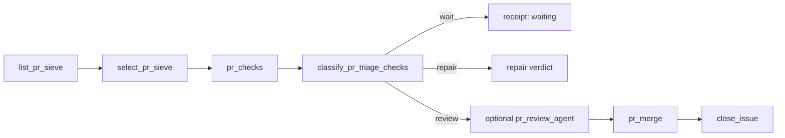

# Lokay — propozycja hybrydowych ciał grafu (Werdykt D)

Status: ciała działów wróciły do authored children. Agenci zostają liśćmi
wewnątrz childy (`coding_execution`, `pr_review_agent`, repair agent).
Parent geometry bez zmian.

## Rzut złożony: ten sam obiekt

To jest ten sam Lokay: jeden produktowy graf Fali, którego kolejność, bramki,
powroty i Definition of Done nie zależą od wykonawcy węzła. `factory_pass`
zostaje parentem pięciu działów, a `reap_stale_worktrees` pozostaje jego
niezależnym siblingiem. Węzeł ma stabilny kontrakt, a jego ciało może być
agentem działu albo authored child Fala — dwa wymienne ciała, jeden graf. Done
nie znaczy „agent odpowiedział”, „tick przeszedł” ani „plan istnieje”; Done to
jakościowy kod na `origin/main`, po merge i zamknięciu powiązanego issue.

## Stan live vs authored child

Poniższy podział wynika z aktualnego kodu, nie z założenia. Live binding parenta
jest w `src/lokay/organ/departments_boundary.py`. Authored child paths są
uruchamiane przez wrappery `src/lokay/proc/run_*_department.py` i pozostają w
`fala/lokay.fala-package.toml`.

| Dział | Ciało teraz (live) | Authored child | Werdykt D |
| --- | --- | --- | --- |
| `self_repair` | `departments_boundary` woła `run_self_repair_department.run` → `run_path("self_repair_department")`. | `self_repair_department` → `self_repair`; stall gate i detached repair są opisane w `docs/GRAPH.md`. | Authored child. Watchdog nie jest piątym kapeluszem agenta; selektor parenta już ogranicza wejście do potwierdzonego stall (`did_not_move`). |
| `issue_triage` | `departments_boundary` woła `run_issue_triage_department.run` → `run_path("issue_triage_department")`. | `issue_triage_department` → `issue_sieve_rows` / `issue_sieve_row`; hard facts, covering PR, occupancy, foreign, cap i leftover są atomami. | Authored child z semantycznym agentem dopiero po `hard_facts`; nie agent działu i nie drugi intake. |
| `executor` | `departments_boundary` woła `run_executor_department.run` → `run_path("executor_department")`. Agent kodowania jest liściem `coding_execution`, nie ciałem działu. | `executor_department` → `executor_rows` → `executor_row` → `issue_to_pr`. | Authored child; deterministyczne bramki poza agentem, executor nie merge’uje. |
| `pr_triage` | `departments_boundary` woła `run_pr_triage_department.run` → `run_path("pr_triage_department")`. Merge/close zostają atomami childa. | `pr_triage_department` → `pr_triage`; child ma `pr_checks`, klasyfikację, review/validate, `pr_merge` i `close_issue`. | Authored child: atomy zachowują bramkę merge i close; opcjonalny `pr_review_agent` zostaje wyłącznie liściem review. |
| `pr_repair` | `departments_boundary` woła `run_pr_repair_department.run` → child `pr_repair`. Agent naprawy jest liściem childa, nie ciałem działu. | `pr_repair` → test lokalny, diff i push na tej samej gałęzi, z budżetem napraw. | Zostawić agenta jako ciało naprawy; merge pozostaje osobnym atomem w `pr_triage`, nie w repair. |

Ważne rozróżnienie: „authored child na dysku” nie oznacza „martwy”. Pięć
działów woła child Fala jako ciało live. Agenci zostają liśćmi wewnątrz
tych dzieci. Agent nie może zastąpić efektora `pr_merge` ani `close_issue`
samym polem `verdict`.

## Kolejność wycinek — najpierw odzyskać merge + close

To jest kolejność zmiany ciał, nie nowa kolejność parenta. Parent nadal
prowadzi `factory_begin` → `self_repair` → `issue_triage` → `executor` →
`pr_triage` → `pr_repair` → `record_pass`; reap pozostaje siblingiem od
`factory_begin`.

### Wycinek 1: `pr_triage` jako atomowa bramka dostawy

Stan docelowy jednego wybranego PR:

`pr_checks` i `classify_pr_triage_checks` są deterministyczne. Jeśli polityka
wymaga review, `pr_review_agent` może dostarczyć opinię, ale jej wynik musi
przejść walidację związaną z aktualnym SHA. Dopiero atomowa polityka
`select_pr_triage_outcome` może dopuścić `merge`; `pr_merge` wykonuje merge,
a `close_issue` zamyka issue. `pr_repair` jest tylko wartością dla parenta,
nie ścieżką uruchamianą wewnątrz `pr_triage`.

Pointa kontrolna przed następną wycinką:

- Czy ticket skończył się potwierdzonym `merge` + `CLOSED`? Jeśli nie — STOP;
  nie dodawać kolejnego departmentu ani kolejnego sita.
- Czy merge woła atom `pr_merge`, a close atom `close_issue`, zamiast ufać
  `verdict=merge` w JSON agenta? Jeśli nie — STOP.
- Czy `require_checks=false` zachowuje znaczenie „brak/niestabilne checki nie
  są automatycznie czerwone”, bez omijania pozostałych bramek? Jeśli nie — STOP.

Źródła implementacyjne tej wycinki są już rozdzielone: authored child
`pr_triage` ma `pr_merge` i `close_issue` w `fala/lokay.fala-package.toml`,
a ich bindingi efektorów są w `src/lokay/organ/lanes.py`. Dokument nie zmienia
tych ścieżek.

### Wycinek 2: occupancy i reap po udowodnionym merge

Dopiero po wycinku 1 weryfikujemy queue hygiene na rzeczywistych stanach:

1. covering OPEN PR jest pracą `pr_triage`, nie nowym executorem;
2. żywy receipt `issue_to_pr` blokuje drugi launch tego repo;
3. martwy wrapper bez covering PR nie może udawać `busy` — powinien być
   odzyskiwalnym kandydatem do dokończenia albo reapingiem po fail-closed
   sprawdzeniu lease;
4. `reap_stale_worktrees` zachowuje żywy postęp i nie zabija żywego procesu;
   cleanup jest siblingiem i sklasyfikowanym skutkiem, nie bramką merge.

Pointa kontrolna: przy OPEN PR occupancy nie może kłamać, że executor ma wolny
slot ani że samo `outcome=none` jest dostawą. Jeśli `pr_triage` nadal nie
kończy merge + close, wracamy do STOP z wycinka 1; occupancy/reap nie jest
lekarstwem na brak efektora.

### Wycinek 3: `self_repair` jako authored child

Po potwierdzeniu dostawy i occupancy przełączamy ciało `self_repair` z
department-agent na istniejący child. Wejście pozostaje wyłącznie bramką
potwierdzonego stallu maszyny; leftover, empty survey, occupancy, idle i
pass-ceiling nie stają się powodami do self-repair. Child prowadzi incident,
detached `origin/main`, kodowanie w ograniczonym slocie oraz deterministyczne
commit/fast-forward/preflight — zgodnie z istniejącą definicją w
`docs/GRAPH.md`.

Pointa kontrolna: self-repair nie może maskować nieudanego merge ani przejąć
pracy produktu. Jeśli ticket nie osiąga merge + CLOSED, wracamy do wycinka 1,
a nie wzmacniamy watchdogiem.

## Zakres poza propozycją

- Drugi parent ani alternatywny graf obok `factory_pass`.
- GitHub Actions; weryfikacja i wykonanie pozostają lokalne.
- `ai:ready` / `work:ready` jako kolejka produktu — to opcjonalne ślady, nie
  źródło intencji.
- Ralph-loop jako tożsamość Lokaya albo nowy harness jako produkt. Harness i
  model pozostają wymiennym `executor.command` / `executor.args`.
- Przebudowa pięciu działów, unroll 1..N w Pythonie lub przenoszenie kolejności
  do promptu agenta.
- Opisywanie propozycji jako już wdrożonego grafu. Ten dokument wyznacza
  kolejność rozmowy; nie implementuje wycinków.
