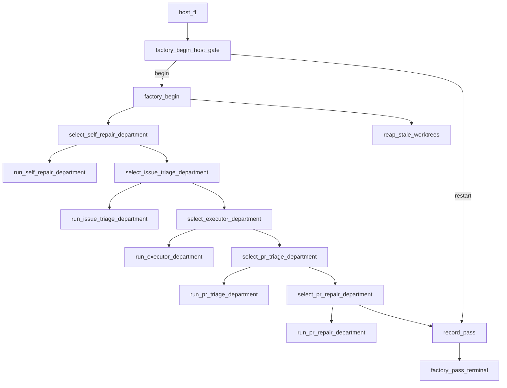

# Process graph (Fala)

**Order is the product.** Atomic `lokay-*` tools do one job each; Fala declares
which jobs run after which.

## Source of truth

[`fala/lokay.fala-package.toml`](../fala/lokay.fala-package.toml) — `src/lokay/data/lokay.fala-package.toml` is a packaged copy of `fala/` (byte-identical; CI fails if they drift).

### `daemon_cycle` (top-level parent)

```text
last_pass_moving
  → select_repair_route
    → recovery_incident (same failure in 4 of 5 distinct pass receipts; last pass still stalled)
      → recovery_run_self_repair (self_repair child Fala; skipped otherwise)
    → recovery_factory (factory route only: one factory_pass; leftover skip never starts repair)
  → summarize_daemon_cycle (repair failed / restart required, or factory result)
```

The moving gate is one leaf. Repair is its own child graph. `recovery_factory`
is one parent `factory_pass` — it does not classify, repair, activate, or
host `product_entry` / `product_pass_budget`. LaunchAgent already re-invokes
the lokay; a 180s tick must not stack eight factory slots. `product_entry`
stays the CLI multi-pass wrapper. Moving
forward is only a new PR or a merge on the last receipt. Leftover skip,
empty survey, and a stale receipt do not count as “not moving” and do not
start recovery. A repair attempt ends the cycle, including on failure; it never
starts a second repair through the five departments in that same cycle. The daemon owns only the singleton lock, health lease and initial
carrier preflight. Fala owns product/recovery order. Every node above is a
separate Unix process returning one JSON envelope. A product run that
actually publishes or merges work records no systemic stall fingerprint.
There is no parent idle-TTL node in the current package. Legacy survey
children still use `survey_ttl` cache helpers; that does not author an early
exit from the live `factory_pass`. Neither compose nor the caretaker shell
adds an idle-skip before Fala.

#### Entry layers and host binding

| Entry | Authored scope |
| --- | --- |
| `daemon_cycle` | Recovery XOR one `factory_pass`; LaunchAgent tick. |
| `factory_pass` | `host_ff` first, host gate, workspace, five departments, receipt and terminal; cleanup sibling. |
| `product_entry` / `product_pass_budget` | Explicit CLI multi-pass budget, currently eight authored slots, each composing factory work and `leftover_closeout`. Not the daemon spine. |

`scripts/lokay-service.sh` owns the OS lock, exec, logs and bounded daemon
wait (default 180s). It signals the lock-owning session, not detached
`issue_to_pr` sessions, and may record `health=pass_ceiling`. Busy lock can
skip exec; this is a lease, not product routing. It does not host-ff or
rewrite the LaunchAgent plist on each tick. Host-ff is the first
`factory_pass` atom; the following host gate chooses begin or restart.

Subprocess atoms pin `cwd` to the Lokay checkout (`PLACEHOLDER_PROJECT`). Fala's
durable host may chdir into `vendor/sqlite.fire` for dylib load; organs must not
inherit that cwd or they emit empty `adapter_failed` and starve the lokay.
A classified `ok=true` organ row with agent transport `status=failed` is a
fallback fact (`organ_envelope`), not `adapter_failed`.

**Repair gate (two small processes):** `last_pass_moving` answers only
whether the last receipt published a new PR or merged. `select_repair_route`
composes that leaf with leftover skip (`leftover_overflow`, 200>30), empty
survey, stale / missing receipt, occupied / in-flight `issue_to_pr`, and
soft lokay health (`waiting`, `repairing`, `idle`, `progress`, `offline`,
`overlap`, `hosted`). Those exclusions route `factory` and never start
`recovery_run_self_repair`. `recovery_incident` runs only when the last
receipt did not move and the existing pass-history.jsonl confirms 4-of-5
from passes newer than the latest self-repair attempt in the Fala journal;
incidents reuse the preflight cooldown ledger
(`github.incident_cooldown_hours`). Activate stays a `self_repair_*` leaf.

### `factory_pass` (parent)

**Order lives in Fala.** Fleet scheduling is not a fat Python tick. The parent
path conducts one-job atoms; child workflow Falas are started from dispatch
atoms via `run_path`.



The authored listing order is the five departments, then `record_pass`, then
`factory_pass_terminal`, then the sibling `reap_stale_worktrees`. Reap still
conducts only from `factory_begin_host_gate` and `factory_begin`; its listing
position must not turn it into a dependency of product or the terminal.

| Atom | One job |
| --- | --- |
| `host_ff` | Lokay host checkout: fetch + ff-only onto origin/main. Clean product branch returns to main. Never `reset --hard`. Fail-closed when dirty or diverged. |
| `factory_begin_host_gate` | Succeeds with `route=begin` or `route=restart`. Restart means host-ff moved HEAD under this process. Never `ok=false`: a failed gate still unblocks product children in Fala. |
| `factory_begin` | NODE child Fala of named LEAF agents: host-alive probe, catalog, pass workspace. `when` gate `route=begin`. Always writes `pass_dir` when the host probe routes `up`. No idle on these leaves. Empty surveys do not skip PRs or issues. Lease, fat preflight, harvest (`child_harvest`), and four terminals are off this path. |
| `select_self_repair_department` / `run_self_repair_department` | Department 1. Parent switch; run only on a confirmed stall (`did_not_move`). Same exclusions as `select_repair_route`: leftover skip, empty survey, occupied, idle, pass_ceiling, waiting. One pass is oil XOR product (product wins). Body is child Fala `self_repair_department`. Off never touches lokay main. |
| `select_issue_triage_department` / `run_issue_triage_department` | Department 2. Sieve only. Child Fala `issue_triage_department`: marks, split, park. One triage boundary after hard_facts — never a second intake engine. Stops at `limits.max_triage_per_tick`, publishes leftover, then yields to executor. Zero `ai/fix`. Zero `needs_human`. Foreign assignee still skipped. |
| `select_executor_department` / `run_executor_department` | Department 3. Code and PR. Child Fala `executor_department`: a do issue becomes an open PR. No merge. Off = zero new `ai/fix`. |
| `select_pr_triage_department` / `run_pr_triage_department` | Department 4. PR sieve / merge. Child Fala `pr_triage_department`: list, checks, review, feedback, merge-commit. Verdict merge / feedback / repair. Does not start `pr_repair`. |
| `select_pr_repair_department` / `run_pr_repair_department` | Department 5. Existing `pr_repair` after a repair verdict from `run_pr_triage_department`. Conducts from the sieve run plus the PR-triage switch. Not started from inside `pr_triage_department`. Disabled skip leaves published feedback and does not touch the branch. |
| `reap_stale_worktrees` | sibling child `stale_worktree_reap`: collect → catalog → summarize. Conducts from `factory_begin` only. Throw / empty / `process.failed` / `adapter_failed` is a classified `route=failed` at the parent boundary, never a path abort. The factory_pass parent stays ok. Does not conduct departments or `record_pass`. Collect composes `protection` or `bound_slots` (oldest first). Catalog composes `overflow_bound` or `apply_slot`. Summarize composes `persist_result` and `prune_preserved_worktree_archives` (TTL GC of `.lokay-preserved`). Overflow bounds one pass to authored slots; a failed removal advances that candidate behind the oldest remainder, so it never pins the four slots forever. Archive TTL GC uses the same four-slot bound. A later pass continues the remainder. Classified REMOVE reclaims disk after registry detach (not archive-only). KEEP live i2pr is issue-scoped (repo+issue), not repo-scoped; also `pr_survey_failed` / open PR / dirty unpublished. Foreign leftover localize is REMOVE (`foreign_localize`) and beats live-i2pr / unpublished-or-dirty / uncommitted-real KEEP. Never unlink Fala sqlite/WAL. Do not raise the 180s ceiling. Tests use tmp dirs only. |
| `record_pass` | write a small `last-pass.json` receipt: `outcome` is `new_pr` \| `merge` \| `none`. A detached `launched=started` worker is occupancy (`remaining.issue_to_pr_started`), not `new_pr`. Moving forward stays a published PR or a merge. Conducts from `factory_begin` and the five department selects. Leftover overflow is a skip on the receipt, never a pass failure. Cleanup success is not required. A this-tick idle/progress receipt is kept by `write_pass_ceiling_receipt`; the 180s watchdog does not erase it. |
| `factory_pass_terminal` | lift `record_pass.result` so `normalize_path_result` sees one authored tick. Does not wait on leftover work-copy cleanup. |
| lokay Fala journals | every live `state.sqlite` under `~/.lokay/fala/<path>/` is maintained through `fala.maintain_journal` at a 64 MiB ceiling; heartbeat `created` leftovers are finalized then deleted through Fala APIs first; self-repair incomplete runs are finalized (kept as evidence); both capped at eight rows per journal per tick. `daemon_entry` / `daemon_cycle` / `factory_pass` use a fresh wrapper sqlite per tick and prune old wrapper dirs; they do not reopen the shared lokay journals. Each host file contains only the requested `path_id`, not all 946 effectors. Recovery stays on `state.jsonl`. Nested children never share the tree-root sqlite or overwrite a sibling materialized package. Over-cap is fail-closed if Fala cannot maintain the file |
| lokay activity | each live lokay organ atom writes `activity.json` beside `state.jsonl` (`path`, `atom`, `work_id`, `transitions`). `daemon_entry` resets the checkpoint at the start of a tick so `transitions` do not accumulate across heartbeats. Ceiling receipts resume from that file. `status_snapshot` and `live=false` organs never write it. Status stays read-only. A missing file is `ceiling_stalled`, not a crash |
| leftover closeout (CLI product budget only) | after each factory pass in `product_pass_budget`, one in-process catalog atom parks leftover `work:ready`/`ai:ready` on GitHub-CLOSED lokay issues. No 30-slot unroll. Lokay repo count never fail-closes prepare. Candidate overflow parks the first authored handful and leftover-skips the rest; it does not fail the pass. Do not paginate every lokay PR to prove a closer. After an empty leftover, skip those GitHub lists for 300s. Fresh leftover skip does not require healthy. Fresh leftover-closeout skip is not applied. Leftover-closeout skip reports planned=not live. Leftover-closeout skip reports probe_failed. Hosted leftover parks still do. Unhealthy leftover-closeout still lists GitHub. Unhealthy leftover-closeout parks are planned. Hosted leftover-closeout reports applied. Empty leftover-closeout host is not applied. Leftover-closeout rate limit does not stamp empty. Pytest must not skip leftover GitHub lists using the lokay stamp. |

**Trust intentional issues:** fleet flow assumes issues from the repo owner /
configured assignee are purposeful. Do not invent new human-approval gates in
the pass spine. Intake `CLOSE` remains a sito verdict for clear obsolete /
wrong-shape / superseded cases only — it marks (`ai:blocked`), it does not
close GitHub. Never bias toward “distrust every ticket.” Goal:
human writes issue → lokay delivers.

### `factory_begin` (child)

```text
probe_factory_host
  → load_factory_config
    → select_factory_scope
      → read_factory_stuck
        → create_factory_pass_dir
          → build_factory_begin_state
            → build_factory_working_state
              → seed_factory_occupancy
                → attach_factory_stuck
                  → persist_factory_begin_state
                    → persist_factory_working_state
                      → persist_factory_tick
```

NODE agent owns this graph. Each effector is a named LEAF agent (one
Unix process). `harvest_factory_children` already invokes child Fala
`child_harvest` — it is not a leaf on this path, so harvest skip cannot
eat the factory. No leaf has `when`. Empty surveys are not idle.

The lokay invokes this parent path (`compose_factory_pass` → `run_path`).
`lokay-factory-tick` is the same parent Fala path — not a second in-process
lokay. Parent journal: `~/.lokay/fala/factory/state.sqlite`. Issue-to-PR and
`coding_execution` children use per-issue journals under `i2pr/`,
`i2pr-delivery/`, and `coding-execution/`. `test_local_execution` is the same
class of nested child: per-issue under `test-local-execution/`. A shared
`local/test` journal lets one live pytest hold `no_declared_test` skip for
another repo, so PR triage never reaches `pr_merge`. Cache always runs and
returns `route=terminal|hit|miss`. A Fala `when` on a skipped cache atom fails
`run_declared_tests` (`condition_source_not_succeeded`), so inspect
`no_declared_test` is a succeeded cache `route=terminal` and pytest skips
because the route is not `miss`. `pr_triage` and `pr_repair` are nested PR
children under `pr-triage/` and `pr-repair/`. A shared `pr_triage` journal
lets one live review hold `pr_merge` for another repo. Every other child path uses its own journal under
`~/.lokay/fala/<path_id>/`. Native Fala materializes only the requested
`path_id` next to that journal. Nested children must not overwrite
`~/.lokay/fala/lokay.fala-package.toml` or share
`~/.lokay/fala/state.sqlite`. `factory_pass` uses a fresh wrapper sqlite
per tick, same as `daemon_entry` / `daemon_cycle`.
Python `compose/*` may validate CLI contracts and
call `graph_run.run_path`; it must not re-implement fleet scheduling. Do not
grow `compose/*` with GitHub/git/agent logic beyond wiring. Hermes Kanban is not
the ledger for step order.


### PR closeout ownership

The retired `closeout_prs` catalog path is removed. Live `pr_triage_department`
and `pr_repair_department` own fleet PR decisions and repairs. The single-PR
`closeout_pr` child remains for existing-PR delivery and the explicit CLI. Parent `issue_to_pr` closeout of an existing open/merged ai/fix PR is path success (`delivered`, reason `delivery_pr_exists`), never `condition_not_met`.
`product_entry` / `product_pass_budget` are CLI multi-pass wrappers, not the
heartbeat. `leftover_catalog` only parks CLOSED-ready labels.
### `pr_triage_department` (PR sieve)

Two small blocks plus graph. List, checks, review, feedback, merge-commit.
Does not write product code. Does not call `pr_repair` from inside.

```text
list_pr_sieve
  → select_pr_sieve
    → run_pr_sieve                   when route=pr → child Fala pr_triage
      → select_pr_triage_verdict     merge / feedback / repair
        → summarize_pr_triage_department
```

A repair verdict is a value. The parent `pr_repair` department consumes it.

### `self_repair_department` (factory body)

Two small blocks. Parent `run_self_repair_department` invokes this child only
when the last receipt did not publish a new PR or merge. Leftover skip never
enters.

```text
open_self_repair_incident     LEAF  stall incident (did_not_move)
  → invoke_self_repair        LEAF  existing self_repair child; skipped without incident
```

Off: parent select routes skip and the lokay goes straight to issue triage /
executor / PR triage. This graph never starts from leftover overflow.

### `self_repair` (emergency only)

```text
self_repair_prepare          child Fala: detached exact origin/main
  → self_repair_run_agent    leaf: coding slot in that worktree
    → self_repair_commit     leaf: commit_all
      → self_repair_validate child Fala: identity + suite + untracked catalog + diff (no 30-slot unroll)
        → self_repair_push_main   leaf: fast-forward only, exact unchanged base
          → self_repair_activate  child Fala: exact commit
            → self_repair_preflight  leaf: fresh process
              → self_repair_close    leaf: close the incident
```

Each `self_repair_*` step is its own leaf or child Fala. The moving-forward
gate (`last_pass_moving`) is a leaf outside this graph. Activate is not
inside `recovery_factory`. This path does not classify last-pass progress and
does not run the factory.

Entered only from:

1. **Daemon preflight lane** — Lokay unhealthy, minimal carrier healthy (not
   overlap / not carrier-down); or
2. **`daemon_cycle` last-pass gate** — `last_pass_moving` is one leaf (new
   PR or merge). `select_repair_route` composes leftover skip, empty
   survey, and a stale receipt so they never enter. After the child
   finishes, `recovery_factory` always hosts one `factory_pass`.
   Repair never loops as the lokay. Activate is `self_repair_activate`.

It never creates a branch or PR. The coding agent can edit only the detached
worktree; deterministic atoms alone commit and push directly to `main`. The
`self_repair_run_agent` coding slot uses the same bounded 1800-second budget as
other agent paths. A successful path always returns `restart_required`; product
work never resumes in the stale daemon process. Fail-closed validate soft-skips
push/activate/preflight/close and still reaches `summarize_self_repair` as
terminal failed (incident left open); incomplete self-repair journal runs are
finalized as timeout evidence and kept.

### `issue_triage_department` (sieve + split + park)

Two small blocks plus graph. Zero code. Zero PR. Parent
`run_issue_triage_department` invokes this child. Foreign assignees stay
skipped at `select_next_issue`.

```text
list_open_issues
  → run_issue_sieve_rows      child Fala issue_sieve_rows
    → summarize_issue_triage_department   launched is always empty
```

`issue_sieve_rows`:

```text
prepare_issue_sieve
  → select_issue_sieve_slot_N   run / empty
    → run_issue_sieve_row_N     when route=run  (child issue_sieve_row)
      → classify_issue_sieve_row_N   continue / idle / cap
        → select_issue_sieve_result
```

Python does not loop. Fala owns the authored slots, budget, and resume
cursor. Ceiling/restart continues from `pass_dir` without rescanning
finished rows.

`issue_sieve_row`:

```text
select_next_issue             route=ready when the row already has ai:ready
                              or work:ready — skips issue triage
  → issues_run_triage         when route=issue
    → select_issue_sieve      do / skip / park / split
                              (published triage verdict is final — no second
                              intake_check / run_issue_sieve_intake)
                              route=ready is do / already_ready without a
                              triage envelope
      → run_issue_sieve_split   when route=split   (children only)
        → summarize_issue_sieve_row
```

Already dual-label ready is `route=ready` from `select_next_issue`.
`issues_run_triage` stays `when route=issue` only. Skipped issue triage still
conducts: `select_issue_sieve` waits on `select_next_issue` and treats a
skipped `issues_run_triage` as done (same skipped-upstream pattern as an
empty pick). A "do" mark is not a branch. Executor is the next department.
The catalog loop is the authored `issue_sieve_rows` child, not a daemon tick
and not a Python `while`. Leftover is consumed only on an authored skip
(`park`, `blocked`, already-closed). `triage_not_done` / adapter
fail keep the row. `leftover=0` only when the takeable list is exhausted.
Sieve already-ready consumes the current row so the next slot can sito an
unlabeled leftover. Executor `select_issue_do_row` keeps a ready leftover
(`consume=False`) so the same ticket becomes do without issue triage.

### `executor_department` (code and PR)

Two small blocks plus graph. Not issue sieve. Not PR sieve. Not merge.
Parent `run_executor_department` invokes this child whenever the switch is on.

```text
list_open_issues
  → run_executor_rows         child Fala executor_rows
    → summarize_executor_department   merged is always false
```

`executor_rows`:

```text
prepare_executor_rows
  → select_executor_slot_N    run / empty
    → run_executor_row_N      when route=run  (child executor_row)
      → classify_executor_row_N   continue / idle / cap
        → select_executor_result
```

Python does not loop. Fala owns the authored slots, serial launch budget,
and resume cursor. Default `max_issue_to_pr_per_pass` is 1. Skip does not
spend the budget. Ceiling/restart continues from `pass_dir`.

`executor_row`:

```text
select_next_issue
  → select_issue_do_row       ready leftover becomes do (no triage)
    → select_issue_executor   department switch
      → issues_launch_pr      when route=do → child Fala issue_to_pr
        → summarize_executor_row
```

`select_next_issue` only answers whether a takeable row remains. Empty
assignees, or only the configured lokay, may be taken. Anyone else on the
assignee list is foreign and is skipped. `assign_issue` does not add the
lokay beside them. A live `issue_to_pr` receipt occupies its repo: that repo
is not takeable. Leftover walks past it, same as a foreign assignee. A
failed launch because the receipt is still live consumes that repo from
leftover so the nest cannot spin the same ticket until the 180s pass
ceiling. Off: the launch when is never satisfied. Zero new `ai/fix`.
The parent still runs PR triage after executor; occupancy is queue
hygiene, not a scheduler and not a reason to skip merge.

### `issue_to_pr`

Detached launch uses a durable `starting` receipt before `Popen`, then a
private activation pipe: the child cannot enter this graph until its matching
PID receipt is atomically published. If the launcher dies in that interval,
EOF makes the gated child exit before any worktree action; a later pass may
recover only that pipe-gated reservation after confirming the launcher is dead.
Malformed and pre-barrier reservations remain unknown/live and preserve the
fail-closed occupancy/reap boundary. PID command inspection uses wide `ps` so
macOS truncation cannot turn a live child into a stale worktree candidate.

```text
get_issue
  ├─→ assign_issue
  ├─→ stage_implementing   ← no-op on labels: keep ai:ready, strip leftover cache
  └─→ make_branch
        └─→ worktree_add          ready → plan / localize / coding
                                  missing → summarize (no product). Never ok=false:
                                  a failed worktree still unblocks localize in Fala.
              └─→ plan_issue   ← when worktree route=ready; grandchild Fala plan_issue_execution
                    └─→ localize     ← when worktree route=ready; grandchild Fala localize_execution.
                                       Never ok=false: empty/timeout is route=empty.
                          └─→ coding_execution  ← when localize route=ready; child Fala: run_agent + one JSON retry + one evidence round
                                └─→ commit_all
                                      └─→ rebase_onto_base  ← fetch + rebase onto origin/main; conflict = fail closed
                                            └─→ test_local_execution   ← grandchild Fala; skip if no suite
                                            ├─ (red, recorded) → local_repair_execution   ← child Fala: K=1 patch + recheck
                                            ├─ (select_local_test skip) → miss repair; delivery still writes a route
                                            └─→ assert_real_diff ← refuse plan/localize-only diffs
                                                  └─→ push            ← only after green / honest skip
                                                        └─→ pr_create   ← grandchild Fala; only after successful push
                                                              └─→ stage_pr_open   ← no-op on labels: keep ai:ready
                                                                    └─→ list_prs
                                                                          └─→ pr_label
```

Delivery is not a god path. Grandchildren that already have their own Fala
(`plan_issue`, `localize`, `test_local_execution`, `pr_create`) stay separate
nodes. The two extracted nests are `coding_execution` and
`local_repair_execution`.

`plan_issue` (`lokay-plan-issue`) writes `.lokay/approach.md` in the worktree
**before** `run_agent`: goal, files likely touched, test plan, non-goals.
Mostly deterministic extraction from the issue body (+ path hints). Optional
`--llm` assist is skippable and fail-closed when requested without a configured
slot. This is **evidence for intentional issues**, not a human approval gate and
not `NEEDS_HUMAN` by default. `pr_review` is blind to that plan: the reviewer
sees ticket + code diff + tests, not `.lokay/approach.md` and not a
compare-to-plan instruction.

`localize` (`lokay-localize`) remains one job: a non-empty edit path list
written to `.lokay/localize.json` before `run_agent`. If that file already
has paths **for this issue** and every path exists in the worktree, skip the
localize executor and start `run_agent`. A leftover inherited from main
(other issue in `worktree`, missing issue id) is not a sieve. A same-issue
path list with a missing file or non-path token is also not a sieve —
discard and run **deterministic** localize (structure/grep + plan seed).
Happy path before coding is `plan_issue` (deterministic) + `localize`
(deterministic) — fewer than two LLM calls (#1032). Empty after validation
fails closed. Not an embedding service and not a second planner.

### `issue_triage` (triage child of `issue_triage_department`)

Child of `issue_triage_department`. Triage only: **robić / nie / oznaczyć / człowiek**.
Not implement. Triage must not close someone else's issue. Verdict `close`
parks (`apply_issue_mark`: `ai:blocked` + comment). `issue_split` is a later
child Fala, not an exit here.

```text
get_issue
  → resolve_issue_candidate
    → collect linked/covering PRs
      → resolve_issue_hard_facts
        ├─→ terminal triage (close / skip / blocked)
        └─→ issue_triage_agent → validate → one retry → one evidence round
              → finalize
                ├─→ apply_issue_ready     robić
                ├─→ apply_issue_skip      nie
                ├─→ apply_issue_blocked   nie (preflight incident leaf)
                ├─→ apply_issue_mark      zamknąć → park (no close_issue)
                └─→ apply_issue_manual    park (factory; zero human)
```

Hard facts stay deterministic (still-open, superseded/merged PR, duplicate AI PR).
Semantic remainder is one structured executor call; invalid JSON gets one retry;
a second evidence request parks fail-closed. A close verdict marks; it does not close
GitHub. Own-work closeout after merge stays in `pr_triage` (`close_issue`).
Oversized / multi-epic parks with `issue_split` reason; sieve auto-splits.
Zero `needs_human`. The executor department launches `issue_to_pr` only after a do mark.

### `pr_repair` (red checks on open ai/fix PR)

```text
pr_checks
  └─→ stage_repairing   ← no-op on labels: keep ai:ready
        └─→ worktree_add          ready → localize / run_agent
                                  missing → summarize (no product)
              └─→ localize    ← when worktree route=ready; paths from checks/review seed + tree. Never ok=false.
                    └─→ run_agent   ← when localize route=ready; repair prompt (only non-deterministic node)
                          └─→ commit_all
                                └─→ test_local   ← local pytest; skip if no suite
                                      └─→ assert_real_diff
                                            └─→ push   ← published tip; never rebase (force-push forbidden)
```

### `pr_triage` (sieve / merge policy → close issue)

```text
pr_checks
  └─→ classify_pr_triage_checks   ← wait | repair | review
        ├─ wait     → summarize (pending / offline; do not fail the pass)
        ├─ repair   → summarize repair verdict (red CI; no executor)
        └─ review   → collect evidence → publish verdict
              ├─ request_changes → summarize repair verdict
              ├─ secrets-human   → terminal
              └─ approve → worktree_add → test_local (record_red)
                    └─→ select_pr_triage_outcome
                          ├─ merge  → pr_merge → stage_clear → close_issue
                          └─ repair → summarize repair verdict (local suite red)
```

The parent `factory_pass` consumes that verdict and may invoke the
`pr_repair` department. With repair disabled, feedback remains published and no code
or branch mutation occurs. `pr_review` is fail-closed: invalid JSON,
`request_changes`, `needs_human`, or `secrets=true` never auto-merges.
Trusted auto-merge (`lokay.merge_policy`): with `merge.enabled` / `LOKAY_MERGE_ENABLED`,
approve + green checks + local tests → `pr_merge` + `close_issue` in one path; pending
**or transient GitHub 429/5xx while reading checks** → non-green waiting; confirmed
red CI or a recorded-red local suite → repair verdict for the parent; the parent may invoke the separate `pr_repair` NODE child;
secrets / `needs_human` / escalated `ai:needs-review` never merge.
A later `pr_triage` pass re-reviews the new SHA.
Soft documentation nits must not route to `ai:needs-review`.
`pr_review` does not load `.lokay/approach.md` or ask the reviewer to compare
the diff to the builder plan. The plan stays builder evidence only.
Config: `merge.require_llm_review` (default true), `merge.require_checks` (default false).
Env: `LOKAY_REQUIRE_LLM_REVIEW`, `LOKAY_REQUIRE_CHECKS`, `LOKAY_MERGE_ENABLED`.

The retired `resolve_conflicts` fleet path is removed; PR decisions belong
to the live triage and repair departments, not a second catalog pass.

- **conduction** edges = dependencies (Fala will not ready a node until upstream succeeded).
- **push** / **pr_merge** / **pr_create** also fail closed in the organ unless `test_local` conduction is ok (skip / `no_python_test_suite` counts). `pr_create` additionally requires a successful `push`. `push` / `pr_create` also require `assert_real_diff`: a diff that is only `.lokay/approach.md` / `.lokay/localize.json` is not progress and never opens a PR.
- **issue_to_pr red suite** does **not by itself** open a PR. The delivery
  parent records the first `test_local_execution` probe red, then invokes
  child Fala `local_repair_execution`: `repair_agent` (K=1 patch from the
  test log) → `test_local_recheck`. The recheck first runs the declared suite;
  if it is still red and the branch changes Python under `src/`, it may fall
  back to changed ticket tests plus conventional
  `tests/test_<changed-module>.py` tests. That changed scope must be green; an
  unknown or red ticket scope still fails closed. A green full or
  changed-scope recheck → push → pr_create. Recheck red / zero-diff / agent
  fail → path fails closed (`local_repair_exhausted`); the lokay marks that
  seed stuck and takes the next one. There is no third repair attempt.
- **run_agent** is the only non-deterministic coding slot — external harness via `executor.command`/`args` (no vendor hardcode). See [`NO_STUBS.md`](NO_STUBS.md). For a seed classified separately as unbounded collection work, this slot receives a collector boundary: make only the bounded bootstrap patch; the deployed collector starts durably in the background after merge. Pi and the lokay do not populate collection data or wait for completion.
- **plan_issue** is deterministic evidence before that coding slot.
- **localize** proposes paths immediately before the coding slot (serial path:
  `worktree_add` `route=ready` → `plan_issue` → `localize` → `coding_execution`). Deterministic
  happy path (#1032); no localization LLM before `run_agent`. Existing
  `.lokay/localize.json` paths skip the localize executor only when they
  belong to this issue number. Live mode may call the
  configured executor once for a JSON path list; Python validates and still
  refuses an empty path list. Localize never `ok=false` (Fala unblocks
  children of failed). `route=ready` continues to coding; `route=empty`
  (timeout, invalid JSON, no paths) skips coding. Parent localize budget
  covers the child agents. Empty localize is not invalid-JSON retry.
  `plan_issue.files_likely` is passed as `--extra-path`. Weak token hits do not
  pad the list to 40; a long list is a hint in the prompt, not a cage.
  A tests-only inferred list is a cage: matching `test_foo.py` promotes
  `foo.py`, and a still-empty product set opens first-party imports from
  those tests so the agent can edit product code.
  A skill / markdown hit is not product — `skills/influenzer-shorts` must
  not skip the import walk that opens `playbook.py`.
  Snake identifiers from the seed (`has_fair_hook`) are body needles in
  the whole file, not the first 8KiB.
  Standalone `X` is a platform stem (twitter/tweet), not a dropped
  one-letter token — otherwise #27 cages the agent in HN/brief.
- **run_agent timeout** (executor budget 1800s) is incomplete, not a graph hard-fail.
  The leftover tree is kept; `repair_agent` resumes the same corner / session
  once (K=1). Do not raise 1800 on the first shot.
  Re-view the issue first: if a sibling already closed it, skip with
  `reason=issue_closed` — do not continue or open a second PR.
  Harvest does not bury that reason (the ticket is already done) and
  clears a stale `no_pr` stuck row. `clear_issue` marks `cleared` so
  `save_stuck` cannot restore a delivered corpse. GitHub CLOSED on the
  lokay repo (`factory_scope`) also drops leftover stuck rows after compact
  dropped the journal event. Harvest then drops stuck rows outside the
  lokay catalog, including top-level Temida keys, so a mini lokay cannot
  keep Temida/test corpses.
  `cycle_end` unlinks the start receipt after measuring. Harvest also
  drops leftover start-only cycle files outside lokay catalog or GitHub-CLOSED.
- **Published-tip retry** (`origin/<branch>` exists — including a closed
  CONFLICTING tip that matches HEAD) resets the corner from `origin/<base>`
  and deletes the stale remote tip. KEEP only unpublished ahead that already
  contains `origin/<base>`, or a dirty leftover. Unpublished-but-behind-main
  (rebase_conflict leftover) also RESET — replaying those commits loops.
  Never force-push.
- **Miss harvest** (`factory_begin` → `harvest_fail_closed_children`): `plan_only`
  / `zero_diff` / `rebase_conflict` leave the slot after **3** unique `run_id`s;
  `push_failed` after **2**. A stale ledger row already `blocked` below that
  threshold is reconciled from the journal — harvest reopens the slot until
  unique-run N. At/above its reason's bound the miss row is terminal and is
  preserved verbatim: an old dead receipt cannot refresh its timestamp/error or
  re-enable it. Crash reasons (`local_repair_exhausted`, red recheck, bad ref)
  still block at 1 and stay buried. Harvest, dispatch, and reap do not CLOSE the issue. The repo
  mutex must not stay on one corpse.
- Everything else is deterministic (`gh` / `git` / pure functions).

## Run

```bash
# inspect graph
uv run lokay path --describe
# or: uv run lokay-run-path --describe

# execute (Fala host + organ → atoms)
uv run lokay-run-path --config config.yaml --path issue_to_pr \
  --repo mikolaj92/lokay --issue 1
# live mutations:
uv run lokay-run-path --config config.yaml --path issue_to_pr \
  --repo mikolaj92/lokay --issue 1 --live
```

Journal: `~/.lokay/fala/<path_id>/state.sqlite` (issue children under `i2pr/`, `i2pr-delivery/`, `issue-split/`, `coding-execution/`, `test-local-execution/`; PR children under `pr-triage/`, `pr-repair/`)  
Materialized package: `~/.lokay/fala/<path_id>/lokay.fala-package.toml`  
(`uv run --project <checkout>` filled in for every organ — never bare `python3`)
One `run_path` never rewrites the shared `~/.lokay/fala/lokay.fala-package.toml`.

## Bridge

| Piece | Role |
| --- | --- |
| `fala/lokay.fala-package.toml` | graph |
| `lokay.fala_organ` | one Fala subprocess organ → one atom |
| `lokay.graph_run` | `host_run_package` wrapper |
| `lokay-*` procs | Unix atoms |

Do not put graph order in the coding harness. Do not reintroduce Hermes Kanban as the ledger for step order.

**Runtime note:** Fala is the only workflow composer. Python composers validate the public command contract, invoke
`lokay.graph_run.run_path`, and normalize Fala's terminal per-effector outputs.
`compose_run` is the CLI multi-pass wrapper (`product_entry` then
`product_pass_budget`). The 180s LaunchAgent heartbeat does not use it:
`recovery_factory` hosts one parent `factory_pass`. Atomic `lokay-*`
processes remain the execution boundary, but there is no runtime Python
fallback graph or engine-selection flag.
