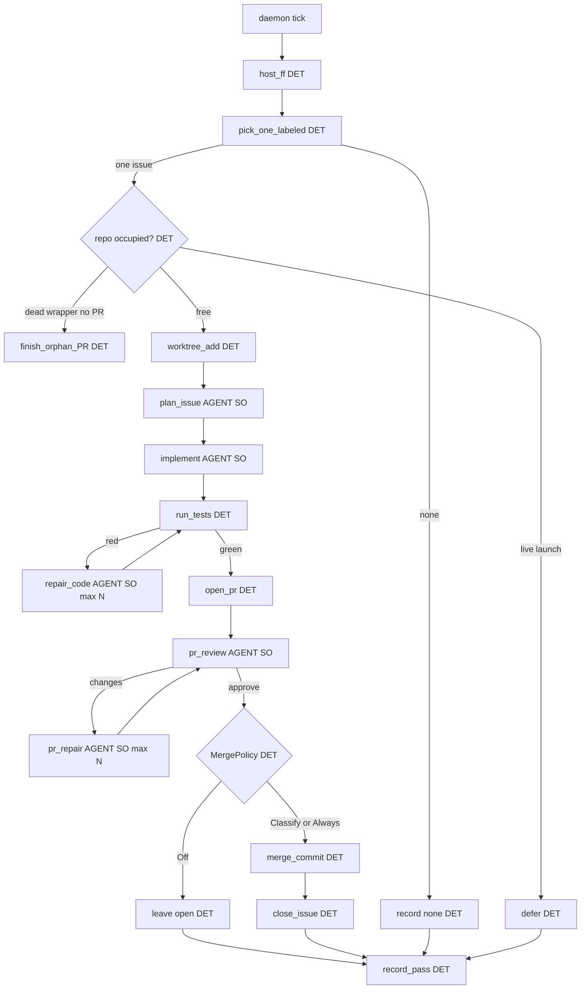

# Working klepacz graph — design (2026-09-10)

Status: **design kanon** pod działający mill. Nie L5. Nie „cały bank”.
Cel: issue (z etykietą) → worktree → diff → test → PR → merge policy.
Graf = kod. LLM tylko w liściach ze **structured output**.

Powiązane: [KLEPACZ.md](./KLEPACZ.md), [instances/SPINE_INDEX.md](./instances/SPINE_INDEX.md),
`docs/WORKING_FACTORIES.md`, `docs/GRAPH.md` (stan obecny — za gruby).

## Diagnosis: czemu obecny graf nie dowozi

Obecny `factory_pass` ma pięć departmentów + recovery + harvest + stuck + leftover +
pass_ceiling + wiele `select_*` — topologia OK w intencji, ale entropia weszła w
orkiestrację (survey/ready/stuck/limbo). Działające mille z KB robią odwrotnie:
**krótki stały łańcuch**, agent nie routuje.

## Pewniaczki do zapożyczenia (źródła w `instances/`)

| # | Pewniaczek | Skąd | W Lokayu |
|---|------------|------|----------|
| 1 | **Label = start** (nie chat) | ready-for-agent, jp-label-auto-fix, Claude Action | Intake: tylko `ready-for-agent` / `ai:ready` (operator). Zero „weź z czatu”. |
| 2 | **Jeden ticket / jeden worktree / K=1** | Copilot cloud, WORKING_FACTORIES | Executor nigdy nie sieje katalogu w środku. |
| 3 | **Coder ≠ merge** | wszędzie poza naszym wyjątkiem | Executor kończy na otwartym PR. Merge = osobny węzeł policy. |
| 4 | **Merge Policy Off / Classify / Always** | ready-for-agent | Zamiast limbo labels. Start: Off albo Classify. |
| 5 | **Fixed stage FSM (labels lub Fala)** | gp-foundry, chippingway, dmitriy label-SM, jnurre sandbox-pal | `factory_pass` = 6–8 atomów, nie 40. |
| 6 | **Reviewer bez write** | godark, Guild | Osobny liść `pr_review` structured: verdict + reasons. |
| 7 | **Bounded repair escape** | gp-foundry fixer max_attempts | `pr_repair` max N; potem skip bez stempla limbo. |
| 8 | **Lokalny test gate przed PR** | Agentless validate, codoop verify | Deterministyczna komenda z ticketu / repo. Fail → retry liść, nie merge. |
| 9 | **Self-repair tylko stall maszyny** | WORKING_FACTORIES | Nie leftover, nie ready=0, nie pass_ceiling. |
| 10 | **Structured output wszędzie LLM** | prawo CEO / PlanCompiler | Każdy agent-liść: JSON schema, fail = ok:false + enum reason. |

## Docelowy graf (cieńszy)



DET = deterministyczny skrypt/atom. AGENT SO = LLM + structured output only.

## Kontrakty structured output (liście)

### plan_issue

```json
{ "ok": true, "goal": "...", "files": ["..."], "test_command": "...", "non_goals": ["..."], "stop_if": ["auth","migration"] }
```

albo `{ "ok": false, "reason": "underspecified"|"too_large"|"dangerous" }` → skip bez limbo.

### implement / repair_code / pr_repair

```json
{ "ok": true, "summary": "...", "files_touched": ["..."], "tests_run": true }
```

albo `{ "ok": false, "reason": "cant_comply"|"needs_split"|"blocked_path" }`.

### pr_review

```json
{ "verdict": "approve"|"changes"|"reject", "reasons": ["..."], "risk": "low"|"high" }
```

`reject` / `high` → nigdy Always-merge.

## Co wycinamy z obecnego grafu

Wyłączamy z `factory_pass` (nie kasujemy historii):

- Drugie sito / dual survey w executorze
- Trwałe park labels — już prawo
- `stuck.json` jako permanent / rolling limbo — tylko krótki cooldown lub zero
- Recovery na leftover / ready=0 / pass_ceiling
- Fat `product_entry` 8-slot w daemon tick — daemon = jeden `pick` → … → `receipt`
- Department agent slots będące orkiestratorami tool-calling — zamiana na SO leaf

## Mapowanie 5 działów → cienki graf

| Dział dziś | W cienkim grafie |
|------------|------------------|
| issue_triage | `pick_one_labeled` (+ opcjonalnie SO tylko gdy hard_facts nie wystarczą) |
| executor | `worktree` + `plan` + `implement` + `test` + `open_pr` |
| pr_triage | `pr_review` SO + `merge_policy` DET |
| pr_repair | `pr_repair` SO bounded |
| self_repair | osobny XOR przy 4/5 stall **maszyny**, nie produktu |

## Kryterium „działa”

Jak prawo CEO: zmergowane `ai/fix` w 1h / 8h / 24h na tipie hosta.
Nie: zielony JSON `outcome=none`. Nie: ładny Fala bez PR.

## Plan wdrożenia (issue slices)

1. Docs+canon — ten plik na main.
2. `pick_one_labeled` — DET lista tylko labeled; K=1 occupancy.
3. Executor spine — worktree → plan SO → implement SO → test DET → open_pr DET; zero merge.
4. `pr_review` SO + merge policy — Off default.
5. Bounded `pr_repair` — max N, escape skip.
6. Disable fat paths — daemon nie woła 8× product_entry; self_repair tylko stall.
