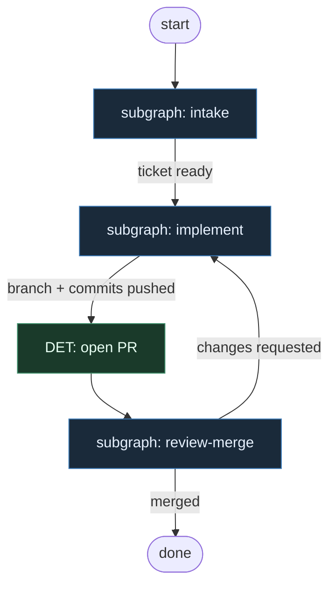

# 01 — Pragmatic Thin

**Persona:** pragmatic minimalist — thinnest path that still ships ticket → PR → review → merge.

**Approach:** from scratch. Independent graph + themed subgraphs (not one monolith).

## Design notes

- **Ship the chain, nothing else.** Ticket intake → branch → implement → commit/push → PR → critical review → merge. No ceremony layers.
- **DET owns the boring middle.** Enter PM, pick next job, process ticket metadata, create branch, commit, push, open PR — scripts, not agents.
- **Entropy only where it pays.** Implement (coding agent) and critical PR review (separate role) are AGENT; optional light plan/breakdown stays optional and thin.
- **Meat ≡ AI in the chain.** Same nodes, same handoffs; a human or an agent can sit in an AGENT seat without reshaping the graph.
- **QA strategy stays.** Uncomfortable questions (scope creep, missing acceptance, regression risk) live in review — they are not optional fluff.
- **NOT L5.** No full autonomy theatre; humans keep architecture and hard decisions; the graph frees them from exhausting intermediate steps.
- **Subgraphs by theme, not by step count.** Intake, implement, review-merge — each holds many small DET actions so the top-level stays readable.
- **One ticket, one PR.** No batching, no mega-branches; thinnest mergeable unit.
- **Fail fast on DET.** Script failures stop the chain; no agent “recovery” that hides broken plumbing.
- **Review is a separate role.** Implementer does not rubber-stamp their own PR; critical review is a distinct AGENT (or human) node.
- **Merge is DET after green review.** Labels/checks → merge script; humans only intervene on conflict or policy block.
- **No product Temida coupling.** Generic PM/ticket/VCS abstractions only.

## Top-level flowchart

**DET vs AGENT at a glance**

| Layer | Mode | Responsibility |
|-------|------|----------------|
| Intake (mostly) | DET | PM enter, next job, ticket normalize, branch name |
| Implement core | AGENT | Code changes that need judgment |
| Git plumbing | DET | commit(s), push |
| Open PR | DET | template + create |
| Critical review | AGENT | Uncomfortable QA + approve/request changes |
| Merge | DET | checks + merge |

## Index of subgraphs

| File | Theme | Role in chain |
|------|--------|----------------|
| [subgraph-intake.md](./subgraph-intake.md) | PM → ticket → branch | DET-heavy front door |
| [subgraph-implement.md](./subgraph-implement.md) | plan? → code → commit → push | AGENT implement + DET git |
| [subgraph-review-merge.md](./subgraph-review-merge.md) | critical review → merge | AGENT review + DET merge |

