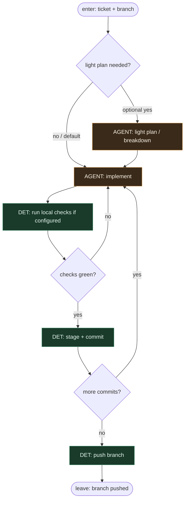

# Subgraph: implement

**Theme:** optional light plan → implement → commit(s) → push.  
**Mode mix:** AGENT for code; DET for git plumbing.

## Flow

## Notes

- **Default path skips plan.** Light plan/breakdown is optional AGENT; pragmatic thin prefers going straight to implement when the ticket is clear.
- **Implement is the entropy sink.** Only this node (and optional plan) may rewrite product code.
- **Commits stay DET.** Message from ticket ID + summary; no agent inventing release-note novels unless required by repo hooks.
- **Small loop, not a second product.** Checks → fix → commit is local; no nested “full SDLC” inside implement.
- **Meat or AI.** Same AGENT seat — human pair-programming or coding agent; graph does not care.
- **Handoff contract.** Output = `{branch, commit_shas, summary}` for DET open-PR at top level.

