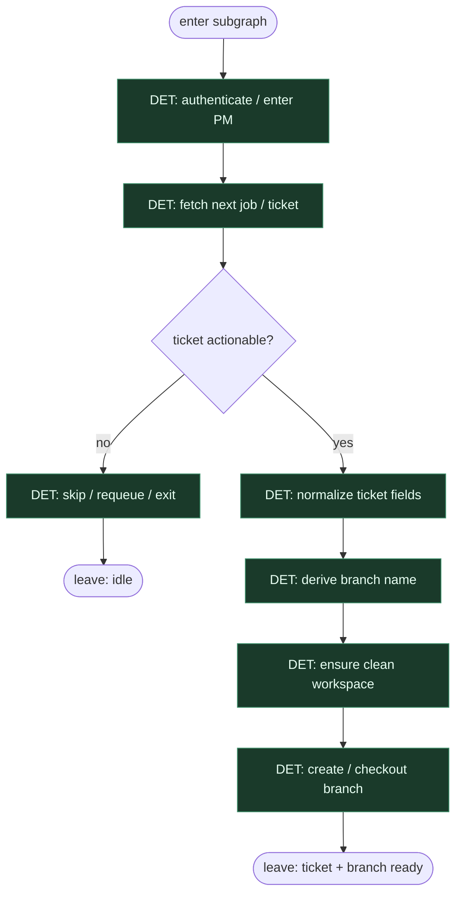

# Subgraph: intake

**Theme:** enter PM → next job → process ticket → ready branch context.  
**Mode mix:** almost all DET; no coding agent here.

## Flow

## Notes

- **Thinnest front door.** No triage agent, no epic decomposition — one actionable ticket or exit.
- **Normalize once.** Title, ID, acceptance hints, links become a stable payload for implement.
- **Branch naming is script.** Deterministic from ticket ID + slug; humans/agents do not invent names ad hoc.
- **Fail closed.** If PM auth or next-job fails, stop — do not invent work.
- **Handoff contract.** Output = `{ticket, branch, base_ref}` for implement subgraph.

