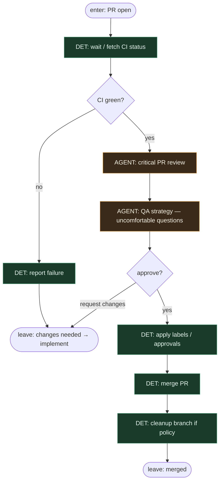

# Subgraph: review-merge

**Theme:** critical PR review (separate role) → QA strategy questions → merge.  
**Mode mix:** AGENT review; DET checks and merge.

## Flow

## Notes

- **Separate role from implementer.** Critical review is never the same seat that wrote the diff (meat or AI).
- **QA strategy stays.** Uncomfortable questions are first-class: missing tests, unclear acceptance, silent scope creep, rollback story.
- **CI is DET gate.** No AGENT override of red builds in the thin path.
- **Merge is script.** After approve + green checks → merge; humans only on conflict/policy.
- **Changes-requested loops to implement** at top level — this subgraph does not re-implement in place.
- **Handoff contract.** Output = `{merged: true, pr, merge_sha}` or `{merged: false, feedback}` for re-implement.

