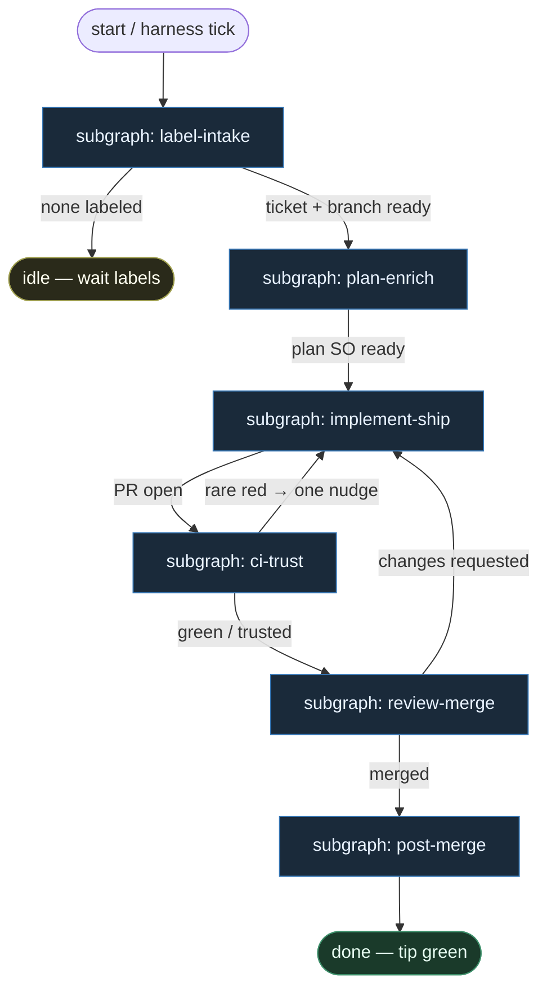

# 02 — Optimistic Full

**Persona:** optimistic — assume labels, CI, and humans cooperate; richer but modular subgraphs.

**Approach:** from_scratch. Osobny graf + tematyczne podgrafy (nie monolit). Polish OK.

## Design notes

- **Załóż współpracę.** Label `ready-for-agent` jest i zostaje; CI zwykle zielone; reviewer odpowiada w sensownym oknie. Optymista nie buduje limbo ani fail-closed theatre na każdym kroku.
- **Richer, still modular.** Pełniejszy łańcuch niż pragmatic-thin: label-intake → plan-enrich → implement-ship → ci-trust → review-merge → post-merge. Każdy temat = osobny podgraf z małymi DET atomami.
- **DET majority.** Pick, normalize, branch, commit, push, open PR, wait CI, flip labels, merge, cleanup — skrypty. Entropia tylko w liściach AGENT (plan, implement, critical review).
- **Agent = high entropy only.** Plan/enrich + implement + osobny critical review (SO). Zero grubego orkiestratora tool-callingiem.
- **Meat ≡ AI.** To samo siedzenie AGENT; graf nie rozróżnia usługi mięsa od AI.
- **Człowiek wolny.** Zdejmujemy wyczerpujące klepanie ticket→branch→PR→dogadaj merge. Architektura, trudne decyzje, niewygodne pytania QA zostają u człowieka.
- **NOT L5.** Nie lights-out bank, nie „wyrzuć inżyniera / PO / UX / QA-strategię”, nie agent wybierający pracę z czatu.
- **Subgraphs not monolith.** Tematy bogatsze niż cienki wariant 01, ale nadal rozbite — nie jeden ogromny węzeł.
- **Merge może być Classify/Always** gdy CI zielone i ryzyko niskie — bo optymista ufa labelom i ludziom; Off nadal dostępne per repo.
- **Kryterium:** zmergowany `ai/fix` na tipie hosta w sensownym oknie — nie ładny JSON bez skutku.

## Top-level flowchart

**DET vs AGENT at a glance**

| Layer | Mode | Responsibility |
|-------|------|----------------|
| Label intake | DET | assume label present; pick one; normalize; branch |
| Plan enrich | AGENT SO | light plan / file hints — modular, not optional fluff |
| Implement + git/PR | AGENT + DET | code judgment; DET commit/push/open PR |
| CI trust | DET | wait checks; optimistic green path; one light nudge |
| Critical review | AGENT SO | osobna rola; uncomfortable QA; approve/request |
| Merge | DET | Off \| Classify \| Always — never LLM-merge |
| Post-merge | DET | cleanup branch, flip done label, receipt |

## Index of subgraphs

| File | Theme | Role in chain |
|------|--------|----------------|
| [subgraph-label-intake.md](./subgraph-label-intake.md) | etykieta → ticket → branch | DET front door; assume labels stick |
| [subgraph-plan-enrich.md](./subgraph-plan-enrich.md) | light plan / breakdown SO | AGENT enrich before code |
| [subgraph-implement-ship.md](./subgraph-implement-ship.md) | implement → test → PR | AGENT code + DET git |
| [subgraph-ci-trust.md](./subgraph-ci-trust.md) | wait CI, trust green | DET optimistic babysit |
| [subgraph-review-merge.md](./subgraph-review-merge.md) | review → merge policy | AGENT review + DET merge |
| [subgraph-post-merge.md](./subgraph-post-merge.md) | cleanup + done labels | DET housekeeping |

## Optimistic assumptions (explicit)

1. Label `ready-for-agent` / `ai:ready` jest i zostaje między pick a start — bez drugiego paranoid re-check.
2. Ludzie trzymają acceptance i etykiety w porządku — nie inventujemy ticketów.
3. CI jest zwykle zielone; jeden flaky nudge wystarczy, nie pełny fail-closed circus.
4. Reviewer (meat lub AI w osobnym siedzeniu) współpracuje — changes-requested wraca do ship, nie do limbo.
5. Merge Classify/Always OK dla niskiego ryzyka gdy CI green — Off default nadal bezpieczny.
6. Post-merge cleanup zawsze działa (delete branch, flip `done`) — nie zostawiaj śmieci.

## Antyteza (czego tu nie ma)

- Fail-closed na każdym atomie (→ wariant 03)
- Limbo labels / „needs-human-maybe”
- Agent pick z czatu / backlogu
- Monolityczny fat graf
- L5 lights-out / dark factory bez człowieka

## Kryterium sukcesu

Człowiek ma energię na architekturę i niewygodne pytania — bo DET + modularne podgrafy odrobiły klepanie. Technicznie: PR zmergowany na tipie hosta, etykiety posprzątane, receipt zapisany.
