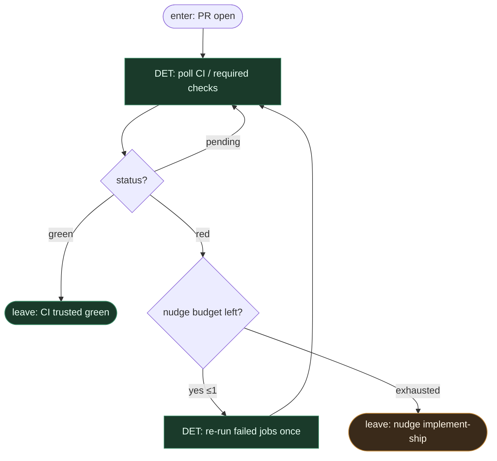

# Subgraph: ci-trust

**Theme:** poczekaj na checks; ufaj zielonemu CI; jeden lekki nudge przy rzadkim flaky.  
**Mode mix:** wszystko DET. Optymistyczny babysit — nie full fail-closed circus (03).

## Flow

## Notes

- **Trust the green path.** Default happy path = green bez dramatu.
- **One flaky nudge.** Re-run failed jobs max 1×; potem wróć do implement-ship z feedbackiem — nie limbo, nie nieskończony poll.
- **CI is oracle.** Agent nie override'uje czerwonego builda.
- **No stuck-PR survey theatre.** Optymista zakłada sensowne okna CI; timeout → leave z receipt do ship/review policy.
- **Handoff:** `{ci: green, pr}` albo `{ci: red_after_nudge, logs_summary}` → top-level wraca do ship.
