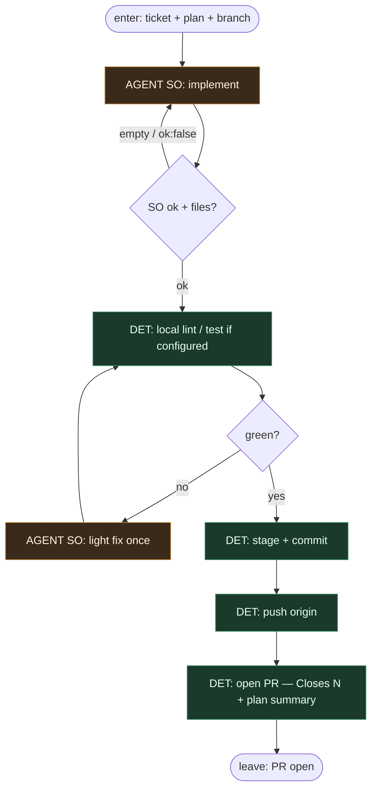

# Subgraph: implement-ship

**Theme:** implement według planu → lokalny check → commit → push → open PR.  
**Mode mix:** AGENT SO implement; DET git/PR. Jedyna ciężka entropia kodu.

## Flow

## Notes

- **Implement = entropy sink.** Tylko tu (i light fix) wolno przepisywać product code.
- **Plan is input, not gospel.** Agent może odstąpić z uzasadnieniem w SO summary.
- **Optimistic local loop.** Jeden light fix; zakładamy, że lokalne checki szybko wracają na zielono.
- **Coder ceiling = open PR.** Implementer nie merguje.
- **DET owns git.** Commit message z ticket ID; push; PR template z `Closes #N`.
- **One ticket, one PR.**
- **Handoff:** `{pr_url, branch, head_sha, summary}`.
