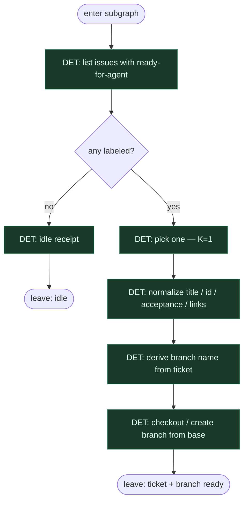

# Subgraph: label-intake

**Theme:** etykieta = start → pick one → normalize ticket → branch ready.  
**Mode mix:** prawie wszystko DET. Optymista zakłada, że label jest i ludzie go trzymają.

## Flow

## Notes

- **Label = start.** Zero chat pick, zero agent choose. Inżynier oznaczył → klepacz bierze.
- **Optimistic skip re-assert.** Nie zakładamy znikającego labela między pick a start (kontrast do 03). Jedna lista, jeden pick.
- **Normalize once.** Stabilny payload `{ticket, acceptance, links}` dla plan-enrich i implement-ship.
- **Branch naming DET.** `ai/<id>-<slug>` lub konwencja repo — nie agent inventuje nazw.
- **K=1.** Jeden ticket naraz; occupancy poza tym podgrafem jeśli trzeba.
- **Handoff:** `{ticket, branch, base_ref}` albo `{idle:true}`.
