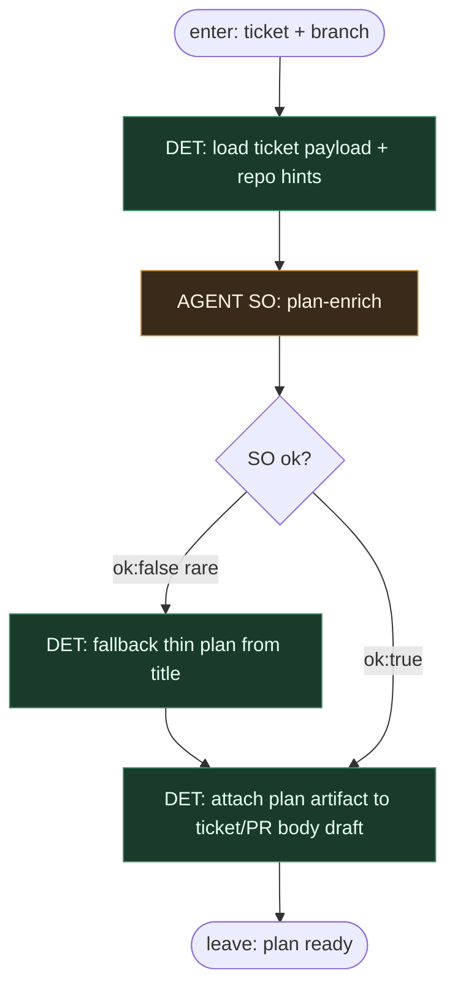

# Subgraph: plan-enrich

**Theme:** lekki plan / file hints / acceptance map — modular enrich przed kodem.  
**Mode mix:** AGENT SO (plan only); DET wrap. Bogatszy niż thin (01), nadal wąski liść.

## Flow

## Notes

- **Plan writes no product code.** Tylko structured plan: kroki, pliki podejrzane, ryzyka, test hints.
- **Default ON in optimistic-full.** Wariant 01 skipuje plan; tu plan jest pierwszym-class modularnym krokiem (współpracujący ticket zwykle ma sens).
- **Fallback thin.** Jeśli SO `ok:false` — DET skleja minimalny plan z tytułu/acceptance; nie escape theatre.
- **Meat ≡ AI.** To samo siedzenie plan-only.
- **Handoff:** `{plan: {steps[], files[], risks[], test_hints[]}, ticket, branch}`.
