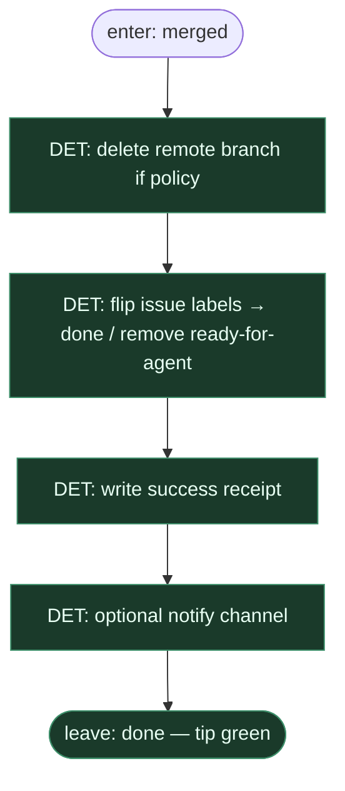

# Subgraph: post-merge

**Theme:** sprzątanie po merge — branch delete, label done, receipt.  
**Mode mix:** wszystko DET. Optymista domyka pętlę czysto.

## Flow

## Notes

- **Close the loop.** Zmergowane bez sprzątania = pół sukcesu; etykiety i branche nie wiszą.
- **DET only.** Zero agenta po merge — housekeeping jest tanie i pewne.
- **Receipt > JSON theatre.** Zapis `{pr, merge_sha, ticket, closed_at}` na tipie hosta.
- **Notify optional.** Slack/webhook jeśli skonfigurowane; brak ≠ fail.
- **Handoff:** `{done:true, receipt}` → top-level DONE.
