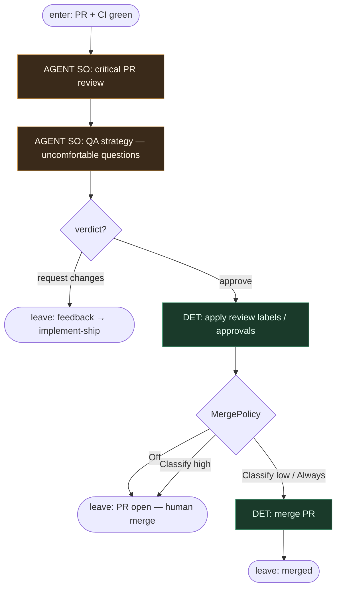

# Subgraph: review-merge

**Theme:** critical review (osobna rola) → QA questions → DET merge policy.  
**Mode mix:** AGENT SO review; DET labels + merge. Zakładamy współpracującego reviewera.

## Flow

## Notes

- **Separate role.** Reviewer ≠ implementer (meat lub AI — inne siedzenie).
- **QA strategy stays.** Brak testów, creep scope, rollback — first-class, nie ozdoba.
- **Optimistic Classify.** Przy green CI i niskim ryzyku Classify/Always może mergować bez czekania na człowieka; Off default per repo nadal OK.
- **Never LLM-merge.** Gałka MergePolicy jest DET — prompt nie „decyduje merge”.
- **Changes → ship.** Feedback wraca do implement-ship na top-level; ten podgraf nie koduje.
- **Handoff:** `{merged:true, merge_sha}` | `{hold:true, reason}` | `{changes:true, feedback[]}`.
