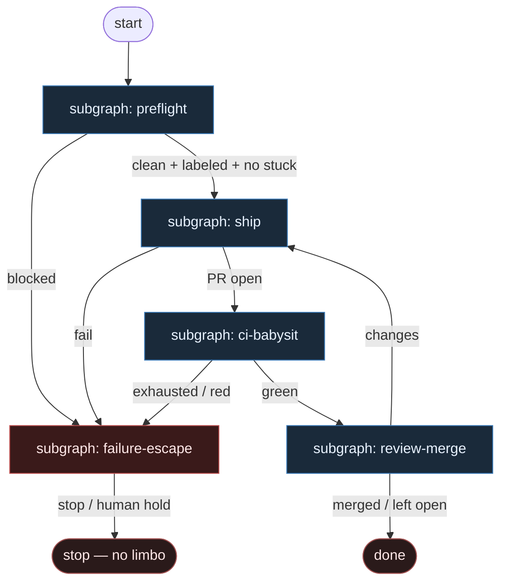

# 03 — Pessimistic Gates

**Persona:** pessimistic — fail-closed everywhere; assume flaky CI, dirty worktrees, stuck PRs, missing labels.

**Approach:** from_scratch. Osobny graf + tematyczne podgrafy (nie monolit). Polish OK.

## Design notes

- **Fail-closed is the default.** Brak labela, brudny worktree, stuck PR, czerwony CI po wyczerpaniu retry, brak acceptance → **stop / escape**, nie „jakoś jedź dalej”.
- **Załóż najgorsze.** CI flaky, worktree brudny, PR wisi bez labeli, etykiety znikają. Każdy podgraf ma jawne bramki DET przed kolejnym krokiem.
- **Babysitting = DET.** Poll CI, re-run flaky, wykryj stuck PR, odmów startu przy dirty tree — skrypty z boundami. Agent nie „ratuje” infrastruktury.
- **AGENT SO tylko w cienkich liściach.** Implement (jak zakodować) + critical review (osobna rola, structured verdict). Zero limbo labels, zero grubego orkiestratora.
- **Człowiek = architektura + QA strategia.** Escape wyprowadza do człowieka przy high-risk / stuck beyond bounds / policy Off — nie do etykiety „limbo”.
- **No limbo labels.** Skip, fail, escape, left_open — jawne stany. Nie `needs-human-maybe` / `ai:deferred` theatre.
- **Subgraphs not monolith.** Preflight, ship, CI babysit, review-merge, failure-escape — każdy ma małe akcje DET; top-level czytelny.
- **Meat ≡ AI.** To samo siedzenie AGENT; graf nie rozróżnia.
- **NOT L5.** Cel: zdjąć wyczerpujące klepanie (poll, retry, gate); człowiek zostaje przy trudnych decyzjach. Nie lights-out bank.
- **Kryterium:** zmergowany lub świadomie `left_open` `ai/fix` na tipie hosta — nie ładny JSON `outcome=none` po milczeniu.

## Top-level flowchart

**DET vs AGENT at a glance**

| Layer | Mode | Responsibility |
|-------|------|----------------|
| Preflight gates | DET | dirty worktree, missing labels, stuck PR survey — fail-closed |
| Ship (implement) | AGENT SO | coding judgment only |
| Ship (git/PR) | DET | branch, test, commit, push, open PR |
| CI babysit | DET | poll, flaky re-run bound, timeout → escape |
| Critical review | AGENT SO | verdict + reasons[] (osobna rola) |
| Merge policy | DET | Off / Classify / Always — never LLM merge |
| Failure / escape | DET + HITL | classify reason, receipt, human hold — **no limbo label** |

## Index of subgraphs

| File | Theme | Role in chain |
|------|--------|----------------|
| [subgraph-preflight.md](./subgraph-preflight.md) | dirty / labels / stuck PR | DET fail-closed front door |
| [subgraph-ship.md](./subgraph-ship.md) | implement → test → PR | AGENT code + DET git |
| [subgraph-ci-babysit.md](./subgraph-ci-babysit.md) | flaky CI poll + retry | DET babysitting with bounds |
| [subgraph-review-merge.md](./subgraph-review-merge.md) | review → merge policy | AGENT review + DET policy |
| [subgraph-failure-escape.md](./subgraph-failure-escape.md) | classify fail → stop/HITL | escape hatch — no limbo |

## Pessimistic assumptions (explicit)

1. Worktree może być brudny — sprawdzaj zanim cokolwiek zaczniesz.
2. Label `ready-for-agent` / `ai:ready` może zniknąć między pick a start — re-check.
3. PR może wisieć w CI lub bez review — survey stuck przed nowym shipem.
4. CI jest flaky — jeden czerwony ≠ ostateczny; bound retry, potem escape.
5. Acceptance / verify może być puste — nie inventuj; skip/escape.
6. Merge Always przy high-risk = zabronione; Off default.

## Kryterium sukcesu

Człowiek ma energię na architekturę i niewygodne pytania — bo DET odrobił babysitting (dirty, stuck, flaky). Technicznie: PR otwarty i albo zmergowany, albo świadomie `left_open` z receipt — nigdy etykieta limbo.
