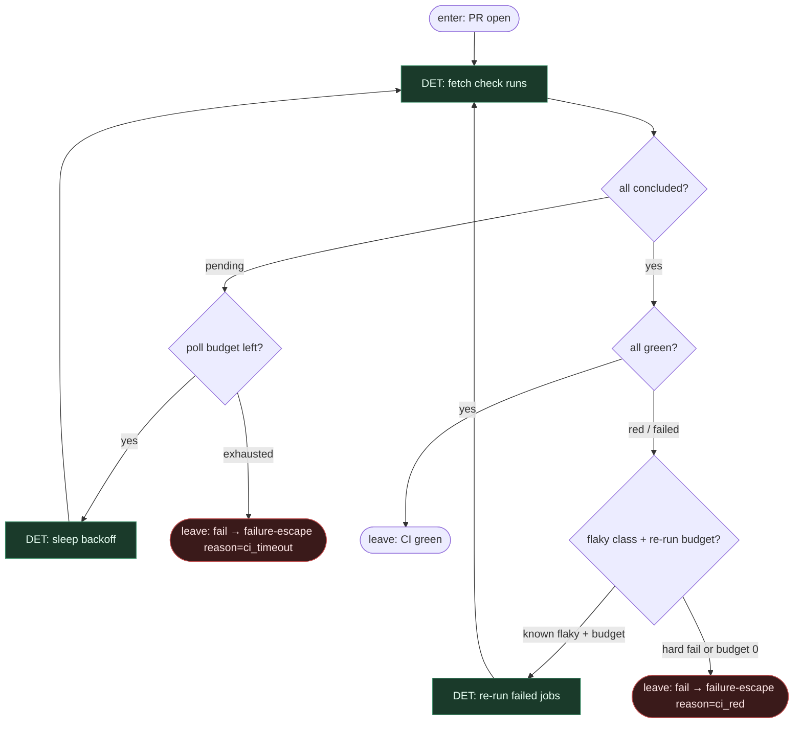

# Subgraph: ci-babysit

**Theme:** flaky CI — poll, bounded re-run, timeout. Babysitting bez człowieka i bez limbo.  
**Mode mix:** 100% DET. Agent nie override’uje czerwonego builda.

## Flow

## Notes

- **Załóż flaky.** Pierwszy czerwony nie jest wyrokiem — jeśli job jest na allowlist flaky **i** zostaje budget re-run, DET odpala ponownie.
- **Bounds are sacred.** `poll_budget`, `rerun_budget`, `max_wall_clock`. Wyczerpanie → escape, nie wieczne czekanie, nie limbo label.
- **Hard fail vs flaky.** Compile / typecheck / policy check = hard. Oznaczone e2e flake = flaky. Nieznane = hard (fail-closed).
- **No AGENT in this subgraph.** Babysitting CI to skrypt. LLM nie „interpretuje logów żeby uznać za zielone”.
- **CI is oracle for merge later.** Ten podgraf tylko doprowadza do `green` albo `escape`.
- **Handoff:** `{ci:green, check_sha}` albo `{fail:true, reason: ci_timeout|ci_red, failing_checks[]}`.
