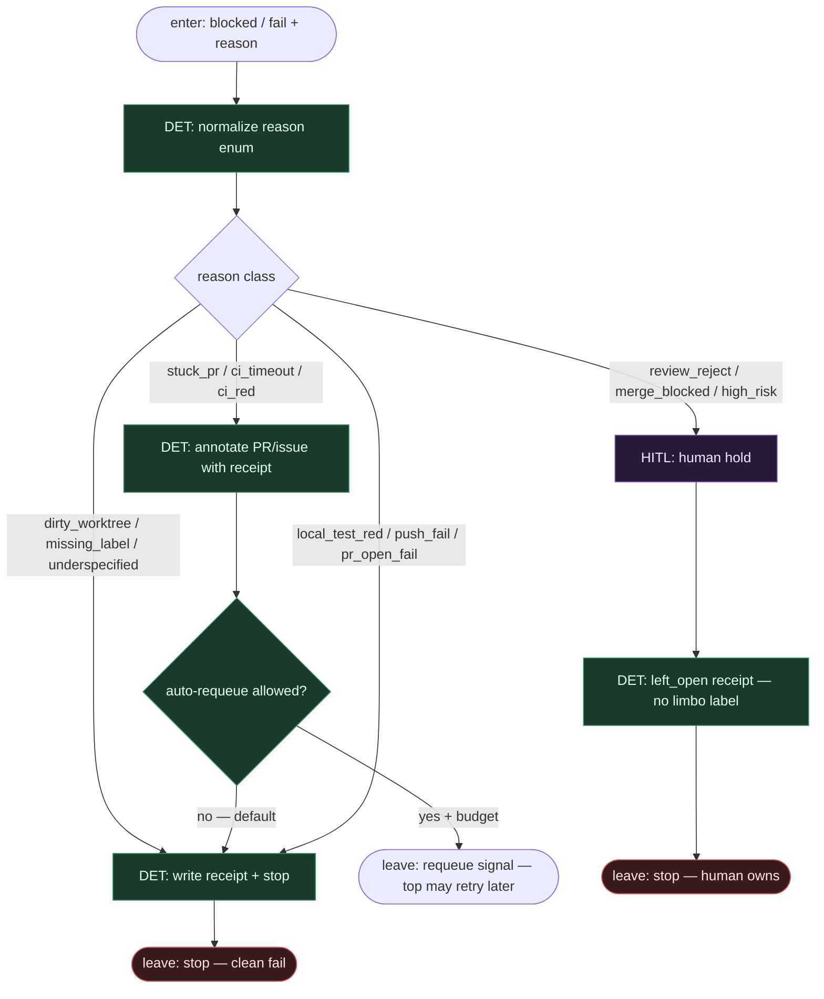

# Subgraph: failure-escape

**Theme:** sklasyfikuj fail → receipt → stop albo HITL. **Żadnych limbo labels.**  
**Mode mix:** DET classify + write receipt; HITL tylko gdy `needs_human`. Escape hatch całego wariantu.

## Flow

## Reason enum (closed)

| reason | Default exit | Limbo label? |
|--------|--------------|--------------|
| `dirty_worktree` | stop | **never** |
| `missing_label` | stop | **never** |
| `underspecified` | stop | **never** |
| `stuck_pr` | stop / optional requeue | **never** |
| `ci_timeout` | stop | **never** |
| `ci_red` | stop | **never** |
| `local_test_red` | stop | **never** |
| `push_fail` / `pr_open_fail` | stop | **never** |
| `review_reject` | HITL hold | **never** |
| `merge_blocked` | HITL hold | **never** |
| `high_risk` | HITL hold | **never** |

## Notes

- **Escape ≠ limbo.** Limbo label to odkładanie wstydu. Tu: receipt JSON + stop albo jawny human hold.
- **Receipt jest skutkiem.** `{reason, issue_id?, pr_url?, checks?, ts, next: stop|human|requeue}` — audytowalny, nie etykieta na tablicy.
- **Requeue rzadki.** Tylko gdy policy + budget na `stuck_pr` / CI flake class; default = stop. Pessimista nie zapętla w nieskończoność.
- **HITL nie jest LLM.** High-risk / reject / merge_blocked → człowiek (architektura / QA). Graf nie udaje decyzji.
- **Top-level łączy tu wszystkie `blocked` / `fail`.** Bez tego podgrafu monolit gubi fail paths.
- **Handoff:** `{stopped:true, receipt}` | `{human_hold:true, receipt}` | `{requeue:true, receipt}` — nigdy `{label: limbo}`.
