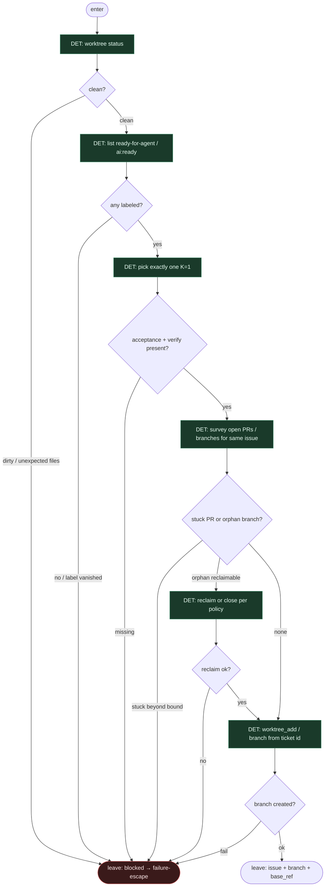

# Subgraph: preflight

**Theme:** brudny worktree / brak labeli / stuck PR — fail-closed przed jakąkolwiek pracą.  
**Mode mix:** 100% DET. Zero agenta. Zero „jakoś pojedziemy”.

## Flow

## Notes

- **Dirty = stop.** Nie stash theatre w grafie. Albo clean, albo escape z powodem `dirty_worktree`.
- **Label re-check.** Pick i start to dwa momenty; label może zniknąć. Brak = `missing_label`, nie limbo.
- **K=1.** Jeden ticket. Batch = nie.
- **Underspecified = blocked.** Brak acceptance / verification → escape `underspecified`. Nie plan-leaf, nie enrich.
- **Stuck PR survey.** Otwarty PR na ten sam issue z czerwonym CI / bez ruchu powyżej TTL → escape `stuck_pr` (albo reclaim jeśli policy na to pozwala).
- **Branch name = skrypt.** Z ID ticketa. Fail tworzenia brancha → escape, nie agent „napraw nazwę”.
- **No limbo labels.** Wyjścia: `blocked` z `reason` enum → failure-escape. Nigdy `ai:limbo`.
- **Handoff:** `{issue_id, branch, base_ref}` albo `{blocked:true, reason}`.
