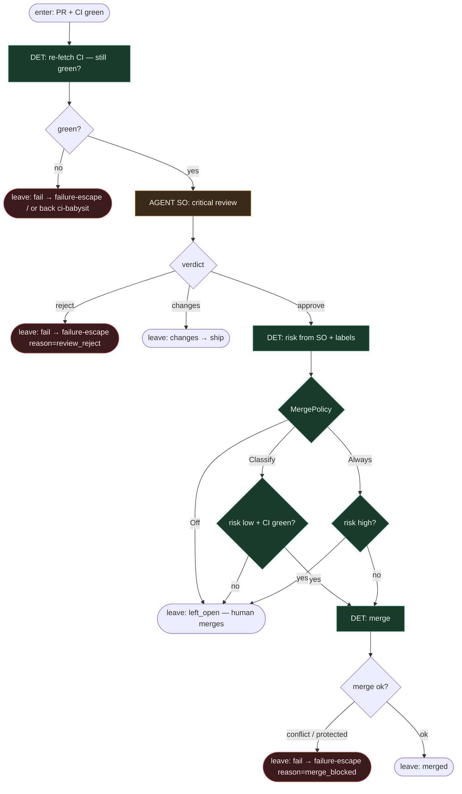

# Subgraph: review-merge

**Theme:** critical review → merge policy. Fail-closed na reject / high-risk / czerwonym re-check.  
**Mode mix:** AGENT SO review; DET merge policy + CI re-assert.

## Flow

## Notes

- **CI re-assert.** Między babysit a merge CI mógł spaść (flake, force-push). Pessimista sprawdza jeszcze raz.
- **Review = osobna rola.** Nie ten sam seat co implement. SO: `{verdict, reasons[], risk}`. `reasons` = niewygodne pytania QA w tym ticku.
- **Reject ≠ limbo.** `review_reject` → failure-escape z receipt. Changes → z powrotem do ship (bounded na top-level).
- **MergePolicy Off default.** Skutek klepacza często = otwarty PR. Always nigdy przy `risk=high`.
- **Merge conflict = escape.** Nie agent „rozwiąż konflikt w monolicie”.
- **No separate QA-strategy AGENT.** Strategia periodyczna człowieka; w ticku wystarczą `reasons[]`.
- **Handoff:** `{merged:true, sha}` | `{merged:false, left_open:true}` | `{merged:false, feedback}` → ship | `{fail:true, reason}`.
