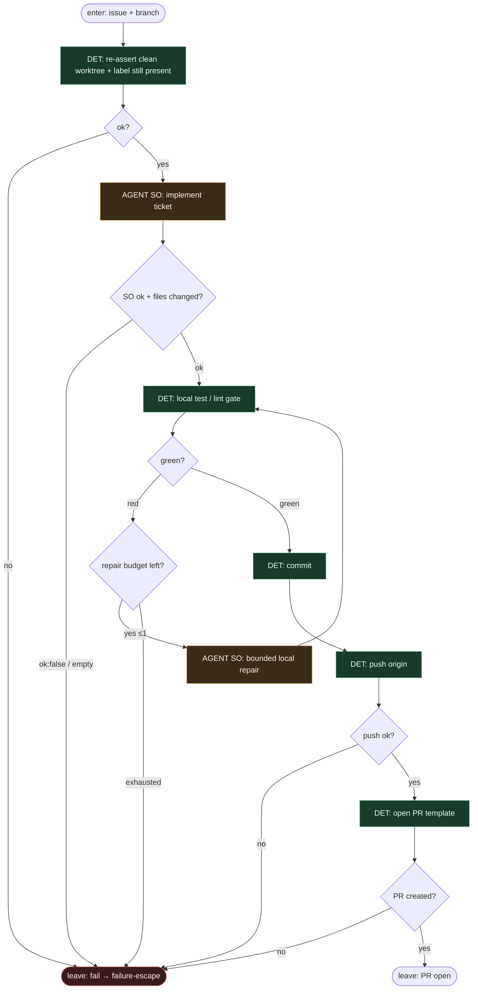

# Subgraph: ship

**Theme:** implement → lokalny test → commit → push → open PR. Jedyna entropia kodu + DET git.  
**Mode mix:** AGENT SO implement; reszta DET. Fail-closed na czerwonym teście / push fail.

## Flow

## Notes

- **Re-assert before code.** Pessimista zakłada, że między preflight a ship coś się zmieniło (dirty, label). Drugi check DET.
- **Implement = AGENT SO.** Structured: `{ok, summary, files[]}`. `ok:false` → escape, nie „spróbuj innego modelu”.
- **Lokalny test jest bramką.** Czerwony bez zielonego po max 1 bounded repair → escape `local_test_red`. Nie otwieraj PR na czerwono.
- **Jeden bounded repair w liściu.** Nie zagnieżdżony SDLC, nie osobny pr_repair subgraph tutaj.
- **Push / open PR fail = escape.** Sieć, rights, template — DET report + failure-escape. Agent nie maskuje.
- **One ticket, one PR.** K=1 kontynuacja z preflight.
- **Handoff:** `{pr_url, branch, head_sha}` albo `{fail:true, reason}` → failure-escape.
