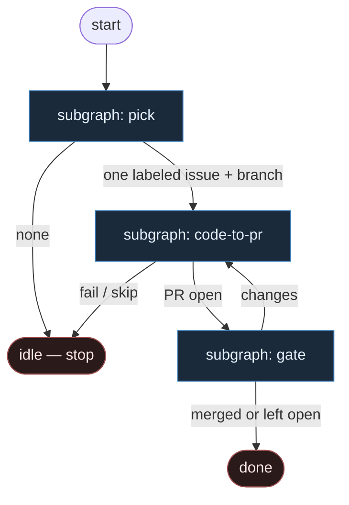

# 04 — Cynical Cuts

**Persona:** cynical — skasuj połowę węzłów, które inni wymyślają; jeśli krok nie przesuwa PR, wycinaj.

**Approach:** from_scratch. Osobny graf + cienkie podgrafy (nie monolit). Polish OK.

## Design notes

- **Reguła cięcia.** Każdy węzeł musi albo (a) wybrać pracę, albo (b) wylądować diffem na remote, albo (c) otworzyć/zablokować/zmergować PR. Reszta = teatr. Skasuj.
- **Połowa tego, co inni rysują, jest zbędna.** Plan-leaf, normalize-ceremony, clean-workspace theatre, osobny QA-strategy AGENT, pr_repair jako podgraf, occupancy/orphan FSM, leftover/pass_ceiling — to nie przesuwa PR. Wycinamy.
- **DET łańcuch jest kręgosłupem.** pick → branch/worktree → test → commit → push → open PR → CI → merge policy. Skrypty. Zero „agent wybiera sobie pracę”.
- **AGENT tylko w cienkich liściach.** Implement (jak zakodować ten ticket) + critical review (osobna rola, structured verdict). Nic więcej. Nie gruby mózg orkiestrujący tool-callingiem.
- **Ticket jasny albo skip.** Brak sekcji acceptance / verification → nie bierzemy. Nie „planuj aż będzie sens”. Taniej niż lepszy model.
- **Jedna szansa lokalnie.** Test czerwony → jeden bounded repair w tym samym liściu implement **albo** fail i exit. Nie zagnieżdżony SDLC.
- **Review bez osobnego QA-node.** Niewygodne pytania żyją *wewnątrz* critical review (reasons[]), nie jako drugi AGENT „strategia”.
- **Merge Policy Off default.** Klepacz kończy na otwartym PR. Always/Classify = gałka, nie religia.
- **NOT L5 / nie dark factory theatre.** Cel: energia człowieka na myślenie o taskach, architekturę, trudne decyzje. Nie lights-out bank. Nie „wyrzuć człowieka”.
- **Meat ≡ AI.** To samo siedzenie AGENT; graf nie rozróżnia.
- **Kryterium:** zmergowany `ai/fix` na tipie hosta w sensownym oknie — nie ładny JSON `outcome=none`.

## Top-level flowchart

**DET vs AGENT at a glance**

| Layer | Mode | Keep? | Why |
|-------|------|-------|-----|
| Pick labeled | DET | yes | bez tego nie ma pracy |
| Branch / worktree | DET | yes | PR potrzebuje brancha |
| Plan leaf | — | **CUT** | nie przesuwa PR; ticket albo gotowy, albo skip |
| Implement | AGENT SO | yes | jedyna entropia kodu |
| Local test | DET | yes | czerwony = nie otwieraj PR |
| Nested repair subgraph | — | **CUT** | max 1 retry w liściu; potem fail |
| Commit + push | DET | yes | bez remote nie ma PR |
| Open PR | DET | yes | definicja skutku klepacza |
| CI wait | DET | yes | czerwony CI ≠ merge |
| Critical review | AGENT SO | yes | osobna rola; verdict + reasons |
| QA-strategy AGENT | — | **CUT** | reasons[] w review wystarczą |
| pr_repair subgraph | — | **CUT** | changes → z powrotem do implement |
| Merge policy | DET | yes | Off / Classify / Always |
| Branch cleanup | — | **CUT** | opcjonalny skrypt poza grafem |
| Self-repair / leftover | — | **CUT** | teatr orkiestracji |

## Index of subgraphs

| File | Theme | Role in chain |
|------|--------|----------------|
| [subgraph-pick.md](./subgraph-pick.md) | label → one issue → branch | DET front door; zero albo jeden |
| [subgraph-code-to-pr.md](./subgraph-code-to-pr.md) | implement → test → commit → push → PR | jedyny AGENT kodu + DET git/PR |
| [subgraph-gate.md](./subgraph-gate.md) | CI → review → merge policy | AGENT review + DET policy |

## Co świadomie skasowano (vs typowy „pełny” graf)

1. `plan_issue` / light plan / file-breakdown leaf  
2. Normalize ticket / enrich metadata ceremony  
3. Ensure clean workspace / orphan finish / occupancy FSM  
4. Dual survey, ready sieve, stuck/limbo labels  
5. Osobny `pr_repair` + osobny QA-strategy AGENT  
6. Per-ticket „human architecture” stage (strategia jest periodyczna, nie w każdym ticku)  
7. Department orchestrators / fat product_entry  

Zostaje to, co **rusza PR**. Reszta jest winą wyobraźni, nie procesu.
