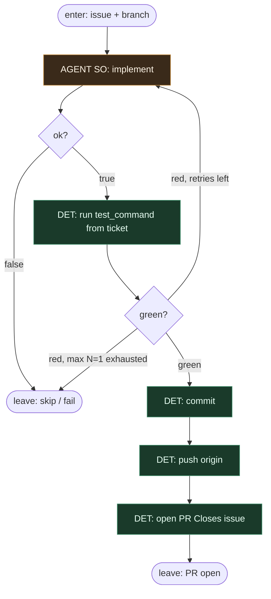

# Subgraph: code-to-pr

**Theme:** zaimplementuj → przetestuj → commit → push → otwórz PR.  
**Mode mix:** jeden AGENT SO (implement); reszta DET. Plan = CUT.

## Flow

## Notes

- **Plan leaf CUT.** Ticket mówi CO i JAK sprawdzić. Jeśli nie — wróć do pick/skip. Planowanie nie otwiera PR.
- **Jeden AGENT liść.** `implement` ze structured output: `{ok, summary, files_touched}` albo `{ok:false, reason}`. Fail = exit, nie limbo.
- **Test z ticketa.** DET komenda. Czerwony bez komendy weryfikacji = nie bierz ticketa (pick już to odsiało).
- **Bounded retry N=1.** Nie osobny `repair_code` subgraph. Druga czerwień = leave fail. Escapism zabija cynizm.
- **Commit/push/open PR = DET.** Message z ID + summary. Template PR. Zero agent-novelisty w git plumbing.
- **CUT:** multi-commit product loop, local-check ceremony poza `test_command`, file-breakdown agent, „ulepsz po drodze”.
- **Handoff:** `{pr_url, branch, head_sha}` albo fail/skip.
