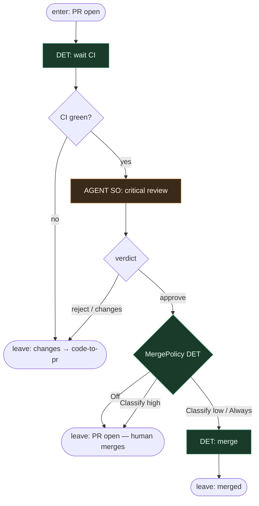

# Subgraph: gate

**Theme:** CI → critical review → merge policy. Koniec albo pętla do code-to-pr.  
**Mode mix:** AGENT SO review; DET CI + policy. Osobny QA-agent = CUT. pr_repair = CUT.

## Flow

## Notes

- **CI jest bramką DET.** Agent nie „override’uje” czerwonego builda.
- **Review = osobna rola.** Nie ten sam seat co implement. Structured: `{verdict, reasons[], risk}`. `reasons` *są* niewygodnymi pytaniami — nie potrzeba drugiego węzła „QA strategy”.
- **pr_repair CUT.** `changes` / `reject` → top-level wraca do code-to-pr. Bez osobnego fixera z max_attempts theatre w tym podgrafie.
- **Merge Policy Off default.** Skutek klepacza = otwarty PR. Always tylko gdy CI jest wyrocznią i risk=low.
- **CUT:** apply-labels ceremony, branch cleanup, per-ticket human-architecture stage, approve-bot rubber stamp bez reasons.
- **Handoff:** `{merged:true, sha}` | `{merged:false, left_open:true}` | `{merged:false, feedback}` → re-implement.
