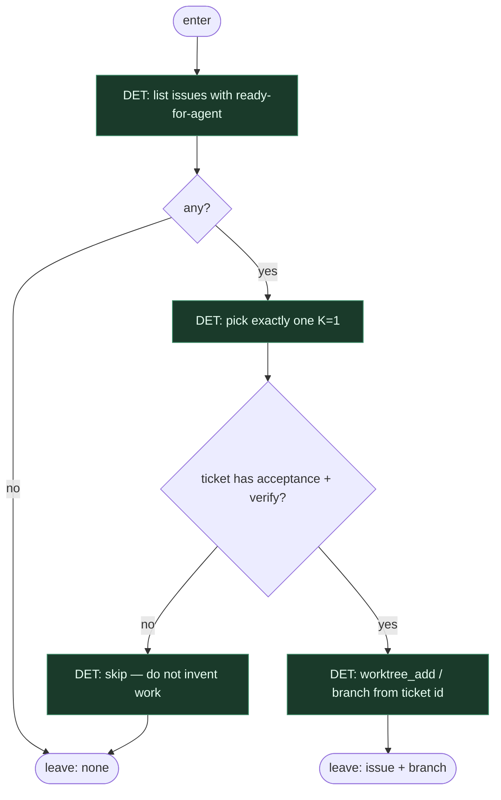

# Subgraph: pick

**Theme:** etykieta → jeden issue → branch. Nic więcej.  
**Mode mix:** 100% DET. Zero agenta. Zero „wybieram z czatu”.

## Flow

## Notes

- **Label = start.** Bez `ready-for-agent` / `ai:ready` nie ma wejścia. Chat nie jest intake.
- **K=1.** Jeden ticket. Nie katalog, nie batch, nie „przy okazji sąsiad”.
- **Underspecified = skip.** Brak acceptance / verification → wyjście. Nie plan-leaf, nie enrich, nie limbo label.
- **Branch name = skrypt.** Z ID ticketa. Człowiek/agent nie wymyśla nazwy.
- **CUT vs inni:** auth theatre jako osobny węzeł, normalize fields, ensure clean workspace, occupancy/orphan/defer FSM — nie rysujemy. Albo worktree się uda, albo fail closed.
- **Handoff:** `{issue_id, branch, base_ref}` albo `none`.
