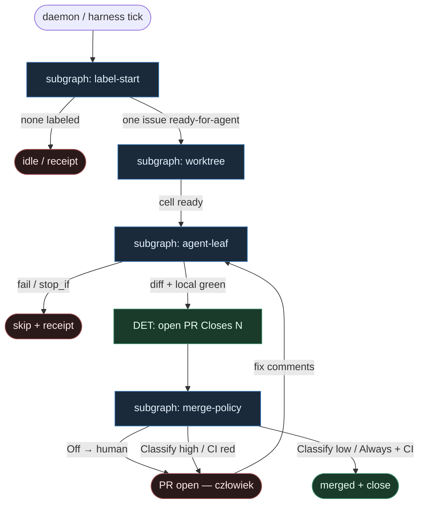

# 05 — Ready-for-agent reuse

**Persona:** reuse-ready — maksymalna wierność [berenddeboer/ready-for-agent](https://github.com/berenddeboer/ready-for-agent) + kanonowi `KLEPACZ.md` / SOUL.

**Approach:** `reuse_ready`. Nie wymyślamy nowej pętli — bierzemy gotowe wzorce z harnessu i rozkładamy je na podgrafy DET-majority.

## Design notes

- **Label = start.** Etykieta `ready-for-agent` jest jedynym triggerem. Zero „weź z czatu”, zero agent pick. Inżynier pisze issue (= spec); klepacz bierze tylko to, co oznaczono.
- **Fresh worktree.** Jeden ticket → jeden worktree → K=1. Install w komórce; brak współdzielonego dirty tree.
- **Agent = liść (SO).** Headless agent (Claude / Codex / OpenCode / …) siedzi tylko w liściu implement (+ opcjonalny review SO). Orkiestrator nie tool-calluje jak gruby mózg.
- **Merge Policy Off | Classify | Always.** Gałka per repo z ready-for-agent. Start: **Off** (PR otwarty, człowiek merguje). Classify = auto tylko niskie ryzyko. Always = tylko gdy CI jest wyrocznią (docs, lockfile, wąski bugfix z testem).
- **DET majority.** Lista labelowanych, worktree add, install, branch, commit, push, open PR, czekanie na CI, merge/hold — skrypty. Entropia tylko w liściach AGENT.
- **Meat ≡ AI.** To samo siedzenie w łańcuchu: usługa mięsa i usługa AI robią te same węzły AGENT; graf się nie zmienia.
- **Subgrafy, nie monolit.** Label-start · worktree · agent-leaf · merge-policy — osobne tematy, małe akcje wewnątrz.
- **NOT L5.** Zdejmujemy babysitting issue→merged PR. Nie lights-out bank, nie „wyrzuć inżyniera / PO / UX / QA-strategię”.
- **Cel ludzki (SOUL):** człowiek ma energię na architekturę i niewygodne pytania — bo nie spalił dnia na ticket→branch→push→PR→dogadaj merge.
- **Kryterium:** zmergowany `ai/fix` (albo świadomy hold przy Off) na tipie hosta — nie ładny JSON bez skutku.

## Top-level flowchart

**DET vs AGENT at a glance**

| Layer | Mode | Skąd (reuse) | Uwaga |
|-------|------|--------------|-------|
| Label pick / authorship filter | DET | ready-for-agent UI/CLI lista | tylko labeled; agent nie wybiera |
| Fresh worktree + install | DET | ready-for-agent sandbox | K=1 occupancy |
| Implement (+ opc. review) | AGENT leaf SO | headless agent | structured output; fail = ok:false |
| Commit / push / open PR | DET | harness plumbing | `Closes #N` |
| CI wait | DET | GitHub/GitLab checks | fail-closed |
| Merge Off\|Classify\|Always | DET policy | ready-for-agent Merge Policy | never LLM-merge |

## Index of subgraphs

| File | Theme | Role in chain |
|------|--------|----------------|
| [subgraph-label-start.md](./subgraph-label-start.md) | etykieta = start | DET intake; zero chat pick |
| [subgraph-worktree.md](./subgraph-worktree.md) | fresh worktree + install | DET sandbox cell |
| [subgraph-agent-leaf.md](./subgraph-agent-leaf.md) | implement (+ opc. review) SO | jedyny AGENT entropy sink |
| [subgraph-merge-policy.md](./subgraph-merge-policy.md) | Off \| Classify \| Always | DET merge gałka; coder ≠ merge |

## Mapowanie na kanon KLEPACZ / SOUL

| Pewniaczek (WORKING_KLEPACZ_GRAPH) | Tu |
|------------------------------------|----|
| Label = start | subgraph-label-start |
| Jeden ticket / jeden worktree / K=1 | subgraph-worktree |
| Coder ≠ merge | agent-leaf kończy przed PR; merge = policy |
| Merge Off/Classify/Always | subgraph-merge-policy |
| Structured output wszędzie LLM | agent-leaf kontrakty |
| Reviewer bez write (opc.) | review SO w agent-leaf; merge poza |

## Antyteza (czego tu nie ma)

- Agent wybierający pracę z czatu / backlogu
- Monolityczny fat graf z merge w środku implementera
- LLM „MergePolicy Classify” jako prompt (gałka jest DET)
- L5 lights-out / wymyślanie ticketów / architektura produktu przez klepacza
- Współdzielony dirty working tree
