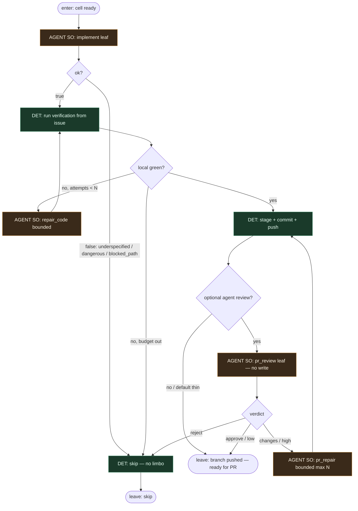

# Subgraph: agent-leaf

**Theme:** headless agent jako **liść** — implement (+ opcjonalny review SO); meat ≡ AI.  
**Mode mix:** AGENT SO tylko w liściach; test/commit lokalne = DET.

## Flow

## Notes

- **Reuse fidelity.** ready-for-agent: headless Claude/Codex/OpenCode/Grok w worktree — *implement + review + PR*. Tu PR open jest DET na top-level; liść kończy na pushed branch (coder ≠ merge).
- **Liść, nie orkiestrator.** Agent dostaje structured output schema; nie routuje całego factory_pass. Fail = `{ok:false, reason:enum}` → skip bez park labels.
- **Meat ≡ AI.** To samo siedzenie: człowiek-klepacz albo model — graf i kontrakt SO bez zmian (SOUL).
- **Głupi i posłuszny.** Inteligentny klepacz „ulepszający po drodze” = ryzyko (KLEPACZ). Trzymaj się issue: In scope / Out / Ask-or-stop (auth, billing, migracje, deps).
- **Bounded repair.** max N na repair_code / pr_repair; potem skip + evidence — nie wieczne limbo.
- **Reviewer bez write (opc.).** `pr_review` SO: `{verdict, reasons[], risk}` — komentarz/werdykt, zero merge auth. `reject`/`high` → nigdy Always w merge-policy.
- **Kontrakty SO (WORKING_KLEPACZ_GRAPH):**
  - implement: `{ok, summary, files_touched, tests_run}`
  - pr_review: `{verdict: approve|changes|reject, reasons, risk: low|high}`
- **Handoff contract.** Output = `{branch, commit_shas, summary, review?}` → DET open PR `Closes #N`, albo `{skip, reason}`.
