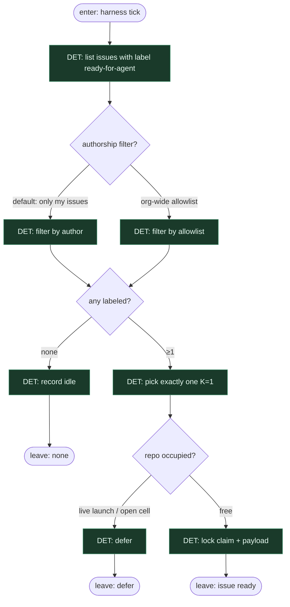

# Subgraph: label-start

**Theme:** etykieta `ready-for-agent` = jedyny start (reuse z berenddeboer/ready-for-agent).  
**Mode mix:** 100% DET. Agent nie wybiera pracy.

## Flow

## Notes

- **Reuse fidelity.** Harness ready-for-agent pokazuje tylko labelowane; to samo tu — lista DET, nie triage AGENT.
- **Label ≠ chat.** Cytat kanonu: *You design, you architect, you verify where needed — the harness removes the babysitting between issue and merged PR.* Człowiek projektuje issue; klepacz startuje od etykiety.
- **K=1.** Jedna misja naraz per repo/occupancy; reszta czeka w kolejce labelowanej.
- **Fail closed.** Brak labeli → idle receipt. Nie wymyślaj ticketów, nie sięgaj po unlabeled „bo wygląda na gotowe”.
- **Agent-ready gate (opc. DET).** Twardy check szablonu (Outcome / In-Out scope / Acceptance / Allowed / Ask-or-stop / Verification) może zablokować claim — taniej niż „lepszy model” (KLEPACZ.md).
- **Handoff contract.** Output = `{issue_id, title, body, labels, base_ref, claim_token}` albo `{none|defer}`.
