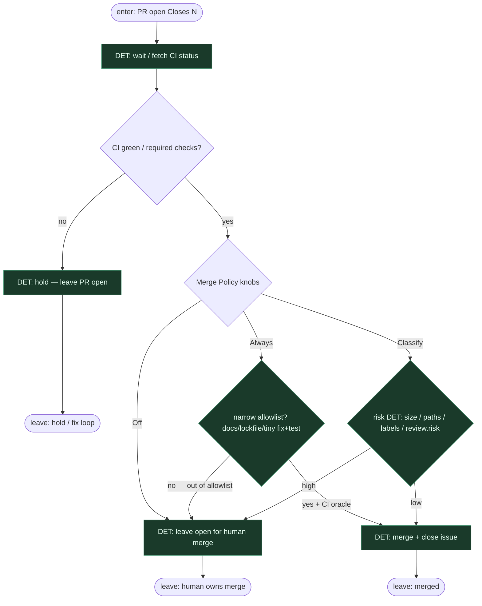

# Subgraph: merge-policy

**Theme:** Merge Policy **Off | Classify | Always** — gałka z ready-for-agent; DET only.  
**Mode mix:** 100% DET po otwartym PR. LLM nie klika merge.

## Flow

## Notes

- **Reuse fidelity.** ready-for-agent Merge Policy per repo: **Off / Classify / Always**. To jest kanoniczna gałka KLEPACZ — nie prompt „czy zmergować?”.
- **Default Off.** Start bezpieczny: klepacz pisze PR, człowiek merguje. Auto-merge = polityka, nie religia (lekcja DEV: linie OK, decyzja zła → revert).
- **Classify = reguły DET.** Size, chronione ścieżki (auth/billing/schema), labels, `review.risk` z opcjonalnego SO — skrypt, nie LLM classifier.
- **Always = wąski.** Tylko gdy CI jest wyrocznią: docs, lockfile, bugfix z testem z issue. `reject`/`high` z review → never Always.
- **Coder ≠ merge.** Implementer (meat lub AI) nie ma przycisku merge. Osobny węzeł policy po CI.
- **Fail-closed.** Czerwone CI, brak required checks, konflikt → hold. Zero agent override.
- **Człowiek zostaje.** Przy Off / high Classify energia idzie w architekturę i niewygodne pytania QA — nie w babysitting kolejki (SOUL).
- **Handoff contract.** Output = `{merged:true, merge_sha, issue_closed}` albo `{merged:false, policy: Off|Classify|Always, reason, pr_url}`.
