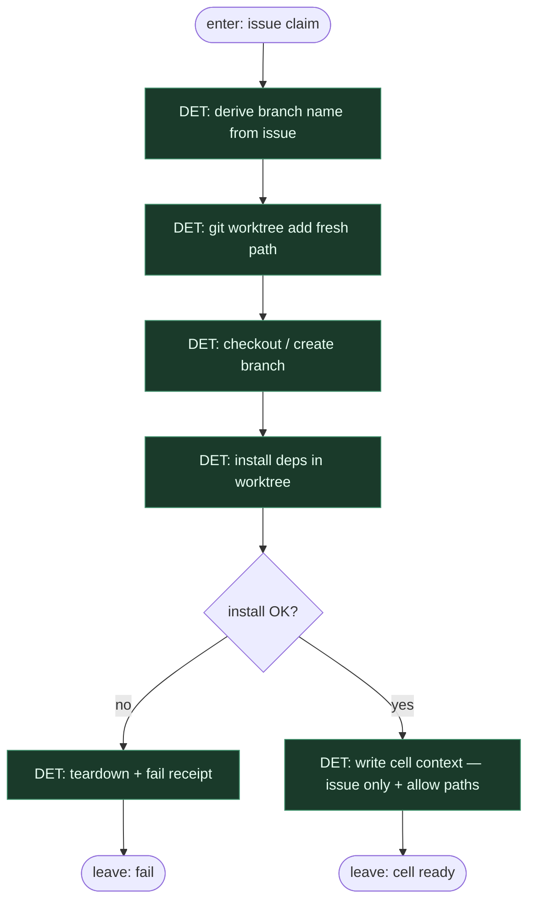

# Subgraph: worktree

**Theme:** fresh worktree + install — sandbox komórka jak w ready-for-agent.  
**Mode mix:** 100% DET. Zero LLM w komórce setup.

## Flow

## Notes

- **Reuse fidelity.** ready-for-agent: *Fresh worktree, install, headless agent*. Worktree jest obowiązkowy — nie „cwd głównego klona”.
- **Izolacja.** Jeden ticket = jeden worktree = jeden branch. Brak dirty conflicts między misjami; idle cleanup po merge/skip.
- **Kontekst wąski.** Agent w następnym podgrafie czyta **tylko** issue + dozwolone pliki/ścieżki z Allowed actions — nie cały świat i nie czat historii.
- **Install jest DET.** `npm i` / `poetry install` / Makefile — skrypt z repo; fail = stop, nie „agent naprawi środowisko na ślepo”.
- **Occupancy.** Cell żyje do PR open / skip / teardown; równoległy drugi claim na to samo repo → defer w label-start.
- **Handoff contract.** Output = `{worktree_path, branch, base_sha, issue_payload, allow_paths[]}` albo `{ok:false, reason:install|worktree}`.
