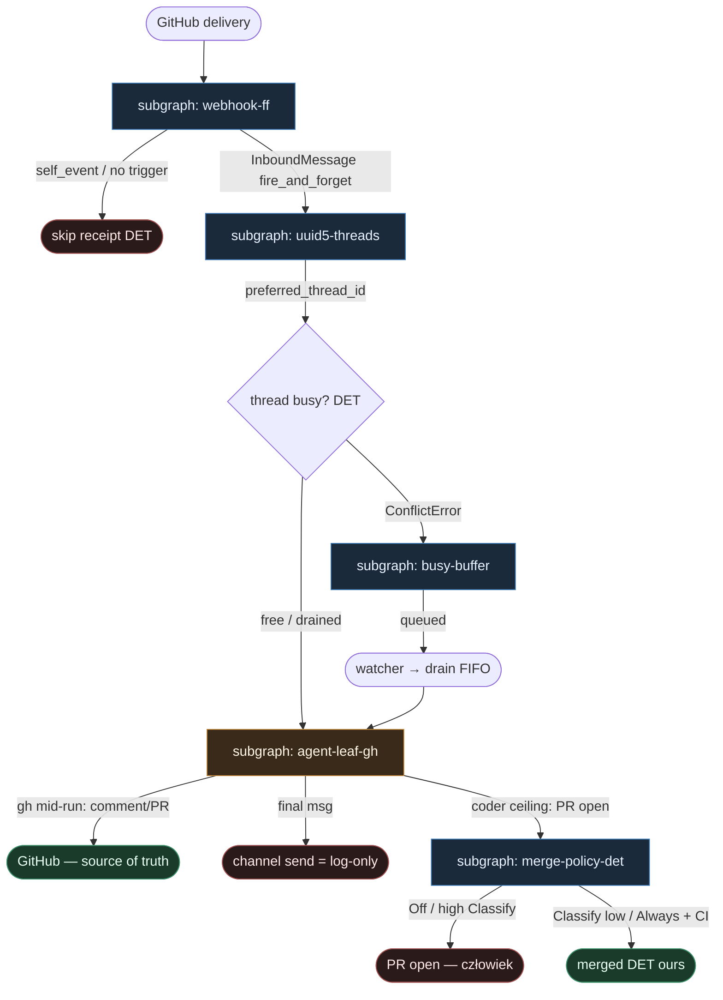

# 06 — DeerFlow borrower (GitHub-channel pewniaczki)

**Persona:** deerflow-borrower compose — bierzemy **pewniaczki** z [ByteDance DeerFlow](https://github.com/bytedance/deer-flow) GitHub channel i wkładamy je w cienki klepacz (SOUL + WORKING_KLEPACZ_GRAPH). Nie portujemy całego DeerFlow.

**Approach:** `compose_borrow`. Webhook → UUID5 thread → AGENT leaf (gh mid-run) → busy buffer → merge DET **ours**.

## Design notes (SOUL)

- **Free humans.** Zdejmujemy babysitting issue→PR i ciche dropy follow-upów. Człowiek zostaje przy architekturze, trudnych decyzjach i (gdy Off) merge.
- **DET majority.** HMAC, fan-out, self-event gate, UUID5, `runs.create`, buffer/drain, CI wait, MergePolicy — skrypty. Entropia tylko w liściu coding AGENT (SO).
- **Subgrafy, nie monolit.** Pięć tematów = pięć plików. Zero fat orkiestratora tool-calling.
- **NOT L5.** Nie lights-out bank, nie „agent wybiera sobie pracę z czatu”, nie wyrzucamy PO/UX/QA-strategii.

## Pewniaczki z DeerFlow (co pożyczamy)

| # | Pewniaczek | DeerFlow | Tu (klepacz) |
|---|------------|----------|--------------|
| 1 | **fire_and_forget webhook** | `ChannelRunPolicy.fire_and_forget=True` → `runs.create` (nie `runs.wait`) | webhook ACK tani; długi coder nie wywala 300s ReadTimeout |
| 2 | **log-only outbound** | `GitHubChannel.send` = INFO log; agent pisze przez `gh` mid-run | kanał nie ferry’uje final message; writeback = `gh` w sandboxie |
| 3 | **UUID5 threads, coder ≠ reviewer** | `uuid5(NS, "{repo}#{n}:{agent}")` | osobne wątki / historie; koordynacja przez GitHub (PR comments) |
| 4 | **self-event gate** | `_is_self_event(sender.login)` przed dispatch | komentarz bota nie odpala ponownie tego samego agenta |
| 5 | **busy follow-up buffer** | ConflictError → buffer + drain FIFO po END_SENTINEL | drugi komentarz nie ginie w ciszy gdy run leci |

## Top-level flowchart

**DET vs AGENT at a glance**

| Warstwa | Tryb | Skąd (borrow) |
|---------|------|----------------|
| HMAC verify + fan-out + self-event | DET | deer-flow webhook/dispatcher |
| UUID5 thread resolve + 409 recovery | DET | `identity.resolve_thread_id` |
| `runs.create` fire_and_forget | DET | `ChannelRunPolicy` |
| Busy buffer + StreamBridge drain | DET | busy follow-up buffer |
| Coding implement (+ opc. review SO) | **AGENT leaf SO** | jedyny entropy sink |
| `gh` comment/PR mid-run | AGENT→DET tool w liściu | log-only outbound kontrakt |
| Merge Off\|Classify\|Always | **DET ours** | KLEPACZ / ready-for-agent gałka |

## Index of subgraphs

| File | Theme | Role in chain |
|------|--------|----------------|
| [subgraph-webhook-ff.md](./subgraph-webhook-ff.md) | fire_and_forget + self-event gate | tani ACK; zero `runs.wait` |
| [subgraph-uuid5-threads.md](./subgraph-uuid5-threads.md) | UUID5; coder ≠ reviewer | deterministyczny thread per agent |
| [subgraph-agent-leaf-gh.md](./subgraph-agent-leaf-gh.md) | coding AGENT leaf + gh mid-run | jedyny AGENT; outbound log-only |
| [subgraph-busy-buffer.md](./subgraph-busy-buffer.md) | busy follow-up buffer | ConflictError → FIFO drain |
| [subgraph-merge-policy-det.md](./subgraph-merge-policy-det.md) | MergePolicy DET **ours** | Off\|Classify\|Always; never LLM-merge |

## Mapowanie na kanon KLEPACZ / SOUL

| Pewniaczek (WORKING_KLEPACZ / SOUL) | Tu |
|-------------------------------------|----|
| Label/trigger = start, nie chat | webhook + binding triggers (nie „weź z czatu”) |
| Coder ≠ merge | agent-leaf kończy na otwartym PR; merge = DET ours |
| Merge Off/Classify/Always | subgraph-merge-policy-det |
| Structured output wszędzie LLM | agent-leaf-gh kontrakty SO |
| Reviewer osobna rola | UUID5 `…:reviewer` ≠ `…:coder` |
| Subgrafy / DET majority / no L5 | cały wariant |

## Antyteza (czego tu nie ma)

- Port całego DeerFlow / Feishu/Slack IM stacku
- `runs.wait` na długim coderze (ReadTimeout + false internal error)
- Auto-post final assistant message na issue/PR (podwójne reply coder+reviewer)
- Wspólny thread coder+reviewer (`multitask_strategy=reject` drop)
- Ciche dropnięcie drugiego komentarza gdy run leci
- LLM klikający merge / L5 lights-out
