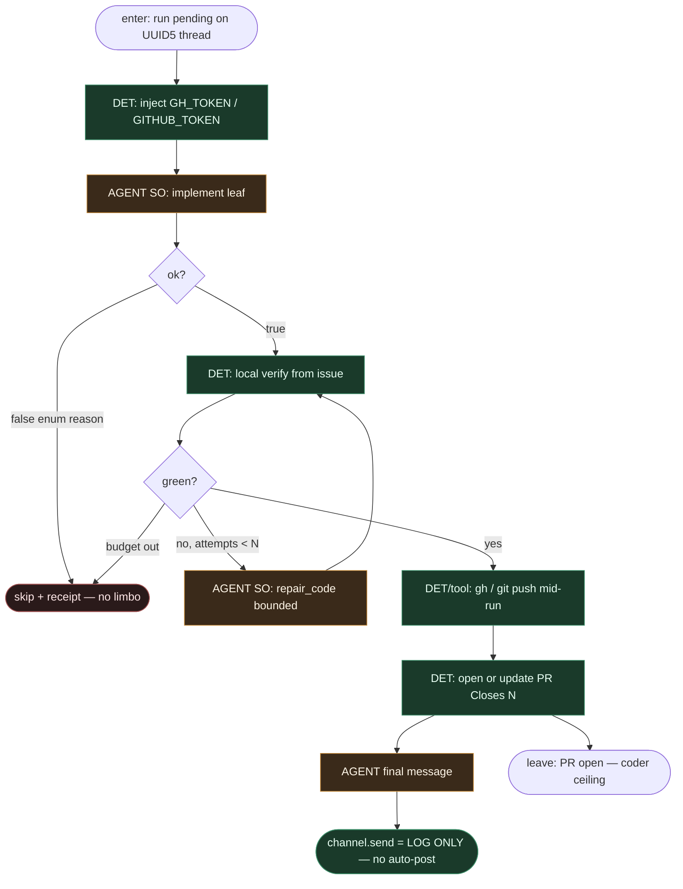

# Subgraph: agent-leaf-gh

**Theme:** Coding **AGENT leaf** + **log-only outbound** (`gh` mid-run).  
**Mode mix:** AGENT SO tylko w liściu; git/test/`gh` argv = DET w sandboxie.

## Flow

## Notes

- **Borrow fidelity — log-only outbound.** DeerFlow `GitHubChannel.send()` loguje final assistant message (INFO) i **nie** postuje na issue/PR. Writeback mid-run = `gh issue comment` / `gh pr comment` / `gh pr create` z sandboxa. Cisza = „LLM nie wołał `gh`” — OK.
- **Dlaczego nie auto-ferry.** (1) coder+reviewer na tym samym evencie dostałyby dwa auto-reply; (2) agent chce pośrednie update’y (link do PR, edit description) — final message nie modeluje tego; (3) self-event gate już chroni przed pętlą po `gh`.
- **fire_and_forget ↔ log-only.** Skoro manager nic nie ferry’uje, `runs.wait` to czysty overhead + 300s `httpx.ReadTimeout` na legalnym długim coderze. Stąd `runs.create` w webhook-ff.
- **Liść, nie orkiestrator.** Structured output only; agent nie routuje factory_pass. Meat ≡ AI — to samo siedzenie (SOUL).
- **Coder ≠ merge.** Ceiling = otwarty PR. Merge = `subgraph-merge-policy-det` (DET ours).
- **Token lifecycle (borrow).** Installation token → `run_context["github_token"]` → sandbox `GH_TOKEN`/`GITHUB_TOKEN` per-call `extra_env`. Bez `os.environ` mutation, bez cross-repo bleed. TTL ~1h — długie runy kończą write przed expiry.
- **Kontrakty SO (WORKING_KLEPACZ_GRAPH):**
  - implement: `{ok, summary, files_touched, tests_run}` / `{ok:false, reason: cant_comply|needs_split|blocked_path|underspecified|dangerous}`
  - opc. pr_review na **osobnym** UUID5 `…:reviewer`: `{verdict, reasons[], risk}` — bez write/merge
- **Handoff contract.** `{pr_url, branch, commit_shas, summary}` albo `{skip, reason}`; final msg → log only.
