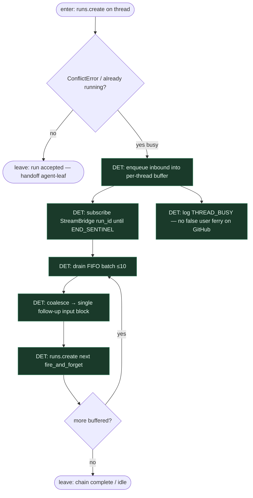

# Subgraph: busy-buffer

**Theme:** **Busy follow-up buffer** — ConflictError nie = cichy drop.  
**Mode mix:** 100% DET (watcher + FIFO drain).

## Flow

## Notes

- **Problem (DeerFlow #4121).** Przy `multitask_strategy="reject"` drugi komentarz na zajętym threadzie → ConflictError → `_send_error(THREAD_BUSY_MESSAGE)`. Ale GitHub outbound jest **log-only**, więc komunikat „busy” idzie w log, a follow-up **ginie**. Człowiek myśli, że bot zignorował komentarz.
- **Fix pattern (buffer + drain + watcher).** Na busy: **kolejkuj** inbound per thread; watcher na `StreamBridge.subscribe(run_id)` do `END_SENTINEL` (push, zero poll `runs.get`); po zakończeniu **drain FIFO** (batch ~10), coalesce w jeden follow-up `runs.create`, naturalnie chainuje gdy >10.
- **Nie mylić z dedupe.** Dedupe (`delivery_id` / `message_id`) chroni przed **redelivery** tego samego eventu. Buffer chroni przed **nowym** komentarzem w trakcie lotu. Oba potrzebne.
- **Self-event vs busy.** Self-event = skip przed enqueue (nie buforujemy własnych `gh` echo). Busy = cudzy/human follow-up gdy run leci.
- **Klepacz mapping.** SOUL: free humans — nie zmuszaj człowieka do „wyślij jeszcze raz za 20 min”. DET babysitting concurrency zamiast cichego dropu.
- **Fail-closed.** Watcher timeout / bridge down → receipt `busy_buffer_orphan` + zostaw PR/issue bez udawania sukcesu; nie limbo labels.
- **Handoff contract.** `{buffered:true, queue_depth, active_run_id}` → później `{drained:n, next_run_id}` albo `{ok:false, reason: buffer_orphan|bridge_down}`.
