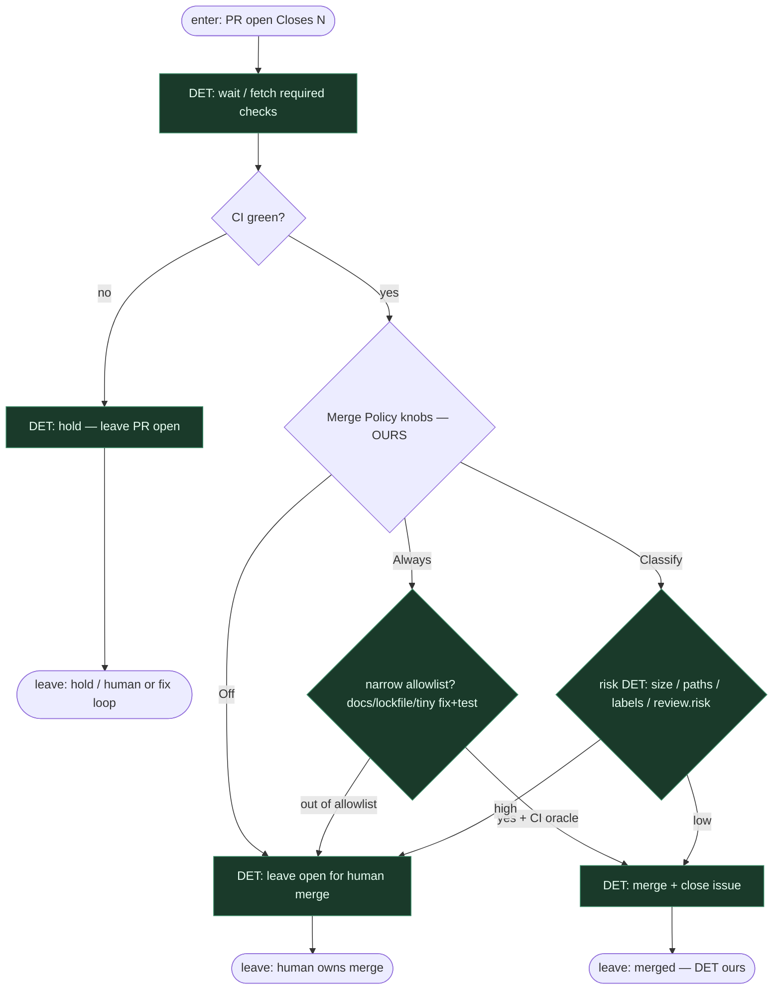

# Subgraph: merge-policy-det

**Theme:** Merge Policy **DET ours** — Off \| Classify \| Always. LLM nie klika merge.  
**Mode mix:** 100% DET po otwartym PR (coder ceiling z agent-leaf-gh).

## Flow

## Notes

- **DET ours.** Gałka per repo z kanonu KLEPACZ / ready-for-agent: **Off / Classify / Always**. To nie jest prompt „czy zmergować?” i nie jest polityka DeerFlow — DeerFlow kończy na `gh` writeback; **merge authority zostaje nasza**.
- **Default Off.** Klepacz (meat lub AI) pisze PR; człowiek merguje. Auto-merge = polityka, nie religia.
- **Classify = reguły DET.** Size, chronione ścieżki (auth/billing/schema), labels, opc. `review.risk` z UUID5 reviewera — skrypt. Nie LLM classifier.
- **Always = wąski.** Tylko gdy CI jest wyrocznią. `reject`/`high` z review → never Always.
- **Coder ≠ merge.** Implement leaf (nawet z `gh pr create`) nie ma przycisku merge. Osobny węzeł po CI.
- **Fail-closed.** Czerwone CI, brak required checks, konflikt → hold. Zero agent override.
- **SOUL.** Przy Off / high Classify energia człowieka idzie w architekturę i niewygodne pytania QA — nie w klepanie kolejki. NOT L5.
- **Handoff contract.** `{merged:true, merge_sha, issue_closed}` albo `{merged:false, policy: Off|Classify|Always, reason, pr_url}`.
