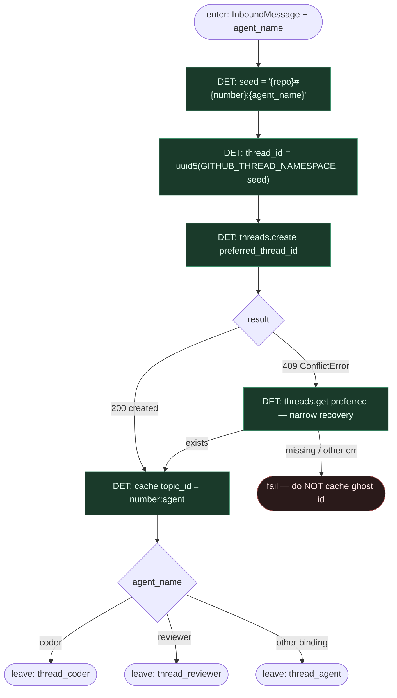

# Subgraph: uuid5-threads

**Theme:** Deterministyczny **UUID5** thread id; **coder ≠ reviewer** (osobne wątki).  
**Mode mix:** 100% DET.

## Flow

## Notes

- **Borrow fidelity.** DeerFlow `resolve_thread_id(repo, number, agent_name)` → `uuid.uuid5(GITHUB_THREAD_NAMESPACE, f"{repo}#{number}:{agent_name}")`. Ten sam seed na każdej replice / po wipe store = ten sam thread.
- **Dlaczego agent_name w seedzie.** Dwa agenty na tym samym PR (coder + reviewer) **celowo** dostają różne thread id. Wspólny thread:
  - spina historie i checkpointy,
  - przy `multitask_strategy="reject"` cicho dropuje jeden run przy dual-mention.
- **Koordynacja przez GitHub.** Cross-agent truth = PR comments / review threads — to, co widzi człowiek. Nie ukryty shared LangGraph state.
- **409 recovery wąski.** Tylko `ConflictError` (HTTP 409) = concurrent create. Inny błąd (5xx, sieć) → propagate, **nie** cache’uj `preferred_thread_id` na wątek, który nigdy nie powstał (późniejsze 404 forever).
- **ChannelStore key.** `topic_id = f"{number}:{agent_name}"` — mapping codera niewidoczny dla reviewera na tym samym PR.
- **Klepacz mapping.** SOUL: reviewer = osobna rola. Tu osobność jest hard: inny thread, inny checkpoint, zero write w review leaf (merge = DET poza).
- **Handoff contract.** Output = `{thread_id, topic_id, agent_name, repo, number}` albo `{ok:false, reason: thread_create_failed}`.
