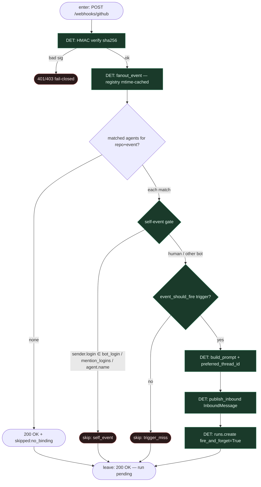

# Subgraph: webhook-ff

**Theme:** GitHub **fire_and_forget webhook** + **self-event gate** (DeerFlow borrow).  
**Mode mix:** 100% DET — tani ACK, zero LangGraph w routerze.

## Flow

## Notes

- **Borrow fidelity.** DeerFlow: webhook handler stays cheap — no `runs.wait`, no LLM w routerze — żeby zmieścić się w GitHub 10s delivery timeout. `ChannelRunPolicy.fire_and_forget=True` → `client.runs.create` wraca gdy run jest `pending`.
- **Self-event gate.** `_is_self_event(sender.login)` używa tej samej precedence co mention gate: `trigger.mention_login` → `github.bot_login` → `default_mention_login` → `agent.name`. Komentarz, który agent sam wstawił przez `gh`, nie odpala ponownie **tego samego** agenta (pętla webhook→run→gh→webhook).
- **Fail-closed HMAC.** Zła sygnatura = reject. Authenticity na webhooku, nie per-sender `/connect` (DeerFlow: `requires_bound_identity=False` dla GitHub).
- **Trigger list = enablement.** Event poza `bindings[].triggers` = nie ładujemy agenta. `DEFAULT_TRIGGERS` tylko field-level defaults (np. `require_mention`), nie lista włączeń.
- **Klepacz mapping.** To jest „label = start” w świecie eventów: start = dostawa GitHub + binding, nie chat pick. Agent nie wybiera sobie pracy.
- **Handoff contract.** Output = `{fired:[{agent, thread_id, run_id}], skipped:[{reason: self_event|trigger_miss|no_binding}]}` + HTTP 200 do GitHub.
