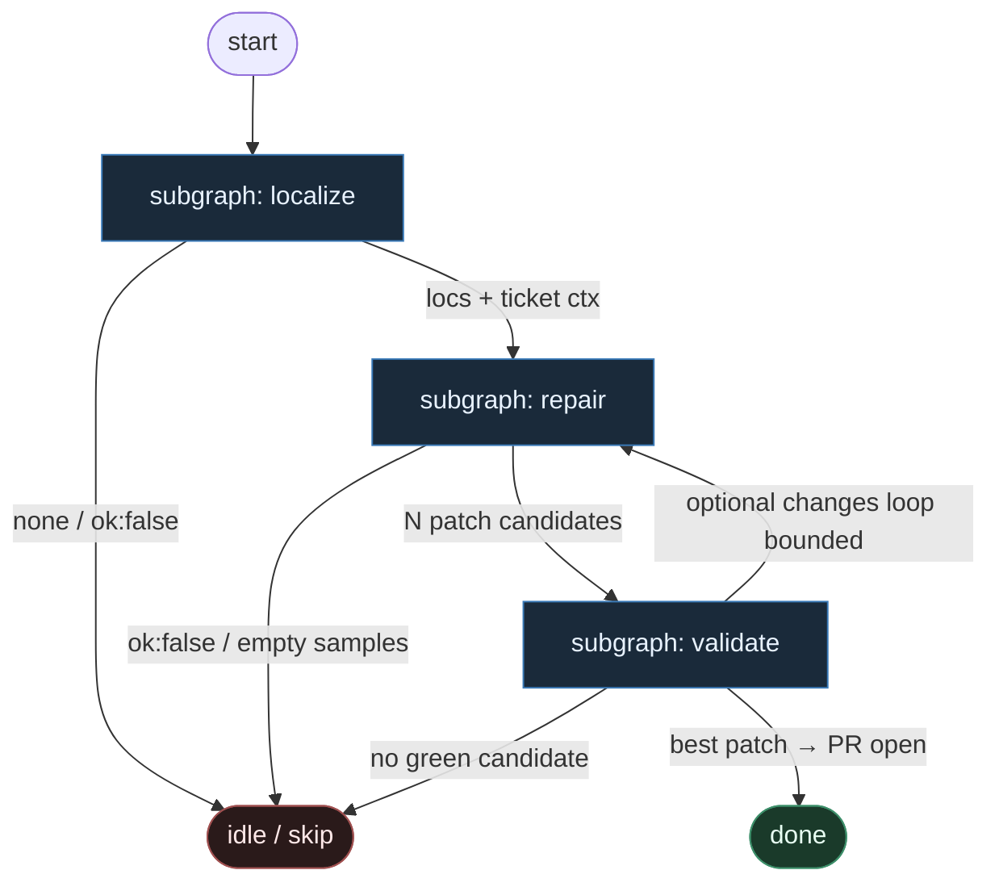

# 07 — Agentless Phases (deterministic)

**Persona:** agentless-deterministic — stała maszyna faz `localize → repair → validate`; LLM **tylko** w wyznaczonych slotach; **zero** ReAct orkiestratora.

**Approach:** compose. Mapowanie OpenAutoCoder/Agentless (arXiv 2407.01489) na duszę klepacza: ticket→PR, nie SWE-bench submit, nie L5.

## Design notes

- **Fazy są kodem, nie promptem.** Kolejność zawsze: lokalizacja → naprawa → walidacja. Żaden model nie wybiera „co dalej” ani nie woła narzędzi ad hoc.
- **LLM fills slots only.** Trzy sloty SO: `localize_hierarchy`, `repair_samples`, (opcjonalnie) `pr_review`. Routing, git, testy, open PR = DET.
- **Zero ReAct.** Zakaz pętli „obserwacja → myśl → tool”. Brak fat ACI z 40 komendami. Harness jest cienki; model jest dobry — nie odwrotnie.
- **Adaptacja ticket→PR.** Agentless „submit patch” = DET commit + push + open PR. Klepacz kończy na otwartym (i opcjonalnie zmergowanym) `ai/fix`, nie na leaderboardzie.
- **Multi-sample w repair, selekcja w validate.** N kandydatów patchy z jednego slotu; walidacja DET (test_command) wybiera zwycięzcę. Model nie „zgaduje zieloności”.
- **Hierarchiczna lokalizacja.** Slot localize zawęża: repo → pliki → elementy (funkcje/bloki). Repair dostaje wąski kontekst — nie cały monolit w oknie.
- **Meat ≡ AI w slocie.** To samo siedzenie SO; silnik faz nie rozróżnia.
- **NOT L5.** Cel z SOUL: zdjąć wyczerpujące klepanie; człowiek zostaje przy architekturze, trudnych decyzjach i (gdy MergePolicy Off) merge.
- **Jeden ticket, jeden PR.** K=1; fazy nie sieją katalogu w środku repair.
- **Fail closed.** Brak lokalizacji / zero zielonych kandydatów / `ok:false` → skip/escape, nie limbo „agent naprawi wszystko”.

## Top-level flowchart

**DET vs AGENT at a glance**

| Phase / seat | Mode | Responsibility |
|--------------|------|----------------|
| Pick labeled + worktree | DET | Front door; K=1 occupancy |
| **localize** slot | AGENT SO | Hierarchia: files[] → elements[]; zero git, zero tools |
| Context pack | DET | Wytnij snippet'y z locs; zbuduj prompt repair |
| **repair** slot | AGENT SO | Multi-sample patch candidates (N); structured diffs |
| Apply + test each | DET | Worktree sandbox / patch apply + `test_command` |
| Select best | DET | Ranking: green first, potem minimal diff / score |
| Commit / push / open PR | DET | Submit = klepacz PR, nie SWE-bench |
| Optional pr_review | AGENT SO | Osobna rola; nigdy self-stamp; nigdy merge button |
| Merge policy | DET | Off \| Classify \| Always |
| ReAct / fat orchestrator | — | **FORBIDDEN** |

## Index of subgraphs

| File | Theme | Role in chain |
|------|--------|----------------|
| [subgraph-localize.md](./subgraph-localize.md) | pick → worktree → localize SO | Faza 1: zawężenie miejsca usterki / zmiany |
| [subgraph-repair.md](./subgraph-repair.md) | context pack → repair SO multi-sample | Faza 2: kandydaci patchy (LLM slot only) |
| [subgraph-validate.md](./subgraph-validate.md) | test → select → commit/push/PR | Faza 3: DET walidacja + submit jako PR |

## Compose map (Agentless → klepacz)

| Agentless | Klepacz seat |
|-----------|--------------|
| Localization (hierarchical) | subgraph-localize: DET intake + `localize_hierarchy` SO |
| Repair (multi-sample patches) | subgraph-repair: `repair_samples` SO, N≥1 |
| Patch validation (tests / filter) | subgraph-validate: DET apply+test+rank |
| Submit best patch | DET: commit → push → open PR (`Closes #issue`) |
| No autonomous tool-loop | invariant: `no_react_orchestrator` |
| Paper scaffold + good model | cienki harness faz; LLM tylko w slotach |

## Antyteza (czego tu nie ma)

- ReAct / SWE-agent / OpenHands-style tool loop
- Agent wybierający kolejną fazę z czatu
- Jednolity „fat brain” planujący + kodujący + merżujący
- Lokalizacja przez swobodny `find` w pętli agenta
- Model oceniający „czy testy przejdą” zamiast DET runnera
- L5 lights-out / „wyrzuć człowieka”

## Kryterium sukcesu

Człowiek ma energię na architekturę i niewygodne pytania — bo nie spalił dnia na lokalizację-ad-hoc i git klepanie. Technicznie: fazy `localize→repair→validate` kończą się otwartym (opcjonalnie zmergowanym) `ai/fix` na tipie hosta; LLM nigdy nie routuje grafu.
