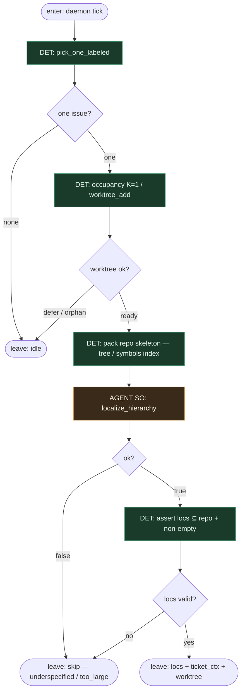

# Subgraph: localize

**Theme:** faza 1 Agentless — hierarchiczne zawężenie miejsca zmiany.  
**Mode mix:** DET intake (pick / worktree) + jeden AGENT SO slot `localize_hierarchy`. Zero ReAct, zero git w slocie.

## Flow



## Notes

- **Faza stała.** Po pick/worktree zawsze slot localize — nie „agent decyduje czy szukać”.
- **Hierarchia (kanon Agentless).** SO zwraca warstwy: `files[]` → opcjonalnie `elements[]` (symbol / zakres linii). Najpierw pliki, potem elementy wewnątrz.
- **LLM bez narzędzi.** Slot dostaje skeleton/index + treść ticketa; **nie** woła shell/`grep` w pętli. Eksploracja = prompt + indeks DET, nie ACI.
- **DET assert.** Puste locs, ścieżki poza repo, `stop_if` overlap → `ok:false` / skip. Fail closed.
- **Ticket jasność.** Brak acceptance/verification w ticketcie może dać `reason: underspecified` — taniej niż ReAct limbo.
- **Handoff contract.** `{issue, worktree, locs: {files[], elements[]}, test_command}` albo idle/skip.

## Structured output — `localize_hierarchy`

```json
{
  "ok": true,
  "files": ["src/foo.py", "tests/test_foo.py"],
  "elements": [
    {"file": "src/foo.py", "symbol": "Foo.bar", "lines": [40, 88]}
  ],
  "rationale": "short why these loci",
  "confidence": "high"
}
```

```json
{ "ok": false, "reason": "underspecified|too_large|dangerous|no_loci" }
```
