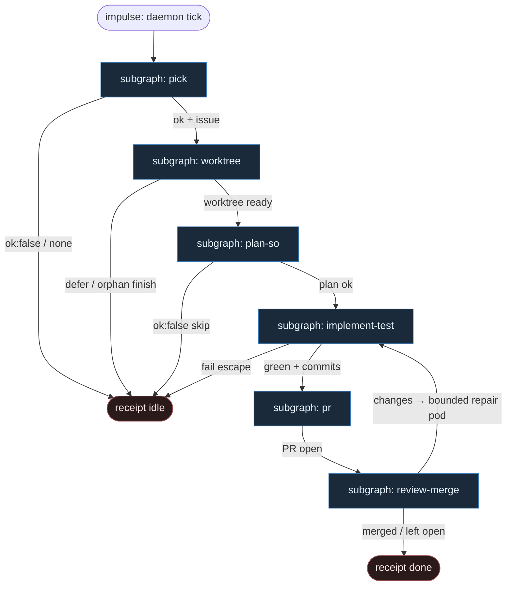

# 08 — Fala-native (Unix atoms)

**Persona:** fala-unix-atoms — wiele małych atomów Unix `ok|fail`; **pod-Fala** na warunkowe subprocessy; LLM **tylko** w liściach ze structured output.

**Approach:** from_scratch. Graf = pakiet Fala (`correlation_paths` + conduction + `when=`). Nie monolit, nie fat tool-calling.

## Design notes

- **Graf jest kodem Fala.** Topologia żyje w pakiecie (TOML/JSON): effector = atom albo liść SO albo pod-Fala. Zmiana procesu = edycja ścieżki korelacji — agent nie routuje.
- **DET = Unix atom.** Każdy deterministyczny krok to `subprocess` argv → `output/result.json` z kontraktem `{ok:true|false,...}`. Fail closed: `ok:false` kończy gałąź albo skacze po `when=`, bez limbo.
- **LLM tylko w liściach SO.** `plan_issue`, `implement`, `pr_review` — schema JSON, fail = `ok:false` + enum reason. Żaden LLM nie wybiera następnego węzła i nie orkiestruje tooli.
- **pod-Fala = warunkowy subprocess.** Złożone rozgałęzienia (occupancy, repair loop, MergePolicy Off|Classify|Always) to **dziecko Fala** z **osobnym journalem**, nie wspólna baza i nie diamond w głowie agenta. Parent woła child przez adapter `subprocess`; wynik wraca `result.json` / bridge.
- **Warunki proste = `when=`.** Skalar z upstream SO/DET: `when = { upstream = "...", path = "...", equals = "..." }`. Non-match → `skipped` (`condition_not_met`), nie silent cancel.
- **Mapa kanoniczna:** pick → worktree → plan SO → implement SO → test DET → PR → review SO → merge policy.
- **K=1 / one ticket one PR.** Pick bierze co najwyżej jeden labeled issue; worktree nie sieje katalogu w środku implementacji.
- **Coder ≠ merge.** Implement kończy się na zielonym teście + (w kolejnym klastrze) otwartym PR. Merge = osobny klaster policy.
- **Meat ≡ AI w liściu SO.** To samo siedzenie; Fala nie rozróżnia.
- **NOT L5.** Cel z SOUL: zdjąć wyczerpujące klepanie; człowiek zostaje przy architekturze, trudnych decyzjach i (gdy Off) merge.

## Top-level flowchart



**DET vs AGENT vs pod-Fala**

| Warstwa | Tryb | Mechanizm Fala |
|---------|------|----------------|
| pick / worktree / test / git / open_pr / merge | DET atom | `subprocess` → `{ok}` |
| plan / implement / review | AGENT SO leaf | `subprocess` LLM wrapper → schema JSON |
| occupancy / repair loop / merge policy branches | pod-Fala | child Fala + osobny journal + `when=` wewnątrz |
| routing / fat orchestrator | — | **FORBIDDEN** |

## Index of subgraphs

| File | Stage cluster | Role |
|------|---------------|------|
| [subgraph-pick.md](./subgraph-pick.md) | pick | labeled issue → zero albo jeden |
| [subgraph-worktree.md](./subgraph-worktree.md) | worktree | occupancy + `git worktree add` |
| [subgraph-plan-so.md](./subgraph-plan-so.md) | plan SO | jedyny LLM planu |
| [subgraph-implement-test.md](./subgraph-implement-test.md) | implement SO → test DET | kod + gate; repair w pod-Fala |
| [subgraph-pr.md](./subgraph-pr.md) | PR | commit/push/open PR — same atomy |
| [subgraph-review-merge.md](./subgraph-review-merge.md) | review SO → merge policy | osobna rola + Off\|Classify\|Always |

## Szkic pakietu (rodzic)

```toml
# klepacz.fala-package.toml (szkic — nie runtime product)
version = "2"
id = "klepacz-fala-native"
title = "Klepacz Fala-native"

[[capabilities]]
id = "unix_atom"
title = "Tiny DET atom ok|fail"

[[capabilities]]
id = "so_leaf"
title = "LLM structured-output leaf"

[[capabilities]]
id = "pod_fala"
title = "Nested Fala subprocess (separate journal)"

[[correlation_paths]]
id = "klepacz_pass"
title = "pick → … → merge policy"

# …effectors: pick_* atoms → worktree pod → plan_issue SO →
# implement SO → test atoms → open_pr → pr_review SO →
# merge_policy pod-Fala (when= on verdict / policy knob)
```

## Kontrakty liści SO (kanon)

**plan_issue** — `{ok, goal, files, test_command, non_goals, stop_if}` albo `{ok:false, reason: underspecified|too_large|dangerous}`

**implement** — `{ok, summary, files_touched, tests_run}` albo `{ok:false, reason: cant_comply|needs_split|blocked_path}`

**pr_review** — `{verdict: approve|changes|reject, reasons[], risk: low|high}` — `reject`/`high` nigdy Always-merge

## Kryterium sukcesu

Człowiek ma energię na architekturę i niewygodne pytania — bo nie spalił dnia na atomach git/PR. Technicznie: zmergowane (albo świadomie otwarte przy Off) `ai/fix` na tipie hosta; LLM nigdy nie wybiera następnego effectora.
