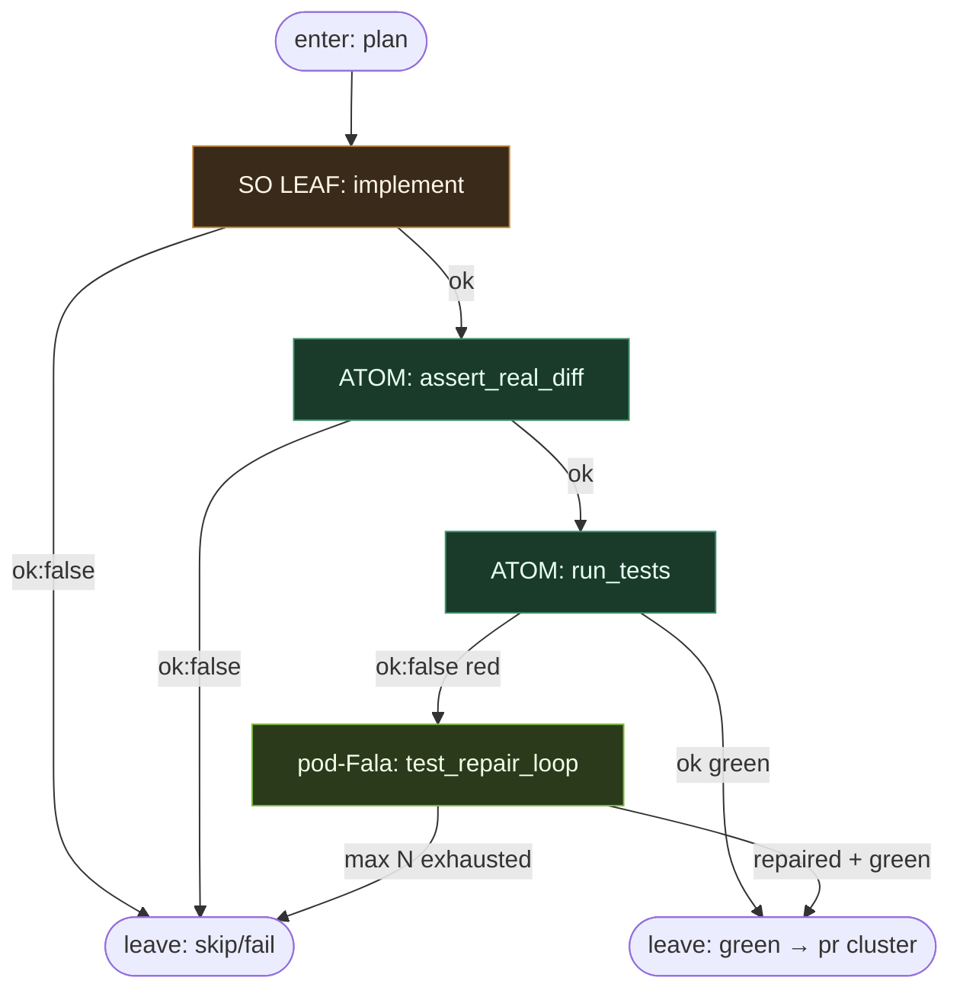

# Subgraph: implement-test

**Stage cluster:** implement SO → test DET  
**Mode:** jeden liść SO (implement) + atomy test/git; **pod-Fala** na bounded repair.  
**Handoff in:** plan ready + worktree.  
**Handoff out:** green tests + (opcjonalnie) lokalne commity gotowe pod PR — albo escape fail.

## Flow



## Structured output — `implement`

```json
{
  "ok": true,
  "summary": "...",
  "files_touched": ["..."],
  "tests_run": false
}
```

Fail: `{ "ok": false, "reason": "cant_comply"|"needs_split"|"blocked_path" }`.

`tests_run` w liściu jest deklaratywne; **prawdziwy gate** to atom `run_tests` (DET).

## Unix atoms

| Atom | ok means | fail |
|------|----------|------|
| `assert_real_diff` | niepusty diff vs base | `empty_diff` |
| `run_tests` | exit 0 komendy z planu / ticketu | `tests_failed` |
| `stage_paths` | git add allowlist | `git_failed` |
| `commit_wip` | commit lokalny (opcjonalnie w klastrze) | `git_failed` |

## pod-Fala: `test_repair_loop`

Child journal: `.fala/pods/repair-<issue>/state.sqlite`

```text
attempt=1..N:
  SO leaf repair_code  →  ATOM run_tests
  when tests ok → emit {ok:true, repaired:true}
  when attempt==N and still red → {ok:false, reason:repair_exhausted}
```

Szkic `when=`:

```toml
[[correlation_paths.effectors]]
id = "repair_code"
capability = "so_leaf"
conduction = ["run_tests"]
when = { upstream = "run_tests", path = "ok", equals = false }
config = { leaf = "repair_code", max_attempts = 2 }

[[correlation_paths.effectors]]
id = "retest"
capability = "unix_atom"
conduction = ["repair_code"]
config = { atom = "run_tests" }
```

Parent widzi tylko terminal child `result.json`. **Nie** rozwija SDLC w głównym passie.

## Notes

- **Implement nie otwiera PR.** Sufit kodera w tym klastrze = zielony test (+ diff).
- **Bounded escape.** Po N: skip bez park labels / limbo.
- **stop_if z planu** egzekwuje atom przed write (np. paths) — DET, nie „agent obiecał”.
- **Reviewer ≠ implementer** — ten liść nigdy nie woła `pr_review`.
