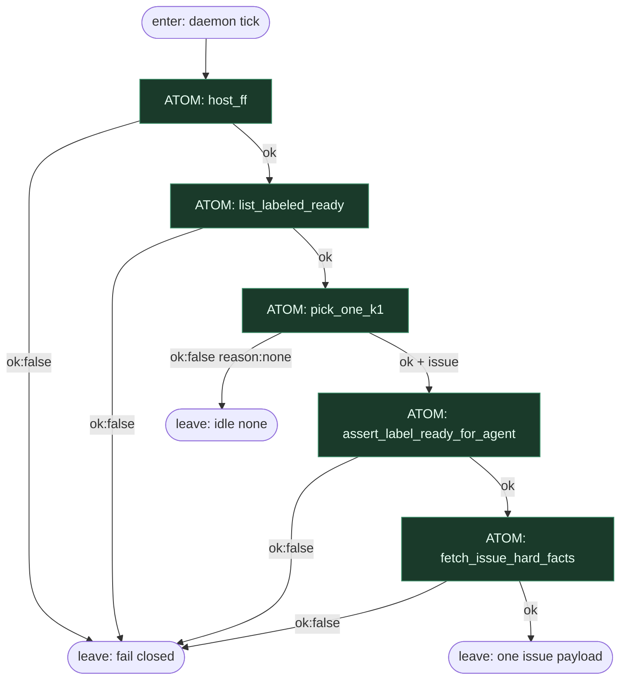

# Subgraph: pick

**Stage cluster:** pick  
**Mode:** same Unix atomy `ok|fail`. Zero LLM.  
**Handoff out:** `{ok:true, issue, label, repo}` albo `{ok:false, reason:none|auth|api}` → idle.

## Flow

## Unix atoms (ok|fail)

| Atom | argv idea | ok means | fail reason (enum) |
|------|-----------|----------|--------------------|
| `host_ff` | `git -C host fetch --prune` | tip fresh | `fetch_failed` |
| `list_labeled_ready` | `gh issue list --label ready-for-agent` | JSON lista | `api` / `auth` |
| `pick_one_k1` | head -n1 / sort stabilny | dokładnie 0\|1 | `none` (0) — nie błąd soft |
| `assert_label_ready_for_agent` | label still present | etykieta = start | `label_missing` |
| `fetch_issue_hard_facts` | `gh issue view --json …` | title, body, number | `api` / `closed` |

Każdy atom: **subprocess** → `result.json`. Parent Fala czyta tylko `ok` + pola schemy; nie interpretuje stderr jako routingu.

## Notes

- **Etykieta = start.** Zero „weź z czatu”. Brak labela → nie pickujemy.
- **K=1 w picku.** `pick_one_k1` nigdy nie zwraca tablicy do równoległego siewu.
- **`none` ≠ awaria orkiestracji.** To legalny terminal → receipt idle.
- **Bez triage AGENT.** Jeśli hard_facts nie wystarczą, to problem szablonu issue — nie liścia LLM tu.
- **Fala wiring:** linear conduction; brak `when=` w tym klastrze (prosty łańcuch).
