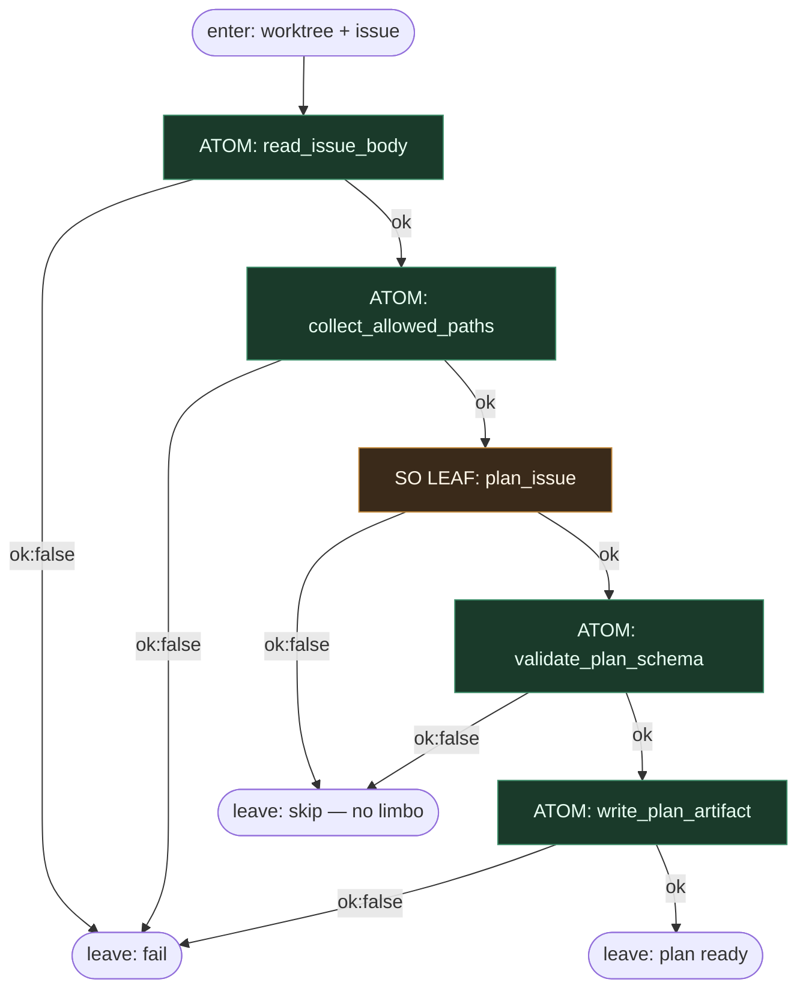

# Subgraph: plan-so

**Stage cluster:** plan SO  
**Mode:** **jeden** liść LLM (structured output) otoczony cienkimi atomami DET.  
**Handoff in:** worktree ready + issue hard_facts.  
**Handoff out:** plan JSON albo skip (`ok:false`).

## Flow



## Structured output — `plan_issue`

```json
{
  "ok": true,
  "goal": "...",
  "files": ["..."],
  "test_command": "...",
  "non_goals": ["..."],
  "stop_if": ["auth", "migration"]
}
```

Fail leaf:

```json
{ "ok": false, "reason": "underspecified" }
```

`reason` ∈ `underspecified` | `too_large` | `dangerous` → **skip bez limbo**.

## Atomy wokół liścia

| Atom | Rola |
|------|------|
| `read_issue_body` | DET odczyt; LLM nie „szuka” issue tool-callingiem |
| `collect_allowed_paths` | z szablonu / allowlist repo |
| `validate_plan_schema` | JSON Schema check — nie LLM |
| `write_plan_artifact` | zapis do worktree / reaction store |

## Notes

- **Plan nie pisze kodu produktu.** Tylko artifact pod implement.
- **LLM = liść.** Adapter woła model z fixed prompt + schema; zero pętli tooli w tym węźle.
- **`when=` dalej:** parent może odpalić implement tylko gdy `plan_issue.ok == true` (albo po `validate_plan_schema`).
- **Meat ≡ AI.** Ten sam SO seat.
