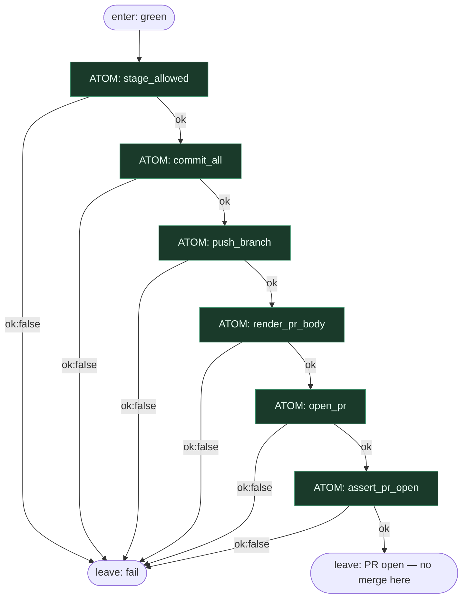

# Subgraph: pr

**Stage cluster:** PR  
**Mode:** same Unix atomy. Zero LLM.  
**Handoff in:** green tests + worktree z diffem.  
**Handoff out:** `{ok:true, pr_url, pr_number}` — sufit executora.

## Flow

## Unix atoms

| Atom | Kontrakt ok | Uwagi |
|------|-------------|-------|
| `stage_allowed` | tylko ścieżki z planu / allowlist | fail: `path_outside_allowlist` |
| `commit_all` | ≥1 commit, message z issue id | fail: `nothing_to_commit` / `git_failed` |
| `push_branch` | remote tip = local | fail: `push_rejected` |
| `render_pr_body` | body z template + `Closes #N` | DET string — nie LLM |
| `open_pr` | `gh pr create` → url | fail: `api` / `already_exists` (idempotent handle) |
| `assert_pr_open` | PR state=open | fail: `pr_missing` |

Każdy atom: `ok:false` → parent kończy pass z receipt fail/skip. Brak „agent dociśnie push”.

## Notes

- **Coder ceiling = open PR.** Merge jest w klastrze review-merge / policy.
- **Idempotencja.** `open_pr` przy istniejącym PR tego brancha → `ok:true` + istniejący numer (albo jawny reason `already_exists` obsłużony atomem resolve).
- **Bez LLM w body.** Template + hard_facts + plan.summary; narracja modelu nie jest potrzebna do otwarcia PR.
- **Fala:** linear conduction; ewentualny `when=` tylko jeśli poprzedni klaster wystawił `tests.ok`.
