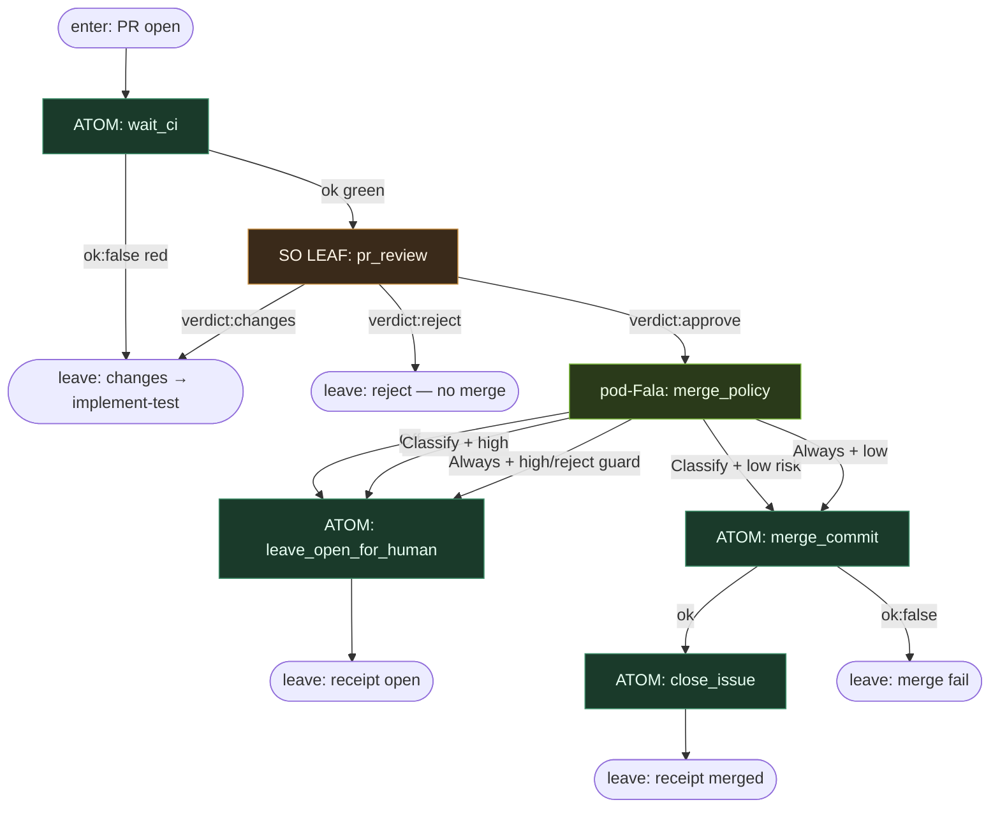

# Subgraph: review-merge

**Stage cluster:** review SO → merge policy  
**Mode:** liść SO (osobna rola) + atomy CI; **pod-Fala** na MergePolicy Off\|Classify\|Always.  
**Handoff in:** PR open.  
**Handoff out:** merged | left open | changes→re-implement (bounded).

## Flow



## Structured output — `pr_review`

```json
{
  "verdict": "approve",
  "reasons": ["..."],
  "risk": "low"
}
```

- `verdict` ∈ `approve` | `changes` | `reject`
- `risk` ∈ `low` | `high`
- **`reject` / `high` → nigdy Always-merge** (guard w pod-Fala / atomie)

Reviewer **bez write** do product tree — tylko verdict (+ opcjonalnie komentarz API atomem osobnym).

## Unix atoms

| Atom | ok means |
|------|----------|
| `wait_ci` | checks green / mergeable |
| `leave_open_for_human` | PR zostaje open; receipt zapisany |
| `merge_commit` | merge (squash/merge wg policy repo) |
| `close_issue` | issue closed / już closed idempotent |
| `post_review_comment` | opcjonalny DET z `reasons[]` |

## pod-Fala: `merge_policy`

Child journal: `.fala/pods/merge-<pr>/state.sqlite`

Gałka hosta: `Off` | `Classify` | `Always` (env / config, nie LLM).

```toml
[[correlation_paths.effectors]]
id = "policy_off"
conduction = ["pr_review"]
when = { upstream = "policy_knob", path = "mode", equals = "Off" }
# → leave_open_for_human

[[correlation_paths.effectors]]
id = "policy_classify_merge"
conduction = ["pr_review", "policy_knob"]
when = { upstream = "pr_review", path = "risk", equals = "low" }
# + knob Classify/Always checked in atom guard
# → merge_commit

[[correlation_paths.effectors]]
id = "policy_hold_high"
conduction = ["pr_review"]
when = { upstream = "pr_review", path = "risk", equals = "high" }
# → leave_open_for_human nawet przy Always
```

## Notes

- **Osobna rola.** Implement SO ≠ review SO (osobny capability / model slot / human).
- **Off = default start.** Klepacz dowozi PR; człowiek merguje.
- **Changes wraca do implement-test**, nie do ukrytego pr_repair theatre bez limitu — parent może odpalić bounded `pr_repair` SO max N jako osobny pod, potem znowu review.
- **Sukces:** zmergowane `ai/fix` *albo* świadomie otwarte przy Off — nie ładny JSON bez skutku.
