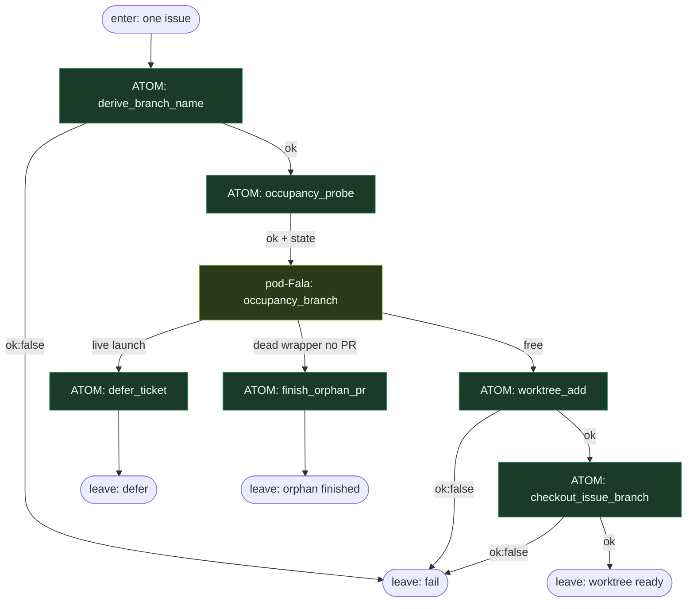

# Subgraph: worktree

**Stage cluster:** worktree  
**Mode:** Unix atomy + **pod-Fala** na occupancy / orphan. Zero LLM.  
**Handoff in:** issue payload.  
**Handoff out:** `{ok:true, worktree_path, branch}` albo defer/orphan/fail → receipt.

## Flow



## Unix atoms

| Atom | ok means | fail / side |
|------|----------|-------------|
| `derive_branch_name` | `ai/issue-N-slug` deterministic | `bad_issue_id` |
| `occupancy_probe` | `{state: free\|live\|dead_orphan}` zawsze `ok:true` jeśli probe działa | `probe_failed` |
| `defer_ticket` | zapis deferred, bez limbo label theatre | `write_failed` |
| `finish_orphan_pr` | domknięcie martwego wrappera / cleanup | `cleanup_failed` |
| `worktree_add` | path istnieje, czysty | `path_busy` / `git_failed` |
| `checkout_issue_branch` | branch na worktree | `git_failed` |

## pod-Fala: `occupancy_branch`

Child Fala (osobny journal, np. `.fala/pods/occupancy-<run>/state.sqlite`):

```toml
# szkic child path
[[correlation_paths.effectors]]
id = "route_free"
conduction = ["occupancy_probe"]
when = { upstream = "occupancy_probe", path = "state", equals = "free" }
# → signals parent to run worktree_add

[[correlation_paths.effectors]]
id = "route_live"
conduction = ["occupancy_probe"]
when = { upstream = "occupancy_probe", path = "state", equals = "live" }
# → defer

[[correlation_paths.effectors]]
id = "route_dead"
conduction = ["occupancy_probe"]
when = { upstream = "occupancy_probe", path = "state", equals = "dead_orphan" }
# → finish_orphan_pr
```

Parent nie trzyma diamond w Pythonie „if live…”. Warunek = conduction Fala / pod.

## Notes

- **Jeden worktree na ticket.** Executor nigdy nie tworzy drugiego katalogu w środku implementacji.
- **Fail closed na git.** `worktree_add` czerwony → stop; nie „agent naprawi FS”.
- **Defer jest DET.** Nie stuck.json limbo; krótki cooldown albo skip tick.
